# Troubleshoot a network by using Network Watcher monitoring and diagnostic toolss

## What is Network Watcher?

Azure Network Watcher is a centralized service for monitoring and diagnosing the health of Azure networks. It provides tools grouped into three categories:
- **Monitoring tools**
- **Network diagnostic tools**
- **Traffic logging tools**

Network Watcher helps identify issues like connectivity problems, latency, packet drops, and misconfigured security rules.

**Network Watcher Overview:**
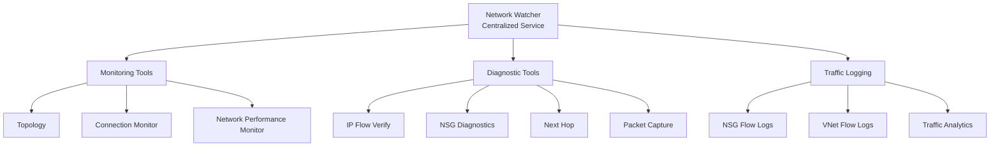

**Learn more:**
- [Network Watcher Overview](https://learn.microsoft.com/en-us/azure/network-watcher/network-watcher-monitoring-overview)
- [Network Watcher Documentation](https://learn.microsoft.com/en-us/azure/network-watcher/)

Azure Network Watcher includes several tools you can use to monitor your virtual networks and virtual machines (VMs). To effectively make use of Network Watcher, it's essential to understand all the available options and the purpose of each tool.

In your engineering company, you want to help your staff to choose the right Network Watcher tool for each troubleshooting task. They need to understand all the options available and the kinds of problems that each tool can solve.

Here, you look at the Network Watcher tool categories, the tools in each category, and how each tool is applied in example use cases.

## **Tool Categories and Details**

### **Monitoring Tools**
1. **Topology**
   - Visualizes the Azure virtual network, resources, and interconnections.
   - Useful for understanding infrastructure before troubleshooting.

2. **Connection Monitor**
   - Verifies connectivity between Azure resources.
   - Measures latency and detects configuration changes or NSG rule impacts.
   - Can monitor IP addresses or FQDNs.

**Connection Monitor Flow:**
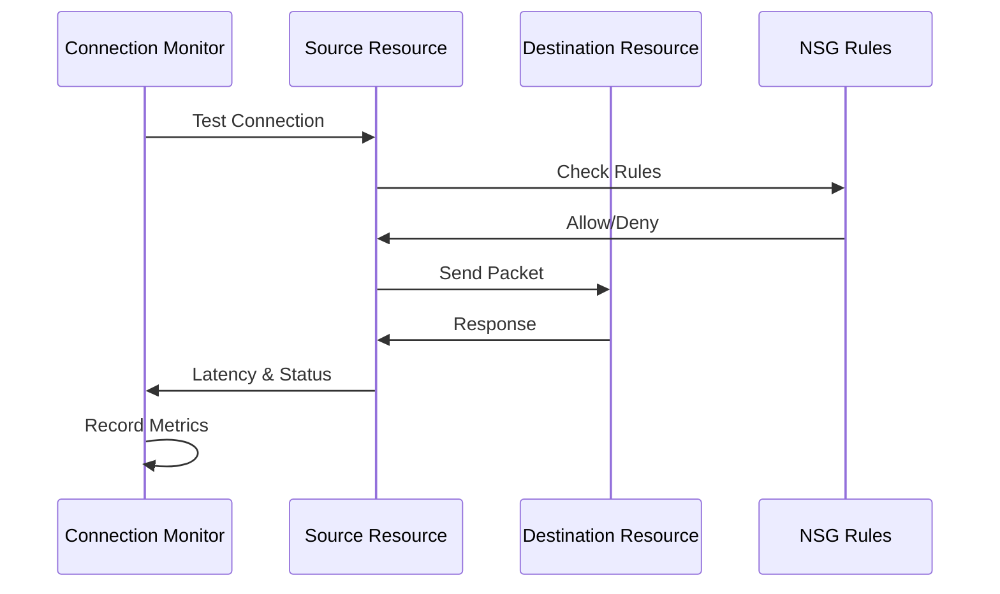

**Learn more:**
- [Connection Monitor](https://learn.microsoft.com/en-us/azure/network-watcher/connection-monitor-overview)

3. **Network Performance Monitor**
   - Tracks latency and packet drops over time.
   - Monitors hybrid connections, ExpressRoute circuits, and endpoint-to-endpoint connectivity.

### **Network Diagnostic Tools**
1. **IP Flow Verify**
   - Checks if packets are allowed or denied for a VM.
   - Identifies NSG blocking rules using 5-tuple parameters.

**IP Flow Verify Process:**
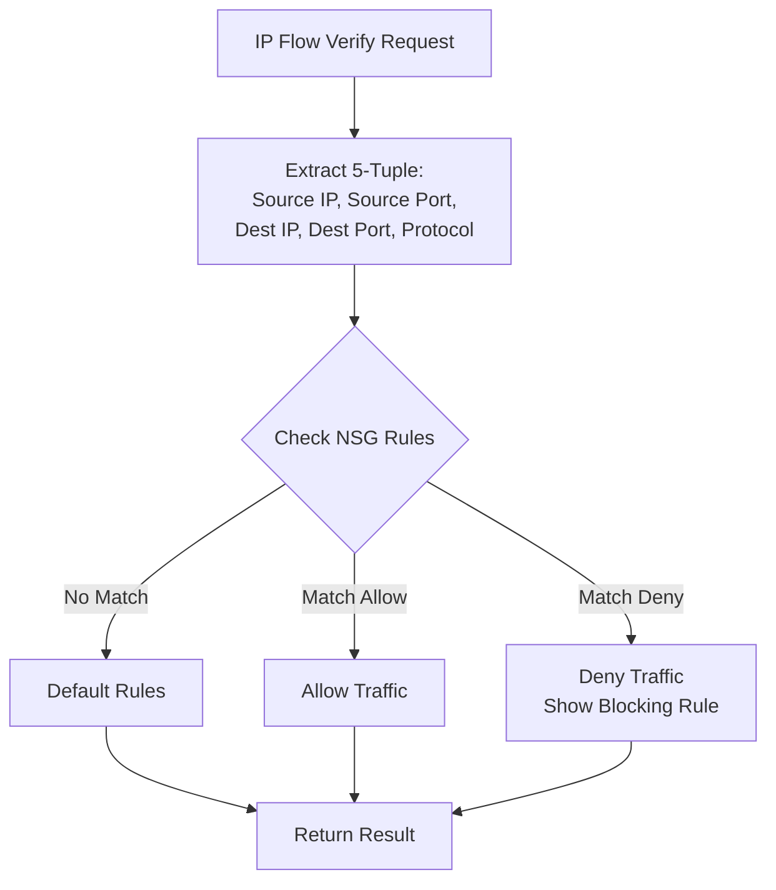

**Learn more:**
- [IP Flow Verify](https://learn.microsoft.com/en-us/azure/network-watcher/diagnose-vm-network-traffic-filtering-problem)

2. **NSG Diagnostics**
   - Displays NSGs traversed and rules applied for a source-destination pair.
   - Shows final allow/deny status.

3. **Next Hop**
   - Determines packet routing path from a VM to a destination.
   - Diagnoses routing table issues.

**Next Hop Analysis:**
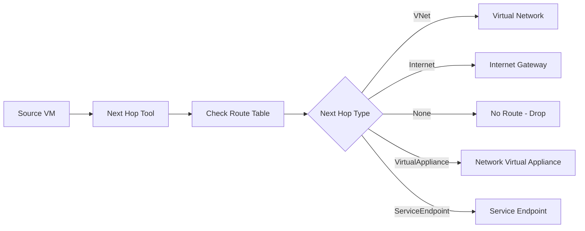

**Learn more:**
- [Next Hop](https://learn.microsoft.com/en-us/azure/network-watcher/diagnose-vm-network-routing-problem)

4. **Effective Security Rules**
   - Lists all effective NSG rules applied to a network interface.
   - Helps identify blocking rules and unnecessary open ports.

5. **Packet Capture**
   - Captures packets for detailed analysis.
   - Useful for diagnosing low-level network issues.

**Packet Capture Architecture:**
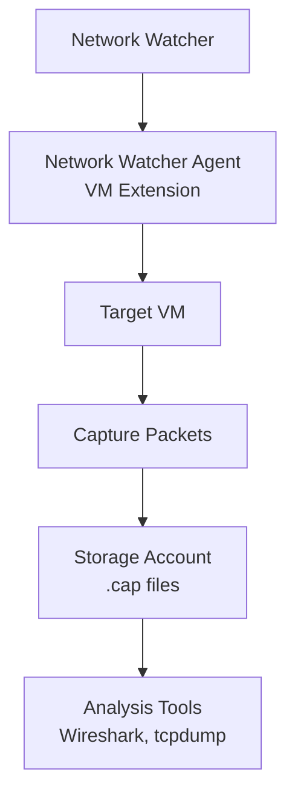

**Learn more:**
- [Packet Capture](https://learn.microsoft.com/en-us/azure/network-watcher/network-watcher-packet-capture-manage-portal)

6. **Connection Troubleshoot**
   - Tests connectivity between resources and provides remediation steps.

7. **VPN Troubleshoot**
   - Diagnoses VPN gateway and connection issues.

**Network Watcher Tool Categories**
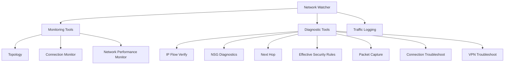

**Troubleshooting Workflow**
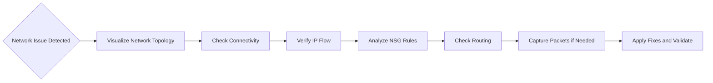

#### Quick Comparison: Network Watcher vs. Virtual Network Manager

| Aspect       | Network Watcher                       | Virtual Network Manager                                |
| ------------ | ------------------------------------- | ------------------------------------------------------ |
| Purpose      | Monitoring and troubleshooting        | Centralized governance and configuration               |
| Scope        | Regional                              | Multi-subscription and multi-region                    |
| Key Features | Topology, diagnostics, packet capture | Connectivity (mesh/hub), security admin rules, routing |
| Use Case     | Operational support                   | Design and enforce network standards                   |

**Integration:**
- Network Watcher can monitor and validate configurations created by Virtual Network Manager
- IP Flow Verify considers both NSG rules and Virtual Network Manager security admin rules
- Use Network Watcher to troubleshoot issues in topologies managed by Virtual Network Manager

---

#### Practical Tips
- Use **Virtual Network Manager** for consistent topology and security policies across large environments.
- Use **Network Watcher** for real-time diagnostics and troubleshooting.
- Combine with **Azure Monitor** for alerts and analytics.

## Detailed Tool Descriptions

### Monitoring Tools

#### 1. Network Topology

**Purpose**: Visualizes the Azure virtual network, resources, and interconnections.

**Key Features:**
- Interactive network diagram
- Resource relationships visualization
- Subnet and network interface mapping
- Security group associations

**Use Cases:**
- Understanding network architecture before troubleshooting
- Documenting network topology
- Identifying misconfigurations
- Planning network changes

**How It Works:**
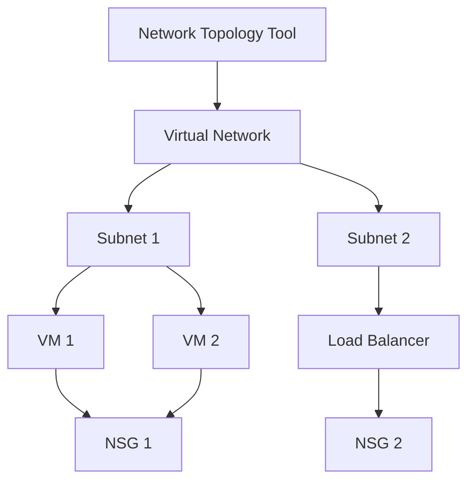

#### 2. Connection Monitor

**Purpose**: Verifies connectivity between Azure resources, measures latency, and detects configuration changes or NSG rule impacts.

**Key Features:**
- End-to-end connectivity testing
- Latency measurement
- Packet loss detection
- Path analysis
- Historical trend analysis

**Supported Endpoints:**
- Azure VMs
- Azure VM Scale Sets
- Azure App Services
- On-premises resources
- External IP addresses
- FQDNs

**Connection Monitor Architecture:**
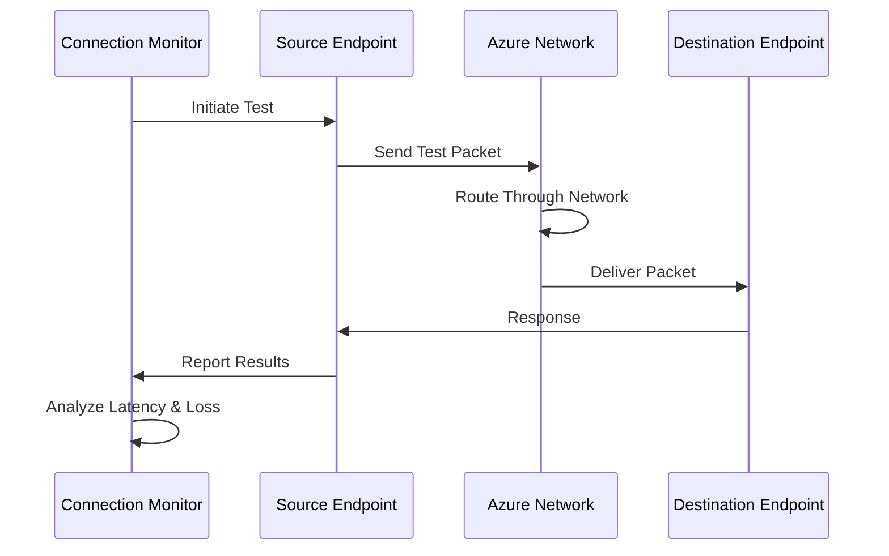

**Test Protocols:**
- **TCP**: Tests TCP connectivity on specified ports
- **ICMP**: Tests basic network connectivity
- **HTTP**: Tests HTTP endpoint availability

**Use Cases:**
- Monitoring application connectivity
- Detecting network issues proactively
- Validating NSG rule changes
- Measuring network performance

#### 3. Network Performance Monitor (NPM)

**Purpose**: Tracks latency and packet drops over time, monitors hybrid connections, ExpressRoute circuits, and endpoint-to-endpoint connectivity.

**Key Features:**
- Historical performance tracking
- Hybrid connection monitoring
- ExpressRoute monitoring
- Endpoint-to-endpoint visibility
- Performance baseline establishment

**Components:**
- **Performance Monitor**: Tracks network performance metrics
- **Service Connectivity Monitor**: Monitors service endpoints
- **ExpressRoute Monitor**: Monitors ExpressRoute circuits

### Network Diagnostic Tools

#### 1. IP Flow Verify

**Purpose**: Checks if packets are allowed or denied for a VM. Identifies NSG blocking rules using 5-tuple parameters.

**5-Tuple Parameters:**
- Source IP address
- Source port
- Destination IP address
- Destination port
- Protocol (TCP/UDP)

**IP Flow Verify Process:**
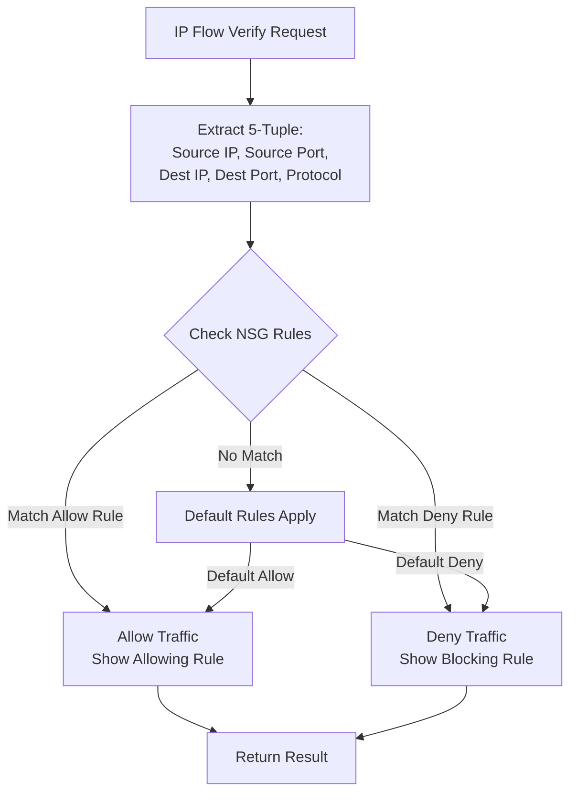

**Use Cases:**
- Troubleshooting connectivity issues
- Validating NSG rules
- Testing firewall configurations
- Diagnosing access problems

**Output Information:**
- Allow/Deny decision
- Matching NSG rule
- Rule priority
- Rule direction (Inbound/Outbound)

#### 2. NSG Diagnostics (Effective Security Rules)

**Purpose**: Displays NSGs traversed and rules applied for a source-destination pair. Shows final allow/deny status.

**Key Features:**
- Complete rule evaluation path
- Effective rules display
- Rule precedence visualization
- Subnet and NIC-level rules

**Effective Rules Include:**
- Network Security Group rules
- Default security rules
- Subnet-level rules
- Network interface-level rules

**Use Cases:**
- Understanding rule precedence
- Identifying blocking rules
- Validating security configurations
- Troubleshooting access issues

#### 3. Next Hop

**Purpose**: Determines packet routing path from a VM to a destination. Diagnoses routing table issues.

**Next Hop Types:**
- **VirtualNetwork**: Route within the same virtual network
- **Internet**: Route to internet gateway
- **None**: No route exists (packet dropped)
- **VirtualAppliance**: Route through network virtual appliance
- **VNetPeering**: Route through VNet peering
- **ServiceEndpoint**: Route to service endpoint

**Next Hop Analysis:**
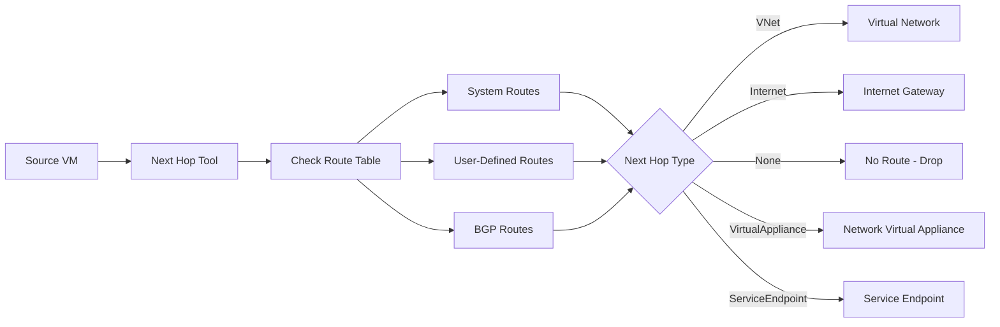

**Use Cases:**
- Diagnosing routing problems
- Validating route table configurations
- Understanding traffic paths
- Troubleshooting connectivity issues

#### 4. Effective Security Rules

**Purpose**: Lists all effective NSG rules applied to a network interface, including rules from subnet and NIC levels.

**Information Provided:**
- All applicable NSG rules
- Rule priority and precedence
- Rule direction (Inbound/Outbound)
- Source and destination information
- Action (Allow/Deny)

**Use Cases:**
- Identifying all rules affecting a VM
- Finding unnecessary open ports
- Validating security configurations
- Troubleshooting access issues

#### 5. Packet Capture

**Purpose**: Captures packets for detailed analysis. Useful for diagnosing low-level network issues.

**Packet Capture Architecture:**
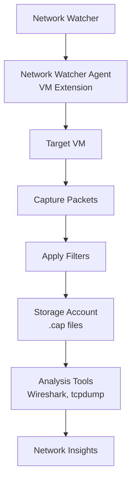

**Capture Features:**
- Remote packet capture
- Filtering capabilities
- Time-based capture
- Size-based capture
- Protocol filtering

**Capture Filters:**
- Protocol (TCP, UDP, ICMP, etc.)
- Source/destination IP
- Source/destination port
- Packet size

**Use Cases:**
- Deep packet inspection
- Protocol analysis
- Security investigation
- Performance troubleshooting

**Requirements:**
- Network Watcher Agent VM Extension installed
- Storage account for capture files
- Appropriate permissions

#### 6. Connection Troubleshoot

**Purpose**: Tests connectivity between resources and provides remediation steps.

**Supported Resources:**
- Virtual machines
- Virtual machine scale sets
- Application Gateways
- Load Balancers
- VPN Gateways

**Troubleshooting Capabilities:**
- Connectivity testing
- Latency measurement
- Path analysis
- Issue identification
- Remediation suggestions

**Use Cases:**
- Quick connectivity validation
- Troubleshooting connection issues
- Validating configuration changes
- Pre-deployment testing

#### 7. VPN Troubleshoot

**Purpose**: Diagnoses VPN gateway and connection issues.

**Diagnostic Capabilities:**
- Gateway status verification
- Connection status checking
- Tunnel health monitoring
- Configuration validation
- Performance analysis

**Supported Scenarios:**
- Site-to-Site VPN
- Point-to-Site VPN
- VNet-to-VNet connections
- ExpressRoute connections

**Use Cases:**
- VPN connectivity issues
- Tunnel establishment problems
- Performance degradation
- Configuration validation

### Traffic Logging Tools

#### 1. NSG Flow Logs

**Purpose**: Logs information about IP traffic flowing through Network Security Groups.

**Flow Log Features:**
- Version 1 (legacy) and Version 2 (enhanced)
- Traffic flow information
- Security rule matching
- Source and destination details
- Protocol and port information

**Flow Log Versions:**

**Version 1:**
- Basic flow information
- Legacy format
- Limited fields

**Version 2:**
- Enhanced format
- Additional fields (flow state, bytes, packets)
- Better analytics support
- Recommended for new deployments

**Flow Log Data:**
- Source IP and port
- Destination IP and port
- Protocol
- Traffic direction (Inbound/Outbound)
- Decision (Allow/Deny)
- Matching NSG rule

**Storage:**
- Azure Storage account
- Retention policies
- Compression support

**Use Cases:**
- Network security analysis
- Compliance auditing
- Traffic pattern analysis
- Security incident investigation

#### 2. VNet Flow Logs

**Purpose**: Logs IP traffic flowing through Azure Virtual Networks.

**Key Features:**
- Network-level traffic logging
- Subnet-level visibility
- Flow aggregation
- Storage in Azure Storage

**Use Cases:**
- Network-wide traffic analysis
- Subnet traffic monitoring
- Network planning
- Security monitoring

#### 3. Traffic Analytics

**Purpose**: Provides rich visualizations of flow logs data with insights and analytics.

**Traffic Analytics Features:**
- Traffic flow visualization
- Geographic traffic maps
- Application and protocol insights
- Security threat detection
- Performance metrics
- Custom dashboards

**Insights Provided:**
- Top talking hosts
- Top applications and protocols
- Traffic distribution
- Security anomalies
- Network topology visualization

**Data Sources:**
- NSG Flow Logs
- VNet Flow Logs
- Log Analytics workspace

**Use Cases:**
- Network visibility
- Security monitoring
- Capacity planning
- Performance optimization
- Compliance reporting

**Traffic Analytics Architecture:**
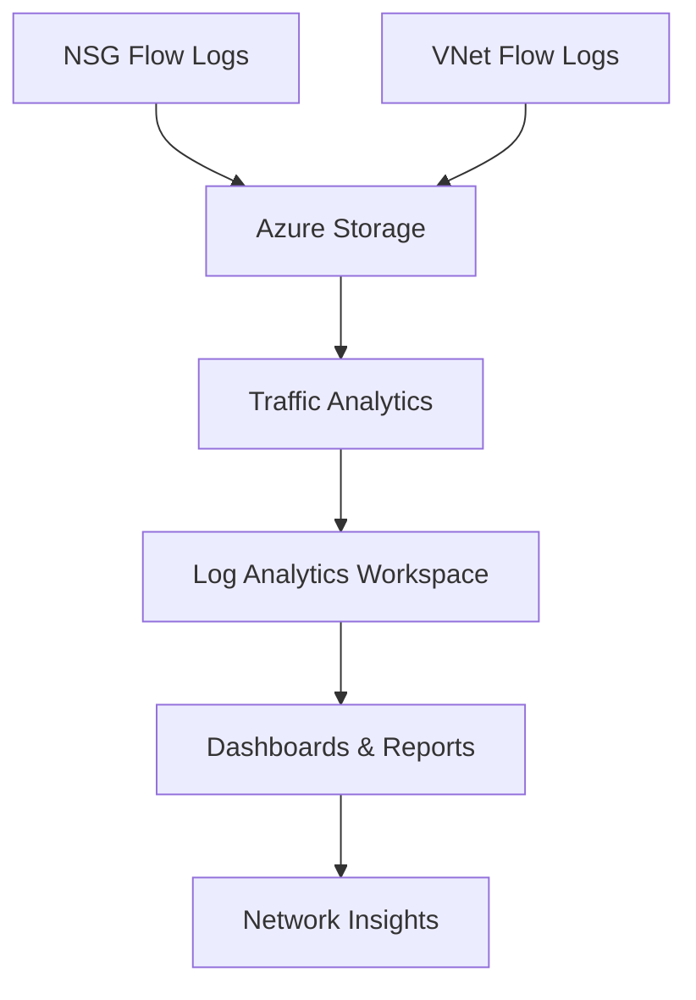

## Network Watcher Integration with Azure Monitor

Network Watcher integrates seamlessly with Azure Monitor for comprehensive network monitoring:

**Integration Points:**
- **Metrics**: Network Watcher metrics available in Azure Monitor
- **Logs**: Flow logs can be sent to Log Analytics workspace
- **Alerts**: Create alerts based on Network Watcher metrics
- **Dashboards**: Visualize Network Watcher data in Azure dashboards

**Benefits:**
- Unified monitoring experience
- Centralized alerting
- Historical data analysis
- Custom visualizations

## Best Practices

### 1. Network Monitoring Strategy

- **Enable Network Watcher** in all regions where you have resources
- **Use Connection Monitor** for proactive monitoring
- **Configure Flow Logs** for security and compliance
- **Enable Traffic Analytics** for insights

### 2. Diagnostic Tools Usage

- **Start with Topology** to understand network structure
- **Use IP Flow Verify** for quick connectivity checks
- **Use Next Hop** for routing issues
- **Use Packet Capture** for deep analysis

### 3. Flow Logs Configuration

- **Use Version 2** for enhanced features
- **Configure retention** based on compliance needs
- **Enable Traffic Analytics** for better insights
- **Monitor storage costs**

### 4. Connection Monitor Setup

- **Monitor critical paths** between applications
- **Set appropriate test intervals**
- **Configure alerts** for connectivity issues
- **Review historical trends**

### 5. Security and Compliance

- **Enable Flow Logs** for all critical NSGs
- **Configure retention** to meet compliance requirements
- **Use Traffic Analytics** for security insights
- **Review security anomalies** regularly

## Check Your Knowledge

### Question 1: Packet Capture Requirements

**To capture traffic on a virtual machine (VM), Azure Network Watcher requires:**

- ✅ **Correct**: Network Watcher Agent VM Extension

**Why:**
- To perform packet capture on a VM, Network Watcher needs the Network Watcher Agent VM Extension installed on that VM
- This extension enables capturing and sending traffic data to storage for analysis
- The extension is required to initiate and manage packet capture sessions remotely

**Additional Requirements:**
- Storage account for storing capture files
- Appropriate permissions to access the VM and storage
- Network connectivity between VM and storage account

- ❌ **Not correct**: Azure Traffic Manager
    
    **Why not:**
    - Traffic Manager is a DNS-based global load balancer, not a diagnostic tool
    - It does not capture traffic or interact with VM-level packet data
    - Traffic Manager operates at DNS level, not at network packet level

- ❌ **Not correct**: An Azure storage account

    **Why not:**
    - While a storage account is used to store captured packets, it is not the requirement to enable capture
    - The essential prerequisite is the VM extension
    - The storage account is a destination for captured data, not the enabling component

### Question 2: Latency Troubleshooting

**To resolve latency issues on the network, which Azure Network Watcher features can you use?**

- ✅ **Correct**: Connection troubleshoot

**Why:**
- Connection Troubleshoot tests connectivity between two endpoints (VMs, IPs, FQDNs)
- Provides hop-by-hop latency and packet loss details
- Makes it the right tool for diagnosing latency problems
- Shows detailed path analysis with latency measurements at each hop

**Additional Tools:**
- **Connection Monitor**: Can also measure latency over time and detect trends
- **Network Performance Monitor**: Tracks latency and packet drops historically

- ❌ **Not correct**: IP flow verify

    **Why not:**
    - IP Flow Verify checks whether traffic is allowed or denied by NSGs and rules
    - It does not measure latency; it only validates access control
    - Focuses on security rule evaluation, not performance metrics

- ❌ **Not correct**: Next hop
    
    **Why not:**
    - Next Hop shows the routing path for a packet (which route or gateway will be used)
    - It helps with routing issues but does not provide latency metrics
    - Focuses on routing decisions, not performance measurement

### Question 3: Network Topology Tool

**What is the primary purpose of the Network Topology tool in Network Watcher?**

- ✅ **Correct**: Visualizes the Azure virtual network, resources, and interconnections

**Why:**
- Network Topology provides an interactive diagram of your network infrastructure
- Shows relationships between resources, subnets, and network interfaces
- Helps understand network architecture before troubleshooting
- Useful for documentation and planning network changes

**Key Features:**
- Interactive network diagrams
- Resource relationship visualization
- Subnet and network interface mapping
- Security group associations

### Question 4: Flow Logs Version

**Which version of NSG Flow Logs is recommended for new deployments?**

- ✅ **Correct**: Version 2

**Why:**
- Version 2 provides enhanced format with additional fields
- Includes flow state, bytes, and packets information
- Better support for Traffic Analytics
- More comprehensive data for analysis

**Version 2 Benefits:**
- Additional metadata fields
- Better analytics support
- Enhanced security insights
- Improved performance metrics

## Key Features Summary

**Azure Network Watcher provides:**
- **Monitoring Tools**: Topology, Connection Monitor, Network Performance Monitor
- **Diagnostic Tools**: IP Flow Verify, NSG Diagnostics, Next Hop, Packet Capture, Connection Troubleshoot, VPN Troubleshoot
- **Traffic Logging**: NSG Flow Logs, VNet Flow Logs, Traffic Analytics
- **Regional Service**: Automatically enabled when creating virtual networks
- **Integration**: Works with Azure Monitor for comprehensive monitoring

**Additional Resources:**
- [Network Watcher Overview](https://learn.microsoft.com/en-us/azure/network-watcher/network-watcher-monitoring-overview)
- [Network Watcher Documentation](https://learn.microsoft.com/en-us/azure/network-watcher/)
- [Network Watcher Best Practices](https://learn.microsoft.com/en-us/azure/network-watcher/network-watcher-best-practices)

