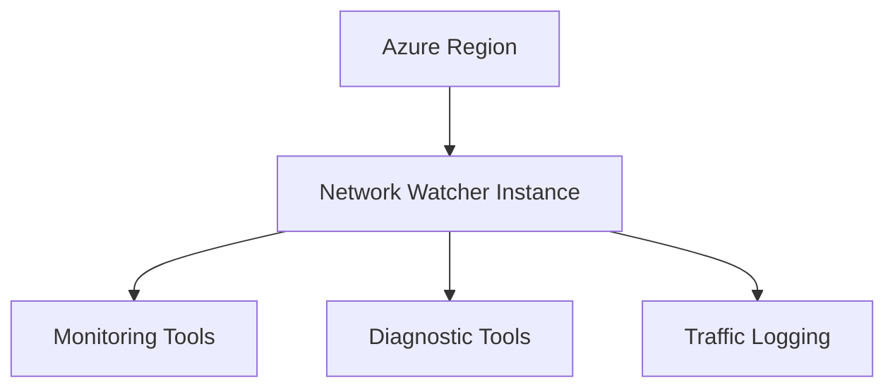

# Implementing Azure Network Watcher Instance with Terraform

## Overview

Network Watcher is a regional service that provides network monitoring and diagnostic capabilities. One Network Watcher instance is required per Azure region.

## Architecture



## Terraform Implementation

### Basic Network Watcher Instance

```hcl
# Resource Group
resource "azurerm_resource_group" "network_watcher" {
  name     = "rg-network-watcher"
  location = "eastus"
}

# Network Watcher
resource "azurerm_network_watcher" "main" {
  name                = "NetworkWatcher_eastus"
  location            = "eastus"
  resource_group_name = azurerm_resource_group.network_watcher.name

  tags = {
    Environment = "Production"
  }
}
```

### Multiple Regional Instances

```hcl
# Network Watcher for East US
resource "azurerm_network_watcher" "eastus" {
  name                = "NetworkWatcher_eastus"
  location            = "eastus"
  resource_group_name = azurerm_resource_group.network_watcher.name
}

# Network Watcher for West Europe
resource "azurerm_network_watcher" "westeurope" {
  name                = "NetworkWatcher_westeurope"
  location            = "westeurope"
  resource_group_name = azurerm_resource_group.network_watcher.name
}
```

### Complete Example

```hcl
resource "azurerm_network_watcher" "main" {
  name                = "NetworkWatcher_eastus"
  location            = "eastus"
  resource_group_name = azurerm_resource_group.network_watcher.name

  tags = {
    Environment = "Production"
    ManagedBy   = "Terraform"
    Purpose     = "Network Monitoring"
  }
}
```

## Key Configuration Parameters

| Parameter | Description | Required | Example |
|-----------|-------------|----------|---------|
| `name` | Network Watcher name | Yes | `NetworkWatcher_eastus` |
| `location` | Azure region | Yes | `eastus` |
| `resource_group_name` | Resource group | Yes | `rg-network-watcher` |

## Naming Convention

Network Watcher instances follow a specific naming convention:
- Format: `NetworkWatcher_<region>`
- Example: `NetworkWatcher_eastus`, `NetworkWatcher_westeurope`

## Best Practices

1. **One Per Region**: Deploy one Network Watcher per region where you have resources
2. **Dedicated Resource Group**: Use a dedicated resource group for Network Watcher instances
3. **Naming**: Follow the `NetworkWatcher_<region>` naming convention
4. **Tagging**: Use consistent tags for cost management

## Outputs

```hcl
output "network_watcher_id" {
  value       = azurerm_network_watcher.main.id
  description = "Network Watcher resource ID"
}
```

## Next Steps

After creating Network Watcher:
1. Set up Connection Monitor (see [02-connection-monitor.md](./02-connection-monitor.md))
2. Configure Packet Capture (see [03-packet-capture.md](./03-packet-capture.md))
3. Enable Flow Logs (see [04-flow-logs.md](./04-flow-logs.md))

## Additional Resources

- [Network Watcher Overview](https://learn.microsoft.com/en-us/azure/network-watcher/network-watcher-monitoring-overview)
- [Terraform azurerm_network_watcher](https://registry.terraform.io/providers/hashicorp/azurerm/latest/docs/resources/network_watcher)

