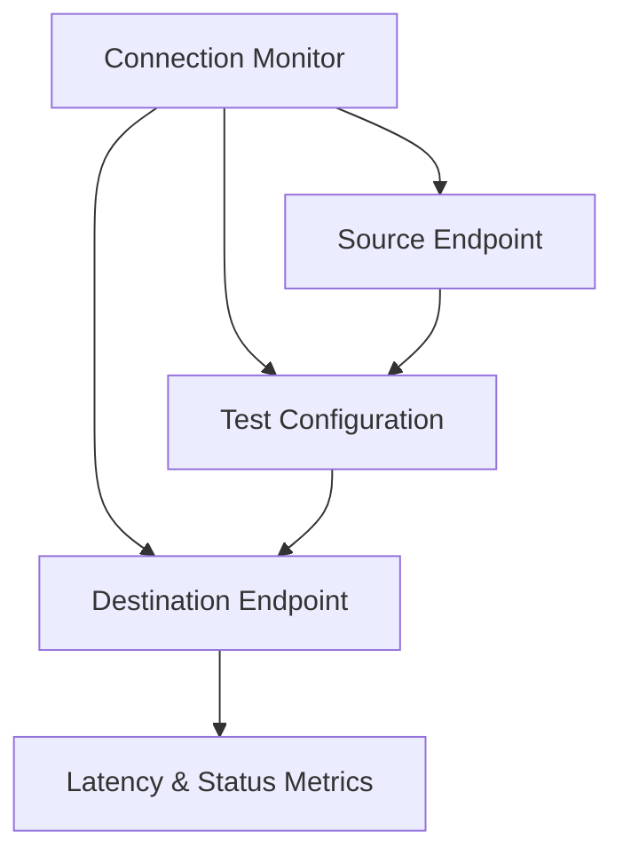

# Implementing Connection Monitor with Terraform

## Overview

Connection Monitor verifies connectivity between Azure resources, measures latency, and detects configuration changes or NSG rule impacts.

## Architecture



## Terraform Implementation

### Basic Connection Monitor

```hcl
resource "azurerm_network_connection_monitor" "main" {
  name               = "cm-main"
  network_watcher_id = azurerm_network_watcher.main.id
  location           = "eastus"

  endpoint {
    name = "source-vm"
    target_resource_id = azurerm_virtual_machine.source.id
  }

  endpoint {
    name = "destination-vm"
    target_resource_id = azurerm_virtual_machine.destination.id
  }

  test_configuration {
    name     = "tcp-test"
    protocol = "Tcp"
    tcp_configuration {
      port = 80
    }
  }

  test_group {
    name                     = "test-group"
    destination_endpoints    = ["destination-vm"]
    source_endpoints         = ["source-vm"]
    test_configuration_names = ["tcp-test"]
  }
}
```

### Connection Monitor with Multiple Endpoints

```hcl
resource "azurerm_network_connection_monitor" "multi_endpoint" {
  name               = "cm-multi"
  network_watcher_id = azurerm_network_watcher.main.id
  location           = "eastus"

  # Source endpoints
  endpoint {
    name = "web-server-1"
    target_resource_id = azurerm_virtual_machine.web1.id
  }

  endpoint {
    name = "web-server-2"
    target_resource_id = azurerm_virtual_machine.web2.id
  }

  # Destination endpoints
  endpoint {
    name = "database-server"
    target_resource_id = azurerm_virtual_machine.db.id
  }

  endpoint {
    name = "storage-account"
    address = azurerm_storage_account.main.primary_blob_endpoint
  }

  # TCP Test Configuration
  test_configuration {
    name     = "tcp-443"
    protocol = "Tcp"
    tcp_configuration {
      port = 443
    }
  }

  # HTTP Test Configuration
  test_configuration {
    name     = "http-test"
    protocol = "Http"
    http_configuration {
      method = "Get"
      path   = "/health"
      port   = 80
      prefer_https = false
    }
  }

  # Test Groups
  test_group {
    name                     = "web-to-db"
    destination_endpoints    = ["database-server"]
    source_endpoints         = ["web-server-1", "web-server-2"]
    test_configuration_names = ["tcp-443"]
    disable                  = false
  }

  test_group {
    name                     = "web-to-storage"
    destination_endpoints    = ["storage-account"]
    source_endpoints         = ["web-server-1", "web-server-2"]
    test_configuration_names = ["http-test"]
    disable                  = false
  }
}
```

### Complete Example with All Options

```hcl
resource "azurerm_network_connection_monitor" "production" {
  name               = "cm-production"
  network_watcher_id = azurerm_network_watcher.main.id
  location           = "eastus"
  notes              = "Production connection monitoring"

  # Endpoints
  endpoint {
    name = "app-server"
    target_resource_id = azurerm_virtual_machine.app.id
  }

  endpoint {
    name = "api-endpoint"
    address = "api.example.com"
  }

  # Test Configurations
  test_configuration {
    name     = "tcp-80"
    protocol = "Tcp"
    tcp_configuration {
      port               = 80
      trace_route_enabled = true
    }
  }

  test_configuration {
    name     = "icmp-test"
    protocol = "Icmp"
    icmp_configuration {
      trace_route_enabled = true
    }
  }

  # Test Groups
  test_group {
    name                     = "app-to-api"
    destination_endpoints    = ["api-endpoint"]
    source_endpoints         = ["app-server"]
    test_configuration_names = ["tcp-80", "icmp-test"]
    disable                  = false
  }

  tags = {
    Environment = "Production"
  }
}
```

## Key Configuration Parameters

| Parameter | Description | Required | Example |
|-----------|-------------|----------|---------|
| `name` | Connection Monitor name | Yes | `cm-main` |
| `network_watcher_id` | Network Watcher ID | Yes | Network Watcher resource ID |
| `location` | Azure region | Yes | `eastus` |
| `endpoint` | Endpoint configuration | Yes | See endpoint block |
| `test_configuration` | Test configuration | Yes | See test_configuration block |
| `test_group` | Test group | Yes | See test_group block |

## Protocol Configurations

### TCP Configuration

```hcl
test_configuration {
  name     = "tcp-test"
  protocol = "Tcp"
  tcp_configuration {
    port               = 80
    trace_route_enabled = true
  }
}
```

### HTTP Configuration

```hcl
test_configuration {
  name     = "http-test"
  protocol = "Http"
  http_configuration {
    method      = "Get"
    path        = "/health"
    port        = 80
    prefer_https = false
    valid_status_code_ranges = ["200-299"]
  }
}
```

### ICMP Configuration

```hcl
test_configuration {
  name     = "icmp-test"
  protocol = "Icmp"
  icmp_configuration {
    trace_route_enabled = true
  }
}
```

## Best Practices

1. **Monitor Critical Paths**: Set up monitors for critical application paths
2. **Multiple Protocols**: Use TCP, HTTP, and ICMP for comprehensive monitoring
3. **Regular Testing**: Configure appropriate test intervals
4. **Alerting**: Set up alerts for connection failures

## Outputs

```hcl
output "connection_monitor_id" {
  value       = azurerm_network_connection_monitor.main.id
  description = "Connection Monitor resource ID"
}
```

## Additional Resources

- [Connection Monitor Overview](https://learn.microsoft.com/en-us/azure/network-watcher/connection-monitor-overview)
- [Terraform azurerm_network_connection_monitor](https://registry.terraform.io/providers/hashicorp/azurerm/latest/docs/resources/network_connection_monitor)

