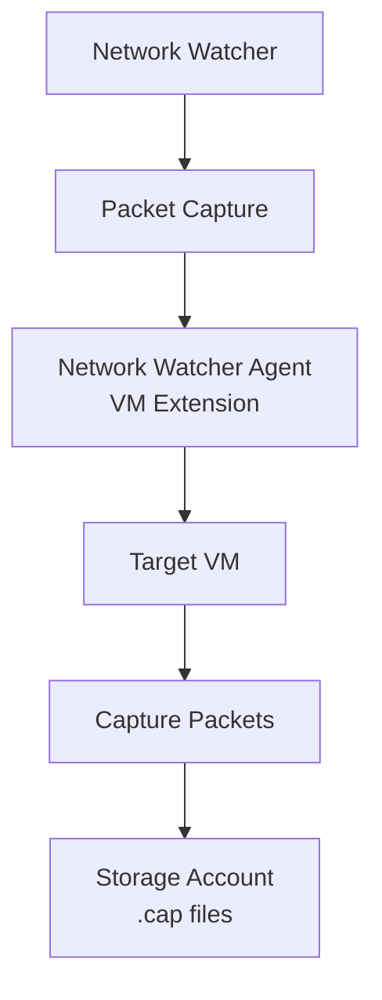

# Implementing Packet Capture with Terraform

## Overview

Packet Capture allows you to capture network traffic on VMs for detailed analysis. Requires Network Watcher Agent VM Extension.

## Architecture



## Terraform Implementation

### Basic Packet Capture

```hcl
# Storage Account for packet capture files
resource "azurerm_storage_account" "packet_capture" {
  name                     = "stapacketcapture"
  resource_group_name      = azurerm_resource_group.main.name
  location                 = "eastus"
  account_tier             = "Standard"
  account_replication_type = "LRS"
}

# Network Watcher Packet Capture
resource "azurerm_network_watcher" "main" {
  name                = "NetworkWatcher_eastus"
  location            = "eastus"
  resource_group_name = azurerm_resource_group.main.name
}

# Packet Capture
resource "azurerm_network_packet_capture" "main" {
  name                 = "pc-main"
  network_watcher_name = azurerm_network_watcher.main.name
  resource_group_name   = azurerm_resource_group.main.name
  target_resource_id   = azurerm_virtual_machine.main.id

  storage_location {
    storage_account_id = azurerm_storage_account.packet_capture.id
  }
}
```

### Packet Capture with Filters

```hcl
resource "azurerm_network_packet_capture" "filtered" {
  name                 = "pc-filtered"
  network_watcher_name = azurerm_network_watcher.main.name
  resource_group_name   = azurerm_resource_group.main.name
  target_resource_id   = azurerm_virtual_machine.main.id

  storage_location {
    storage_account_id = azurerm_storage_account.packet_capture.id
  }

  # Capture only HTTP traffic
  filter {
    local_ip_address = "10.0.0.0/8"
    local_port       = "80"
    protocol         = "TCP"
  }

  # Capture only HTTPS traffic
  filter {
    local_port = "443"
    protocol   = "TCP"
  }

  maximum_bytes_per_packet = 0
  maximum_bytes_per_session = 1073741824  # 1 GB
  maximum_capture_duration  = 18000        # 5 hours in seconds
}
```

### Complete Example with Network Watcher Agent

```hcl
# Network Watcher Agent Extension
resource "azurerm_virtual_machine_extension" "network_watcher" {
  name                 = "NetworkWatcherAgent"
  virtual_machine_id   = azurerm_virtual_machine.main.id
  publisher            = "Microsoft.Azure.NetworkWatcher"
  type                 = "NetworkWatcherAgentLinux"  # or "NetworkWatcherAgentWindows"
  type_handler_version = "1.4"

  auto_upgrade_minor_version = true
}

# Storage Account
resource "azurerm_storage_account" "packet_capture" {
  name                     = "stapacketcapture${random_string.suffix.result}"
  resource_group_name      = azurerm_resource_group.main.name
  location                 = "eastus"
  account_tier             = "Standard"
  account_replication_type = "LRS"
}

resource "random_string" "suffix" {
  length  = 4
  special = false
  upper   = false
}

# Packet Capture
resource "azurerm_network_packet_capture" "main" {
  name                 = "pc-main"
  network_watcher_name = azurerm_network_watcher.main.name
  resource_group_name   = azurerm_resource_group.main.name
  target_resource_id   = azurerm_virtual_machine.main.id

  storage_location {
    storage_account_id = azurerm_storage_account.packet_capture.id
  }

  filter {
    local_port = "80"
    protocol   = "TCP"
  }

  maximum_bytes_per_packet = 0
  maximum_bytes_per_session = 1073741824
  maximum_capture_duration  = 18000
}
```

## Key Configuration Parameters

| Parameter | Description | Required | Example |
|-----------|-------------|----------|---------|
| `name` | Packet capture name | Yes | `pc-main` |
| `network_watcher_name` | Network Watcher name | Yes | `NetworkWatcher_eastus` |
| `resource_group_name` | Resource group | Yes | Resource group name |
| `target_resource_id` | Target VM ID | Yes | VM resource ID |
| `storage_location` | Storage configuration | Yes | Storage account configuration |
| `filter` | Capture filters | No | Filter blocks |

## Filter Options

```hcl
filter {
  local_ip_address   = "10.0.0.0/8"    # Local IP range
  remote_ip_address  = "20.0.0.0/8"    # Remote IP range
  local_port         = "80"            # Local port
  remote_port        = "443"           # Remote port
  protocol           = "TCP"           # TCP, UDP, or Any
}
```

## Best Practices

1. **Network Watcher Agent**: Ensure agent is installed on target VMs
2. **Storage**: Use appropriate storage account for capture files
3. **Filters**: Use filters to reduce capture size
4. **Duration**: Set reasonable capture duration limits
5. **Size Limits**: Configure maximum bytes per session

## Outputs

```hcl
output "packet_capture_id" {
  value       = azurerm_network_packet_capture.main.id
  description = "Packet capture resource ID"
}
```

## Additional Resources

- [Packet Capture Overview](https://learn.microsoft.com/en-us/azure/network-watcher/network-watcher-packet-capture-manage-portal)
- [Terraform azurerm_network_packet_capture](https://registry.terraform.io/providers/hashicorp/azurerm/latest/docs/resources/network_packet_capture)

