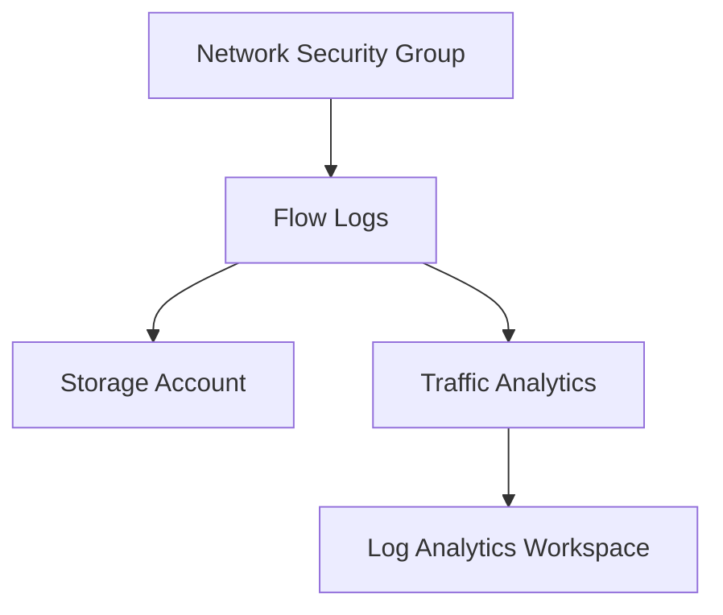

# Implementing NSG Flow Logs with Terraform

## Overview

NSG Flow Logs capture information about IP traffic flowing through Network Security Groups. They enable traffic analytics and security monitoring.

## Architecture



## Terraform Implementation

### Basic NSG Flow Logs

```hcl
# Storage Account for flow logs
resource "azurerm_storage_account" "flowlogs" {
  name                     = "staflowlogs"
  resource_group_name      = azurerm_resource_group.main.name
  location                 = "eastus"
  account_tier             = "Standard"
  account_replication_type = "LRS"
}

# Network Watcher
resource "azurerm_network_watcher" "main" {
  name                = "NetworkWatcher_eastus"
  location            = "eastus"
  resource_group_name = azurerm_resource_group.main.name
}

# NSG Flow Log
resource "azurerm_network_watcher_flow_log" "main" {
  name                      = "nw-flowlog"
  network_watcher_name     = azurerm_network_watcher.main.name
  resource_group_name       = azurerm_resource_group.main.name
  network_security_group_id = azurerm_network_security_group.main.id
  storage_account_id        = azurerm_storage_account.flowlogs.id
  enabled                   = true

  retention_policy {
    enabled = true
    days    = 7
  }
}
```

### Flow Logs with Traffic Analytics

```hcl
# Log Analytics Workspace
resource "azurerm_log_analytics_workspace" "main" {
  name                = "law-main"
  location            = "eastus"
  resource_group_name = azurerm_resource_group.main.name
  sku                 = "PerGB2018"
  retention_in_days   = 30
}

# NSG Flow Log with Traffic Analytics
resource "azurerm_network_watcher_flow_log" "with_analytics" {
  name                      = "nw-flowlog-analytics"
  network_watcher_name     = azurerm_network_watcher.main.name
  resource_group_name       = azurerm_resource_group.main.name
  network_security_group_id = azurerm_network_security_group.main.id
  storage_account_id        = azurerm_storage_account.flowlogs.id
  enabled                   = true

  retention_policy {
    enabled = true
    days    = 7
  }

  traffic_analytics {
    enabled               = true
    workspace_id          = azurerm_log_analytics_workspace.main.workspace_id
    workspace_region      = azurerm_log_analytics_workspace.main.location
    workspace_resource_id = azurerm_log_analytics_workspace.main.id
    interval_in_minutes   = 10
  }
}
```

### Complete Example

```hcl
# Storage Account
resource "azurerm_storage_account" "flowlogs" {
  name                     = "staflowlogs${random_string.suffix.result}"
  resource_group_name      = azurerm_resource_group.main.name
  location                 = "eastus"
  account_tier             = "Standard"
  account_replication_type = "LRS"
  
  # Enable versioning for flow logs
  versioning_enabled = true
}

resource "random_string" "suffix" {
  length  = 4
  special = false
  upper   = false
}

# Log Analytics Workspace
resource "azurerm_log_analytics_workspace" "main" {
  name                = "law-main"
  location            = "eastus"
  resource_group_name = azurerm_resource_group.main.name
  sku                 = "PerGB2018"
  retention_in_days   = 30
}

# Network Watcher
resource "azurerm_network_watcher" "main" {
  name                = "NetworkWatcher_eastus"
  location            = "eastus"
  resource_group_name = azurerm_resource_group.main.name
}

# NSG Flow Log
resource "azurerm_network_watcher_flow_log" "main" {
  name                      = "nw-flowlog"
  network_watcher_name     = azurerm_network_watcher.main.name
  resource_group_name       = azurerm_resource_group.main.name
  network_security_group_id = azurerm_network_security_group.main.id
  storage_account_id        = azurerm_storage_account.flowlogs.id
  enabled                   = true

  retention_policy {
    enabled = true
    days    = 90
  }

  traffic_analytics {
    enabled               = true
    workspace_id          = azurerm_log_analytics_workspace.main.workspace_id
    workspace_region      = azurerm_log_analytics_workspace.main.location
    workspace_resource_id = azurerm_log_analytics_workspace.main.id
    interval_in_minutes   = 10
  }

  tags = {
    Environment = "Production"
  }
}
```

## Key Configuration Parameters

| Parameter | Description | Required | Example |
|-----------|-------------|----------|---------|
| `name` | Flow log name | Yes | `nw-flowlog` |
| `network_watcher_name` | Network Watcher name | Yes | `NetworkWatcher_eastus` |
| `resource_group_name` | Resource group | Yes | Resource group name |
| `network_security_group_id` | NSG resource ID | Yes | NSG resource ID |
| `storage_account_id` | Storage account ID | Yes | Storage account ID |
| `enabled` | Enable flow logs | Yes | `true` |
| `retention_policy` | Retention configuration | Yes | Retention block |
| `traffic_analytics` | Traffic Analytics | No | Traffic Analytics block |

## Retention Policy

```hcl
retention_policy {
  enabled = true
  days    = 90  # Retention period in days
}
```

## Traffic Analytics Configuration

```hcl
traffic_analytics {
  enabled               = true
  workspace_id          = log_analytics_workspace_id
  workspace_region      = "eastus"
  workspace_resource_id = log_analytics_workspace_resource_id
  interval_in_minutes   = 10  # 10 or 60 minutes
}
```

## Best Practices

1. **Storage Account**: Use dedicated storage account for flow logs
2. **Retention**: Configure appropriate retention based on compliance needs
3. **Traffic Analytics**: Enable for security insights and visualization
4. **Cost Management**: Monitor storage and Log Analytics costs
5. **Versioning**: Enable storage account versioning for flow logs

## Outputs

```hcl
output "flow_log_id" {
  value       = azurerm_network_watcher_flow_log.main.id
  description = "NSG Flow Log resource ID"
}
```

## Additional Resources

- [NSG Flow Logs Overview](https://learn.microsoft.com/en-us/azure/network-watcher/network-watcher-nsg-flow-logging-overview)
- [Traffic Analytics](https://learn.microsoft.com/en-us/azure/network-watcher/traffic-analytics)
- [Terraform azurerm_network_watcher_flow_log](https://registry.terraform.io/providers/hashicorp/azurerm/latest/docs/resources/network_watcher_flow_log)

