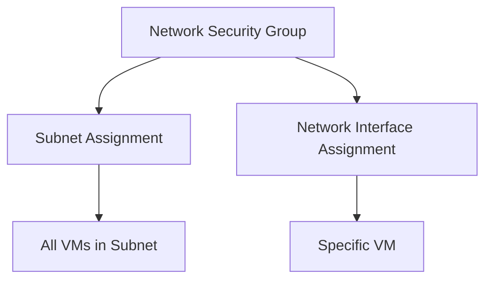

# Implementing Network Security Group with Terraform

## Overview

Network Security Groups (NSGs) filter network traffic to and from Azure resources. They contain security rules that allow or deny inbound and outbound traffic.

## Architecture



## Terraform Implementation

### Basic Network Security Group

```hcl
# Resource Group
resource "azurerm_resource_group" "nsg" {
  name     = "rg-nsg"
  location = "eastus"
}

# Network Security Group
resource "azurerm_network_security_group" "main" {
  name                = "nsg-main"
  location            = azurerm_resource_group.nsg.location
  resource_group_name = azurerm_resource_group.nsg.name

  tags = {
    Environment = "Production"
  }
}
```

### NSG Assignment to Subnet

```hcl
# Virtual Network
resource "azurerm_virtual_network" "main" {
  name                = "vnet-main"
  address_space       = ["10.0.0.0/16"]
  location            = "eastus"
  resource_group_name = azurerm_resource_group.main.name
}

# Subnet
resource "azurerm_subnet" "web" {
  name                 = "subnet-web"
  resource_group_name  = azurerm_resource_group.main.name
  virtual_network_name = azurerm_virtual_network.main.name
  address_prefixes     = ["10.0.1.0/24"]
}

# Network Security Group
resource "azurerm_network_security_group" "web" {
  name                = "nsg-web"
  location            = "eastus"
  resource_group_name = azurerm_resource_group.main.name
}

# Associate NSG to Subnet
resource "azurerm_subnet_network_security_group_association" "web" {
  subnet_id                 = azurerm_subnet.web.id
  network_security_group_id = azurerm_network_security_group.web.id
}
```

### NSG Assignment to Network Interface

```hcl
# Network Interface
resource "azurerm_network_interface" "main" {
  name                = "nic-main"
  location            = "eastus"
  resource_group_name = azurerm_resource_group.main.name

  ip_configuration {
    name                          = "internal"
    subnet_id                     = azurerm_subnet.main.id
    private_ip_address_allocation = "Dynamic"
  }
}

# Network Security Group
resource "azurerm_network_security_group" "main" {
  name                = "nsg-main"
  location            = "eastus"
  resource_group_name = azurerm_resource_group.main.name
}

# Associate NSG to Network Interface
resource "azurerm_network_interface_security_group_association" "main" {
  network_interface_id      = azurerm_network_interface.main.id
  network_security_group_id = azurerm_network_security_group.main.id
}
```

### Evaluation Order

**Important**: When NSGs are applied to both subnet and network interface:

- **Inbound traffic**: Subnet NSG → Network Interface NSG
- **Outbound traffic**: Network Interface NSG → Subnet NSG

```hcl
# Subnet NSG
resource "azurerm_network_security_group" "subnet" {
  name                = "nsg-subnet"
  location            = "eastus"
  resource_group_name = azurerm_resource_group.main.name
}

# NIC NSG
resource "azurerm_network_security_group" "nic" {
  name                = "nsg-nic"
  location            = "eastus"
  resource_group_name = azurerm_resource_group.main.name
}

# Both associations
resource "azurerm_subnet_network_security_group_association" "main" {
  subnet_id                 = azurerm_subnet.main.id
  network_security_group_id = azurerm_network_security_group.subnet.id
}

resource "azurerm_network_interface_security_group_association" "main" {
  network_interface_id      = azurerm_network_interface.main.id
  network_security_group_id = azurerm_network_security_group.nic.id
}
```

## Key Configuration Parameters

| Parameter | Description | Required | Example |
|-----------|-------------|----------|---------|
| `name` | NSG name | Yes | `nsg-main` |
| `location` | Azure region | Yes | `eastus` |
| `resource_group_name` | Resource group | Yes | Resource group name |

## Best Practices

1. **Subnet-Level Assignment**: Apply NSGs at subnet level for easier management
2. **Consistent Security**: All VMs in subnet get same security rules
3. **Reduced Overhead**: Less administrative effort than per-NIC assignment
4. **Documentation**: Document NSG purposes and use cases

## Outputs

```hcl
output "nsg_id" {
  value       = azurerm_network_security_group.main.id
  description = "Network Security Group resource ID"
}
```

## Next Steps

After creating the NSG:
1. Add security rules (see [02-security-rules.md](./02-security-rules.md))
2. Configure service tags (see [03-service-tags.md](./03-service-tags.md))
3. Set up application security groups (see [04-application-security-groups.md](./04-application-security-groups.md))

## Additional Resources

- [Network Security Groups Overview](https://learn.microsoft.com/en-us/azure/virtual-network/network-security-groups-overview)
- [Terraform azurerm_network_security_group](https://registry.terraform.io/providers/hashicorp/azurerm/latest/docs/resources/network_security_group)

