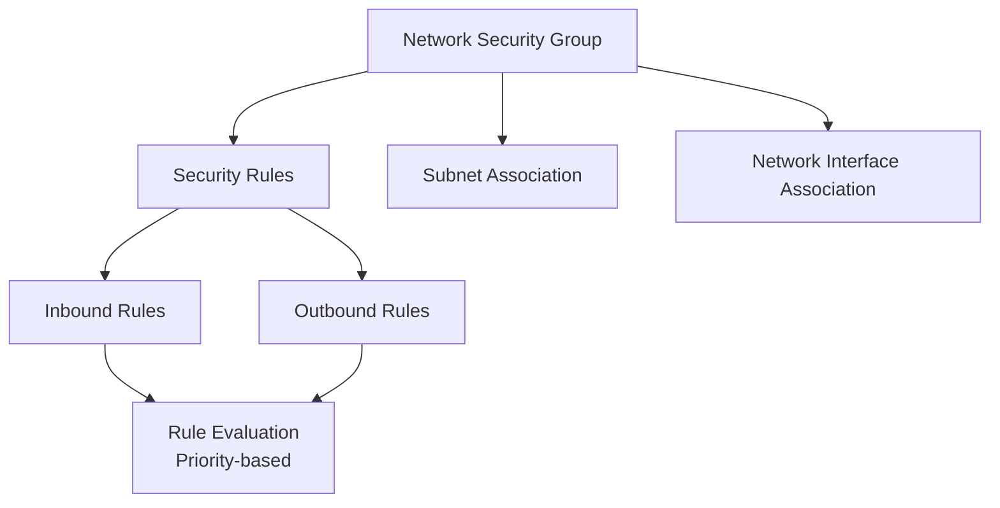

# Terraform Implementation Guides for Azure Network Security Groups

This directory contains comprehensive guides for implementing Azure Network Security Groups (NSGs) using Terraform.

## Documentation Structure

1. **[01-network-security-group.md](./01-network-security-group.md)**
   - Creating NSGs
   - NSG assignment to subnets and network interfaces
   - Evaluation order

2. **[02-security-rules.md](./02-security-rules.md)**
   - Inbound and outbound security rules
   - Rule priority and evaluation
   - Five-tuple matching

3. **[03-service-tags.md](./03-service-tags.md)**
   - Using service tags in rules
   - Available service tags
   - Regional service tags

4. **[04-application-security-groups.md](./04-application-security-groups.md)**
   - Creating application security groups
   - Grouping network interfaces
   - Using ASGs in NSG rules

5. **[05-service-endpoints.md](./05-service-endpoints.md)**
   - Virtual network service endpoints
   - Enabling service endpoints
   - Route table changes

## Quick Start

### Complete Example

```hcl
# 1. Create Network Security Group
resource "azurerm_network_security_group" "main" {
  name                = "nsg-main"
  location            = "eastus"
  resource_group_name = azurerm_resource_group.main.name
}

# 2. Create Security Rules
resource "azurerm_network_security_rule" "allow_http" {
  name                        = "AllowHTTP"
  priority                    = 1000
  direction                   = "Inbound"
  access                      = "Allow"
  protocol                    = "Tcp"
  source_port_range           = "*"
  destination_port_range      = "80"
  source_address_prefix       = "Internet"
  destination_address_prefix  = "*"
  resource_group_name         = azurerm_resource_group.main.name
  network_security_group_name = azurerm_network_security_group.main.name
}

# 3. Associate NSG to Subnet
resource "azurerm_subnet_network_security_group_association" "main" {
  subnet_id                 = azurerm_subnet.main.id
  network_security_group_id = azurerm_network_security_group.main.id
}
```

## Architecture Overview



## Best Practices

1. **Subnet-Level Assignment**: Apply NSGs at subnet level for easier management
2. **Rule Priority**: Use appropriate priority values (100-4096)
3. **Service Tags**: Use service tags to simplify rule management
4. **Application Security Groups**: Use ASGs for workload-based security
5. **Documentation**: Document rule purposes and business justifications

## Additional Resources

- [Azure NSG Documentation](https://learn.microsoft.com/en-us/azure/virtual-network/network-security-groups-overview)
- [Terraform Azure Provider - NSG](https://registry.terraform.io/providers/hashicorp/azurerm/latest/docs/resources/network_security_group)

