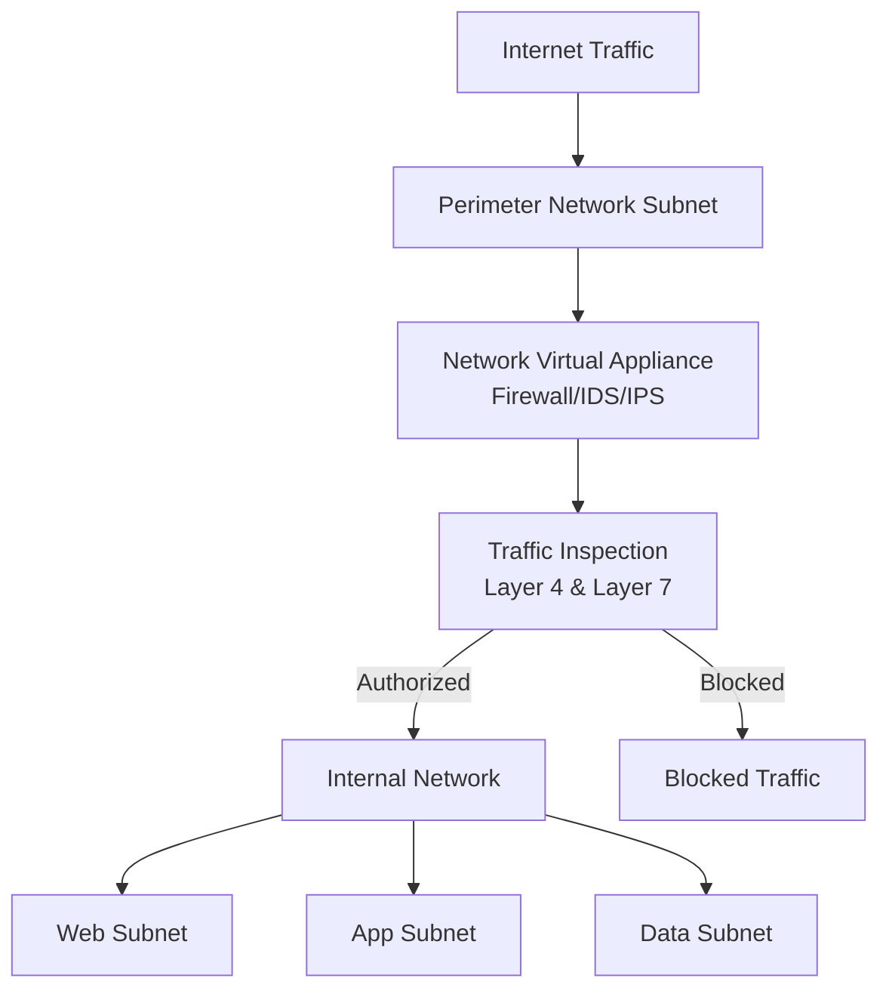
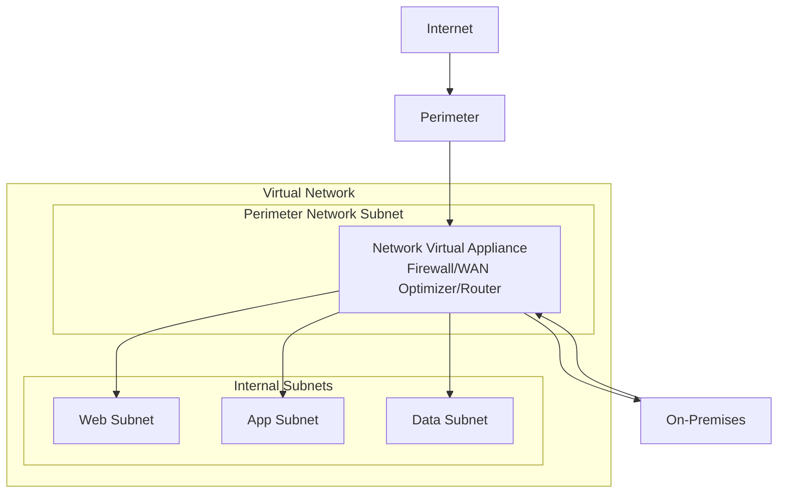
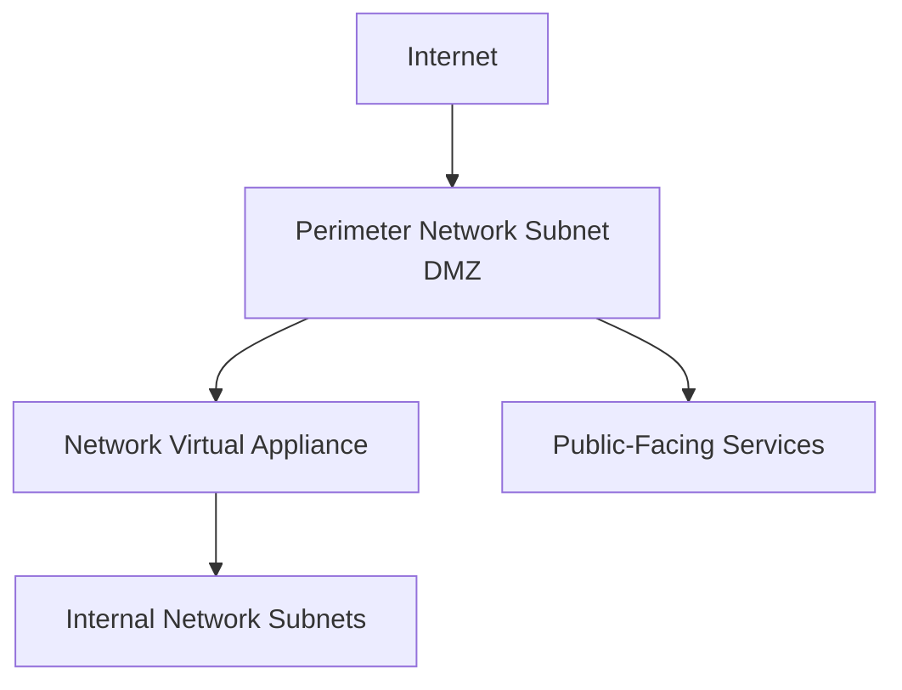
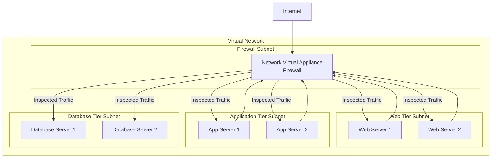
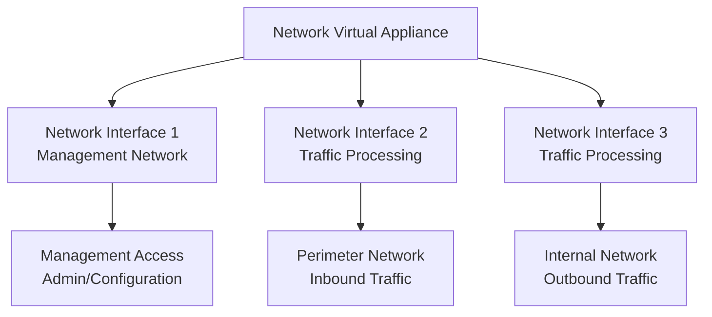
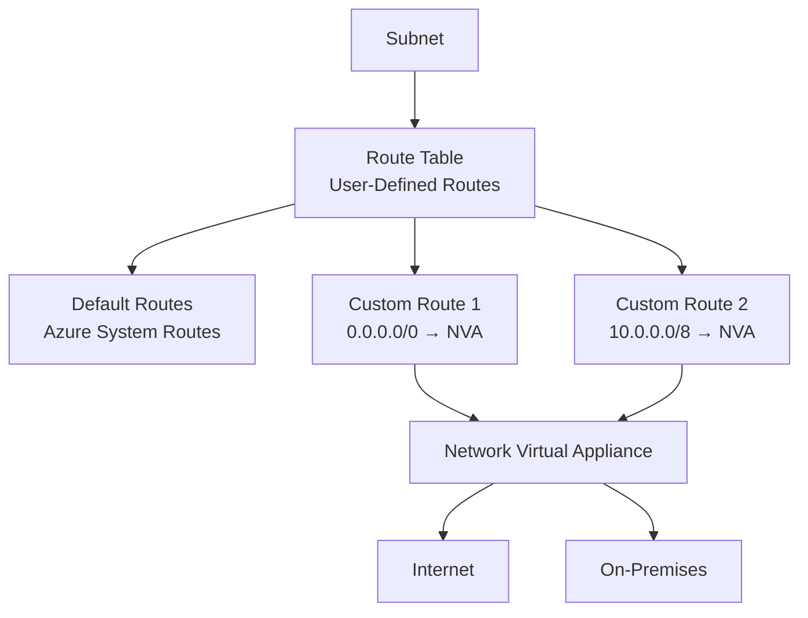
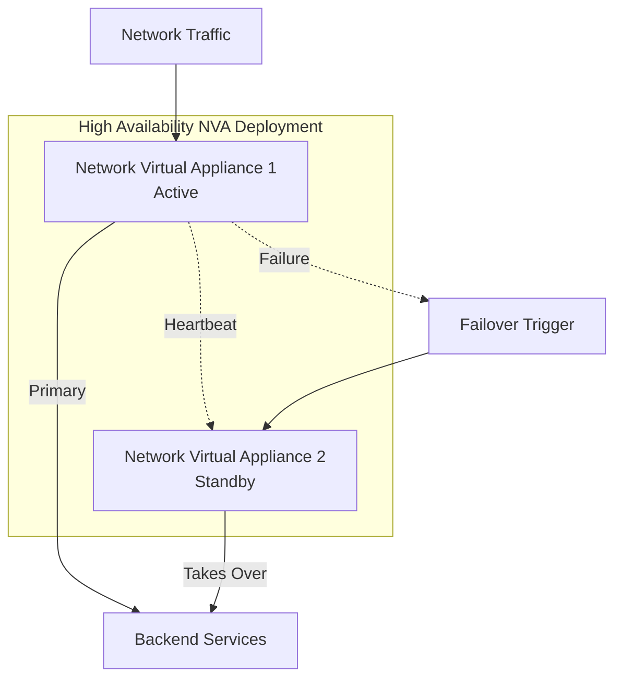
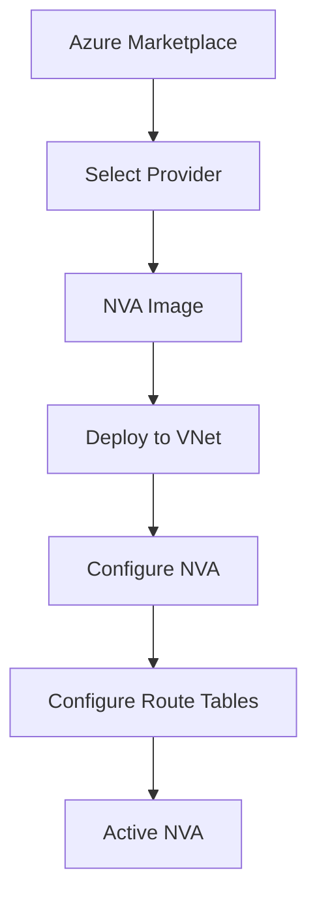

# Azure Network Virtual Appliance (NVA)

## Overview

A network virtual appliance (NVA) is a virtual appliance that consists of various layers like:
- A firewall
- A WAN optimizer
- Application-delivery controllers
- Routers
- Load balancers
- IDS/IPS (Intrusion Detection/Prevention Systems)
- Proxies

You can deploy NVAs that you choose from providers in Azure Marketplace. Such providers include Cisco, Check Point, Barracuda, Sophos, WatchGuard, and SonicWall. You can use an NVA to filter traffic inbound to a virtual network, to block malicious requests, and to block requests made from unexpected resources.

**Learn more:**
- [Network Virtual Appliances Overview](https://learn.microsoft.com/en-us/azure/architecture/reference-architectures/dmz/nva-ha)
- [Azure Marketplace - Network Appliances](https://azuremarketplace.microsoft.com/marketplace/apps/category/networking)

## Use Case: Retail Organization Scenario

In the retail-organization example scenario, you must work with the security and network teams. You want to implement a secure environment that scrutinizes all incoming traffic and blocks unauthorized traffic from passing on to the internal network. You also want to secure both virtual-machine networking and Azure-services networking as part of your company's network-security strategy.

Your goal is to prevent unwanted or unsecured network traffic from reaching key systems.

As part of the network-security strategy, you must control the flow of traffic within your virtual network. You also must learn the role of an NVA and the benefit of using an NVA to control traffic flow through an Azure network.

**NVA Security Architecture:**

## Network Virtual Appliance

Network virtual appliances (NVAs) are virtual machines that control the flow of network traffic by controlling routing. You'll typically use them to manage traffic flowing from a perimeter-network environment to other networks or subnets.

**Network Virtual Appliance Architecture:**

**Key Characteristics:**
- **Traffic Control**: Controls flow of network traffic through routing
- **Security Enforcement**: Filters and inspects traffic
- **Perimeter Protection**: Manages traffic from perimeter network to internal networks
- **Routing Control**: Acts as a router forwarding requests between subnets

## NVA Deployment Configurations

You can deploy firewall appliances into a virtual network in different configurations. You can put a firewall appliance in a perimeter-network subnet in the virtual network, or if you want more control of security, implement a microsegmentation approach.

### Perimeter Network Configuration

**Traditional Perimeter Network:**

**Characteristics:**
- NVA deployed in dedicated perimeter/DMZ subnet
- Single point of security control
- Simpler configuration
- Suitable for basic security requirements

### Microsegmentation Approach

With the microsegmentation approach, you can create dedicated subnets for the firewall and then deploy web applications and other services in other subnets. All traffic is routed through the firewall and inspected by the NVAs. You'll enable forwarding on the virtual-appliance network interfaces to pass traffic that is accepted by the appropriate subnet.

**Microsegmentation Architecture:**

**Microsegmentation Benefits:**
- **Granular Control**: Inspect all traffic between subnets
- **Layer 4 & Layer 7 Inspection**: Deep packet inspection capabilities
- **Enhanced Security**: All packets inspected at OSI Layer 4 and Layer 7 (for application-aware appliances)
- **Isolation**: Each tier isolated with firewall inspection
- **Compliance**: Better compliance with security requirements

**Key Configuration:**
- Enable IP forwarding on the virtual-appliance network interfaces
- Configure route tables to route traffic through NVA
- All traffic between subnets passes through firewall for inspection

## NVA Network Interface Configuration

Some NVAs require multiple network interfaces. One network interface is dedicated to the management network for the appliance. Additional network interfaces manage and control the traffic processing. After you've deployed the NVA, you can then configure the appliance to route the traffic through the proper interface.

**Multi-NIC NVA Architecture:**

**Network Interface Roles:**
- **Management Interface**: Dedicated to appliance administration and configuration
- **Traffic Processing Interfaces**: Handle actual network traffic flow
- **Multiple Interfaces**: Allow separation of management and data traffic
- **IP Forwarding**: Must be enabled on traffic processing interfaces

## User-Defined Routes

For most environments, the default system routes already defined by Azure are enough to get the environments up and running. In certain cases, you should create a routing table and add custom routes. Examples include:

- **Access to the internet via on-premises network using forced tunneling**: Route all internet traffic through on-premises network
- **Using virtual appliances to control traffic flow**: Route traffic through NVAs for inspection

**User-Defined Routes Architecture:**

**Route Table Configuration:**
- You can create multiple route tables in Azure
- Each route table can be associated with one or more subnets
- A subnet can only be associated with one route table
- Routes are evaluated in order of specificity (most specific first)

**Common NVA Routing Scenarios:**

1. **Force All Traffic Through NVA:**
   - Route: `0.0.0.0/0` → NVA IP address
   - All traffic routed through firewall

2. **Route Specific Subnets Through NVA:**
   - Route: `10.0.0.0/8` → NVA IP address
   - Only internal traffic routed through NVA

3. **Internet Traffic Through NVA:**
   - Route: Internet traffic → NVA IP address
   - All outbound internet traffic inspected

## Network Virtual Appliances in a Highly Available Architecture

If traffic is routed through an NVA, the NVA becomes a critical piece of your infrastructure. Any NVA failures directly affect the ability of your services to communicate. It's important to include a highly available architecture in your NVA deployment.

**High Availability Architecture:**

**High Availability Methods:**

1. **Active-Standby Configuration:**
   - Primary NVA handles all traffic
   - Standby NVA ready to take over
   - Automatic failover on primary failure

2. **Active-Active Configuration:**
   - Multiple NVAs share traffic load
   - Load balancing across NVAs
   - Higher throughput and redundancy

3. **Availability Sets:**
   - Deploy NVAs in availability sets
   - Protection from hardware failures
   - 99.95% SLA

4. **Availability Zones:**
   - Deploy NVAs across availability zones
   - Protection from datacenter failures
   - 99.99% SLA

**High Availability Best Practices:**
- Deploy multiple NVA instances
- Use availability sets or availability zones
- Configure health monitoring
- Implement automatic failover
- Test failover scenarios regularly

## NVA Providers and Marketplace

You can deploy NVAs from various providers available in Azure Marketplace:

**Popular NVA Providers:**
- **Cisco**: Cisco ASAv, Cisco CSR
- **Check Point**: Check Point Security Gateway
- **Barracuda**: Barracuda CloudGen Firewall
- **Sophos**: Sophos XG Firewall
- **WatchGuard**: WatchGuard Firebox
- **SonicWall**: SonicWall Virtual Firewall
- **Fortinet**: FortiGate-VM
- **Palo Alto**: Palo Alto Networks VM-Series

**Marketplace Deployment:**

**NVA Selection Considerations:**
- **Features**: Required security features (firewall, IDS/IPS, etc.)
- **Performance**: Throughput and connection limits
- **Licensing**: Licensing model and costs
- **Management**: Management interface and tools
- **Support**: Provider support and documentation

## Check Your Knowledge

### Question 1: Main Benefit of Network Virtual Appliance

**What is the main benefit of using a network virtual appliance?**

- ✅ **Correct**: To control incoming traffic from the perimeter network and allow only traffic that meets security requirements to pass through.

**Why:**
- NVAs are primarily used to control and inspect traffic flow
- They filter traffic from perimeter networks to internal networks
- Only traffic meeting security requirements is allowed through
- NVAs provide deep packet inspection and security enforcement
- They act as security gateways between network segments

- ❌ **Not correct**: To control outbound access to the internet.
  - While NVAs can control outbound traffic, their main benefit is controlling incoming traffic from perimeter networks
  - The primary use case is perimeter security and traffic inspection

- ❌ **Not correct**: To load balance incoming traffic from the internet across multiple Azure virtual machines and across two regions for DR purposes.
  - Load balancing is not the primary function of NVAs
  - Azure Load Balancer or Application Gateway are used for load balancing
  - NVAs focus on security and traffic control, not load distribution

- ❌ **Not correct**: To control who can access Azure resources from the perimeter network.
  - Access control is typically handled by Network Security Groups (NSGs) or Azure RBAC
  - NVAs focus on traffic flow control and security inspection, not user access control

### Question 2: How to Deploy a Network Virtual Appliance

**How might you deploy a network virtual appliance?**

- ✅ **Correct**: Download a virtual appliance from Azure Marketplace and configure the appliance to connect to the production and perimeter networks.

**Why:**
- NVAs are typically deployed from Azure Marketplace
- Marketplace provides pre-configured NVA images from various vendors
- After deployment, you configure the appliance to connect to your networks
- This is the standard and recommended approach for deploying NVAs

- ❌ **Not correct**: You can configure a Windows virtual machine and enable IP forwarding after routing tables, user-defined routes, and subnets have been updated. Or you can use a partner image from Azure Marketplace.
  - While technically possible, this is not the recommended approach
  - NVAs are specialized appliances, not just VMs with IP forwarding
  - Partner images from Marketplace are the preferred method
  - The first part (Windows VM with IP forwarding) is not a standard NVA deployment

- ❌ **Not correct**: Using Azure CLI, deploy a Linux virtual machine in Azure, connect this virtual machine to your production virtual network, and assign a public IP address.
  - This describes deploying a generic VM, not an NVA
  - NVAs are specialized appliances with specific security features
  - Simply deploying a Linux VM doesn't make it an NVA
  - NVAs require specific configurations and features

- ❌ **Not correct**: Using the Azure portal, deploy a Windows 2016 Server instance. Next, using Azure Application Gateway, add the Windows 2016 Server instance as a target endpoint.
  - This describes configuring Application Gateway, not deploying an NVA
  - Application Gateway is a different service (Layer 7 load balancer)
  - NVAs are separate security appliances, not Application Gateway endpoints

## Key Features Summary

**Network Virtual Appliances provide:**
- **Traffic Control**: Control flow of network traffic through routing
- **Security Enforcement**: Filter and inspect traffic at Layer 4 and Layer 7
- **Perimeter Protection**: Secure perimeter network to internal network communication
- **Deep Packet Inspection**: Application-aware inspection capabilities
- **Flexible Deployment**: Perimeter network or microsegmentation approaches
- **Marketplace Integration**: Easy deployment from Azure Marketplace
- **High Availability**: Support for active-standby and active-active configurations

**NVA Use Cases:**
- **Firewall**: Network firewall protection
- **WAN Optimization**: Optimize WAN traffic
- **Application Delivery**: Application delivery controllers
- **Routing**: Advanced routing capabilities
- **Load Balancing**: Network-level load balancing
- **IDS/IPS**: Intrusion detection and prevention
- **Proxy Services**: Proxy and caching services

**Comparison: NVA vs Azure Native Services**

| Feature | Network Virtual Appliance | Azure Native Services |
|---------|--------------------------|----------------------|
| **Deployment** | Marketplace images | Azure managed services |
| **Control** | Full control and customization | Managed by Azure |
| **Maintenance** | You manage updates | Azure manages updates |
| **Flexibility** | Highly flexible | Standardized features |
| **Cost** | VM costs + licensing | Pay-as-you-go |
| **Use Case** | Custom security requirements | Standard security needs |

**Additional Resources:**
- [Network Virtual Appliance Architecture](https://learn.microsoft.com/en-us/azure/architecture/reference-architectures/dmz/nva-ha)
- [Azure Marketplace - Network Appliances](https://azuremarketplace.microsoft.com/marketplace/apps/category/networking)
- [User-Defined Routes](https://learn.microsoft.com/en-us/azure/virtual-network/virtual-networks-udr-overview)
- [High Availability NVAs](https://learn.microsoft.com/en-us/azure/architecture/reference-architectures/dmz/nva-ha)

