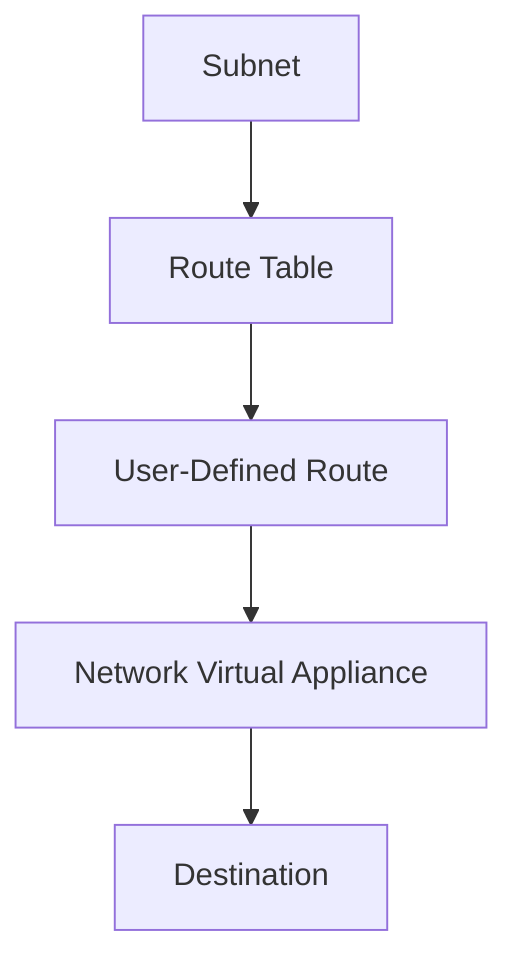

# Implementing User-Defined Routes for Network Virtual Appliances

## Overview

User-defined routes direct traffic through NVAs. Route tables are associated with subnets to control traffic flow.

## Architecture



## Terraform Implementation

### Basic Route Table with NVA Route

```hcl
# Route Table
resource "azurerm_route_table" "nva" {
  name                = "rt-nva"
  location            = "eastus"
  resource_group_name = azurerm_resource_group.main.name
}

# Route through NVA
resource "azurerm_route" "nva" {
  name                   = "route-nva"
  resource_group_name    = azurerm_resource_group.main.name
  route_table_name       = azurerm_route_table.nva.name
  address_prefix         = "0.0.0.0/0"
  next_hop_type         = "VirtualAppliance"
  next_hop_in_ip_address = "10.0.1.10"  # NVA IP address
}

# Associate route table to subnet
resource "azurerm_subnet_route_table_association" "internal" {
  subnet_id      = azurerm_subnet.internal.id
  route_table_id = azurerm_route_table.nva.id
}
```

### Forced Tunneling Through NVA

```hcl
# Route all internet traffic through NVA
resource "azurerm_route" "forced_tunnel" {
  name                   = "route-forced-tunnel"
  resource_group_name    = azurerm_resource_group.main.name
  route_table_name       = azurerm_route_table.nva.name
  address_prefix         = "0.0.0.0/0"
  next_hop_type         = "VirtualAppliance"
  next_hop_in_ip_address = "10.0.1.10"
}
```

### Route Specific Subnets Through NVA

```hcl
# Route internal traffic through NVA
resource "azurerm_route" "internal" {
  name                   = "route-internal"
  resource_group_name    = azurerm_resource_group.main.name
  route_table_name       = azurerm_route_table.nva.name
  address_prefix         = "10.0.0.0/8"
  next_hop_type         = "VirtualAppliance"
  next_hop_in_ip_address = "10.0.1.10"
}

# Route on-premises traffic through NVA
resource "azurerm_route" "onprem" {
  name                   = "route-onprem"
  resource_group_name    = azurerm_resource_group.main.name
  route_table_name       = azurerm_route_table.nva.name
  address_prefix         = "192.168.0.0/16"
  next_hop_type         = "VirtualAppliance"
  next_hop_in_ip_address = "10.0.1.10"
}
```

## Key Configuration Parameters

| Parameter | Description | Required | Example |
|-----------|-------------|----------|---------|
| `address_prefix` | Destination CIDR | Yes | `0.0.0.0/0` |
| `next_hop_type` | Next hop type | Yes | `VirtualAppliance` |
| `next_hop_in_ip_address` | NVA IP address | Yes | `10.0.1.10` |

## Additional Resources

- [User-Defined Routes](https://learn.microsoft.com/en-us/azure/virtual-network/virtual-networks-udr-overview)
- [Terraform azurerm_route_table](https://registry.terraform.io/providers/hashicorp/azurerm/latest/docs/resources/route_table)


