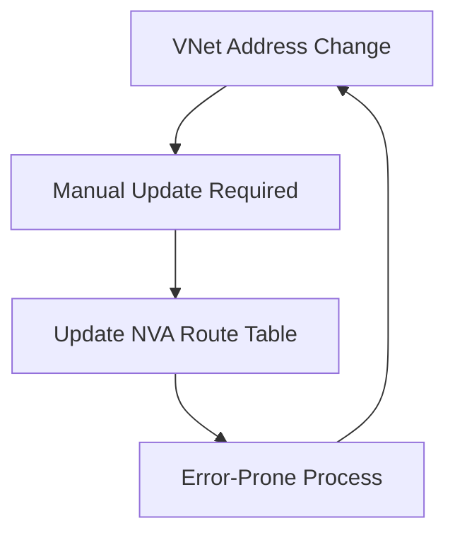
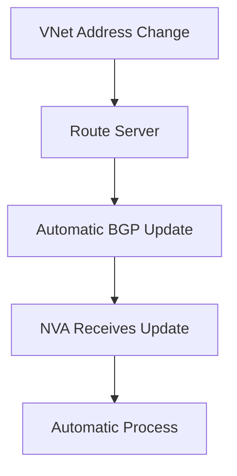
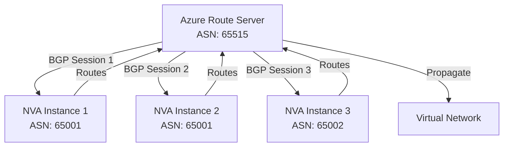
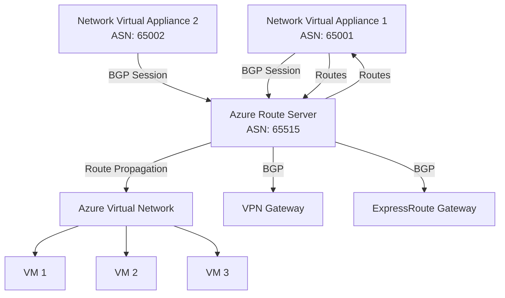
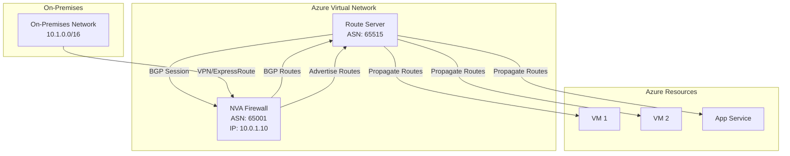
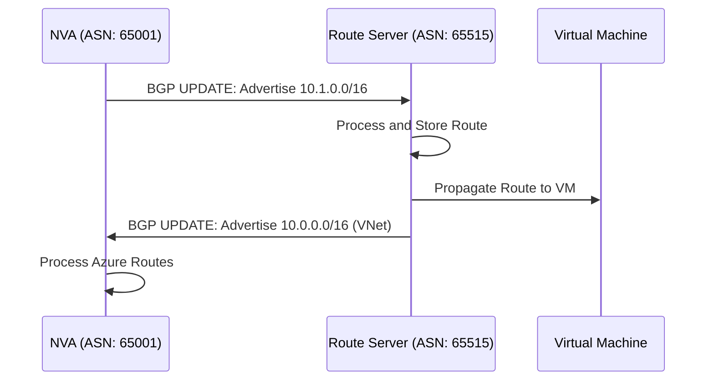
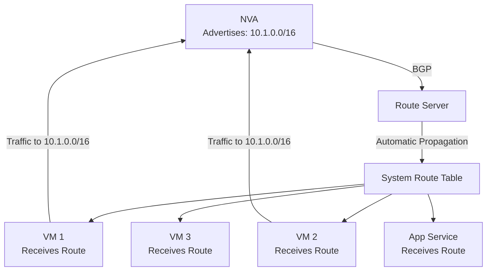
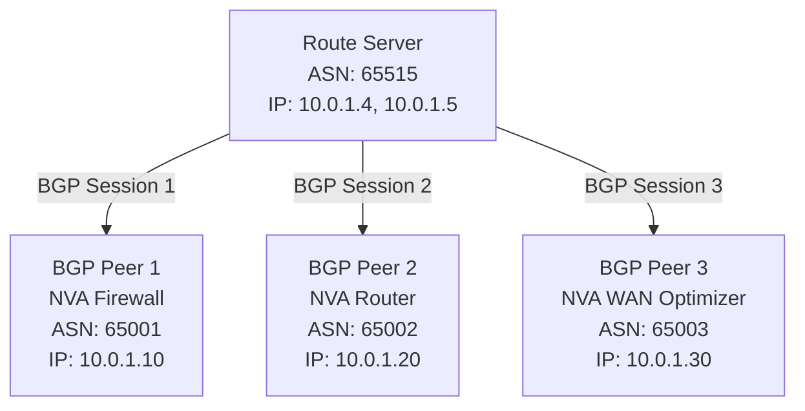
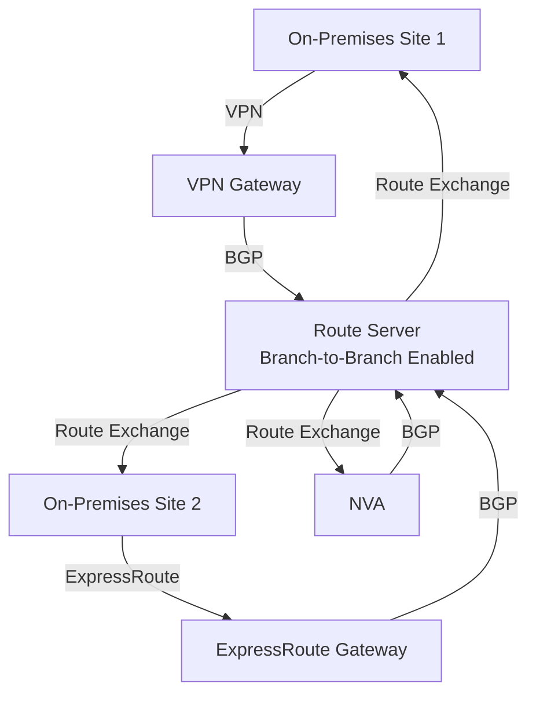
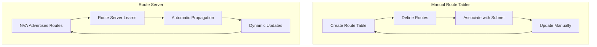

# Azure Route Server

## Overview

Azure Route Server is a fully managed service that enables dynamic routing between your Network Virtual Appliances (NVAs) and Azure Virtual Networks using the Border Gateway Protocol (BGP). Route Server simplifies network routing by automatically exchanging routes between NVAs and Azure resources, eliminating the need for manual route table configuration.

**Key Benefits:**
- **Dynamic Routing**: Automatic route exchange via BGP
- **Simplified Management**: No manual route table configuration needed
- **High Availability**: Standard SKU provides zone-redundant deployment
- **Hybrid Connectivity**: Integrates with VPN Gateway and ExpressRoute Gateway
- **Scalable**: Support for multiple BGP peers (NVAs)

## How Route Server Simplifies Dynamic Routing

Azure Route Server simplifies dynamic routing between Network Virtual Appliances (NVAs) and Virtual Networks. It is a fully managed service configured with high availability, which simplifies the configuration, management, and deployment of NVAs in the virtual network.

### Key Simplifications

**1. No Manual Route Table Updates in NVAs**

You no longer need to manually update the routing table in the NVA every time virtual network addresses are updated. Route Server automatically propagates route changes to NVAs via BGP.

**Before Route Server:**

**With Route Server:**

**2. No Manual User-Defined Routes Updates**

You no longer need to manually update user-defined routes every time the Network Virtual Appliance (NVA) advertises new routes or withdraws old ones. Route Server automatically learns routes from NVAs and propagates them to all VMs in the VNet.

**Traditional Approach (Manual Routes):**
- Create route tables manually
- Define routes statically
- Update routes when NVA routes change
- Associate route tables with subnets
- Manual maintenance required

**Route Server Approach (Dynamic Routes):**
- Routes learned automatically via BGP
- Automatic propagation to all VMs
- No manual route table updates needed
- Routes updated dynamically as NVA advertises/withdraws

**3. Multiple NVA Instances Support**

You can peer multiple instances of your NVA with Azure Route Server. This enables:
- **High Availability**: Deploy multiple NVAs for redundancy
- **Load Distribution**: Distribute traffic across multiple NVAs
- **Active-Active Configuration**: Multiple NVAs with same ASN
- **Active-Standby Configuration**: Primary and backup NVAs

**Multiple NVA Peering:**

**4. Standard Protocol Interface**

The interface between the NVA and Azure Route Server is based on a common standard protocol. As long as your NVA supports BGP, you can establish a connection between it and Azure Route Server.

**BGP Protocol Benefits:**
- **Industry Standard**: BGP is the standard routing protocol
- **Vendor Agnostic**: Works with any BGP-capable NVA
- **No Proprietary APIs**: No vendor-specific integrations needed
- **Widely Supported**: Most network devices support BGP

**Supported NVA Types:**
- Any firewall that supports BGP (Palo Alto, Fortinet, Check Point, etc.)
- Any router that supports BGP (Cisco, Juniper, VyOS, etc.)
- Any network device with BGP support

**5. Flexible Deployment**

You can deploy Azure Route Server in any new or existing virtual networks. This provides flexibility in network design and allows you to add Route Server to existing deployments without major changes.

**Deployment Scenarios:**
- **New VNets**: Deploy Route Server during initial setup
- **Existing VNets**: Add Route Server to existing networks
- **Multiple VNets**: Deploy Route Server in each VNet as needed
- **Peered VNets**: Route Server works with VNet peering

### Summary of Simplifications

| Aspect | Without Route Server | With Route Server |
|--------|---------------------|-------------------|
| **Route Updates in NVA** | Manual updates required | Automatic via BGP |
| **User-Defined Routes** | Manual route table management | Automatic route propagation |
| **Multiple NVAs** | Complex manual configuration | Simple BGP peering |
| **Protocol** | Vendor-specific or manual | Standard BGP protocol |
| **Deployment** | Limited flexibility | Works in new or existing VNets |
| **Management** | Manual and error-prone | Fully managed by Azure |
| **High Availability** | Manual configuration | Built-in with Standard SKU |

**Learn more:**
- [Azure Route Server Overview](https://learn.microsoft.com/en-us/azure/route-server/overview)
- [Route Server Documentation](https://learn.microsoft.com/en-us/azure/route-server/)
- [Route Server with NVA](https://learn.microsoft.com/en-us/azure/route-server/quickstart-configure-route-server)

**Route Server Architecture:**

## What is Azure Route Server?

Azure Route Server is a network service that runs as a managed service in your Azure Virtual Network. It enables your Network Virtual Appliances (NVAs) to exchange routing information dynamically with Azure resources using the Border Gateway Protocol (BGP).

**Key Characteristics:**
- **Fully Managed**: Azure manages the service, no VMs to maintain
- **High Availability**: Configured with high availability out of the box
- **BGP-Based**: Uses standard BGP protocol for route exchange
- **Automatic Propagation**: Routes are automatically propagated to all VMs in the VNet
- **Simplified Management**: Reduces complexity of NVA configuration and deployment
- **Flexible Deployment**: Can be deployed in new or existing virtual networks

## Network Virtual Appliances (NVAs)

Network Virtual Appliances are third-party network devices deployed as virtual machines in Azure. They provide network functions such as firewalls, routers, WAN optimizers, and other network services.

**Common NVA Types:**
- **Firewalls**: Palo Alto, Fortinet, Check Point, Cisco ASA
- **Routers**: Cisco, Juniper, VyOS
- **WAN Optimizers**: Riverbed, Silver Peak
- **Load Balancers**: F5 BIG-IP, Citrix ADC

**NVA Requirements for Route Server:**
- Must support BGP protocol
- Must have IP forwarding enabled
- Must be deployed in Azure Virtual Network
- Must use a unique ASN (different from Route Server's ASN 65515)

**NVA Architecture with Route Server:**

## How Route Server Works

### BGP Route Exchange

Route Server uses BGP to exchange routing information:

1. **NVA Advertises Routes**: NVAs advertise their routes to Route Server via BGP
2. **Route Server Learns Routes**: Route Server receives and processes routes from NVAs
3. **Automatic Propagation**: Route Server automatically propagates learned routes to all VMs in the VNet
4. **Bidirectional Exchange**: Route Server also advertises Azure VNet routes to NVAs

**Route Exchange Flow:**

### Route Propagation

Routes learned from NVAs are automatically added to the system route table of all VMs in the VNet. This happens automatically without manual configuration.

**Route Propagation Architecture:**

## Route Server Components

### Route Server Instance

The Route Server is deployed as a managed service in a dedicated subnet.

**Key Properties:**
- **ASN**: Always uses ASN 65515 (fixed, cannot be changed)
- **SKU**: Standard (high availability)
- **Public IP**: Required for BGP peering
- **Subnet**: Must be in "RouteServerSubnet" (dedicated subnet)

### BGP Peer Connections

Each NVA that needs to exchange routes requires a BGP peer connection.

**BGP Peer Configuration:**
- **Peer ASN**: NVA's Autonomous System Number (must be different from 65515)
- **Peer IP**: NVA's IP address in the VNet
- **BGP Session**: Established between Route Server and NVA

**BGP Peer Architecture:**

## Route Server Requirements

### Subnet Requirements

**Critical Requirements:**
- **Subnet Name**: Must be exactly "RouteServerSubnet" (case-sensitive)
- **Subnet Size**: Minimum /27 (32 IP addresses), recommended /26 or /25
- **Dedicated Subnet**: Should only contain Route Server (no other resources)
- **Location**: Must be in the VNet where you want dynamic routing

**Subnet Sizing:**
- **/27**: Minimum size (32 addresses, ~29 usable)
- **/26**: Recommended (64 addresses, ~61 usable)
- **/25**: Large deployments (128 addresses, ~125 usable)

### Network Requirements

- **VNet**: Route Server must be in the VNet where routing is needed
- **Public IP**: Required for Route Server (automatically created)
- **Connectivity**: NVAs must be able to reach Route Server's subnet

### NVA Requirements

For NVAs to peer with Route Server:

1. **BGP Support**: NVA must support BGP protocol
2. **IP Forwarding**: Must be enabled on NVA's network interface
3. **Unique ASN**: Must use ASN different from 65515
4. **Network Access**: Must be in same VNet or peered VNet
5. **BGP Configuration**: Must be configured to peer with Route Server

## Use Cases

### 1. Dynamic Routing with Firewalls

Use Route Server to dynamically exchange routes with firewall NVAs, enabling automatic route updates when network topology changes.

**Scenario:**
- Firewall NVA manages traffic between Azure and on-premises
- Routes change dynamically based on network conditions
- No manual route table updates needed

### 2. Hybrid Cloud Connectivity

Route Server integrates with VPN Gateway and ExpressRoute Gateway to enable dynamic routing in hybrid scenarios.

**Scenario:**
- On-premises network connected via VPN/ExpressRoute
- Routes exchanged dynamically between on-premises and Azure
- Automatic failover and route updates

### 3. Multi-NVA Routing

Route Server can peer with multiple NVAs simultaneously, enabling complex routing scenarios.

**Scenario:**
- Multiple firewall NVAs for redundancy
- Different NVAs for different traffic types
- Centralized route management

### 4. Microsegmentation

Use Route Server with NVAs to implement network microsegmentation with dynamic routing.

**Scenario:**
- Different network segments with different security policies
- Routes managed dynamically by NVAs
- Automatic propagation to all resources

## Branch-to-Branch Traffic

Route Server can enable branch-to-branch traffic, allowing route exchange between:
- Azure VPN Gateway
- ExpressRoute Gateway
- NVAs via BGP

**Branch-to-Branch Architecture:**

**Benefits:**
- Dynamic routing between on-premises sites
- Automatic route updates
- Simplified hybrid network management

## Route Server vs Manual Route Tables

### Manual Route Tables

**Traditional Approach:**
- Create route tables manually
- Define routes statically
- Associate route tables with subnets
- **Manually update NVA routing tables** when VNet addresses change
- **Manually update user-defined routes** when NVA advertises/withdraws routes
- Complex configuration for multiple NVAs
- Update routes manually when topology changes

**Limitations:**
- Manual configuration and updates required
- No automatic route updates
- Complex management for large networks
- Error-prone manual processes
- Time-consuming maintenance
- Difficult to scale with multiple NVAs

### Route Server (Dynamic Routing)

**Modern Approach:**
- Automatic route exchange via BGP
- Dynamic route updates without manual intervention
- Automatic propagation to all VMs
- Centralized route management
- **No manual NVA route table updates** - changes propagate automatically
- **No manual user-defined route updates** - routes learned automatically
- **Support for multiple NVA instances** - simple BGP peering
- **Standard BGP protocol** - works with any BGP-capable NVA
- **Deploy in new or existing VNets** - flexible deployment

**Advantages:**
- **Eliminates Manual Updates**: No need to manually update routing tables in NVAs
- **Eliminates Manual Route Management**: No need to manually update user-defined routes
- **Multiple NVA Support**: Easily peer multiple NVA instances
- **Standard Protocol**: BGP is industry-standard, vendor-agnostic
- **Flexible Deployment**: Works in new or existing virtual networks
- **Fully Managed**: Azure manages the service with high availability
- **Automatic Route Updates**: Routes updated dynamically as network changes
- **Simplified Management**: Reduces operational complexity
- **Scalable**: Scales to large networks easily

**Comparison:**

## Best Practices

### Subnet Design

1. **Dedicated Subnet**: Use dedicated subnet for Route Server only
2. **Proper Sizing**: Use /26 or /25 for future growth
3. **Naming**: Always use "RouteServerSubnet" (exact name)
4. **Location**: Deploy in the VNet where routing is needed

### NVA Configuration

1. **Unique ASNs**: Ensure each NVA uses a unique ASN
2. **IP Forwarding**: Always enable IP forwarding on NVA interfaces
3. **BGP Configuration**: Properly configure BGP on NVAs
4. **High Availability**: Deploy multiple NVAs for redundancy

### Route Server Configuration

1. **Standard SKU**: Always use Standard SKU for production
2. **Branch-to-Branch**: Enable if using VPN/ExpressRoute
3. **Zone Redundancy**: Use zone-redundant public IP for high availability
4. **Monitoring**: Monitor BGP sessions and route counts

### Security

1. **Network Security Groups**: Apply NSGs to Route Server subnet
2. **Private Peering**: Use private IP addresses for BGP peering
3. **Access Control**: Use Azure RBAC to control Route Server access
4. **Audit Logging**: Enable logging for route changes

## Troubleshooting

### BGP Session Not Established

**Symptoms:**
- Routes not being exchanged
- BGP peer connection shows as down

**Solutions:**
- Verify NVA has BGP enabled and configured
- Check IP forwarding is enabled on NVA
- Verify NVA can reach Route Server subnet
- Check ASN is different from 65515
- Verify peer IP is correct

### Routes Not Propagating

**Symptoms:**
- NVA advertises routes but VMs don't receive them
- Routes not appearing in VM route table

**Solutions:**
- Check Route Server is in the same VNet
- Verify branch-to-branch is enabled if needed
- Check route prefixes are valid
- Verify BGP session is established

### Subnet Issues

**Symptoms:**
- Cannot create Route Server
- Route Server deployment fails

**Solutions:**
- Verify subnet name is exactly "RouteServerSubnet"
- Check subnet size is /27 or larger
- Ensure subnet is dedicated (no other resources)
- Verify subnet is in correct VNet

## Summary

Azure Route Server provides:
- **Dynamic Routing**: Automatic route exchange via BGP
- **Simplified Management**: No manual route table configuration
- **NVA Integration**: Seamless integration with Network Virtual Appliances
- **Hybrid Connectivity**: Integration with VPN and ExpressRoute Gateways
- **High Availability**: Standard SKU with zone redundancy, fully managed service
- **Eliminates Manual Updates**: No need to manually update NVA routing tables or user-defined routes
- **Multiple NVA Support**: Can peer multiple NVA instances with Route Server
- **Standard Protocol**: BGP-based interface works with any BGP-capable NVA
- **Flexible Deployment**: Can be deployed in new or existing virtual networks

**Key Takeaways:**
- Route Server uses ASN 65515 (fixed)
- Requires dedicated "RouteServerSubnet" (minimum /27)
- NVAs must support BGP and have IP forwarding enabled
- Routes are automatically propagated to all VMs
- Supports multiple BGP peers simultaneously
- **No manual route table updates needed** - changes propagate automatically
- **No manual user-defined route updates** - routes learned automatically via BGP
- **Fully managed service** - Azure handles high availability and management
- **Simplifies NVA deployment** - reduces configuration and management complexity

**Additional Resources:**
- [Route Server Quickstart](https://learn.microsoft.com/en-us/azure/route-server/quickstart-configure-route-server)
- [Route Server FAQ](https://learn.microsoft.com/en-us/azure/route-server/route-server-faq)
- [BGP Configuration Guide](https://learn.microsoft.com/en-us/azure/route-server/quickstart-configure-route-server-powershell)

