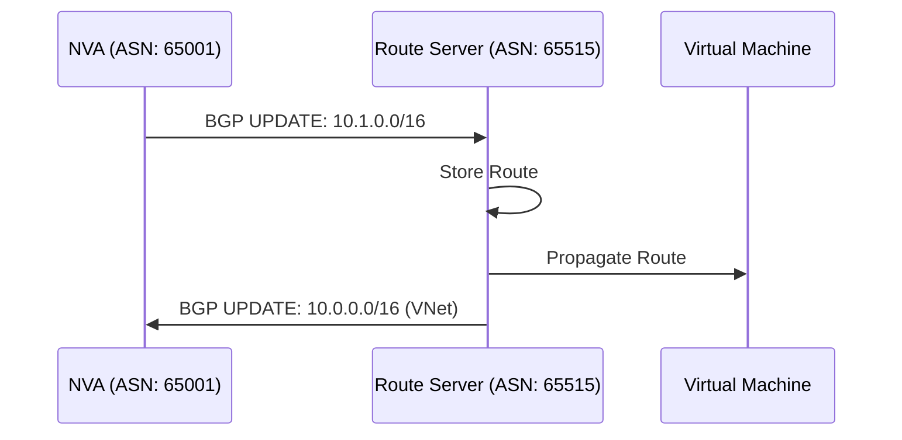

# BGP Peer Connections

## Overview

BGP peer connections enable Network Virtual Appliances (NVAs) to exchange routes with Azure Route Server using the Border Gateway Protocol (BGP).

**Key Concepts:**
- Each NVA requires a BGP peer connection
- Route Server uses ASN 65515 (fixed)
- NVAs must use different ASN (not 65515)
- Routes are automatically exchanged via BGP

## Creating BGP Peer Connection

### Basic BGP Peer

```hcl
# Route Server
resource "azurerm_route_server" "main" {
  name                = "rs-main"
  location            = azurerm_resource_group.main.location
  resource_group_name = azurerm_resource_group.main.name
  sku                 = "Standard"
  subnet_id           = azurerm_subnet.route_server.id
  public_ip_address_id = azurerm_public_ip.route_server.id
}

# BGP Peer Connection
resource "azurerm_route_server_bgp_connection" "nva" {
  name            = "bgp-nva-firewall"
  route_server_id = azurerm_route_server.main.id
  peer_asn        = 65001  # NVA's ASN (must be different from 65515)
  peer_ip         = "10.0.1.10"  # NVA's IP address in VNet
}
```

### Multiple BGP Peers

Route Server can peer with multiple NVAs simultaneously.

```hcl
# Route Server
resource "azurerm_route_server" "main" {
  name                = "rs-main"
  location            = azurerm_resource_group.main.location
  resource_group_name = azurerm_resource_group.main.name
  sku                 = "Standard"
  subnet_id           = azurerm_subnet.route_server.id
  public_ip_address_id = azurerm_public_ip.route_server.id
}

# BGP Peer 1: Primary Firewall
resource "azurerm_route_server_bgp_connection" "firewall_primary" {
  name            = "bgp-firewall-primary"
  route_server_id = azurerm_route_server.main.id
  peer_asn        = 65001
  peer_ip         = "10.0.1.10"
}

# BGP Peer 2: Secondary Firewall
resource "azurerm_route_server_bgp_connection" "firewall_secondary" {
  name            = "bgp-firewall-secondary"
  route_server_id = azurerm_route_server.main.id
  peer_asn        = 65001  # Same ASN for active-active
  peer_ip         = "10.0.1.11"
}

# BGP Peer 3: Router NVA
resource "azurerm_route_server_bgp_connection" "router" {
  name            = "bgp-router"
  route_server_id = azurerm_route_server.main.id
  peer_asn        = 65002  # Different ASN
  peer_ip         = "10.0.1.20"
}
```

### Using for_each for Multiple Peers

```hcl
locals {
  bgp_peers = {
    "firewall-primary" = {
      name     = "bgp-firewall-primary"
      peer_asn = 65001
      peer_ip  = "10.0.1.10"
    }
    "firewall-secondary" = {
      name     = "bgp-firewall-secondary"
      peer_asn = 65001
      peer_ip  = "10.0.1.11"
    }
    "router" = {
      name     = "bgp-router"
      peer_asn = 65002
      peer_ip  = "10.0.1.20"
    }
  }
}

resource "azurerm_route_server_bgp_connection" "peers" {
  for_each = local.bgp_peers

  name            = each.value.name
  route_server_id = azurerm_route_server.main.id
  peer_asn        = each.value.peer_asn
  peer_ip         = each.value.peer_ip
}
```

## BGP Peer Configuration

### ASN Requirements

**Route Server ASN:**
- Always uses ASN **65515**
- Cannot be changed
- Fixed by Azure

**NVA ASN:**
- Must be different from 65515
- Can use any valid ASN (private or public)
- Common private ASN ranges: 64512-65534

```hcl
# Valid ASN examples
peer_asn = 65001  # Private ASN (recommended)
peer_asn = 64512  # Private ASN
peer_asn = 65000  # Private ASN
```

### Peer IP Address

The peer IP must be:
- NVA's IP address in the VNet
- Reachable from Route Server subnet
- Static IP (not dynamic)

```hcl
# Example: NVA with static private IP
resource "azurerm_network_interface" "nva" {
  name                = "nic-nva"
  location            = azurerm_resource_group.main.location
  resource_group_name = azurerm_resource_group.main.name

  ip_configuration {
    name                          = "internal"
    subnet_id                     = azurerm_subnet.nva.id
    private_ip_address_allocation = "Static"
    private_ip_address            = "10.0.1.10"  # Use this IP for BGP peer
  }
}

# BGP Peer using NVA's IP
resource "azurerm_route_server_bgp_connection" "nva" {
  name            = "bgp-nva"
  route_server_id = azurerm_route_server.main.id
  peer_asn        = 65001
  peer_ip         = "10.0.1.10"  # NVA's static IP
}
```

## Complete Example

```hcl
# Route Server
resource "azurerm_route_server" "main" {
  name                = "rs-main"
  location            = azurerm_resource_group.main.location
  resource_group_name = azurerm_resource_group.main.name
  sku                 = "Standard"
  subnet_id           = azurerm_subnet.route_server.id
  public_ip_address_id = azurerm_public_ip.route_server.id

  branch_to_branch_traffic_enabled = true
}

# BGP Peers
resource "azurerm_route_server_bgp_connection" "firewall_primary" {
  name            = "bgp-firewall-primary"
  route_server_id = azurerm_route_server.main.id
  peer_asn        = 65001
  peer_ip         = "10.0.1.10"
}

resource "azurerm_route_server_bgp_connection" "firewall_secondary" {
  name            = "bgp-firewall-secondary"
  route_server_id = azurerm_route_server.main.id
  peer_asn        = 65001
  peer_ip         = "10.0.1.11"
}

# Outputs
output "bgp_peer_ids" {
  description = "BGP peer connection IDs"
  value = {
    firewall_primary   = azurerm_route_server_bgp_connection.firewall_primary.id
    firewall_secondary = azurerm_route_server_bgp_connection.firewall_secondary.id
  }
}
```

## BGP Route Exchange

### How Routes Are Exchanged

1. **NVA Advertises Routes**: NVA sends BGP UPDATE messages to Route Server
2. **Route Server Learns**: Route Server processes and stores routes
3. **Automatic Propagation**: Routes are propagated to all VMs in VNet
4. **Bidirectional**: Route Server also advertises VNet routes to NVA

**Route Exchange Flow:**


## High Availability

### Active-Active Configuration

Deploy multiple NVAs with the same ASN for active-active redundancy.

```hcl
# Primary NVA
resource "azurerm_route_server_bgp_connection" "nva1" {
  name            = "bgp-nva-1"
  route_server_id = azurerm_route_server.main.id
  peer_asn        = 65001
  peer_ip         = "10.0.1.10"
}

# Secondary NVA (same ASN)
resource "azurerm_route_server_bgp_connection" "nva2" {
  name            = "bgp-nva-2"
  route_server_id = azurerm_route_server.main.id
  peer_asn        = 65001  # Same ASN for active-active
  peer_ip         = "10.0.1.11"
}
```

### Active-Standby Configuration

Use different ASNs and configure NVA for active-standby.

```hcl
# Primary NVA
resource "azurerm_route_server_bgp_connection" "primary" {
  name            = "bgp-nva-primary"
  route_server_id = azurerm_route_server.main.id
  peer_asn        = 65001
  peer_ip         = "10.0.1.10"
}

# Standby NVA (different ASN)
resource "azurerm_route_server_bgp_connection" "standby" {
  name            = "bgp-nva-standby"
  route_server_id = azurerm_route_server.main.id
  peer_asn        = 65002  # Different ASN
  peer_ip         = "10.0.1.11"
}
```

## Best Practices

1. **Unique ASNs**: Use unique ASNs for different NVAs (unless active-active)
2. **Static IPs**: Use static IP addresses for NVAs
3. **Multiple Peers**: Deploy multiple NVAs for redundancy
4. **Monitoring**: Monitor BGP session status
5. **Documentation**: Document ASN assignments

## Troubleshooting

### BGP Session Not Established

**Symptoms:**
- BGP peer shows as down
- Routes not being exchanged

**Solutions:**
- Verify NVA has BGP enabled
- Check IP forwarding is enabled on NVA
- Verify peer IP is correct
- Check ASN is different from 65515
- Verify network connectivity

### Routes Not Propagating

**Symptoms:**
- BGP session established but routes not appearing

**Solutions:**
- Check NVA is advertising routes
- Verify route prefixes are valid
- Check Route Server is in same VNet
- Verify branch-to-branch is enabled if needed

## Additional Resources

- [BGP Configuration](https://learn.microsoft.com/en-us/azure/route-server/quickstart-configure-route-server)
- [Terraform azurerm_route_server_bgp_connection](https://registry.terraform.io/providers/hashicorp/azurerm/latest/docs/resources/route_server_bgp_connection)

