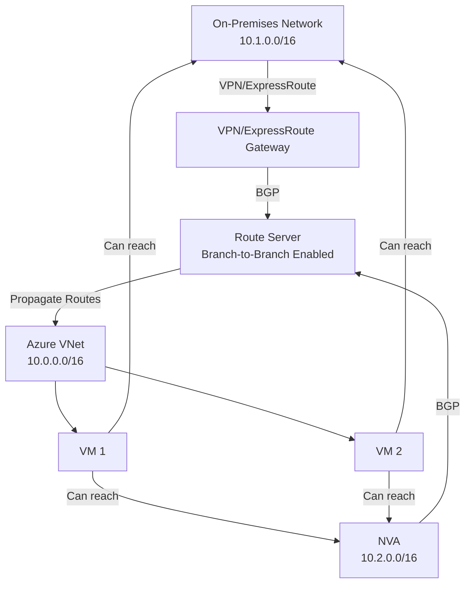

# Hybrid Connectivity with Route Server

## Overview

Azure Route Server integrates with VPN Gateway and ExpressRoute Gateway to enable dynamic routing in hybrid cloud scenarios. This allows automatic route exchange between on-premises networks and Azure Virtual Networks.

**Key Features:**
- Dynamic routing with VPN Gateway
- ExpressRoute Gateway integration
- Branch-to-branch traffic support
- Automatic route propagation

## Branch-to-Branch Traffic

Enable branch-to-branch traffic to allow route exchange between:
- Azure VPN Gateway
- ExpressRoute Gateway
- NVAs via BGP

```hcl
resource "azurerm_route_server" "main" {
  name                = "rs-main"
  location            = azurerm_resource_group.main.location
  resource_group_name = azurerm_resource_group.main.name
  sku                 = "Standard"
  subnet_id           = azurerm_subnet.route_server.id
  public_ip_address_id = azurerm_public_ip.route_server.id

  branch_to_branch_traffic_enabled = true  # Enable for hybrid connectivity
}
```

## VPN Gateway Integration

### Creating VPN Gateway

```hcl
# Gateway Subnet
resource "azurerm_subnet" "gateway" {
  name                 = "GatewaySubnet"
  resource_group_name  = azurerm_resource_group.main.name
  virtual_network_name = azurerm_virtual_network.main.name
  address_prefixes     = ["10.0.3.0/27"]
}

# Public IP for VPN Gateway
resource "azurerm_public_ip" "vpn_gateway" {
  name                = "pip-vpngateway"
  location            = azurerm_resource_group.main.location
  resource_group_name = azurerm_resource_group.main.name
  allocation_method   = "Static"
  sku                 = "Standard"
}

# VPN Gateway
resource "azurerm_virtual_network_gateway" "vpn" {
  name                = "vgw-vpn"
  location            = azurerm_resource_group.main.location
  resource_group_name = azurerm_resource_group.main.name
  type                = "Vpn"
  vpn_type            = "RouteBased"
  sku                 = "VpnGw2"
  active_active       = false

  ip_configuration {
    name                          = "vnetGatewayConfig"
    public_ip_address_id          = azurerm_public_ip.vpn_gateway.id
    private_ip_address_allocation = "Dynamic"
    subnet_id                     = azurerm_subnet.gateway.id
  }

  bgp_settings {
    asn = 65514  # VPN Gateway ASN (different from Route Server's 65515)
  }
}
```

### Route Server with VPN Gateway

```hcl
# Route Server
resource "azurerm_route_server" "main" {
  name                = "rs-main"
  location            = azurerm_resource_group.main.location
  resource_group_name = azurerm_resource_group.main.name
  sku                 = "Standard"
  subnet_id           = azurerm_subnet.route_server.id
  public_ip_address_id = azurerm_public_ip.route_server.id

  branch_to_branch_traffic_enabled = true  # Required for VPN Gateway
}
```

**Automatic Integration:**
- VPN Gateway automatically peers with Route Server
- Routes are exchanged automatically via BGP
- No manual BGP peer connection needed for VPN Gateway

## ExpressRoute Gateway Integration

### Creating ExpressRoute Gateway

```hcl
# Gateway Subnet
resource "azurerm_subnet" "gateway" {
  name                 = "GatewaySubnet"
  resource_group_name  = azurerm_resource_group.main.name
  virtual_network_name = azurerm_virtual_network.main.name
  address_prefixes     = ["10.0.3.0/27"]
}

# ExpressRoute Circuit
resource "azurerm_express_route_circuit" "main" {
  name                  = "erc-main"
  resource_group_name   = azurerm_resource_group.main.name
  location              = azurerm_resource_group.main.location
  service_provider_name = "Equinix"
  peering_location      = "Silicon Valley"
  bandwidth_in_mbps     = 50

  sku {
    tier   = "Standard"
    family = "MeteredData"
  }
}

# ExpressRoute Gateway
resource "azurerm_virtual_network_gateway" "expressroute" {
  name                = "vgw-expressroute"
  location            = azurerm_resource_group.main.location
  resource_group_name = azurerm_resource_group.main.name
  type                = "ExpressRoute"
  sku                 = "Standard"

  ip_configuration {
    name                          = "vnetGatewayConfig"
    private_ip_address_allocation = "Dynamic"
    subnet_id                     = azurerm_subnet.gateway.id
  }
}

# ExpressRoute Connection
resource "azurerm_express_route_circuit_connection" "main" {
  name                        = "ercc-main"
  peering_id                  = azurerm_express_route_circuit.main.express_route_peering.id
  peer_peering_id             = azurerm_express_route_circuit.main.express_route_peering.id
  virtual_network_gateway_id  = azurerm_virtual_network_gateway.expressroute.id
}
```

### Route Server with ExpressRoute Gateway

```hcl
# Route Server
resource "azurerm_route_server" "main" {
  name                = "rs-main"
  location            = azurerm_resource_group.main.location
  resource_group_name = azurerm_resource_group.main.name
  sku                 = "Standard"
  subnet_id           = azurerm_subnet.route_server.id
  public_ip_address_id = azurerm_public_ip.route_server.id

  branch_to_branch_traffic_enabled = true  # Required for ExpressRoute
}
```

**Automatic Integration:**
- ExpressRoute Gateway automatically peers with Route Server
- Routes are exchanged automatically via BGP
- On-premises routes are propagated to Azure VNet

## Complete Hybrid Scenario

### Route Server with VPN Gateway and NVA

```hcl
# Virtual Network
resource "azurerm_virtual_network" "main" {
  name                = "vnet-main"
  address_space       = ["10.0.0.0/16"]
  location            = azurerm_resource_group.main.location
  resource_group_name = azurerm_resource_group.main.name
}

# Route Server Subnet
resource "azurerm_subnet" "route_server" {
  name                 = "RouteServerSubnet"
  resource_group_name  = azurerm_resource_group.main.name
  virtual_network_name = azurerm_virtual_network.main.name
  address_prefixes     = ["10.0.1.0/27"]
}

# Gateway Subnet
resource "azurerm_subnet" "gateway" {
  name                 = "GatewaySubnet"
  resource_group_name  = azurerm_resource_group.main.name
  virtual_network_name = azurerm_virtual_network.main.name
  address_prefixes     = ["10.0.3.0/27"]
}

# NVA Subnet
resource "azurerm_subnet" "nva" {
  name                 = "NVASubnet"
  resource_group_name  = azurerm_resource_group.main.name
  virtual_network_name = azurerm_virtual_network.main.name
  address_prefixes     = ["10.0.2.0/24"]
}

# Public IPs
resource "azurerm_public_ip" "route_server" {
  name                = "pip-routeserver"
  location            = azurerm_resource_group.main.location
  resource_group_name = azurerm_resource_group.main.name
  allocation_method   = "Static"
  sku                 = "Standard"
}

resource "azurerm_public_ip" "vpn_gateway" {
  name                = "pip-vpngateway"
  location            = azurerm_resource_group.main.location
  resource_group_name = azurerm_resource_group.main.name
  allocation_method   = "Static"
  sku                 = "Standard"
}

# Route Server
resource "azurerm_route_server" "main" {
  name                = "rs-main"
  location            = azurerm_resource_group.main.location
  resource_group_name = azurerm_resource_group.main.name
  sku                 = "Standard"
  subnet_id           = azurerm_subnet.route_server.id
  public_ip_address_id = azurerm_public_ip.route_server.id

  branch_to_branch_traffic_enabled = true
}

# VPN Gateway
resource "azurerm_virtual_network_gateway" "vpn" {
  name                = "vgw-vpn"
  location            = azurerm_resource_group.main.location
  resource_group_name = azurerm_resource_group.main.name
  type                = "Vpn"
  vpn_type            = "RouteBased"
  sku                 = "VpnGw2"

  ip_configuration {
    name                          = "vnetGatewayConfig"
    public_ip_address_id          = azurerm_public_ip.vpn_gateway.id
    private_ip_address_allocation = "Dynamic"
    subnet_id                     = azurerm_subnet.gateway.id
  }

  bgp_settings {
    asn = 65514
  }
}

# NVA Network Interface
resource "azurerm_network_interface" "nva" {
  name                = "nic-nva"
  location            = azurerm_resource_group.main.location
  resource_group_name = azurerm_resource_group.main.name
  enable_ip_forwarding = true

  ip_configuration {
    name                          = "internal"
    subnet_id                     = azurerm_subnet.nva.id
    private_ip_address_allocation = "Static"
    private_ip_address            = "10.0.2.10"
  }
}

# BGP Peer for NVA
resource "azurerm_route_server_bgp_connection" "nva" {
  name            = "bgp-nva"
  route_server_id = azurerm_route_server.main.id
  peer_asn        = 65001
  peer_ip         = "10.0.2.10"
}
```

## Route Exchange in Hybrid Scenarios

### Route Flow



### Automatic Route Exchange

1. **On-Premises Routes**: VPN/ExpressRoute Gateway advertises on-premises routes to Route Server
2. **NVA Routes**: NVA advertises its routes to Route Server
3. **Azure Routes**: Route Server advertises VNet routes to both Gateway and NVA
4. **Propagation**: All routes are automatically propagated to VMs in the VNet

## Best Practices

1. **Branch-to-Branch**: Always enable for hybrid scenarios
2. **Gateway ASN**: Use different ASN for Gateway (not 65515)
3. **Route Filtering**: Configure route filters if needed
4. **Monitoring**: Monitor route counts and BGP sessions
5. **Documentation**: Document ASN assignments

## Troubleshooting

### Routes Not Exchanging with Gateway

**Check:**
- Branch-to-branch is enabled on Route Server
- Gateway has BGP enabled
- Gateway ASN is different from 65515
- Gateway is in same VNet

### On-Premises Routes Not Propagating

**Check:**
- VPN/ExpressRoute connection is established
- BGP is enabled on Gateway
- Route Server branch-to-branch is enabled
- Routes are being advertised from on-premises

## Additional Resources

- [VPN Gateway BGP](https://learn.microsoft.com/en-us/azure/vpn-gateway/vpn-gateway-bgp-overview)
- [ExpressRoute BGP](https://learn.microsoft.com/en-us/azure/expressroute/expressroute-routing)
- [Route Server FAQ](https://learn.microsoft.com/en-us/azure/route-server/route-server-faq)

