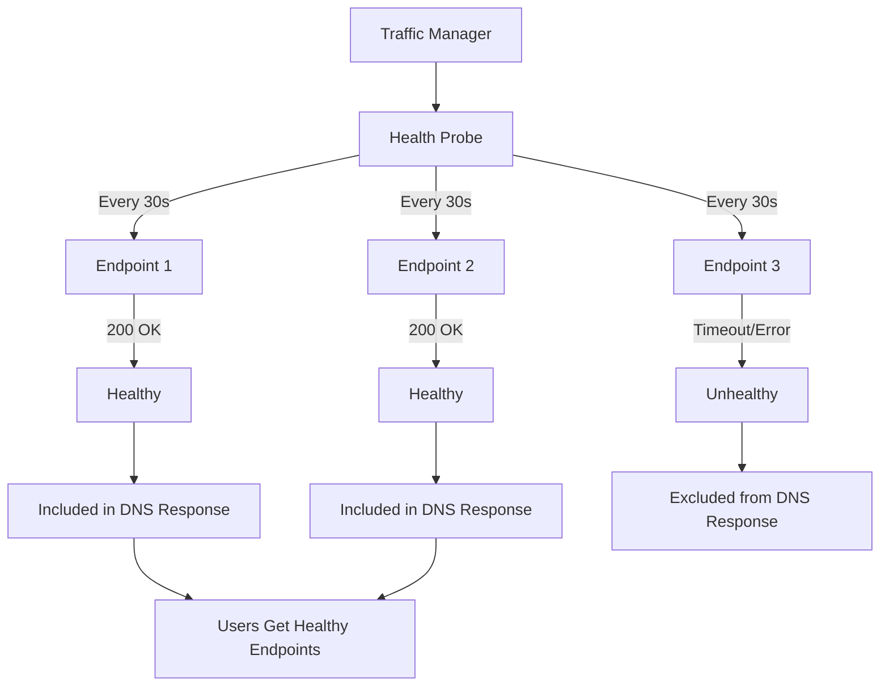

# Traffic Manager Health Monitoring

This guide explains how to configure health monitoring for Azure Traffic Manager endpoints using Terraform.

## Overview

Traffic Manager continuously monitors endpoint health using health probes. Unhealthy endpoints are automatically removed from DNS responses, ensuring traffic only routes to healthy endpoints.

## Health Probe Configuration

Health probes are configured in the `monitor_config` block of the Traffic Manager profile.

### Basic Health Probe

```hcl
resource "azurerm_traffic_manager_profile" "main" {
  name                   = "tm-global-app"
  resource_group_name    = azurerm_resource_group.tm.name
  traffic_routing_method = "Performance"

  dns_config {
    relative_name = "global-app"
    ttl           = 60
  }

  monitor_config {
    protocol                     = "HTTPS"
    port                         = 443
    path                         = "/health"
    interval_in_seconds           = 30
    timeout_in_seconds            = 10
    tolerated_number_of_failures = 3
  }
}
```

## Health Probe Parameters

### Protocol

Traffic Manager supports three protocols for health probes:

#### HTTP Protocol

```hcl
monitor_config {
  protocol                     = "HTTP"
  port                         = 80
  path                         = "/health"
  interval_in_seconds           = 30
  timeout_in_seconds            = 10
  tolerated_number_of_failures = 3
}
```

#### HTTPS Protocol

```hcl
monitor_config {
  protocol                     = "HTTPS"
  port                         = 443
  path                         = "/health"
  interval_in_seconds           = 30
  timeout_in_seconds            = 10
  tolerated_number_of_failures = 3
}
```

#### TCP Protocol

```hcl
monitor_config {
  protocol                     = "TCP"
  port                         = 3389
  interval_in_seconds           = 30
  timeout_in_seconds            = 10
  tolerated_number_of_failures = 3
  # Note: path not used for TCP
}
```

### Probe Interval

The `interval_in_seconds` parameter controls how often Traffic Manager probes endpoints.

```hcl
monitor_config {
  protocol                     = "HTTPS"
  port                         = 443
  path                         = "/health"
  interval_in_seconds           = 30  # Probe every 30 seconds
  timeout_in_seconds            = 10
  tolerated_number_of_failures = 3
}
```

**Recommendations:**
- **30 seconds**: Default, good balance
- **10 seconds**: Faster detection, more probes
- **60 seconds**: Slower detection, fewer probes

### Probe Timeout

The `timeout_in_seconds` parameter controls how long to wait for a response.

```hcl
monitor_config {
  protocol                     = "HTTPS"
  port                         = 443
  path                         = "/health"
  interval_in_seconds           = 30
  timeout_in_seconds            = 10  # Wait up to 10 seconds for response
  tolerated_number_of_failures = 3
}
```

**Recommendations:**
- **10 seconds**: Default, good for most scenarios
- **5 seconds**: Faster failure detection
- **20 seconds**: For slower endpoints

### Tolerated Failures

The `tolerated_number_of_failures` parameter controls how many consecutive failures before marking unhealthy.

```hcl
monitor_config {
  protocol                     = "HTTPS"
  port                         = 443
  path                         = "/health"
  interval_in_seconds           = 30
  timeout_in_seconds            = 10
  tolerated_number_of_failures = 3  # 3 failures = unhealthy
}
```

**How it works:**
- Traffic Manager probes every 30 seconds
- If 3 consecutive probes fail, endpoint marked unhealthy
- Total time to detect failure: 30s × 3 = 90 seconds

**Recommendations:**
- **3 failures**: Default, good balance
- **1 failure**: Faster detection, but more sensitive to transient issues
- **5 failures**: More tolerant, slower detection

## Expected Status Code Ranges

For HTTP/HTTPS probes, you can specify expected status code ranges.

### Single Status Code Range

```hcl
monitor_config {
  protocol                     = "HTTPS"
  port                         = 443
  path                         = "/health"
  interval_in_seconds           = 30
  timeout_in_seconds            = 10
  tolerated_number_of_failures = 3
  expected_status_code_ranges   = ["200-299"]  # Any 2xx status code
}
```

### Multiple Status Code Ranges

```hcl
monitor_config {
  protocol                     = "HTTPS"
  port                         = 443
  path                         = "/health"
  interval_in_seconds           = 30
  timeout_in_seconds            = 10
  tolerated_number_of_failures = 3
  expected_status_code_ranges   = [
    "200-299",  # Success codes
    "301-302"   # Redirect codes (also considered healthy)
  ]
}
```

### Specific Status Codes

```hcl
monitor_config {
  protocol                     = "HTTPS"
  port                         = 443
  path                         = "/health"
  interval_in_seconds           = 30
  timeout_in_seconds            = 10
  tolerated_number_of_failures = 3
  expected_status_code_ranges   = [
    "200",      # OK
    "201",      # Created
    "204"       # No Content
  ]
}
```

## Health Check Paths

The health check path should point to a lightweight endpoint that quickly indicates service health.

### Common Health Check Paths

```hcl
# Simple health check
monitor_config {
  path = "/health"
}

# API health check
monitor_config {
  path = "/api/health"
}

# Detailed health check
monitor_config {
  path = "/api/health/detailed"
}

# Root path (not recommended for production)
monitor_config {
  path = "/"
}
```

### Health Check Endpoint Best Practices

1. **Lightweight**: Should respond quickly (< 1 second)
2. **No Dependencies**: Should not depend on databases or external services
3. **Meaningful**: Should accurately reflect service health
4. **Secure**: Consider authentication if exposing sensitive information

## Complete Health Monitoring Example

```hcl
resource "azurerm_traffic_manager_profile" "monitored" {
  name                   = "tm-monitored-app"
  resource_group_name    = azurerm_resource_group.tm.name
  traffic_routing_method = "Performance"

  dns_config {
    relative_name = "monitored-app"
    ttl           = 60
  }

  monitor_config {
    protocol                     = "HTTPS"
    port                         = 443
    path                         = "/api/health"
    interval_in_seconds           = 30
    timeout_in_seconds            = 10
    tolerated_number_of_failures = 3
    expected_status_code_ranges   = ["200-299"]
  }
}

# Endpoint 1
resource "azurerm_traffic_manager_endpoint" "endpoint1" {
  name                = "endpoint-1"
  resource_group_name = azurerm_resource_group.tm.name
  profile_name        = azurerm_traffic_manager_profile.monitored.name
  type                = "azureEndpoints"
  target_resource_id  = azurerm_public_ip.endpoint1.id
  enabled             = true
}

# Endpoint 2
resource "azurerm_traffic_manager_endpoint" "endpoint2" {
  name                = "endpoint-2"
  resource_group_name = azurerm_resource_group.tm.name
  profile_name        = azurerm_traffic_manager_profile.monitored.name
  type                = "azureEndpoints"
  target_resource_id  = azurerm_public_ip.endpoint2.id
  enabled             = true
}
```

## Health Monitoring Flow



## Health Status States

Traffic Manager endpoints can be in one of these states:

1. **Enabled**: Endpoint is enabled and will be probed
2. **Disabled**: Endpoint is disabled, no traffic routed
3. **Stopped**: Endpoint is stopped (manually or automatically)
4. **Degraded**: Endpoint is responding but with issues
5. **Online**: Endpoint is healthy and receiving traffic
6. **CheckingEndpoint**: Health probe in progress

## Monitoring Health Status

### Using Azure Monitor

```hcl
# Traffic Manager profile with monitoring
resource "azurerm_traffic_manager_profile" "monitored" {
  # ... configuration ...
}

# Monitor endpoint health
# View in Azure Portal: Traffic Manager Profile → Monitoring
```

### Health Status Metrics

- **Probe Result**: Success or failure of health probes
- **Endpoint Status**: Current status of each endpoint
- **Response Time**: Time taken for health probe to respond
- **Availability**: Percentage of time endpoint is healthy

## Best Practices

1. **Use HTTPS**: Use HTTPS for secure health checks when possible
2. **Fast Health Endpoints**: Keep health check endpoints lightweight
3. **Appropriate Intervals**: Balance between responsiveness and probe load
4. **Monitor Status**: Regularly check endpoint health in Azure Portal
5. **Test Failover**: Verify failover behavior when endpoints become unhealthy
6. **Status Code Ranges**: Configure appropriate status code ranges
7. **Custom Headers**: Use custom headers if health endpoint requires authentication

## Troubleshooting

### Endpoint Always Unhealthy

**Possible Causes:**
- Health check path doesn't exist
- Wrong port configured
- Firewall blocking probes
- Health endpoint too slow (exceeds timeout)

**Solutions:**
- Verify health check path exists and responds
- Check port configuration
- Review firewall rules
- Increase timeout if endpoint is slow

### Slow Failover

**Possible Causes:**
- TTL too long
- Probe interval too long
- Tolerated failures too high

**Solutions:**
- Reduce TTL to 60 seconds
- Reduce probe interval to 10-30 seconds
- Reduce tolerated failures to 1-3

## Additional Resources

- [Traffic Manager Health Monitoring](https://learn.microsoft.com/en-us/azure/traffic-manager/traffic-manager-monitoring)
- [Traffic Manager Endpoint Monitoring](https://learn.microsoft.com/en-us/azure/traffic-manager/traffic-manager-endpoint-monitoring)
- [Traffic Manager Troubleshooting](https://learn.microsoft.com/en-us/azure/traffic-manager/traffic-manager-troubleshooting)

