# Azure Traffic Manager

## Overview

Azure Traffic Manager allows you to control how network traffic is distributed to application deployments (endpoints) running in different datacenters. Azure Traffic Manager uses DNS to direct client requests to the appropriate service endpoint based on a traffic routing method. For any profile, Traffic Manager applies the associated traffic routing method to each DNS query it receives. The traffic routing method determines which endpoint is returned in the DNS response.

**Key Characteristics:**

- **DNS-Based Load Balancing**: Uses DNS to route traffic, not a proxy
- **Global Distribution**: Distributes traffic across multiple Azure regions and datacenters
- **High Availability**: Automatic failover between endpoints
- **Health Monitoring**: Monitors endpoint health and routes only to healthy endpoints
- **Multiple Routing Methods**: Supports various routing methods for different scenarios

**Traffic Manager Architecture:**
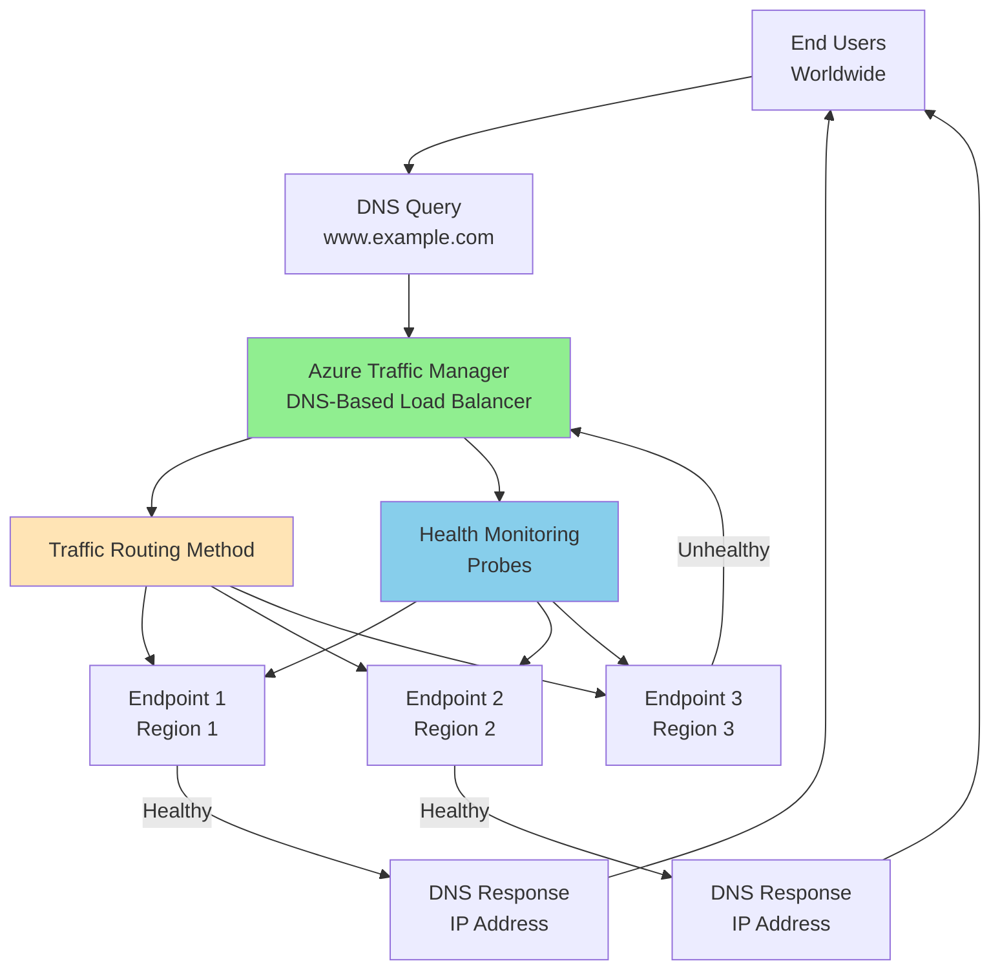
```mermaid
graph TB
    Users[End Users<br/>Worldwide] --> DNS[DNS Query<br/>www.example.com]
    DNS --> TM[Azure Traffic Manager<br/>DNS-Based Load Balancer]
    
    TM --> RoutingMethod[Traffic Routing Method]
    
    RoutingMethod --> Endpoint1[Endpoint 1<br/>Region 1]
    RoutingMethod --> Endpoint2[Endpoint 2<br/>Region 2]
    RoutingMethod --> Endpoint3[Endpoint 3<br/>Region 3]
    
    TM --> HealthMonitor[Health Monitoring<br/>Probes]
    HealthMonitor --> Endpoint1
    HealthMonitor --> Endpoint2
    HealthMonitor --> Endpoint3
    
    Endpoint1 -->|Healthy| Response1[DNS Response<br/>IP Address]
    Endpoint2 -->|Healthy| Response2[DNS Response<br/>IP Address]
    Endpoint3 -->|Unhealthy| TM
    
    Response1 --> Users
    Response2 --> Users
    
    style TM fill:#90EE90
    style RoutingMethod fill:#FFE4B5
    style HealthMonitor fill:#87CEEB
```

**How Traffic Manager Works:**
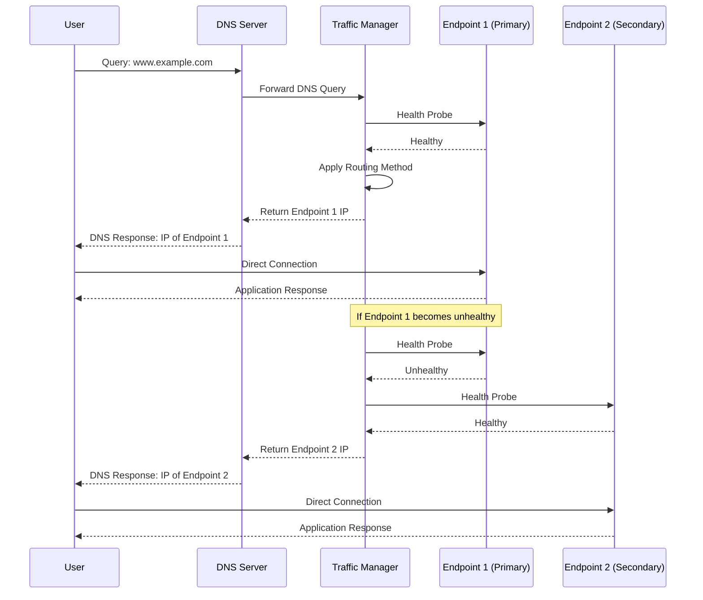
```mermaid
sequenceDiagram
    participant User
    participant DNS as DNS Server
    participant TM as Traffic Manager
    participant Endpoint1 as Endpoint 1 (Primary)
    participant Endpoint2 as Endpoint 2 (Secondary)
    
    User->>DNS: Query: www.example.com
    DNS->>TM: Forward DNS Query
    TM->>Endpoint1: Health Probe
    Endpoint1-->>TM: Healthy
    TM->>TM: Apply Routing Method
    TM-->>DNS: Return Endpoint 1 IP
    DNS-->>User: DNS Response: IP of Endpoint 1
    User->>Endpoint1: Direct Connection
    Endpoint1-->>User: Application Response
    
    Note over TM,Endpoint1: If Endpoint 1 becomes unhealthy
    TM->>Endpoint1: Health Probe
    Endpoint1-->>TM: Unhealthy
    TM->>Endpoint2: Health Probe
    Endpoint2-->>TM: Healthy
    TM-->>DNS: Return Endpoint 2 IP
    DNS-->>User: DNS Response: IP of Endpoint 2
    User->>Endpoint2: Direct Connection
    Endpoint2-->>User: Application Response
```

**Learn more:**
- [Azure Traffic Manager Overview](https://learn.microsoft.com/en-us/azure/traffic-manager/traffic-manager-overview)
- [Traffic Manager Documentation](https://learn.microsoft.com/en-us/azure/traffic-manager/)

## Traffic Routing Methods

Azure Traffic Manager supports different traffic routing methods to determine how to route network traffic to different service endpoints. Select the method that best fits your requirements.

### Priority Routing Method

Use the Priority routing method for a primary service endpoint for all traffic. You can provide multiple backup endpoints in case the primary or one of the backup endpoints is unavailable.

**Priority Routing Architecture:**
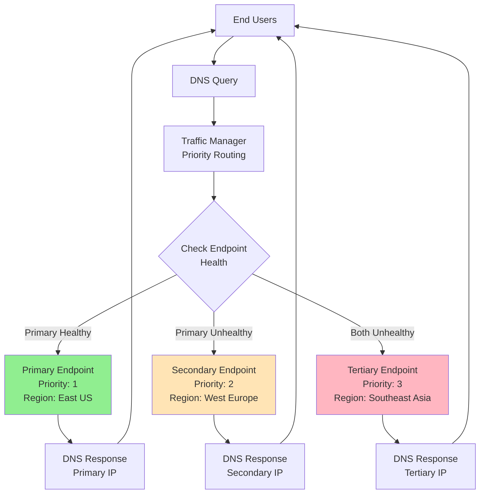
```mermaid
graph TB
    Users[End Users] --> DNS[DNS Query]
    DNS --> TM[Traffic Manager<br/>Priority Routing]
    
    TM --> Check{Check Endpoint<br/>Health}
    
    Check -->|Primary Healthy| Primary[Primary Endpoint<br/>Priority: 1<br/>Region: East US]
    Check -->|Primary Unhealthy| Secondary[Secondary Endpoint<br/>Priority: 2<br/>Region: West Europe]
    Check -->|Both Unhealthy| Tertiary[Tertiary Endpoint<br/>Priority: 3<br/>Region: Southeast Asia]
    
    Primary --> Response1[DNS Response<br/>Primary IP]
    Secondary --> Response2[DNS Response<br/>Secondary IP]
    Tertiary --> Response3[DNS Response<br/>Tertiary IP]
    
    Response1 --> Users
    Response2 --> Users
    Response3 --> Users
    
    style Primary fill:#90EE90
    style Secondary fill:#FFE4B5
    style Tertiary fill:#FFB6C1
```

**Priority Routing Flow:**
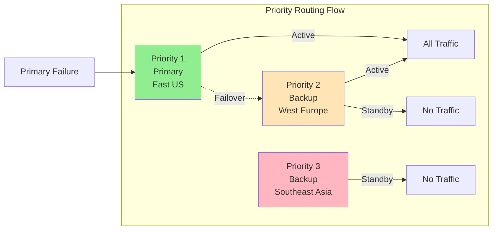
```mermaid
graph LR
    subgraph "Priority Routing Flow"
        P1[Priority 1<br/>Primary<br/>East US] -->|Active| Traffic1[All Traffic]
        P2[Priority 2<br/>Backup<br/>West Europe] -->|Standby| Traffic2[No Traffic]
        P3[Priority 3<br/>Backup<br/>Southeast Asia] -->|Standby| Traffic3[No Traffic]
    end
    
    Failure[Primary Failure] --> P1
    P1 -.->|Failover| P2
    P2 -->|Active| Traffic1
    
    style P1 fill:#90EE90
    style P2 fill:#FFE4B5
    style P3 fill:#FFB6C1
```

**Priority Routing Diagram:**

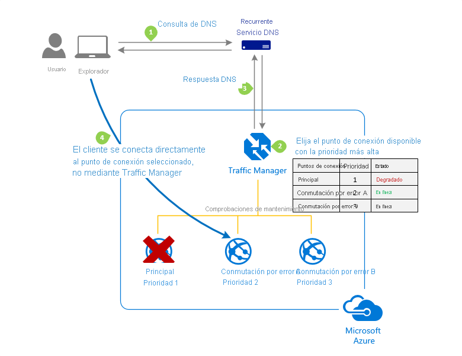

**Key Characteristics:**
- **Primary Endpoint**: Receives all traffic when healthy
- **Backup Endpoints**: Standby endpoints activated on primary failure
- **Automatic Failover**: Traffic automatically routes to next priority endpoint
- **Use Case**: Disaster recovery, high availability scenarios
- **Failover Order**: Priority 1 → Priority 2 → Priority 3

**Example Scenario:**
- **Primary (Priority 1)**: Production datacenter in East US
- **Secondary (Priority 2)**: DR datacenter in West Europe
- **Tertiary (Priority 3)**: Backup datacenter in Southeast Asia

When the primary endpoint is healthy, all traffic routes to it. If it becomes unhealthy, Traffic Manager automatically routes traffic to the secondary endpoint.

### Weighted Routing Method

Use the Weighted routing method when you want to distribute traffic across a set of endpoints based on their importance. Set the same weight value to distribute traffic evenly across all endpoints.

**Weighted Routing Architecture:**
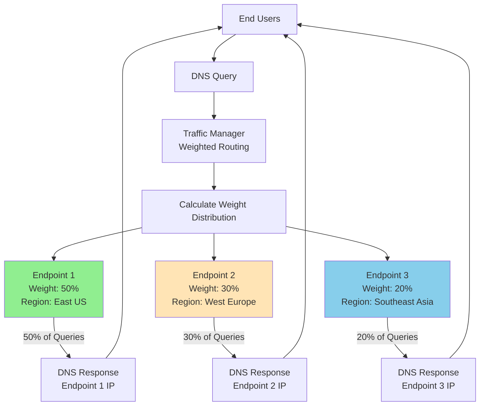
```mermaid
graph TB
    Users[End Users] --> DNS[DNS Query]
    DNS --> TM[Traffic Manager<br/>Weighted Routing]
    
    TM --> WeightCalc[Calculate Weight Distribution]
    
    WeightCalc --> E1[Endpoint 1<br/>Weight: 50%<br/>Region: East US]
    WeightCalc --> E2[Endpoint 2<br/>Weight: 30%<br/>Region: West Europe]
    WeightCalc --> E3[Endpoint 3<br/>Weight: 20%<br/>Region: Southeast Asia]
    
    E1 -->|50% of Queries| Response1[DNS Response<br/>Endpoint 1 IP]
    E2 -->|30% of Queries| Response2[DNS Response<br/>Endpoint 2 IP]
    E3 -->|20% of Queries| Response3[DNS Response<br/>Endpoint 3 IP]
    
    Response1 --> Users
    Response2 --> Users
    Response3 --> Users
    
    style E1 fill:#90EE90
    style E2 fill:#FFE4B5
    style E3 fill:#87CEEB
```

**Weighted Routing Distribution:**
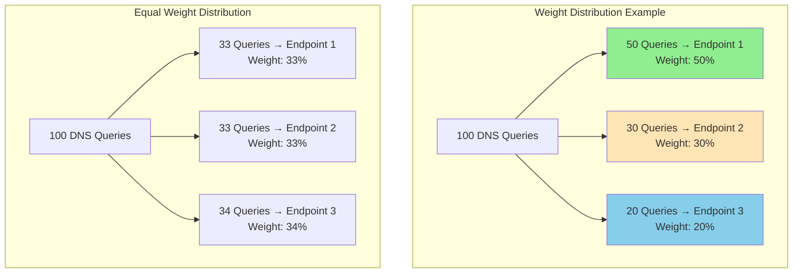
```mermaid
graph TB
    subgraph "Weight Distribution Example"
        Total[100 DNS Queries] --> W1[50 Queries → Endpoint 1<br/>Weight: 50%]
        Total --> W2[30 Queries → Endpoint 2<br/>Weight: 30%]
        Total --> W3[20 Queries → Endpoint 3<br/>Weight: 20%]
    end
    
    subgraph "Equal Weight Distribution"
        Equal[100 DNS Queries] --> E1[33 Queries → Endpoint 1<br/>Weight: 33%]
        Equal --> E2[33 Queries → Endpoint 2<br/>Weight: 33%]
        Equal --> E3[34 Queries → Endpoint 3<br/>Weight: 34%]
    end
    
    style W1 fill:#90EE90
    style W2 fill:#FFE4B5
    style W3 fill:#87CEEB
```

**Weighted Routing Diagram:**

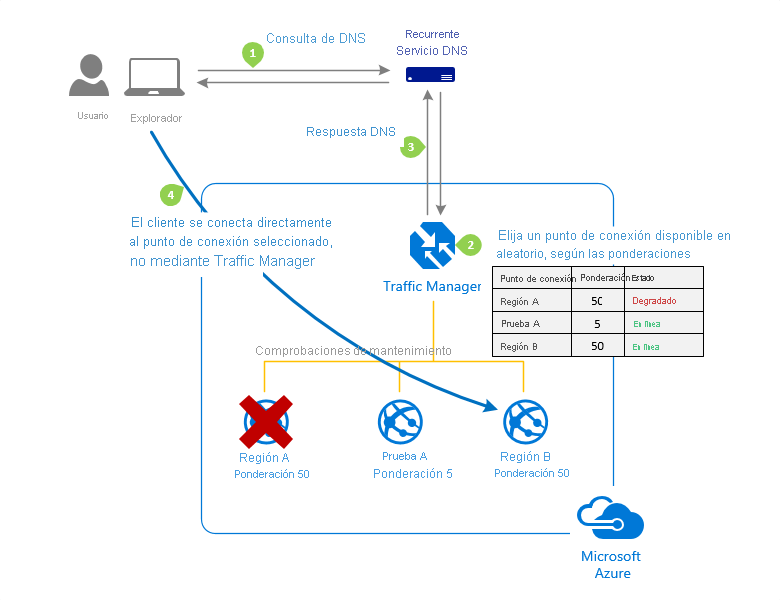

**Key Characteristics:**
- **Weight-Based Distribution**: Traffic distributed based on configured weights
- **Proportional Routing**: Higher weight = more traffic
- **Equal Distribution**: Same weight = equal traffic distribution
- **Use Case**: Gradual traffic migration, A/B testing, capacity-based routing
- **Round-Robin DNS**: Uses DNS round-robin to distribute queries

**Example Scenarios:**

1. **Gradual Migration**: 
   - Old infrastructure: Weight 80%
   - New infrastructure: Weight 20%
   - Gradually increase new infrastructure weight

2. **Capacity-Based Routing**:
   - Large datacenter: Weight 60%
   - Medium datacenter: Weight 30%
   - Small datacenter: Weight 10%

3. **Equal Distribution**:
   - All endpoints: Weight 33.33%
   - Traffic evenly distributed

### Performance Routing Method

Use the Performance routing method when endpoints are in different geographic locations. Users should use the "closest" endpoint for the lowest network latency.

**Performance Routing Architecture:**
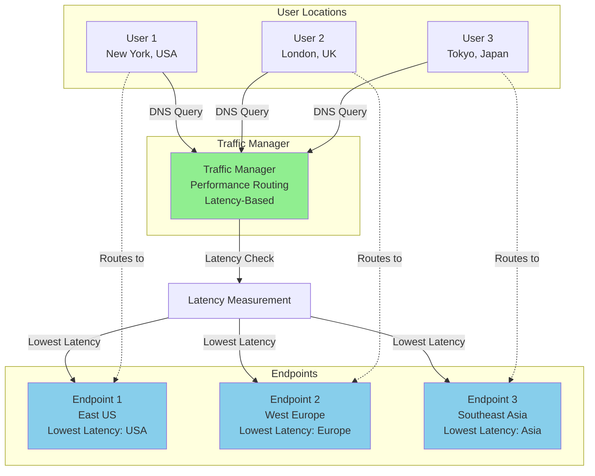
```mermaid
graph TB
    subgraph "User Locations"
        User1[User 1<br/>New York, USA]
        User2[User 2<br/>London, UK]
        User3[User 3<br/>Tokyo, Japan]
    end
    
    subgraph "Traffic Manager"
        TM[Traffic Manager<br/>Performance Routing<br/>Latency-Based]
    end
    
    subgraph "Endpoints"
        E1[Endpoint 1<br/>East US<br/>Lowest Latency: USA]
        E2[Endpoint 2<br/>West Europe<br/>Lowest Latency: Europe]
        E3[Endpoint 3<br/>Southeast Asia<br/>Lowest Latency: Asia]
    end
    
    User1 -->|DNS Query| TM
    User2 -->|DNS Query| TM
    User3 -->|DNS Query| TM
    
    TM -->|Latency Check| Latency[Latency Measurement]
    Latency -->|Lowest Latency| E1
    Latency -->|Lowest Latency| E2
    Latency -->|Lowest Latency| E3
    
    User1 -.->|Routes to| E1
    User2 -.->|Routes to| E2
    User3 -.->|Routes to| E3
    
    style TM fill:#90EE90
    style E1 fill:#87CEEB
    style E2 fill:#87CEEB
    style E3 fill:#87CEEB
```

**Performance Routing Latency-Based Selection:**
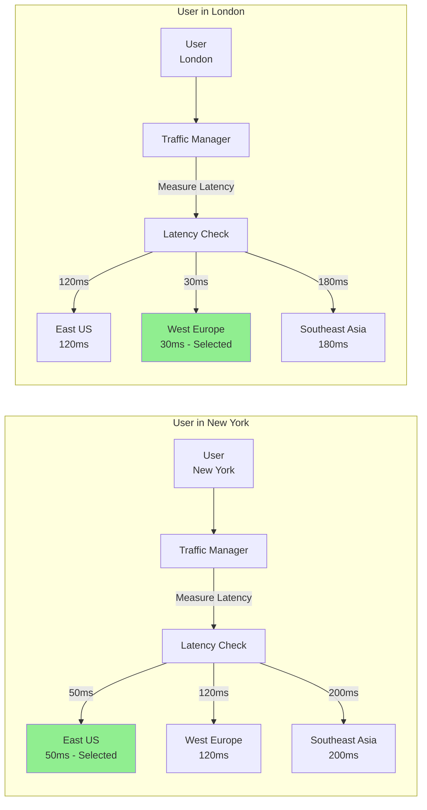
```mermaid
graph LR
    subgraph "User in New York"
        NY[User<br/>New York] --> TM1[Traffic Manager]
        TM1 -->|Measure Latency| L1[Latency Check]
        
        L1 -->|50ms| E1[East US<br/>50ms - Selected]
        L1 -->|120ms| E2[West Europe<br/>120ms]
        L1 -->|200ms| E3[Southeast Asia<br/>200ms]
    end
    
    subgraph "User in London"
        UK[User<br/>London] --> TM2[Traffic Manager]
        TM2 -->|Measure Latency| L2[Latency Check]
        
        L2 -->|120ms| E1B[East US<br/>120ms]
        L2 -->|30ms| E2B[West Europe<br/>30ms - Selected]
        L2 -->|180ms| E3B[Southeast Asia<br/>180ms]
    end
    
    style E1 fill:#90EE90
    style E2B fill:#90EE90
```

**Performance Routing Diagram:**

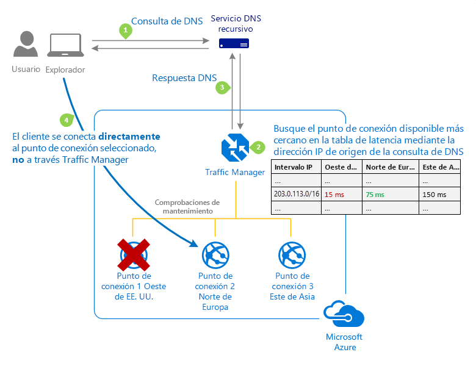

**Key Characteristics:**
- **Latency-Based Routing**: Routes to endpoint with lowest latency
- **Geographic Optimization**: Users routed to nearest endpoint
- **Automatic Selection**: Traffic Manager measures latency and selects best endpoint
- **Use Case**: Global applications requiring low latency
- **Performance Monitoring**: Continuously monitors endpoint performance

**How Performance Routing Works:**
1. Traffic Manager maintains a **latency table** for each endpoint
2. When a DNS query arrives, Traffic Manager checks the user's location
3. Traffic Manager selects the endpoint with the **lowest latency** for that location
4. Returns the selected endpoint's IP address in the DNS response

**Example Scenario:**
- **Endpoint 1**: East US (best for users in North America)
- **Endpoint 2**: West Europe (best for users in Europe)
- **Endpoint 3**: Southeast Asia (best for users in Asia)

A user in New York gets routed to East US (lowest latency), while a user in London gets routed to West Europe.

### Geographic Routing Method

Use the Geographic routing method to direct users to specific endpoints based on where their DNS queries originate geographically. Good option for regional compliance requirements.

**Geographic Routing Architecture:**
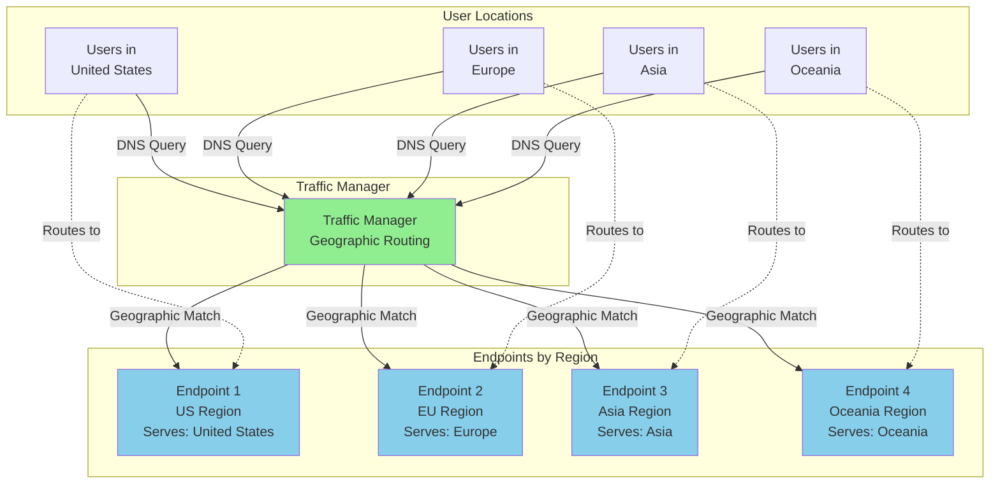
```mermaid
graph TB
    subgraph "User Locations"
        US[Users in<br/>United States]
        EU[Users in<br/>Europe]
        ASIA[Users in<br/>Asia]
        OCEANIA[Users in<br/>Oceania]
    end
    
    subgraph "Traffic Manager"
        TM[Traffic Manager<br/>Geographic Routing]
    end
    
    subgraph "Endpoints by Region"
        E1[Endpoint 1<br/>US Region<br/>Serves: United States]
        E2[Endpoint 2<br/>EU Region<br/>Serves: Europe]
        E3[Endpoint 3<br/>Asia Region<br/>Serves: Asia]
        E4[Endpoint 4<br/>Oceania Region<br/>Serves: Oceania]
    end
    
    US -->|DNS Query| TM
    EU -->|DNS Query| TM
    ASIA -->|DNS Query| TM
    OCEANIA -->|DNS Query| TM
    
    TM -->|Geographic Match| E1
    TM -->|Geographic Match| E2
    TM -->|Geographic Match| E3
    TM -->|Geographic Match| E4
    
    US -.->|Routes to| E1
    EU -.->|Routes to| E2
    ASIA -.->|Routes to| E3
    OCEANIA -.->|Routes to| E4
    
    style TM fill:#90EE90
    style E1 fill:#87CEEB
    style E2 fill:#87CEEB
    style E3 fill:#87CEEB
    style E4 fill:#87CEEB
```

**Geographic Routing Mapping:**
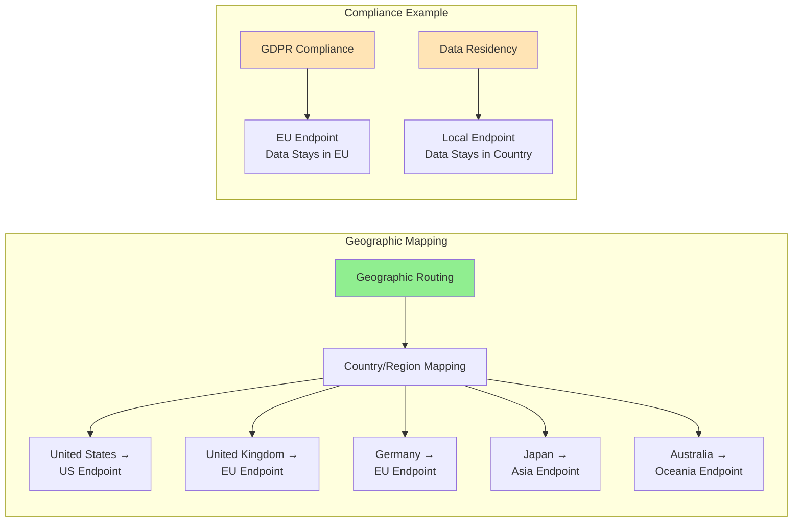
```mermaid
graph LR
    subgraph "Geographic Mapping"
        Geo[Geographic Routing] --> Countries[Country/Region Mapping]
        
        Countries --> US[United States →<br/>US Endpoint]
        Countries --> UK[United Kingdom →<br/>EU Endpoint]
        Countries --> DE[Germany →<br/>EU Endpoint]
        Countries --> JP[Japan →<br/>Asia Endpoint]
        Countries --> AU[Australia →<br/>Oceania Endpoint]
    end
    
    subgraph "Compliance Example"
        GDPR[GDPR Compliance] --> EUEndpoint[EU Endpoint<br/>Data Stays in EU]
        DataResidency[Data Residency] --> LocalEndpoint[Local Endpoint<br/>Data Stays in Country]
    end
    
    style Geo fill:#90EE90
    style GDPR fill:#FFE4B5
    style DataResidency fill:#FFE4B5
```

**Geographic Routing Diagram:**

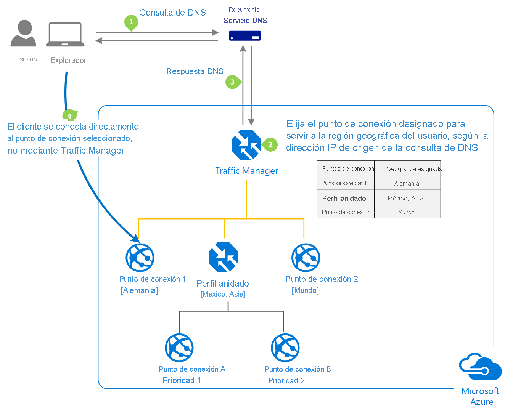

**Key Characteristics:**
- **Geographic-Based Routing**: Routes based on user's geographic location
- **Compliance Support**: Ensures data stays in specific regions
- **Country/Region Mapping**: Maps countries/regions to specific endpoints
- **Use Case**: Data residency requirements, regional compliance (GDPR, etc.)
- **Deterministic Routing**: Same location always routes to same endpoint

**Geographic Routing Use Cases:**

1. **Data Residency Compliance**:
   - EU users → EU endpoint (GDPR compliance)
   - US users → US endpoint
   - Ensures data stays in required geographic region

2. **Regional Content**:
   - Different content for different regions
   - Localized applications
   - Regional language support

3. **Regulatory Requirements**:
   - Financial services regulations
   - Healthcare data regulations
   - Government data requirements

**Example Scenario:**
- **EU Endpoint**: Serves all European countries (GDPR compliance)
- **US Endpoint**: Serves United States and Canada
- **Asia Endpoint**: Serves Asian countries
- **Oceania Endpoint**: Serves Australia and New Zealand

A user in Germany always gets routed to the EU endpoint, ensuring data residency compliance.

## Traffic Routing Methods Comparison

**Routing Methods Comparison Table:**

| Method | Use Case | Key Feature | Example Scenario |
|--------|----------|-------------|------------------|
| **Priority** | Disaster recovery, high availability | Automatic failover | Primary datacenter with backup |
| **Weighted** | Gradual migration, A/B testing | Proportional distribution | 80% old infrastructure, 20% new |
| **Performance** | Global applications, low latency | Latency-based routing | Route to nearest endpoint |
| **Geographic** | Data residency, compliance | Location-based routing | EU users → EU endpoint |

**Routing Methods Decision Tree:**
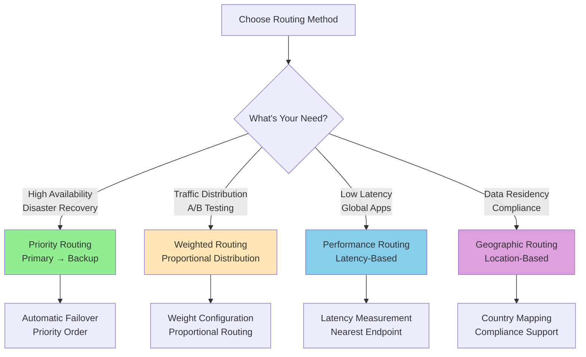
```mermaid
graph TB
    Start[Choose Routing Method] --> Need{What's Your Need?}
    
    Need -->|High Availability<br/>Disaster Recovery| Priority[Priority Routing<br/>Primary → Backup]
    Need -->|Traffic Distribution<br/>A/B Testing| Weighted[Weighted Routing<br/>Proportional Distribution]
    Need -->|Low Latency<br/>Global Apps| Performance[Performance Routing<br/>Latency-Based]
    Need -->|Data Residency<br/>Compliance| Geographic[Geographic Routing<br/>Location-Based]
    
    Priority --> Features1[Automatic Failover<br/>Priority Order]
    Weighted --> Features2[Weight Configuration<br/>Proportional Routing]
    Performance --> Features3[Latency Measurement<br/>Nearest Endpoint]
    Geographic --> Features4[Country Mapping<br/>Compliance Support]
    
    style Priority fill:#90EE90
    style Weighted fill:#FFE4B5
    style Performance fill:#87CEEB
    style Geographic fill:#DDA0DD
```

## Traffic Manager Components

**Traffic Manager Profile Components:**
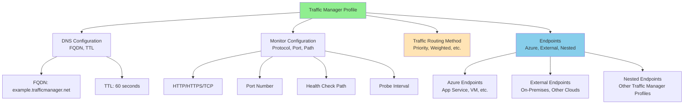
```mermaid
graph TB
    Profile[Traffic Manager Profile] --> DNSConfig[DNS Configuration<br/>FQDN, TTL]
    Profile --> MonitorConfig[Monitor Configuration<br/>Protocol, Port, Path]
    Profile --> RoutingMethod[Traffic Routing Method<br/>Priority, Weighted, etc.]
    Profile --> Endpoints[Endpoints<br/>Azure, External, Nested]
    
    DNSConfig --> FQDN[FQDN: example.trafficmanager.net]
    DNSConfig --> TTL[TTL: 60 seconds]
    
    MonitorConfig --> Protocol[HTTP/HTTPS/TCP]
    MonitorConfig --> Port[Port Number]
    MonitorConfig --> Path[Health Check Path]
    MonitorConfig --> Interval[Probe Interval]
    
    Endpoints --> AzureEndpoint[Azure Endpoints<br/>App Service, VM, etc.]
    Endpoints --> ExternalEndpoint[External Endpoints<br/>On-Premises, Other Clouds]
    Endpoints --> NestedEndpoint[Nested Endpoints<br/>Other Traffic Manager Profiles]
    
    style Profile fill:#90EE90
    style RoutingMethod fill:#FFE4B5
    style Endpoints fill:#87CEEB
```

## Health Monitoring

Traffic Manager continuously monitors endpoint health using health probes.

**Health Monitoring Architecture:**
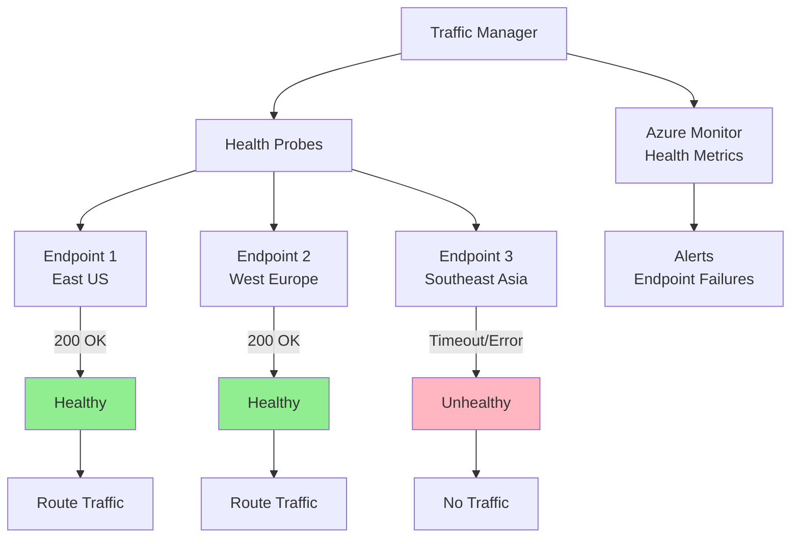
```mermaid
graph TB
    TM[Traffic Manager] --> Probe[Health Probes]
    
    Probe --> E1[Endpoint 1<br/>East US]
    Probe --> E2[Endpoint 2<br/>West Europe]
    Probe --> E3[Endpoint 3<br/>Southeast Asia]
    
    E1 -->|200 OK| Healthy1[Healthy]
    E2 -->|200 OK| Healthy2[Healthy]
    E3 -->|Timeout/Error| Unhealthy[Unhealthy]
    
    Healthy1 --> Route1[Route Traffic]
    Healthy2 --> Route2[Route Traffic]
    Unhealthy --> NoRoute[No Traffic]
    
    TM --> Monitor[Azure Monitor<br/>Health Metrics]
    Monitor --> Alerts[Alerts<br/>Endpoint Failures]
    
    style Healthy1 fill:#90EE90
    style Healthy2 fill:#90EE90
    style Unhealthy fill:#FFB6C1
```

**Health Probe Configuration:**
- **Protocol**: HTTP, HTTPS, or TCP
- **Port**: Port number to probe
- **Path**: Path for HTTP/HTTPS probes (e.g., `/health`)
- **Interval**: How often to probe (default: 30 seconds)
- **Timeout**: Probe timeout (default: 10 seconds)
- **Tolerated Failures**: Number of failures before marking unhealthy (default: 3)

## Best Practices

### 1. Choose the Right Routing Method
- **Priority**: For disaster recovery and high availability
- **Weighted**: For gradual migrations and A/B testing
- **Performance**: For global applications requiring low latency
- **Geographic**: For data residency and compliance requirements

### 2. Configure Health Monitoring
- Set appropriate probe intervals
- Configure health check paths
- Monitor probe results in Azure Monitor
- Set up alerts for endpoint failures

### 3. Use Short TTLs
- Default TTL is 60 seconds
- Shorter TTLs enable faster failover
- Balance between failover speed and DNS query load

### 4. Plan for Failover
- Always have backup endpoints
- Test failover scenarios
- Monitor endpoint health regularly
- Document failover procedures

### 5. Consider DNS Caching
- Client-side DNS caching may delay failover
- Short TTLs help mitigate caching issues
- Consider DNS resolver behavior

## Summary

Azure Traffic Manager provides:
- **DNS-Based Load Balancing**: Routes traffic using DNS, not a proxy
- **Multiple Routing Methods**: Priority, Weighted, Performance, Geographic
- **High Availability**: Automatic failover between endpoints
- **Health Monitoring**: Continuous endpoint health checks
- **Global Distribution**: Distributes traffic across multiple regions
- **Compliance Support**: Geographic routing for data residency

**Key Differences Between Routing Methods:**

| Aspect | Priority | Weighted | Performance | Geographic |
|--------|----------|----------|-------------|------------|
| **Primary Use** | Failover | Distribution | Low Latency | Compliance |
| **Traffic Flow** | All to primary | Proportional | Nearest endpoint | By location |
| **Failover** | Automatic | N/A | Automatic | N/A |
| **Configuration** | Priority order | Weight values | Automatic | Country mapping |

**Additional Resources:**
- [Traffic Manager Quickstart](https://learn.microsoft.com/en-us/azure/traffic-manager/quickstart-create-traffic-manager-profile)
- [Traffic Manager Routing Methods](https://learn.microsoft.com/en-us/azure/traffic-manager/traffic-manager-routing-methods)
- [Traffic Manager Best Practices](https://learn.microsoft.com/en-us/azure/traffic-manager/traffic-manager-best-practices)
- [Traffic Manager FAQ](https://learn.microsoft.com/en-us/azure/traffic-manager/traffic-manager-faqs)

