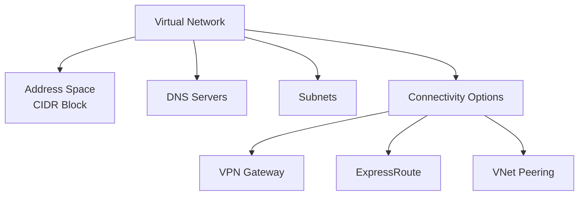

# Implementing Azure Virtual Network with Terraform

## Overview

Azure Virtual Network provides logical isolation of Azure cloud resources. It enables secure communication between Azure resources, on-premises networks, and the internet.

## Architecture



## Terraform Implementation

### Basic Virtual Network

```hcl
# Resource Group
resource "azurerm_resource_group" "vnet" {
  name     = "rg-vnet"
  location = "eastus"
}

# Virtual Network
resource "azurerm_virtual_network" "main" {
  name                = "vnet-main"
  address_space       = ["10.0.0.0/16"]
  location            = "eastus"
  resource_group_name = azurerm_resource_group.vnet.name

  tags = {
    Environment = "Production"
  }
}
```

### Virtual Network with DNS Configuration

```hcl
resource "azurerm_virtual_network" "main" {
  name                = "vnet-main"
  address_space       = ["10.0.0.0/16"]
  location            = "eastus"
  resource_group_name = azurerm_resource_group.vnet.name

  # Custom DNS servers
  dns_servers = ["10.0.0.4", "10.0.0.5", "8.8.8.8"]

  tags = {
    Environment = "Production"
    ManagedBy   = "Terraform"
  }
}
```

### Virtual Network with Multiple Address Spaces

```hcl
resource "azurerm_virtual_network" "main" {
  name                = "vnet-main"
  address_space       = ["10.0.0.0/16", "172.16.0.0/16"]
  location            = "eastus"
  resource_group_name = azurerm_resource_group.vnet.name
}
```

## Key Configuration Parameters

| Parameter | Description | Required | Example |
|-----------|-------------|----------|---------|
| `name` | Virtual network name | Yes | `vnet-main` |
| `location` | Azure region | Yes | `eastus` |
| `resource_group_name` | Resource group | Yes | Resource group name |
| `address_space` | CIDR block(s) | Yes | `["10.0.0.0/16"]` |
| `dns_servers` | DNS server IPs | No | `["10.0.0.4"]` |

## Important Considerations

1. **Address Space**: Cannot be changed after creation
2. **No Overlap**: Must not overlap with on-premises or other VNets
3. **Planning**: Plan for future connectivity requirements
4. **CIDR Notation**: Must use CIDR notation for address space

## Best Practices

1. **Plan Address Space**: Plan carefully before creation
2. **Future Growth**: Consider future expansion needs
3. **Hybrid Connectivity**: Plan for on-premises connectivity
4. **DNS**: Configure DNS servers if custom DNS required

## Outputs

```hcl
output "virtual_network_id" {
  value       = azurerm_virtual_network.main.id
  description = "Virtual Network resource ID"
}

output "virtual_network_address_space" {
  value       = azurerm_virtual_network.main.address_space
  description = "Virtual Network address space"
}
```

## Next Steps

After creating the virtual network:
1. Create subnets (see [02-subnets.md](./02-subnets.md))
2. Configure IP addresses (see [03-private-ip-addresses.md](./03-private-ip-addresses.md) and [04-public-ip-addresses.md](./04-public-ip-addresses.md))

## Additional Resources

- [Virtual Network Overview](https://learn.microsoft.com/en-us/azure/virtual-network/virtual-networks-overview)
- [Terraform azurerm_virtual_network](https://registry.terraform.io/providers/hashicorp/azurerm/latest/docs/resources/virtual_network)


