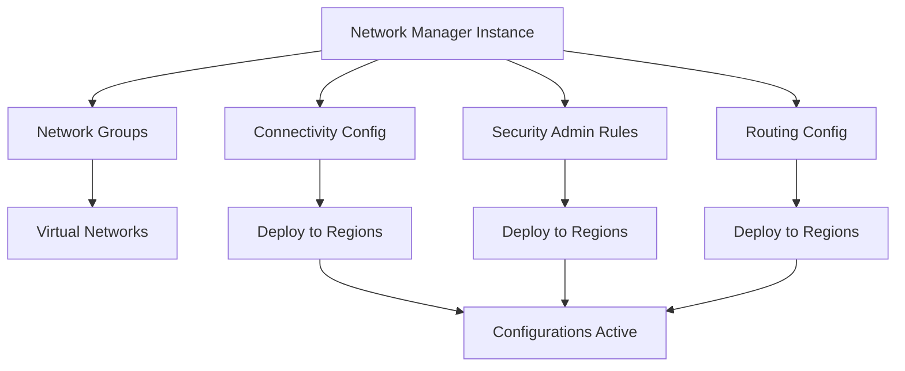

# Terraform Implementation Guides for Azure Virtual Network Manager

This directory contains comprehensive guides for implementing Azure Virtual Network Manager services using Terraform.

## Documentation Structure

1. **[01-network-manager-instance.md](./01-network-manager-instance.md)**
   - Creating Network Manager instances
   - Scope definition (subscriptions, management groups)
   - Scope access configuration

2. **[02-network-groups.md](./02-network-groups.md)**
   - Creating network groups
   - Static membership
   - Dynamic membership via Azure Policy

3. **[03-connectivity-configuration.md](./03-connectivity-configuration.md)**
   - Hub-and-spoke topology
   - Mesh topology
   - Group connectivity options

4. **[04-security-admin-rules.md](./04-security-admin-rules.md)**
   - Security admin configurations
   - Security admin rule collections
   - Security admin rules
   - Rule evaluation order

5. **[05-routing-configuration.md](./05-routing-configuration.md)**
   - Routing configurations
   - Integration with Azure Route Server
   - Route table management

6. **[06-configuration-deployment.md](./06-configuration-deployment.md)**
   - Deploying configurations to regions
   - Phased rollout strategies
   - Deployment validation

## Quick Start

### Complete Example

```hcl
# 1. Create Network Manager Instance
resource "azurerm_network_manager" "main" {
  name                = "nwm-enterprise"
  location            = "eastus"
  resource_group_name = "rg-network-management"

  scope {
    subscription_ids = ["subscription-id-1", "subscription-id-2"]
  }

  scope_accesses = ["Connectivity", "SecurityAdmin", "Routing"]
}

# 2. Create Network Groups
resource "azurerm_network_manager_network_group" "production" {
  name               = "production-vnets"
  network_manager_id = azurerm_network_manager.main.id
}

# 3. Create Connectivity Configuration
resource "azurerm_network_manager_connectivity_configuration" "hub_spoke" {
  name               = "hub-spoke-prod"
  network_manager_id = azurerm_network_manager.main.id
  connectivity_topology = "HubAndSpoke"

  applies_to_group {
    network_group_id   = azurerm_network_manager_network_group.production.id
    group_connectivity = "None"
  }

  hub {
    resource_id   = azurerm_virtual_network.hub.id
    resource_type = "Microsoft.Network/virtualNetworks"
  }
}

# 4. Deploy Configuration
resource "azurerm_network_manager_deployment" "connectivity" {
  location           = "eastus"
  network_manager_id = azurerm_network_manager.main.id
  scope_access       = "Connectivity"

  configuration_ids = [
    azurerm_network_manager_connectivity_configuration.hub_spoke.id
  ]
}
```

## Using the Module

The module provides a complete implementation of Virtual Network Manager:

```hcl
module "network_manager" {
  source = "../../modules/virtual-network-manager"

  resource_group_name    = "rg-network-management"
  location              = "eastus"
  network_manager_name  = "nwm-enterprise"
  scope_subscription_ids = ["subscription-id-1", "subscription-id-2"]

  network_groups = {
    "production-vnets" = {
      description            = "Production virtual networks"
      static_member_vnet_ids = [
        azurerm_virtual_network.prod_vnet_1.id,
        azurerm_virtual_network.prod_vnet_2.id
      ]
    }
  }

  connectivity_configurations = {
    "hub-spoke-prod" = {
      topology                        = "HubAndSpoke"
      network_group_names            = ["production-vnets"]
      group_connectivity             = "None"
      delete_existing_peering_enabled = false
      hub = {
        resource_id   = azurerm_virtual_network.hub.id
        resource_type = "Microsoft.Network/virtualNetworks"
      }
    }
  }

  deployments = {
    "deploy-eastus" = {
      location         = "eastus"
      scope_access     = "Connectivity"
      configuration_ids = [module.network_manager.connectivity_configuration_ids["hub-spoke-prod"]]
    }
  }
}
```

## Architecture Overview



## Best Practices

1. **Start Small**: Begin with a limited scope and expand gradually
2. **Phased Deployment**: Deploy to non-production environments first
3. **Validation**: Use Network Watcher to validate configurations
4. **Documentation**: Document network group purposes and rule justifications
5. **Monitoring**: Set up alerts for configuration changes
6. **Tagging**: Use consistent tagging for dynamic membership
7. **Testing**: Test configurations thoroughly before production deployment

## Common Workflows

### Workflow 1: Hub-and-Spoke Setup

1. Create Network Manager instance
2. Create network groups (hub and spokes)
3. Create connectivity configuration (hub-and-spoke)
4. Deploy to regions
5. Validate with Network Watcher

### Workflow 2: Security Policy Enforcement

1. Create Network Manager instance
2. Create network groups
3. Create security admin configuration
4. Create security admin rules
5. Deploy to regions
6. Monitor and validate

### Workflow 3: Multi-Region Deployment

1. Create Network Manager instance
2. Create configurations
3. Deploy to Region 1 (development)
4. Validate and test
5. Deploy to Region 2 (testing)
6. Validate and test
7. Deploy to all production regions

## Troubleshooting

### Configuration Not Active

- **Issue**: Configuration created but not taking effect
- **Solution**: Ensure deployment has been completed to the target region

### VNets Not Connected

- **Issue**: Peerings not created after deployment
- **Solution**: Check network group membership and address space conflicts

### Security Rules Blocking Traffic

- **Issue**: Legitimate traffic being blocked
- **Solution**: Review rule priority and use Network Watcher IP Flow Verify

## Additional Resources

- [Azure Virtual Network Manager Documentation](https://learn.microsoft.com/en-us/azure/virtual-network-manager/)
- [Terraform Azure Provider - Network Manager](https://registry.terraform.io/providers/hashicorp/azurerm/latest/docs/resources/network_manager)
- [Virtual Network Manager Module](../../../modules/virtual-network-manager/README.md)

