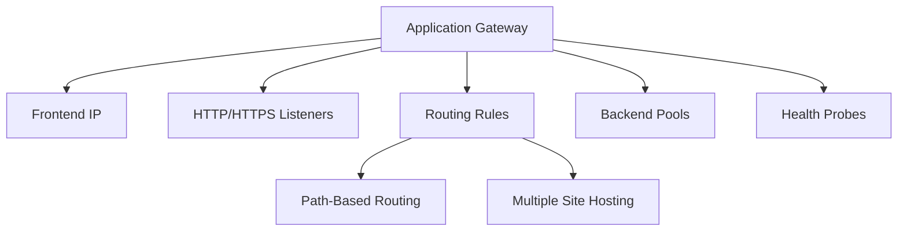

# Terraform Implementation Guides for Azure Application Gateway

This directory contains comprehensive guides for implementing Azure Application Gateway services using Terraform.

## Documentation Structure

1. **[01-application-gateway.md](./01-application-gateway.md)**
   - Creating Application Gateway
   - SKU selection (Standard vs WAF)
   - Frontend IP configuration

2. **[02-backend-pools.md](./02-backend-pools.md)**
   - Backend pool configuration
   - VM, VMSS, and App Service backends
   - Health probe configuration

3. **[03-listeners-and-rules.md](./03-listeners-and-rules.md)**
   - HTTP and HTTPS listeners
   - Routing rules configuration
   - Path-based routing

4. **[04-multiple-site-hosting.md](./04-multiple-site-hosting.md)**
   - Multiple site configuration
   - Hostname-based routing
   - Multi-tenant applications

5. **[05-advanced-features.md](./05-advanced-features.md)**
   - HTTP redirection
   - Header rewriting
   - Custom error pages
   - SSL/TLS configuration

6. **[06-web-application-firewall.md](./06-web-application-firewall.md)**
   - WAF configuration
   - OWASP rule sets
   - WAF modes (Detection/Prevention)
   - Custom WAF rules

## Quick Start

### Basic Application Gateway

```hcl
# Public IP
resource "azurerm_public_ip" "ag" {
  name                = "pip-ag"
  location            = "eastus"
  resource_group_name = azurerm_resource_group.main.name
  allocation_method   = "Static"
  sku                 = "Standard"
}

# Application Gateway
resource "azurerm_application_gateway" "main" {
  name                = "ag-main"
  location            = "eastus"
  resource_group_name = azurerm_resource_group.main.name

  sku {
    name     = "Standard_v2"
    tier     = "Standard_v2"
    capacity = 2  # Manual scaling
  }

  # Autoscaling configuration (V2 only)
  autoscale_configuration {
    min_capacity = 2
    max_capacity = 10
  }

  gateway_ip_configuration {
    name      = "appGatewayIpConfig"
    subnet_id = azurerm_subnet.ag.id
  }

  frontend_port {
    name = "http"
    port = 80
  }

  frontend_ip_configuration {
    name                 = "appGatewayFrontendIP"
    public_ip_address_id = azurerm_public_ip.ag.id
  }

  backend_address_pool {
    name = "backendPool"
  }

  backend_http_settings {
    name                  = "httpSettings"
    cookie_based_affinity = "Disabled"
    port                  = 80
    protocol              = "Http"
  }

  http_listener {
    name                           = "listener"
    frontend_ip_configuration_name = "appGatewayFrontendIP"
    frontend_port_name             = "http"
    protocol                       = "Http"
  }

  request_routing_rule {
    name                       = "rule"
    rule_type                  = "Basic"
    http_listener_name         = "listener"
    backend_address_pool_name   = "backendPool"
    backend_http_settings_name  = "httpSettings"
  }
}
```

### Application Gateway with Autoscaling

```hcl
resource "azurerm_application_gateway" "autoscale" {
  name                = "ag-autoscale"
  location            = "eastus"
  resource_group_name = azurerm_resource_group.main.name

  sku {
    name = "Standard_v2"
    tier = "Standard_v2"
    # capacity not specified when using autoscaling
  }

  autoscale_configuration {
    min_capacity = 2
    max_capacity = 10
  }

  # ... other configuration ...
}
```

## Architecture Overview



## Best Practices

1. **Use WAF SKU**: For production web applications requiring security
2. **HTTPS**: Enable HTTPS listeners with SSL certificates
3. **Health Probes**: Configure appropriate probe intervals and endpoints
4. **Autoscaling**: Use Standard_v2 or WAF_v2 with autoscaling for cost optimization
5. **Zone Redundancy**: Deploy across availability zones for high availability
6. **Subnet Sizing**: Plan subnet size based on scaling requirements (/28 minimum)
7. **Session Affinity**: Enable only when required for stateful applications
8. **Connection Draining**: Enable for graceful server removal

## Additional Resources

- [Azure Application Gateway Documentation](https://learn.microsoft.com/en-us/azure/application-gateway/)
- [Terraform Azure Provider - Application Gateway](https://registry.terraform.io/providers/hashicorp/azurerm/latest/docs/resources/application_gateway)

