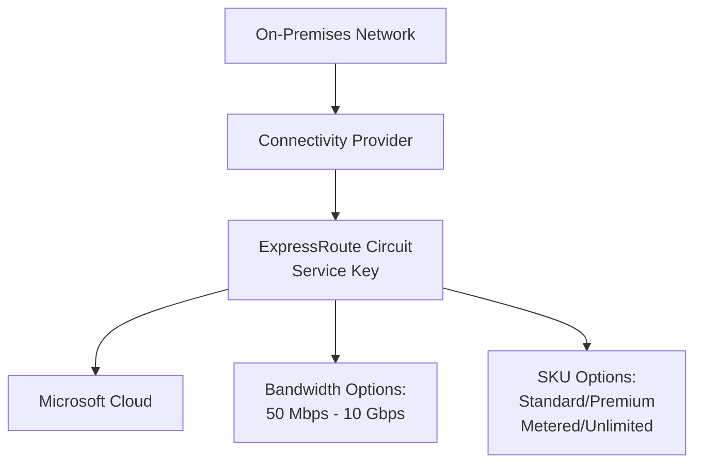

# Implementing Azure ExpressRoute Circuit with Terraform

## Overview

An ExpressRoute circuit is the logical connection between your on-premises infrastructure and the Microsoft Cloud. Each circuit is identified by a service key (s-key) and provides private, dedicated connectivity.

## Architecture



## Terraform Implementation

### Basic ExpressRoute Circuit

```hcl
# Resource Group
resource "azurerm_resource_group" "expressroute" {
  name     = "rg-expressroute"
  location = "eastus"
}

# ExpressRoute Circuit
resource "azurerm_express_route_circuit" "main" {
  name                  = "erc-main"
  resource_group_name   = azurerm_resource_group.expressroute.name
  location              = "eastus"
  service_provider_name = "Equinix"
  peering_location      = "Washington DC"
  bandwidth_in_mbps     = 1000

  sku {
    tier   = "Standard"
    family = "MeteredData"
  }

  tags = {
    Environment = "Production"
    CostCenter  = "IT"
  }
}
```

### Circuit Configuration Options

#### SKU Configuration

**Standard vs Premium:**
- **Standard**: Basic connectivity, limited route limits
- **Premium**: Increased route limits, global connectivity, more VNet links

```hcl
# Standard SKU
sku {
  tier   = "Standard"
  family = "MeteredData"  # or "UnlimitedData"
}

# Premium SKU
sku {
  tier   = "Premium"
  family = "MeteredData"
}
```

#### Bandwidth Options

Available bandwidth options:
- 50 Mbps
- 100 Mbps
- 200 Mbps
- 500 Mbps
- 1 Gbps
- 10 Gbps

```hcl
resource "azurerm_express_route_circuit" "high_bandwidth" {
  # ... other configuration ...
  bandwidth_in_mbps = 10000  # 10 Gbps
}
```

### Service Provider Configuration

Different service providers require different configurations:

```hcl
# Equinix
resource "azurerm_express_route_circuit" "equinix" {
  service_provider_name = "Equinix"
  peering_location      = "Washington DC"
  # ...
}

# AT&T
resource "azurerm_express_route_circuit" "att" {
  service_provider_name = "AT&T"
  peering_location      = "Chicago"
  # ...
}

# Verizon
resource "azurerm_express_route_circuit" "verizon" {
  service_provider_name = "Verizon"
  peering_location      = "New York"
  # ...
}
```

### Complete Example with All Options

```hcl
resource "azurerm_express_route_circuit" "production" {
  name                  = "erc-production"
  resource_group_name   = azurerm_resource_group.expressroute.name
  location              = "eastus"
  service_provider_name = "Equinix"
  peering_location      = "Washington DC"
  bandwidth_in_mbps     = 1000

  sku {
    tier   = "Premium"
    family = "MeteredData"
  }

  allow_classic_operations = false

  tags = {
    Environment = "Production"
    CostCenter  = "IT"
    ManagedBy    = "Terraform"
  }
}

# Output the service key
output "expressroute_service_key" {
  value       = azurerm_express_route_circuit.production.service_key
  description = "Service key for ExpressRoute circuit"
  sensitive   = true
}
```

## Key Configuration Parameters

| Parameter | Description | Required | Example |
|-----------|-------------|----------|---------|
| `name` | Name of the ExpressRoute circuit | Yes | `erc-main` |
| `resource_group_name` | Resource group name | Yes | `rg-expressroute` |
| `location` | Azure region | Yes | `eastus` |
| `service_provider_name` | Connectivity provider | Yes | `Equinix` |
| `peering_location` | Peering location | Yes | `Washington DC` |
| `bandwidth_in_mbps` | Circuit bandwidth | Yes | `1000` |
| `sku.tier` | SKU tier (Standard/Premium) | Yes | `Premium` |
| `sku.family` | Billing model | Yes | `MeteredData` |

## Best Practices

1. **Choose Appropriate Bandwidth**: Start with expected needs, can scale up
2. **Select Right SKU**: Premium for production, Standard for dev/test
3. **Service Provider**: Choose based on location and requirements
4. **Peering Location**: Select closest to your on-premises location
5. **Tagging**: Use consistent tags for cost management

## Outputs

```hcl
output "circuit_id" {
  value       = azurerm_express_route_circuit.main.id
  description = "ExpressRoute circuit resource ID"
}

output "service_key" {
  value       = azurerm_express_route_circuit.main.service_key
  description = "Service key for ExpressRoute circuit"
  sensitive   = true
}

output "service_provider_provisioning_state" {
  value       = azurerm_express_route_circuit.main.service_provider_provisioning_state
  description = "Service provider provisioning state"
}
```

## Next Steps

After creating the circuit:
1. Configure peering (see [02-expressroute-peering.md](./02-expressroute-peering.md))
2. Create ExpressRoute gateway (see [03-expressroute-gateway.md](./03-expressroute-gateway.md))
3. Connect to virtual network (see [04-expressroute-connection.md](./04-expressroute-connection.md))

## Additional Resources

- [ExpressRoute Circuit Overview](https://learn.microsoft.com/en-us/azure/expressroute/expressroute-circuit-peerings)
- [Terraform azurerm_express_route_circuit](https://registry.terraform.io/providers/hashicorp/azurerm/latest/docs/resources/express_route_circuit)

