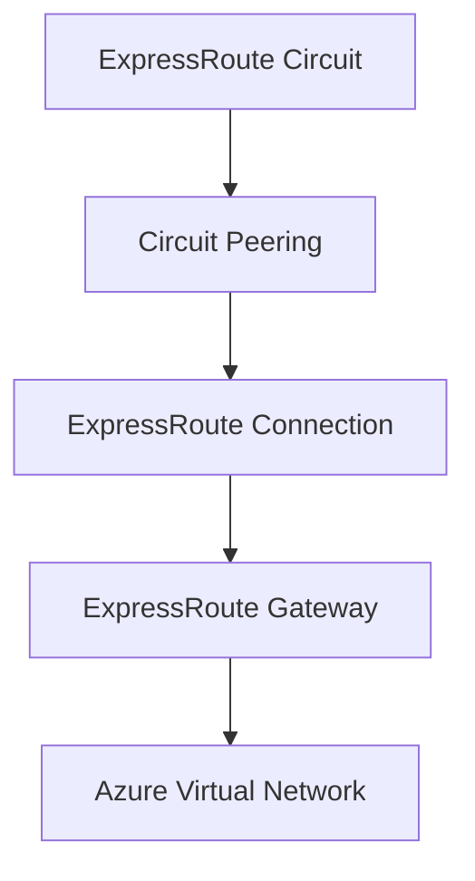

# Implementing ExpressRoute Connection with Terraform

## Overview

ExpressRoute Connection links your ExpressRoute circuit peering to an ExpressRoute gateway, enabling connectivity between on-premises and Azure virtual networks.

## Architecture



## Terraform Implementation

### Basic Connection

```hcl
resource "azurerm_express_route_connection" "main" {
  name                  = "erc-connection"
  express_route_gateway_id = azurerm_express_route_gateway.main.id
  express_route_circuit_peering_id = azurerm_express_route_circuit_peering.private.id
}
```

### Connection with Authorization

```hcl
# Authorization (if circuit is in different subscription)
resource "azurerm_express_route_circuit_authorization" "main" {
  name                       = "erc-auth"
  express_route_circuit_name = azurerm_express_route_circuit.main.name
  resource_group_name        = azurerm_resource_group.expressroute.name
}

# Connection using authorization
resource "azurerm_express_route_connection" "main" {
  name                  = "erc-connection"
  express_route_gateway_id = azurerm_express_route_gateway.main.id
  express_route_circuit_peering_id = azurerm_express_route_circuit_peering.private.id
  authorization_key     = azurerm_express_route_circuit_authorization.main.authorization_key
}
```

### Complete Example

```hcl
# ExpressRoute Circuit
resource "azurerm_express_route_circuit" "main" {
  name                  = "erc-main"
  resource_group_name   = azurerm_resource_group.expressroute.name
  location              = "eastus"
  service_provider_name = "Equinix"
  peering_location      = "Washington DC"
  bandwidth_in_mbps     = 1000

  sku {
    tier   = "Standard"
    family = "MeteredData"
  }
}

# Private Peering
resource "azurerm_express_route_circuit_peering" "private" {
  peering_type                  = "AzurePrivatePeering"
  express_route_circuit_name     = azurerm_express_route_circuit.main.name
  resource_group_name            = azurerm_resource_group.expressroute.name
  peer_asn                       = 65001
  primary_peer_address_prefix    = "192.168.1.0/30"
  secondary_peer_address_prefix  = "192.168.1.4/30"
  vlan_id                        = 100
}

# ExpressRoute Gateway
resource "azurerm_express_route_gateway" "main" {
  name                = "erg-main"
  resource_group_name = azurerm_resource_group.expressroute.name
  location            = "eastus"
  virtual_hub_id      = azurerm_virtual_hub.main.id
  scale_units         = 1
}

# Connection
resource "azurerm_express_route_connection" "main" {
  name                        = "erc-connection"
  express_route_gateway_id    = azurerm_express_route_gateway.main.id
  express_route_circuit_peering_id = azurerm_express_route_circuit_peering.private.id
  
  routing_weight              = 0
  enable_internet_security    = false
  
  tags = {
    Environment = "Production"
  }
}
```

## Key Configuration Parameters

| Parameter | Description | Required | Example |
|-----------|-------------|----------|---------|
| `name` | Connection name | Yes | `erc-connection` |
| `express_route_gateway_id` | Gateway resource ID | Yes | Gateway resource ID |
| `express_route_circuit_peering_id` | Peering resource ID | Yes | Peering resource ID |
| `routing_weight` | Routing weight | No | `0` |
| `enable_internet_security` | Internet security | No | `false` |
| `authorization_key` | Authorization key | No | Required for cross-subscription |

## Best Practices

1. **Routing Weight**: Use for load balancing multiple connections
2. **Internet Security**: Enable for secure internet breakout
3. **Authorization**: Required when circuit is in different subscription
4. **Monitoring**: Set up alerts for connection status

## Outputs

```hcl
output "connection_id" {
  value       = azurerm_express_route_connection.main.id
  description = "ExpressRoute connection resource ID"
}
```

## Additional Resources

- [ExpressRoute Connection Overview](https://learn.microsoft.com/en-us/azure/expressroute/expressroute-howto-linkvnet-portal-resource-manager)
- [Terraform azurerm_express_route_connection](https://registry.terraform.io/providers/hashicorp/azurerm/latest/docs/resources/express_route_connection)

