# Azure Load Balancer

## Overview

Azure Load Balancer is a service you can use to distribute traffic across multiple virtual machines or other services. It allows you to scale the app to larger sizes than a single virtual machine can support, and ensures that users get service even when a virtual machine fails.

In your healthcare organization, you can expect large user demand. It's vitally important that each user can book an appointment, even during peak demand or when one or more virtual machines fail. By using multiple virtual servers for your front end with a load balancer to distribute traffic among them, you achieve a high capacity because all the virtual servers collaborate to satisfy requests. You also improve resilience because the load balancer can automatically reroute traffic when a virtual server fails.

Here, you learn how Load Balancer's features can help you create robust app architectures.

**Learn more:**
- [Azure Load Balancer Overview](https://learn.microsoft.com/en-us/azure/load-balancer/load-balancer-overview)
- [Load Balancer Documentation](https://learn.microsoft.com/en-us/azure/load-balancer/)

## Distribute traffic with Azure Load Balancer

Azure Load Balancer is a service you can use to distribute traffic across multiple virtual machines. Use Load Balancer to scale applications and create high availability for your virtual machines and services. Load balancers use a hash-based distribution algorithm. By default, a five-tuple hash is used to map traffic to available servers. The hash is made from the following elements:

- **Source IP**: The IP address of the requesting client.
- **Source port**: The port of the requesting client.
- **Destination IP**: The destination IP of the request.
- **Destination port**: The destination port of the request.
- **Protocol type**: The specified protocol type. Transmission Control Protocol (TCP) or User Datagram Protocol (UDP).

**Load Balancer Distribution Algorithm:**
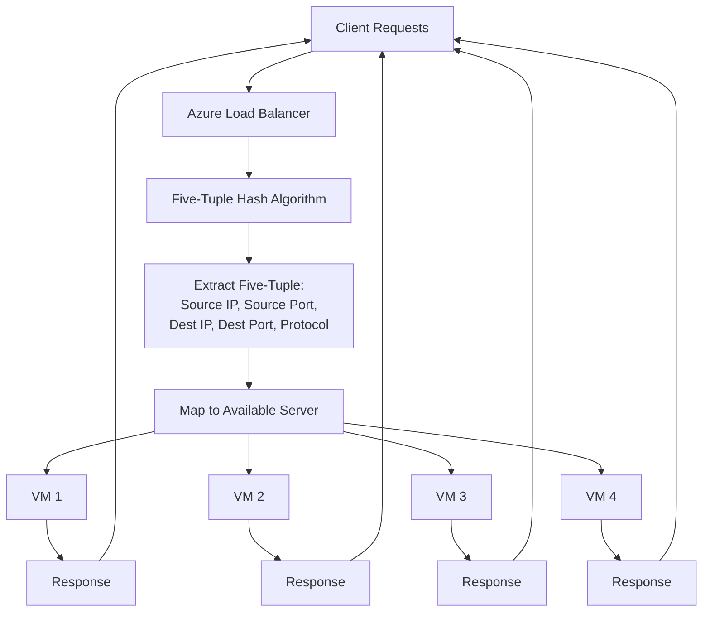

**Load Balancer Overview:**
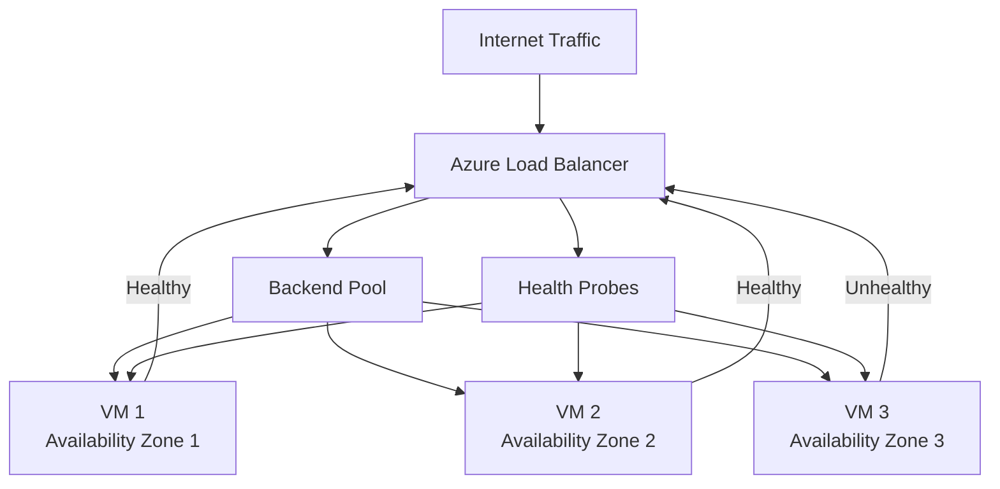

**Key Features:**
- Load Balancer supports inbound and outbound scenarios
- Provides low latency and high throughput
- Scales up to millions of flows for TCP and UDP applications
- Load balancers aren't physical instances - they're objects that express how Azure configures its infrastructure

**Learn more:**
- [Load Balancer Distribution Modes](https://learn.microsoft.com/en-us/azure/load-balancer/load-balancer-distribution-mode)
- [Load Balancer Components](https://learn.microsoft.com/en-us/azure/load-balancer/components)

## Availability Sets and Availability Zones

With Load Balancer, you can use availability sets and availability zones to ensure that virtual machines are always available:

| Configuration | Service level agreement (SLA) | Information |
|---------------|-------------------------------|-------------|
| **Availability set** | 99.95% | Protection from hardware failures within datacenters |
| **Availability zone** | 99.99% | Protection from entire datacenter failure |

### Availability Sets

An availability set is a logical grouping used to isolate virtual machine resources from each other when they're deployed. Azure ensures that the virtual machines you put in an availability set run across multiple physical servers, compute racks, storage units, and network switches. If there's a hardware or software failure, only a subset of your virtual machines is affected. Your overall solution stays operational. Availability sets are essential for building reliable cloud solutions.

**Availability Set Architecture:**
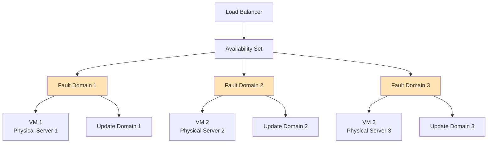

**Key Characteristics:**
- **Fault Domains**: VMs are distributed across different physical servers, racks, and network switches
- **Update Domains**: VMs are grouped to allow planned maintenance without affecting all VMs
- **High Availability**: Protects against hardware failures within a datacenter
- **SLA**: 99.95% uptime guarantee

**Learn more:**
- [Availability Sets Overview](https://learn.microsoft.com/en-us/azure/virtual-machines/availability-set-overview)
- [Manage Availability Sets](https://learn.microsoft.com/en-us/azure/virtual-machines/availability-set-overview)

### Availability Zones

An availability zone offers groups of one or more datacenters that have independent power, cooling, and networking. The virtual machines in an availability zone are placed in different physical locations within the same region. Use this architecture when you want to ensure that you can continue to serve users when an entire datacenter fails.

**Availability Zone Architecture:**
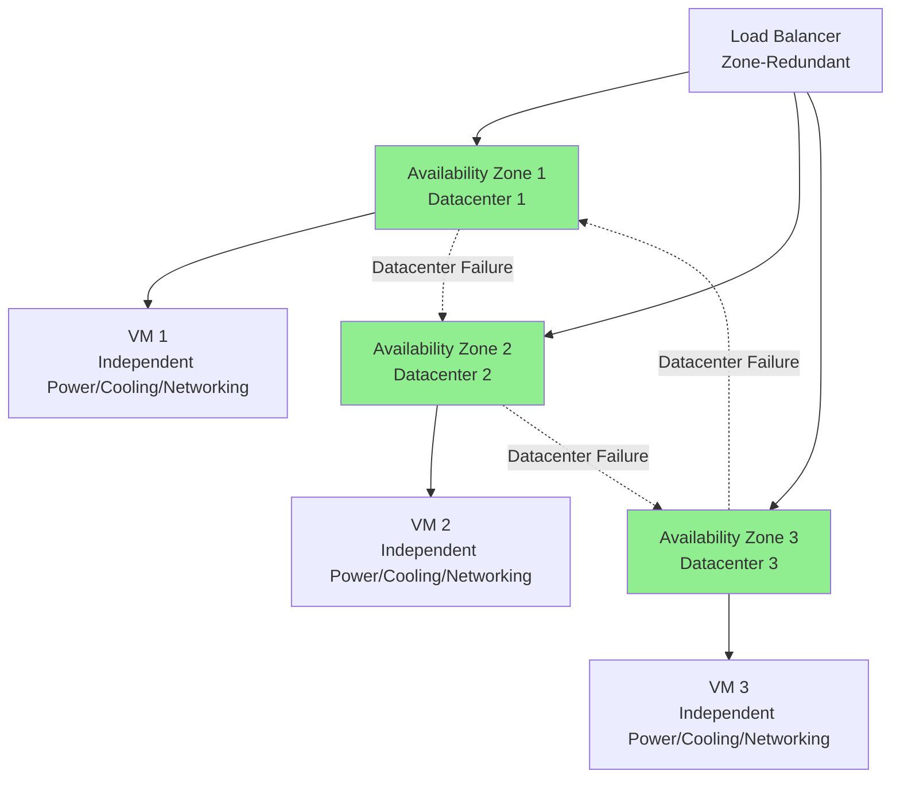

**Key Characteristics:**
- **Independent Infrastructure**: Each zone has separate power, cooling, and networking
- **Physical Separation**: VMs are placed in different physical datacenters
- **Higher SLA**: 99.99% uptime guarantee
- **Regional Scope**: Zones are within the same Azure region

**Important Considerations:**
- Availability zones don't support all virtual machine sizes
- Not available in all Azure regions
- Check that they're supported in your region before using them in your architecture

**Learn more:**
- [Availability Zones Overview](https://learn.microsoft.com/en-us/azure/availability-zones/az-overview)
- [Regions with Availability Zones](https://learn.microsoft.com/en-us/azure/availability-zones/az-region)

## Select the right Load Balancer product

Two products are available when you create a load balancer in Azure: basic load balancers and standard load balancers.

### Basic Load Balancers

Basic load balancers allow:

- Port forwarding
- Automatic reconfiguration
- Health probes
- Outbound connections through source network address translation (SNAT)
- Diagnostics through Azure Log Analytics for public-facing load balancers

**Limitations:**
- You can only use basic load balancers with a single availability set or scale set
- No availability zone support
- Limited features compared to Standard Load Balancer

**Use Cases:**
- Development and testing environments
- Simple applications with basic requirements
- Cost-sensitive scenarios

**Learn more:**
- [Basic Load Balancer](https://learn.microsoft.com/en-us/azure/load-balancer/load-balancer-overview#skus)

### Standard Load Balancers

Standard load balancers support all of the basic load balancer features. They also allow:

- HTTPS health probes
- Availability zones
- Diagnostics through Azure Monitor, for multidimensional metrics
- High availability (HA) ports
- Outbound rules
- A guaranteed SLA (99.99% for two or more virtual machines)

**Key Advantages:**
- **Higher SLA**: 99.99% uptime guarantee (vs 99.95% for Basic)
- **Advanced Features**: HA ports, outbound rules, zone redundancy
- **Better Monitoring**: Multidimensional metrics through Azure Monitor
- **Production Ready**: Recommended for production workloads

**Use Cases:**
- Production applications requiring high availability
- Applications needing zone redundancy
- Enterprise workloads with strict SLA requirements

**Learn more:**
- [Standard Load Balancer](https://learn.microsoft.com/en-us/azure/load-balancer/load-balancer-standard-overview)
- [Load Balancer SKU Comparison](https://learn.microsoft.com/en-us/azure/load-balancer/skus)

**Load Balancer SKU Comparison:**
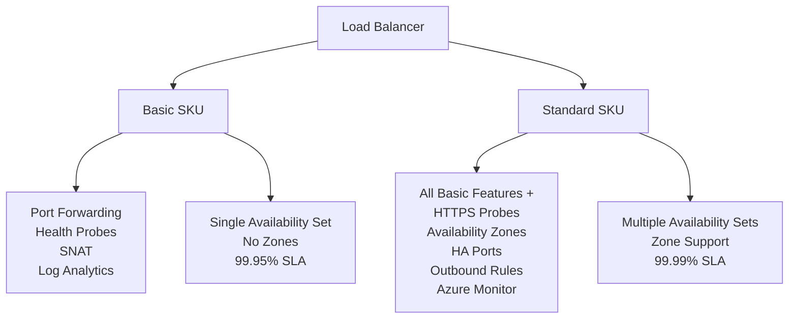

## Internal and external load balancers

### External Load Balancer

An external load balancer operates by distributing client traffic across multiple virtual machines. An external load balancer permits traffic from the internet. The traffic might come from browsers, mobile apps, or other sources. In a healthcare organization, the balancer distributes the load of all the browsers that run the client healthcare application.

**External Load Balancer Architecture:**
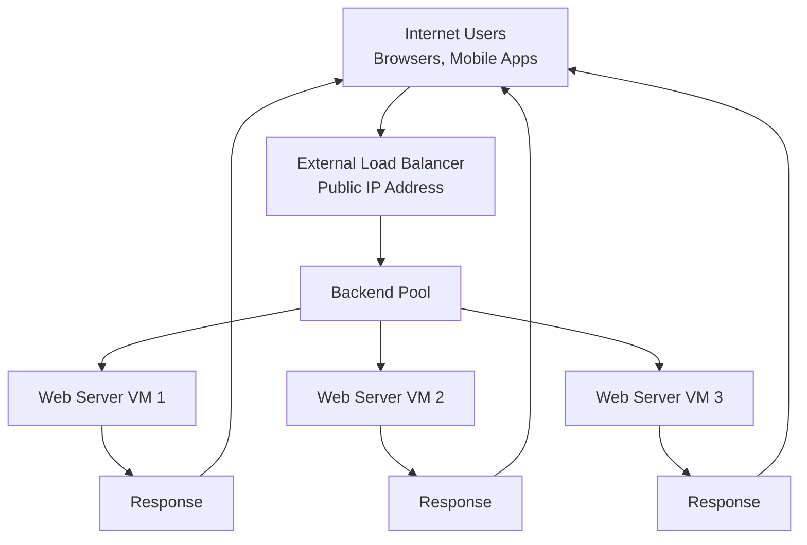

**Key Characteristics:**
- **Public IP Address**: Has a public-facing IP address
- **Internet Traffic**: Accepts traffic from the internet
- **Use Case**: Front-end web servers, public-facing applications
- **Example**: Healthcare application accessible from browsers and mobile apps

**Learn more:**
- [Public Load Balancer](https://learn.microsoft.com/en-us/azure/load-balancer/load-balancer-overview#public-load-balancer)

### Internal Load Balancer

In addition to balancing requests from users to front-end servers, you can use Azure Load Balancer to distribute traffic from front-end servers evenly among back-end servers.

In your healthcare organization, front-end servers call business logic services hosted on a middle tier. You want to ensure that the middle tier is as scalable and resilient as the front end. You want to use a load balancer to distribute requests from the front-end servers evenly among the middle-tier servers. This way, you can scale out the middle-tier servers to achieve the highest capacity possible. You also ensure that the middle tier is resilient to failure. When a server fails, the load balancer automatically reroutes traffic to another server.

An internal load balancer distributes a load from internal Azure resources to other Azure resources. For example, if you have front-end web servers that need to call the business logic hosted on multiple middle-tier servers, you can distribute that load evenly by using an internal load balancer. No traffic is allowed from internet sources. In a healthcare organization, a load balancer distributes a load across the internal application tier.

**Internal Load Balancer Architecture:**
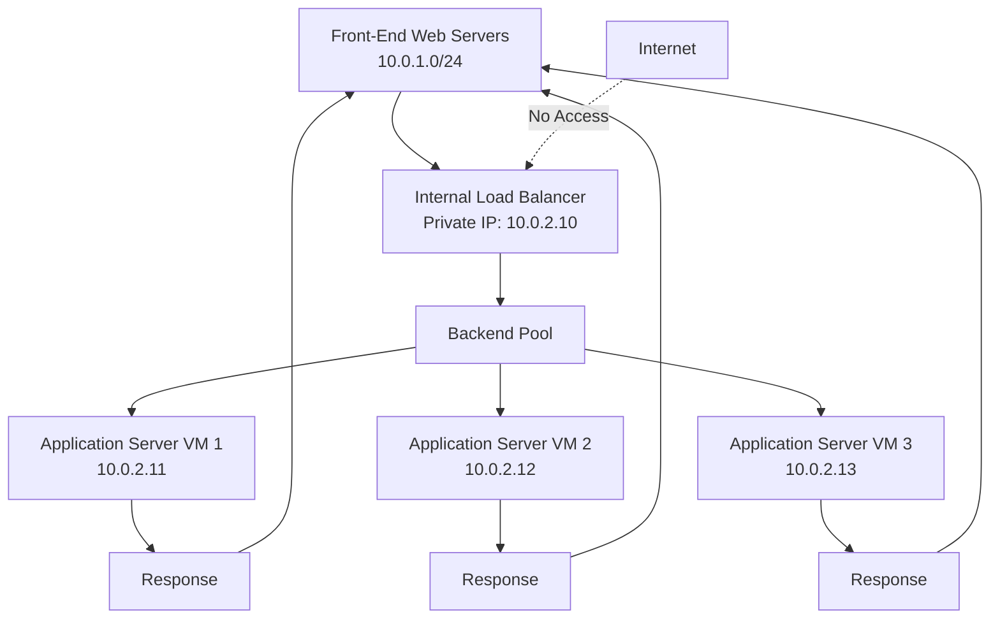

**Key Characteristics:**
- **Private IP Address**: Uses a private IP address within the VNet
- **Internal Traffic Only**: No internet access allowed
- **Use Case**: Multi-tier applications, internal services
- **Example**: Application tier load balancing in healthcare organization

#### Configure an Internal Load Balancer

In the healthcare-portal scenario, a web tier handles requests from users. The web tier connects to databases to retrieve data for users. The database tier is also deployed on two virtual machines. To allow the front-end web portal to continue to serve client requests if a database server fails, you can set up an internal load balancer to distribute traffic to the database servers.

**Healthcare Portal Internal Load Balancer Architecture:**
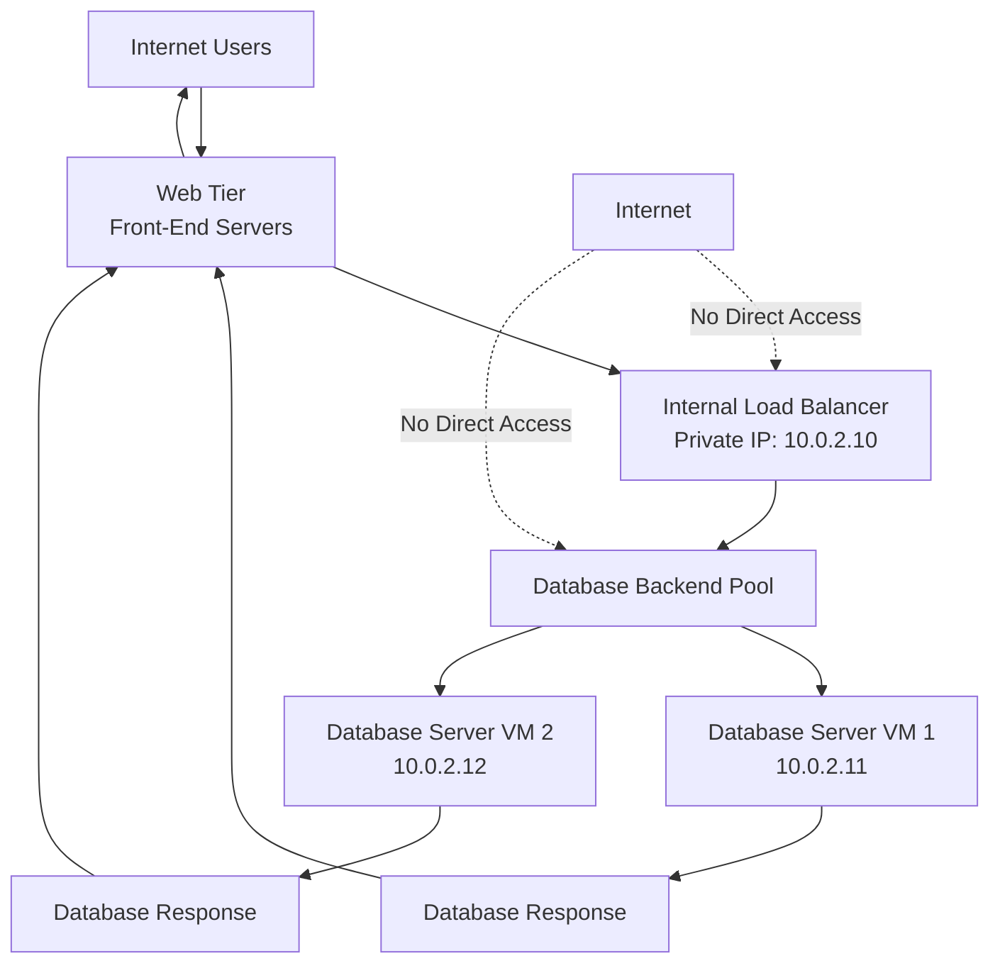

You can configure an internal load balancer in almost the same way as an external load balancer, but with these differences:

**Configuration Differences:**

1. **Type Selection**: When you create the load balancer, select **Internal** for the Type value. When you select this setting, the load balancer's front-end IP address isn't exposed to the internet.

2. **IP Address**: Assign a **private IP address** instead of a public IP address for the load balancer's front end.

3. **Network Placement**: Place the load balancer in the **protected virtual network** that contains the virtual machines you want to handle the requests.

**Internal Load Balancer Configuration:**
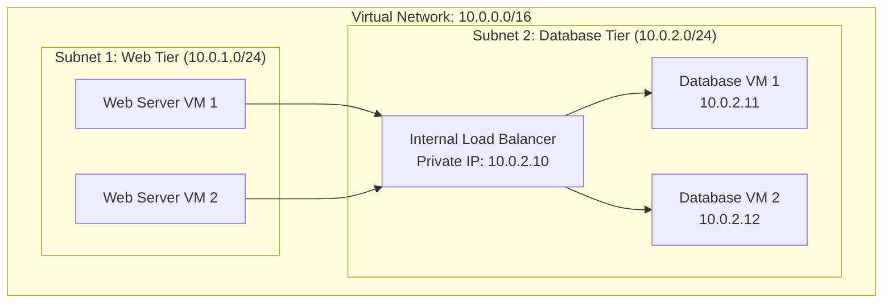

The internal load balancer should be visible only to the web tier. All the virtual machines that host the databases are in one subnet. You can use an internal load balancer to distribute traffic to those virtual machines.

**Key Configuration Requirements:**
- **Virtual Network**: Virtual machines must be in the same virtual network
- **Private IP**: Load balancer uses a private IP address (not public)
- **Subnet Placement**: Load balancer and backend VMs can be in the same or different subnets within the VNet
- **No Internet Access**: Load balancer is not accessible from the internet

#### Choose the Distribution Mode

In the healthcare portal, the application tier is stateless, so you don't need to use source IP affinity. You can use the default distribution mode of a **five-tuple hash**. This mode offers the greatest scalability and resilience. The load balancer routes traffic to any healthy server.

**Distribution Mode Options:**

1. **Five-Tuple Hash (Default)**: 
   - Uses source IP, source port, destination IP, destination port, and protocol
   - Best for stateless applications
   - Maximum scalability and resilience
   - Traffic can be routed to any healthy server

2. **Source IP Affinity (Session Affinity)**:
   - Routes traffic from the same source IP to the same backend server
   - Useful for stateful applications
   - May reduce scalability

**Distribution Mode Comparison:**
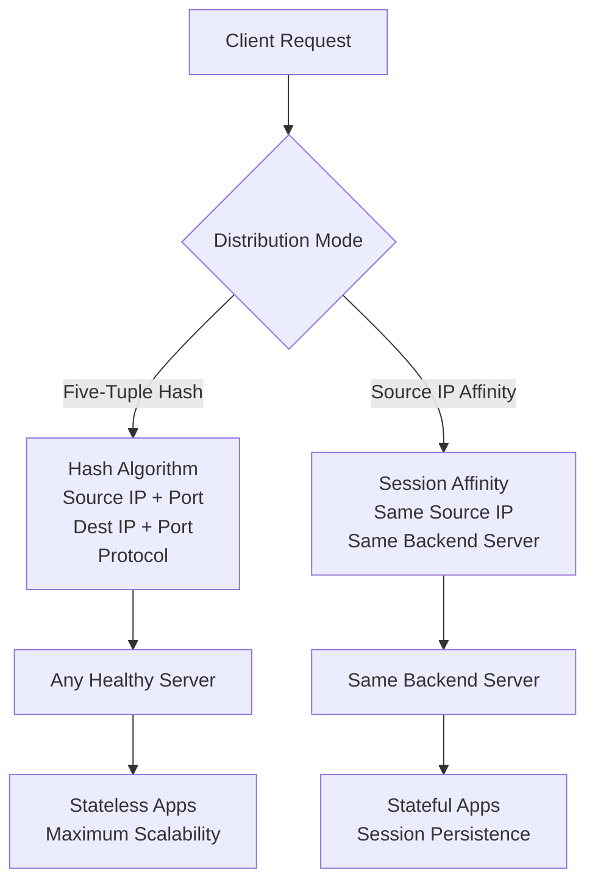

**Best Practice**: For stateless applications like the healthcare portal application tier, use the default five-tuple hash distribution mode for maximum scalability and resilience.

**Learn more:**
- [Internal Load Balancer](https://learn.microsoft.com/en-us/azure/load-balancer/load-balancer-overview#internal-load-balancer)
- [Load Balancer Distribution Modes](https://learn.microsoft.com/en-us/azure/load-balancer/load-balancer-distribution-mode)

**Load Balancer Types Comparison:**
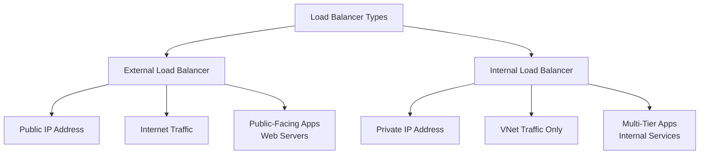

## Load Balancer Components

**Complete Load Balancer Architecture:**
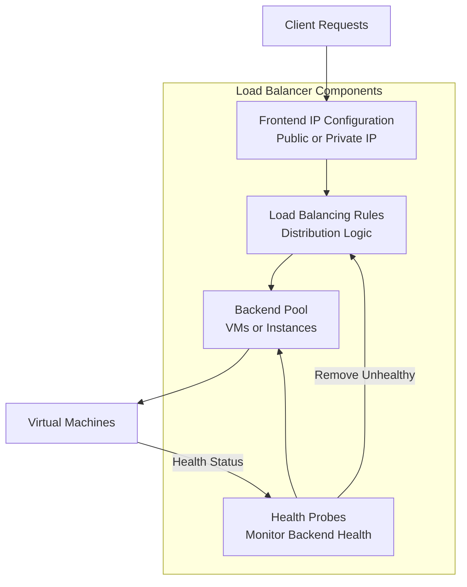

**Key Components:**
1. **Frontend IP Configuration**: Public or private IP address that receives traffic
2. **Backend Pool**: Collection of VMs or instances that serve requests
3. **Health Probes**: Monitor the health of backend instances
4. **Load Balancing Rules**: Define how traffic is distributed

**Learn more:**
- [Load Balancer Components](https://learn.microsoft.com/en-us/azure/load-balancer/components)
- [Configure Load Balancer](https://learn.microsoft.com/en-us/azure/load-balancer/quickstart-load-balancer-standard-public-portal)

## Best Practices

### 1. Use Standard Load Balancer for Production
- Standard Load Balancer provides better SLA (99.99%)
- Supports availability zones for higher resilience
- Advanced monitoring and diagnostics

### 2. Deploy Across Availability Zones
- Use availability zones for maximum resilience
- Ensure VMs are distributed across zones
- Configure zone-redundant load balancer

### 3. Configure Health Probes
- Set appropriate probe intervals
- Configure healthy/unhealthy thresholds
- Monitor probe results in Azure Monitor

### 4. Use Availability Sets as Fallback
- If availability zones aren't available, use availability sets
- Distribute VMs across fault and update domains
- Ensures 99.95% SLA

### 5. Monitor and Alert
- Set up Azure Monitor alerts for load balancer metrics
- Monitor backend pool health
- Track connection counts and throughput

## Check Your Knowledge

### Question 1: Internal Load Balancer Configuration

**Which configuration is required to configure an internal load balancer?**

- ✅ **Correct**: Virtual machines must be in the same virtual network.

**Why:**
- Internal load balancers distribute traffic within a virtual network
- All backend VMs must be in the same VNet as the load balancer
- The load balancer uses a private IP address within the VNet
- This ensures traffic stays internal and is not exposed to the internet

- ❌ **Not correct**: Virtual machines must be publicly accessible.
  - Internal load balancers are specifically designed for private, internal traffic
  - Backend VMs do not need public IP addresses
  - The load balancer itself uses a private IP address

- ❌ **Not correct**: Virtual machines must be in an availability set.
  - While availability sets provide high availability, they are not required for internal load balancers
  - VMs can be in availability sets, availability zones, or neither
  - The key requirement is that VMs are in the same virtual network

### Question 2: External Load Balancer Characteristics

**Which one of the following statements about external load balancers is correct?**

- ✅ **Correct**: They have a public IP address.

**Why:**
- External load balancers are designed to accept traffic from the internet
- They require a public IP address to be accessible from the internet
- This allows browsers, mobile apps, and other internet clients to reach the load balancer
- The public IP address is the entry point for external traffic

- ❌ **Not correct**: They have a private, front-facing IP address.
  - External load balancers use public IP addresses, not private
  - Private IP addresses are used by internal load balancers
  - The term "front-facing" refers to the frontend IP configuration, which must be public for external load balancers

- ❌ **Not correct**: They don't have a listener IP address.
  - External load balancers do have a listener IP address (the frontend IP)
  - This is the public IP address that receives incoming traffic
  - The listener IP is essential for routing traffic to backend servers

## Summary

Azure Load Balancer provides:
- **Traffic Distribution**: Hash-based algorithm using five-tuple
- **High Availability**: Works with availability sets (99.95% SLA) and availability zones (99.99% SLA)
- **Scalability**: Scale applications beyond single VM capacity
- **Resilience**: Automatic traffic rerouting when VMs fail
- **Flexibility**: External (internet-facing) or internal (VNet-only) configurations
- **Product Options**: Basic (dev/test) or Standard (production) SKUs
- **Distribution Modes**: Five-tuple hash (default) for stateless apps, or source IP affinity for stateful apps

**Key Differences: External vs Internal Load Balancer**

| Feature | External Load Balancer | Internal Load Balancer |
|---------|------------------------|------------------------|
| **IP Address** | Public IP address | Private IP address |
| **Traffic Source** | Internet traffic | Internal VNet traffic only |
| **Accessibility** | Accessible from internet | Only accessible within VNet |
| **Use Case** | Public-facing applications | Multi-tier internal applications |
| **Configuration** | Type: Public | Type: Internal |

**Additional Resources:**
- [Load Balancer Quickstart](https://learn.microsoft.com/en-us/azure/load-balancer/quickstart-load-balancer-standard-public-portal)
- [Load Balancer Tutorials](https://learn.microsoft.com/en-us/azure/load-balancer/tutorial-load-balancer-standard-public-zone-redundant-portal)
- [Load Balancer Best Practices](https://learn.microsoft.com/en-us/azure/load-balancer/load-balancer-standard-overview)
- [Load Balancer FAQ](https://learn.microsoft.com/en-us/azure/load-balancer/load-balancer-faqs)

