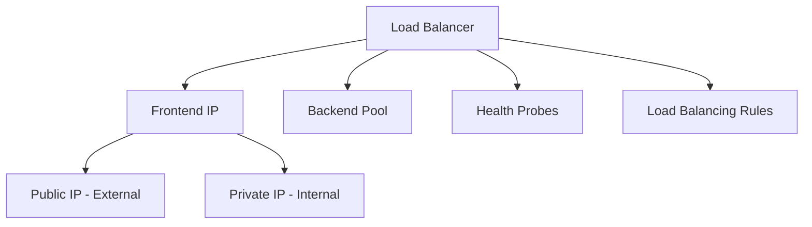

# Terraform Implementation Guides for Azure Load Balancer

This directory contains comprehensive guides for implementing Azure Load Balancer services using Terraform.

## Documentation Structure

1. **[01-load-balancer.md](./01-load-balancer.md)**
   - Creating load balancers
   - SKU selection (Basic vs Standard)
   - Frontend IP configuration

2. **[02-backend-pool.md](./02-backend-pool.md)**
   - Backend pool configuration
   - VM and availability set association
   - Availability zone configuration

3. **[03-health-probes.md](./03-health-probes.md)**
   - Health probe configuration
   - HTTP, HTTPS, and TCP probes
   - Probe intervals and thresholds

4. **[04-load-balancing-rules.md](./04-load-balancing-rules.md)**
   - Load balancing rules
   - Distribution modes
   - Port and protocol configuration

5. **[05-internal-load-balancer.md](./05-internal-load-balancer.md)**
   - Internal load balancer configuration
   - Private IP address assignment
   - VNet-only traffic

## Quick Start

### External Load Balancer

```hcl
# Public IP
resource "azurerm_public_ip" "lb" {
  name                = "pip-lb"
  location            = "eastus"
  resource_group_name = azurerm_resource_group.main.name
  allocation_method   = "Static"
  sku                 = "Standard"
}

# Load Balancer
resource "azurerm_lb" "main" {
  name                = "lb-main"
  location            = "eastus"
  resource_group_name = azurerm_resource_group.main.name
  sku                 = "Standard"

  frontend_ip_configuration {
    name                 = "PublicIPAddress"
    public_ip_address_id = azurerm_public_ip.lb.id
  }
}
```

### Internal Load Balancer

```hcl
# Load Balancer
resource "azurerm_lb" "internal" {
  name                = "lb-internal"
  location            = "eastus"
  resource_group_name = azurerm_resource_group.main.name
  sku                 = "Standard"

  frontend_ip_configuration {
    name                          = "InternalIPAddress"
    private_ip_address_allocation = "Static"
    private_ip_address            = "10.0.2.10"
    subnet_id                     = azurerm_subnet.backend.id
  }
}
```

## Architecture Overview



## Best Practices

1. **Use Standard SKU**: For production workloads
2. **Health Probes**: Configure appropriate probe intervals
3. **Availability Zones**: Deploy across zones for high availability
4. **Distribution Mode**: Use five-tuple hash for stateless apps

## Additional Resources

- [Azure Load Balancer Documentation](https://learn.microsoft.com/en-us/azure/load-balancer/)
- [Terraform Azure Provider - Load Balancer](https://registry.terraform.io/providers/hashicorp/azurerm/latest/docs/resources/lb)

