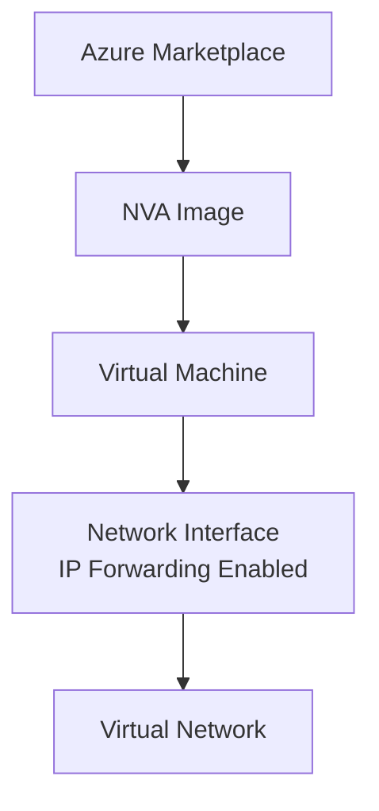

# Implementing Network Virtual Appliance Deployment with Terraform

## Overview

Network Virtual Appliances (NVAs) are virtual machines deployed from Azure Marketplace that control network traffic flow. They require specific configuration including IP forwarding and route table configuration.

## Architecture



## Terraform Implementation

### Basic NVA Deployment

```hcl
# Resource Group
resource "azurerm_resource_group" "nva" {
  name     = "rg-nva"
  location = "eastus"
}

# Virtual Network
resource "azurerm_virtual_network" "main" {
  name                = "vnet-main"
  address_space       = ["10.0.0.0/16"]
  location            = "eastus"
  resource_group_name = azurerm_resource_group.nva.name
}

# Perimeter Subnet for NVA
resource "azurerm_subnet" "perimeter" {
  name                 = "subnet-perimeter"
  resource_group_name  = azurerm_resource_group.nva.name
  virtual_network_name = azurerm_virtual_network.main.name
  address_prefixes     = ["10.0.1.0/24"]
}

# Network Interface with IP Forwarding
resource "azurerm_network_interface" "nva" {
  name                = "nic-nva"
  location            = "eastus"
  resource_group_name = azurerm_resource_group.nva.name

  enable_ip_forwarding = true  # Required for NVA

  ip_configuration {
    name                          = "internal"
    subnet_id                     = azurerm_subnet.perimeter.id
    private_ip_address_allocation = "Static"
    private_ip_address            = "10.0.1.10"
  }
}

# NVA Virtual Machine (Example: Cisco ASAv)
resource "azurerm_virtual_machine" "nva" {
  name                  = "vm-nva"
  location              = "eastus"
  resource_group_name   = azurerm_resource_group.nva.name
  network_interface_ids = [azurerm_network_interface.nva.id]
  vm_size               = "Standard_D2s_v3"

  storage_image_reference {
    publisher = "cisco"
    offer     = "cisco-asav"
    sku       = "asav-azure-byol"
    version   = "latest"
  }

  storage_os_disk {
    name              = "osdisk-nva"
    caching           = "ReadWrite"
    create_option     = "FromImage"
    managed_disk_type = "Premium_LRS"
  }

  os_profile {
    computer_name  = "nva"
    admin_username = "admin"
    admin_password = var.nva_admin_password
  }
}
```

### Multi-NIC NVA Deployment

```hcl
# Management Network Interface
resource "azurerm_network_interface" "nva_mgmt" {
  name                = "nic-nva-mgmt"
  location            = "eastus"
  resource_group_name = azurerm_resource_group.nva.name

  ip_configuration {
    name                          = "mgmt"
    subnet_id                     = azurerm_subnet.management.id
    private_ip_address_allocation = "Static"
    private_ip_address            = "10.0.0.10"
  }
}

# Perimeter Network Interface (IP Forwarding Enabled)
resource "azurerm_network_interface" "nva_perimeter" {
  name                = "nic-nva-perimeter"
  location            = "eastus"
  resource_group_name = azurerm_resource_group.nva.name

  enable_ip_forwarding = true

  ip_configuration {
    name                          = "perimeter"
    subnet_id                     = azurerm_subnet.perimeter.id
    private_ip_address_allocation = "Static"
    private_ip_address            = "10.0.1.10"
  }
}

# Internal Network Interface (IP Forwarding Enabled)
resource "azurerm_network_interface" "nva_internal" {
  name                = "nic-nva-internal"
  location            = "eastus"
  resource_group_name = azurerm_resource_group.nva.name

  enable_ip_forwarding = true

  ip_configuration {
    name                          = "internal"
    subnet_id                     = azurerm_subnet.internal.id
    private_ip_address_allocation = "Static"
    private_ip_address            = "10.0.2.10"
  }
}

# NVA with Multiple NICs
resource "azurerm_virtual_machine" "nva" {
  name                = "vm-nva"
  location            = "eastus"
  resource_group_name = azurerm_resource_group.nva.name
  network_interface_ids = [
    azurerm_network_interface.nva_mgmt.id,
    azurerm_network_interface.nva_perimeter.id,
    azurerm_network_interface.nva_internal.id
  ]
  vm_size = "Standard_D4s_v3"

  # ... storage and OS configuration ...
}
```

## Key Configuration Parameters

| Parameter | Description | Required | Example |
|-----------|-------------|----------|---------|
| `enable_ip_forwarding` | Enable IP forwarding on NIC | Yes | `true` |
| `private_ip_address` | Static IP for NVA | Recommended | `10.0.1.10` |
| `vm_size` | VM size for NVA | Yes | `Standard_D2s_v3` |
| `publisher` | Marketplace publisher | Yes | `cisco`, `checkpoint`, etc. |
| `offer` | Marketplace offer | Yes | `cisco-asav` |
| `sku` | Marketplace SKU | Yes | `asav-azure-byol` |

## Best Practices

1. **IP Forwarding**: Always enable on traffic processing interfaces
2. **Static IP**: Use static IP addresses for routing configuration
3. **Marketplace Images**: Use validated images from Azure Marketplace
4. **Network Segmentation**: Deploy in dedicated subnets
5. **High Availability**: Deploy multiple NVAs for redundancy

## Next Steps

After deploying NVA:
1. Configure IP forwarding (see [02-ip-forwarding.md](./02-ip-forwarding.md))
2. Set up route tables (see [03-user-defined-routes.md](./03-user-defined-routes.md))
3. Configure high availability (see [04-nva-high-availability.md](./04-nva-high-availability.md))

## Additional Resources

- [Azure Marketplace - Network Appliances](https://azuremarketplace.microsoft.com/marketplace/apps/category/networking)
- [Terraform azurerm_virtual_machine](https://registry.terraform.io/providers/hashicorp/azurerm/latest/docs/resources/virtual_machine)


