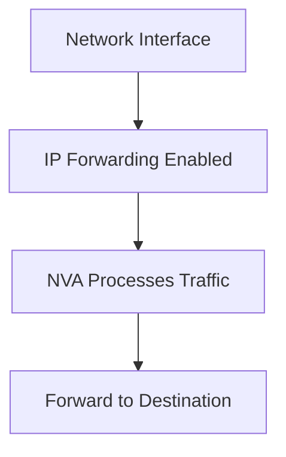

# Implementing IP Forwarding for Network Virtual Appliances

## Overview

IP forwarding must be enabled on network interfaces for NVAs to function as routers and forward traffic between subnets.

## Architecture



## Terraform Implementation

### Enable IP Forwarding on Network Interface

```hcl
resource "azurerm_network_interface" "nva" {
  name                = "nic-nva"
  location            = "eastus"
  resource_group_name = azurerm_resource_group.main.name

  enable_ip_forwarding = true  # Critical for NVA functionality

  ip_configuration {
    name                          = "internal"
    subnet_id                     = azurerm_subnet.perimeter.id
    private_ip_address_allocation = "Static"
    private_ip_address            = "10.0.1.10"
  }
}
```

### Multi-NIC Configuration

```hcl
# Management NIC (IP forwarding not required)
resource "azurerm_network_interface" "nva_mgmt" {
  name                = "nic-nva-mgmt"
  location            = "eastus"
  resource_group_name = azurerm_resource_group.main.name

  enable_ip_forwarding = false  # Management doesn't need forwarding

  ip_configuration {
    name                          = "mgmt"
    subnet_id                     = azurerm_subnet.management.id
    private_ip_address_allocation = "Static"
    private_ip_address            = "10.0.0.10"
  }
}

# Traffic Processing NICs (IP forwarding required)
resource "azurerm_network_interface" "nva_traffic" {
  name                = "nic-nva-traffic"
  location            = "eastus"
  resource_group_name = azurerm_resource_group.main.name

  enable_ip_forwarding = true  # Required for traffic forwarding

  ip_configuration {
    name                          = "traffic"
    subnet_id                     = azurerm_subnet.perimeter.id
    private_ip_address_allocation = "Static"
    private_ip_address            = "10.0.1.10"
  }
}
```

## Key Points

- **Required for Traffic Forwarding**: IP forwarding must be enabled on interfaces that process traffic
- **Not Required for Management**: Management interfaces don't need IP forwarding
- **Static IP Recommended**: Use static IP addresses for routing configuration
- **Multiple Interfaces**: Enable forwarding on all traffic processing interfaces

## Additional Resources

- [IP Forwarding in Azure](https://learn.microsoft.com/en-us/azure/virtual-network/virtual-network-network-interface-addresses#ip-forwarding)


