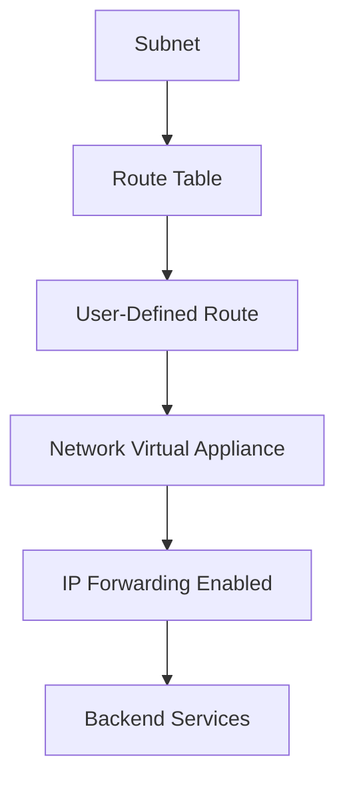

# Terraform Implementation Guides for Azure Network Virtual Appliances

This directory contains comprehensive guides for implementing Network Virtual Appliances (NVAs) using Terraform.

## Documentation Structure

1. **[01-nva-deployment.md](./01-nva-deployment.md)**
   - Deploying NVAs from Azure Marketplace
   - VM configuration for NVA
   - Network interface configuration

2. **[02-ip-forwarding.md](./02-ip-forwarding.md)**
   - Enabling IP forwarding
   - Network interface configuration
   - Multi-NIC NVA setup

3. **[03-user-defined-routes.md](./03-user-defined-routes.md)**
   - Creating route tables
   - Configuring routes through NVA
   - Forced tunneling scenarios

4. **[04-nva-high-availability.md](./04-nva-high-availability.md)**
   - Active-standby configuration
   - Active-active configuration
   - Availability sets and zones

## Quick Start

### Basic NVA Deployment

```hcl
# Network Interface with IP Forwarding
resource "azurerm_network_interface" "nva" {
  name                = "nic-nva"
  location            = "eastus"
  resource_group_name = azurerm_resource_group.main.name

  enable_ip_forwarding = true  # Required for NVA

  ip_configuration {
    name                          = "internal"
    subnet_id                     = azurerm_subnet.perimeter.id
    private_ip_address_allocation = "Static"
    private_ip_address            = "10.0.1.10"
  }
}

# NVA Virtual Machine
resource "azurerm_virtual_machine" "nva" {
  name                  = "vm-nva"
  location              = "eastus"
  resource_group_name   = azurerm_resource_group.main.name
  network_interface_ids = [azurerm_network_interface.nva.id]
  vm_size               = "Standard_D2s_v3"

  storage_image_reference {
    publisher = "cisco"
    offer     = "cisco-asav"
    sku       = "asav-azure-byol"
    version   = "latest"
  }

  os_profile {
    computer_name  = "nva"
    admin_username = "admin"
    admin_password = var.nva_admin_password
  }
}

# Route Table
resource "azurerm_route_table" "nva" {
  name                = "rt-nva"
  location            = "eastus"
  resource_group_name = azurerm_resource_group.main.name
}

# Route through NVA
resource "azurerm_route" "nva" {
  name                   = "route-nva"
  resource_group_name    = azurerm_resource_group.main.name
  route_table_name       = azurerm_route_table.nva.name
  address_prefix         = "0.0.0.0/0"
  next_hop_type         = "VirtualAppliance"
  next_hop_in_ip_address = "10.0.1.10"
}

# Associate route table to subnet
resource "azurerm_subnet_route_table_association" "internal" {
  subnet_id      = azurerm_subnet.internal.id
  route_table_id = azurerm_route_table.nva.id
}
```

## Architecture Overview



## Best Practices

1. **IP Forwarding**: Always enable IP forwarding on NVA network interfaces
2. **Route Tables**: Configure route tables to direct traffic through NVA
3. **High Availability**: Deploy multiple NVAs for redundancy
4. **Marketplace Images**: Use validated NVA images from Azure Marketplace
5. **Network Segmentation**: Use microsegmentation for enhanced security

## Additional Resources

- [Network Virtual Appliance Architecture](https://learn.microsoft.com/en-us/azure/architecture/reference-architectures/dmz/nva-ha)
- [User-Defined Routes](https://learn.microsoft.com/en-us/azure/virtual-network/virtual-networks-udr-overview)
- [Terraform Azure Provider - Virtual Machine](https://registry.terraform.io/providers/hashicorp/azurerm/latest/docs/resources/virtual_machine)


