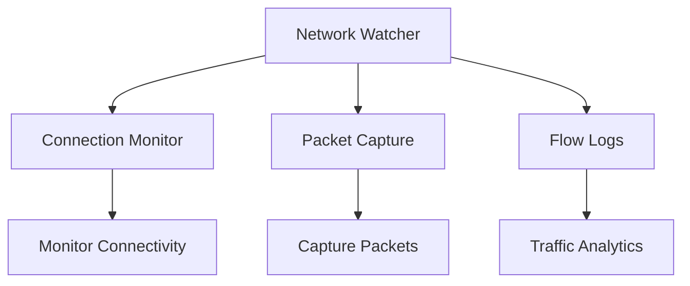

# Terraform Implementation Guides for Azure Network Watcher

This directory contains comprehensive guides for implementing Azure Network Watcher services using Terraform.

## Documentation Structure

1. **[01-network-watcher-instance.md](./01-network-watcher-instance.md)**
   - Creating Network Watcher instances
   - Regional deployment
   - Instance configuration

2. **[02-connection-monitor.md](./02-connection-monitor.md)**
   - Connection Monitor setup
   - Endpoint configuration
   - Test configuration

3. **[03-packet-capture.md](./03-packet-capture.md)**
   - Packet capture configuration
   - Network Watcher Agent setup
   - Storage configuration

4. **[04-flow-logs.md](./04-flow-logs.md)**
   - NSG Flow Logs
   - Traffic Analytics
   - Log Analytics workspace integration

## Quick Start

### Complete Example

```hcl
# 1. Create Network Watcher
resource "azurerm_network_watcher" "main" {
  name                = "nw-main"
  location            = "eastus"
  resource_group_name = azurerm_resource_group.main.name
}

# 2. Create Connection Monitor
resource "azurerm_network_connection_monitor" "main" {
  name               = "cm-main"
  network_watcher_id = azurerm_network_watcher.main.id
  location           = "eastus"

  endpoint {
    name = "source"
    target_resource_id = azurerm_virtual_machine.source.id
  }

  endpoint {
    name = "destination"
    target_resource_id = azurerm_virtual_machine.destination.id
  }

  test_configuration {
    name     = "tcp-test"
    protocol = "Tcp"
    tcp_configuration {
      port = 80
    }
  }

  test_group {
    name                     = "test-group"
    destination_endpoints    = ["destination"]
    source_endpoints         = ["source"]
    test_configuration_names = ["tcp-test"]
  }
}

# 3. Configure NSG Flow Logs
resource "azurerm_network_watcher_flow_log" "main" {
  name                      = "nw-flowlog"
  network_watcher_name     = azurerm_network_watcher.main.name
  resource_group_name       = azurerm_resource_group.main.name
  network_security_group_id = azurerm_network_security_group.main.id
  storage_account_id        = azurerm_storage_account.main.id
  enabled                   = true

  retention_policy {
    enabled = true
    days    = 7
  }
}
```

## Architecture Overview



## Best Practices

1. **Regional Deployment**: Deploy Network Watcher in each region where you have resources
2. **Connection Monitoring**: Set up monitors for critical connections
3. **Flow Logs**: Enable flow logs for security and compliance
4. **Retention**: Configure appropriate retention policies
5. **Cost Management**: Monitor storage costs for flow logs

## Additional Resources

- [Azure Network Watcher Documentation](https://learn.microsoft.com/en-us/azure/network-watcher/)
- [Terraform Azure Provider - Network Watcher](https://registry.terraform.io/providers/hashicorp/azurerm/latest/docs/resources/network_watcher)

