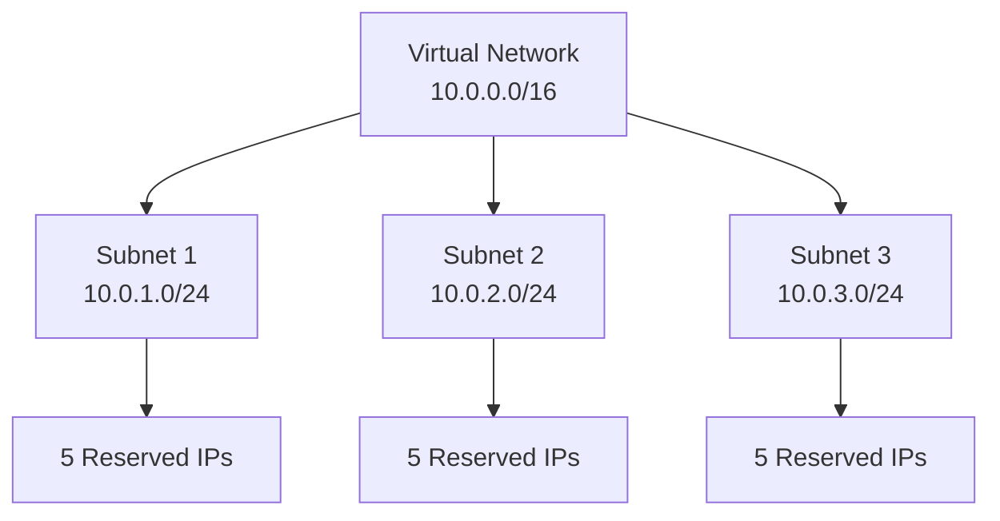

# Implementing Azure Subnets with Terraform

## Overview

Subnets provide logical divisions within a virtual network to improve security, increase performance, and make management easier.

## Architecture



## Terraform Implementation

### Basic Subnet

```hcl
# Virtual Network
resource "azurerm_virtual_network" "main" {
  name                = "vnet-main"
  address_space       = ["10.0.0.0/16"]
  location            = "eastus"
  resource_group_name = azurerm_resource_group.main.name
}

# Subnet
resource "azurerm_subnet" "main" {
  name                 = "subnet-main"
  resource_group_name  = azurerm_resource_group.main.name
  virtual_network_name = azurerm_virtual_network.main.name
  address_prefixes     = ["10.0.1.0/24"]
}
```

### Multiple Subnets

```hcl
# Web Subnet
resource "azurerm_subnet" "web" {
  name                 = "subnet-web"
  resource_group_name  = azurerm_resource_group.main.name
  virtual_network_name = azurerm_virtual_network.main.name
  address_prefixes     = ["10.0.1.0/24"]
}

# Application Subnet
resource "azurerm_subnet" "app" {
  name                 = "subnet-app"
  resource_group_name  = azurerm_resource_group.main.name
  virtual_network_name = azurerm_virtual_network.main.name
  address_prefixes     = ["10.0.2.0/24"]
}

# Database Subnet
resource "azurerm_subnet" "db" {
  name                 = "subnet-db"
  resource_group_name  = azurerm_resource_group.main.name
  virtual_network_name = azurerm_virtual_network.main.name
  address_prefixes     = ["10.0.3.0/24"]
}
```

### Gateway Subnet

```hcl
# Gateway Subnet (required for VPN/ExpressRoute Gateway)
resource "azurerm_subnet" "gateway" {
  name                 = "GatewaySubnet"
  resource_group_name  = azurerm_resource_group.main.name
  virtual_network_name = azurerm_virtual_network.main.name
  address_prefixes     = ["10.0.0.0/27"]  # Minimum /27
}
```

### Subnet with Service Endpoints

```hcl
resource "azurerm_subnet" "main" {
  name                 = "subnet-main"
  resource_group_name  = azurerm_resource_group.main.name
  virtual_network_name = azurerm_virtual_network.main.name
  address_prefixes     = ["10.0.1.0/24"]

  service_endpoints = ["Microsoft.Storage", "Microsoft.Sql"]
}
```

## Reserved Addresses

For each subnet, Azure reserves 5 IP addresses:
- First address: Network address
- Second address: Default gateway
- Third and fourth: Azure DNS
- Last address: Broadcast address

**Example for 10.0.1.0/24:**
- Reserved: 10.0.1.0, 10.0.1.1, 10.0.1.2, 10.0.1.3, 10.0.1.255
- Usable: 10.0.1.4 - 10.0.1.254 (251 addresses)

## Key Configuration Parameters

| Parameter | Description | Required | Example |
|-----------|-------------|----------|---------|
| `name` | Subnet name | Yes | `subnet-main` |
| `resource_group_name` | Resource group | Yes | Resource group name |
| `virtual_network_name` | VNet name | Yes | VNet name |
| `address_prefixes` | Subnet CIDR | Yes | `["10.0.1.0/24"]` |
| `service_endpoints` | Service endpoints | No | `["Microsoft.Storage"]` |

## Best Practices

1. **Subnet Sizing**: Account for reserved addresses (5 per subnet)
2. **Service Subnets**: Reserve space for gateway, bastion, etc.
3. **Security**: Use NSGs for subnet-level security
4. **No Overlap**: Ensure subnet ranges don't overlap

## Additional Resources

- [Subnet Overview](https://learn.microsoft.com/en-us/azure/virtual-network/virtual-network-manage-subnet)
- [Terraform azurerm_subnet](https://registry.terraform.io/providers/hashicorp/azurerm/latest/docs/resources/subnet)


