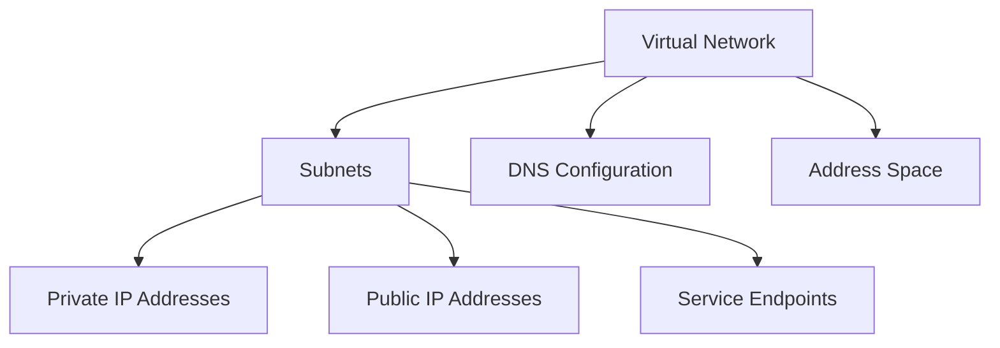

# Terraform Implementation Guides for Azure Virtual Networks

This directory contains comprehensive guides for implementing Azure Virtual Networks using Terraform.

## Documentation Structure

1. **[01-virtual-network.md](./01-virtual-network.md)**
   - Creating virtual networks
   - Address space configuration
   - DNS server settings

2. **[02-subnets.md](./02-subnets.md)**
   - Creating subnets
   - Subnet address ranges
   - Reserved addresses

3. **[03-private-ip-addresses.md](./03-private-ip-addresses.md)**
   - Private IP address configuration
   - Dynamic vs static assignment
   - Network interface IP configuration

4. **[04-public-ip-addresses.md](./04-public-ip-addresses.md)**
   - Public IP address creation
   - SKU selection (Basic vs Standard)
   - Dynamic vs static assignment

5. **[05-service-endpoints.md](./05-service-endpoints.md)**
   - Virtual network service endpoints
   - Enabling service endpoints on subnets
   - Route table changes

## Quick Start

### Basic Virtual Network

```hcl
# Resource Group
resource "azurerm_resource_group" "vnet" {
  name     = "rg-vnet"
  location = "eastus"
}

# Virtual Network
resource "azurerm_virtual_network" "main" {
  name                = "vnet-main"
  address_space       = ["10.0.0.0/16"]
  location            = "eastus"
  resource_group_name = azurerm_resource_group.vnet.name

  dns_servers = ["10.0.0.4", "10.0.0.5"]

  tags = {
    Environment = "Production"
  }
}

# Subnet
resource "azurerm_subnet" "main" {
  name                 = "subnet-main"
  resource_group_name  = azurerm_resource_group.vnet.name
  virtual_network_name = azurerm_virtual_network.main.name
  address_prefixes     = ["10.0.1.0/24"]
}
```

### Virtual Network with Multiple Subnets

```hcl
resource "azurerm_virtual_network" "main" {
  name                = "vnet-main"
  address_space       = ["10.0.0.0/16"]
  location            = "eastus"
  resource_group_name = azurerm_resource_group.vnet.name
}

# Web Subnet
resource "azurerm_subnet" "web" {
  name                 = "subnet-web"
  resource_group_name  = azurerm_resource_group.vnet.name
  virtual_network_name = azurerm_virtual_network.main.name
  address_prefixes     = ["10.0.1.0/24"]
}

# Application Subnet
resource "azurerm_subnet" "app" {
  name                 = "subnet-app"
  resource_group_name  = azurerm_resource_group.vnet.name
  virtual_network_name = azurerm_virtual_network.main.name
  address_prefixes     = ["10.0.2.0/24"]
}

# Database Subnet
resource "azurerm_subnet" "db" {
  name                 = "subnet-db"
  resource_group_name  = azurerm_resource_group.vnet.name
  virtual_network_name = azurerm_virtual_network.main.name
  address_prefixes     = ["10.0.3.0/24"]
}
```

## Architecture Overview



## Best Practices

1. **Address Space Planning**: Plan carefully before creation, consider future growth
2. **Subnet Design**: Create subnets based on security and management needs
3. **Reserved Addresses**: Account for 5 reserved addresses per subnet
4. **DNS Configuration**: Configure custom DNS if needed
5. **Service Subnets**: Reserve space for service-specific subnets

## Additional Resources

- [Azure Virtual Network Documentation](https://learn.microsoft.com/en-us/azure/virtual-network/)
- [Terraform Azure Provider - Virtual Network](https://registry.terraform.io/providers/hashicorp/azurerm/latest/docs/resources/virtual_network)


