# Azure Virtual Networks

## Overview

A major incentive for adopting cloud solutions like Azure is to enable information technology departments to transition server resources to the cloud. Moving resources to the cloud can save money and simplify administrative operations. Relocating resources removes the need to maintain expensive datacenters with uninterruptible power supplies, generators, multiple fail-safes, or clustered database servers. For small and medium-sized companies, which might not have the expertise to maintain their own robust infrastructure, moving to the cloud is particularly appealing.

**Learn more:**
- [Azure Virtual Network Overview](https://learn.microsoft.com/en-us/azure/virtual-network/virtual-networks-overview)
- [Virtual Network Documentation](https://learn.microsoft.com/en-us/azure/virtual-network/)

## Things to Know About Azure Virtual Networks

You can implement Azure Virtual Network to create a virtual representation of your network in the cloud. With some planning, you can deploy virtual networks and connect the resources you need more effectively. Let's examine some characteristics of virtual networks in Azure.

**Virtual Network Characteristics:**
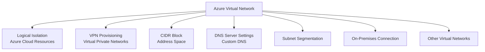

**Key Characteristics:**

1. **Logical Isolation**: An Azure virtual network is a logical isolation of the Azure cloud resources.

2. **VPN Provisioning**: You can use virtual networks to provision and manage virtual private networks (VPNs) in Azure.

3. **CIDR Blocks**: Each virtual network has its own Classless Inter-Domain Routing (CIDR) block and can be linked to other virtual networks and on-premises networks.

4. **Hybrid Connectivity**: You can link virtual networks with an on-premises IT infrastructure to create hybrid or cross-premises solutions, when the CIDR blocks of the connecting networks don't overlap.

5. **DNS and Segmentation**: You control the DNS server settings for virtual networks, and segmentation of the virtual network into subnets.

**Virtual Network Architecture:**
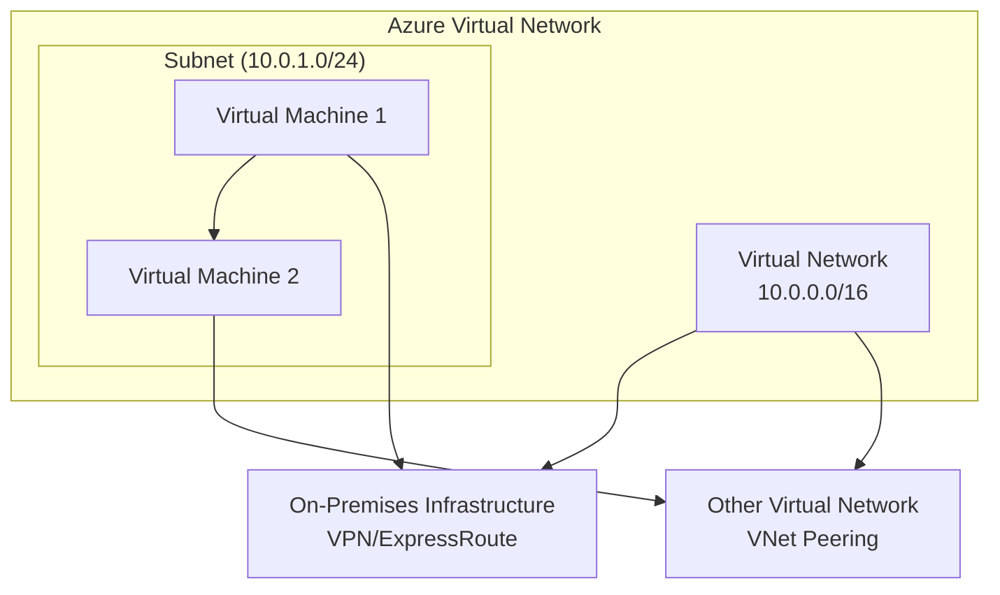

## Things to Consider When Using Virtual Networks

Virtual networks can be used in many ways. As you think about the configuration plan for your virtual networks and subnets, consider the following scenarios.

| Scenario | Description |
|----------|-------------|
| **Create a dedicated private cloud-only virtual network** | Sometimes you don't require a cross-premises configuration for your solution. When you create a virtual network, your services and virtual machines within your virtual network can communicate directly and securely with each other in the cloud. You can still configure endpoint connections for the virtual machines and services that require internet communication, as part of your solution. |
| **Securely extend your data center with virtual networks** | You can build traditional site-to-site VPNs to securely scale your datacenter capacity. Site-to-site VPNs use IPSEC to provide a secure connection between your corporate VPN gateway and Azure. |
| **Enable hybrid cloud scenarios** | Virtual networks give you the flexibility to support a range of hybrid cloud scenarios. You can securely connect cloud-based applications to any type of on-premises system, such as mainframes and Unix systems. |

**Virtual Network Use Cases:**
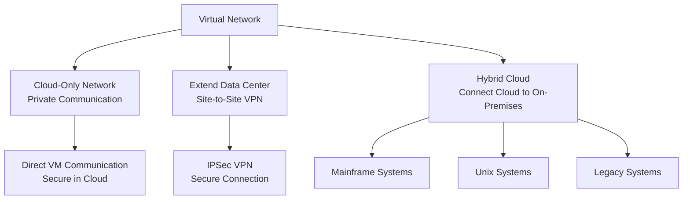

## Create Subnets

Azure Subnets provide a way for you to implement logical divisions within your virtual network. Your network can be segmented into subnets to help improve security, increase performance, and make it easier to manage.

**Subnet Benefits:**
- **Security**: Improve security through network segmentation
- **Performance**: Increase performance through traffic isolation
- **Management**: Make network management easier
- **Organization**: Logical organization of resources

### Things to Know About Subnets

There are certain conditions for the IP addresses in a virtual network when you apply segmentation with subnets.

**Subnet Requirements:**
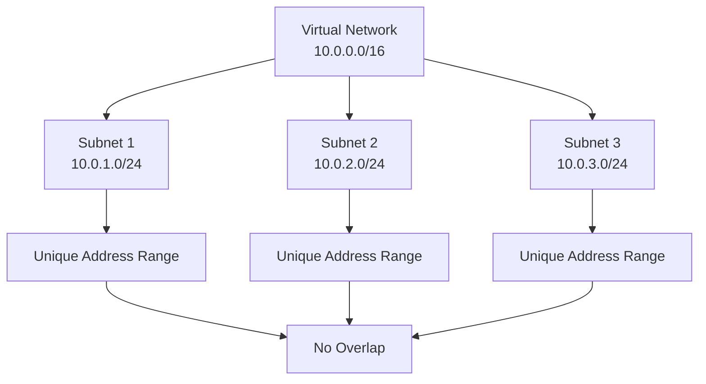

**Subnet IP Address Conditions:**

1. **Address Range Within VNet**: Each subnet contains a range of IP addresses that fall within the virtual network address space.

2. **Unique Range**: The address range for a subnet must be unique within the address space for the virtual network.

3. **No Overlap**: The range for one subnet can't overlap with other subnet IP address ranges in the same virtual network.

4. **CIDR Notation**: The IP address space for a subnet must be specified by using CIDR notation.

**Subnet Configuration Example:**
```
Virtual Network: 10.0.0.0/16

Subnet 1: 10.0.1.0/24  (10.0.1.0 - 10.0.1.255)
Subnet 2: 10.0.2.0/24  (10.0.2.0 - 10.0.2.255)
Subnet 3: 10.0.3.0/24  (10.0.3.0 - 10.0.3.255)
```

### Reserved Addresses

For each subnet, Azure reserves five IP addresses. The first four addresses and the last address are reserved.

**Reserved Addresses in 192.168.1.0/24:**

| Reserved Address | Reason |
|------------------|--------|
| **192.168.1.0** | This value identifies the virtual network address. |
| **192.168.1.1** | Azure configures this address as the default gateway. |
| **192.168.1.2** | Azure maps this Azure DNS IP address to the virtual network space. |
| **192.168.1.3** | Azure maps this Azure DNS IP address to the virtual network space. |
| **192.168.1.255** | This value supplies the virtual network broadcast address. |

**Reserved Addresses Visualization:**
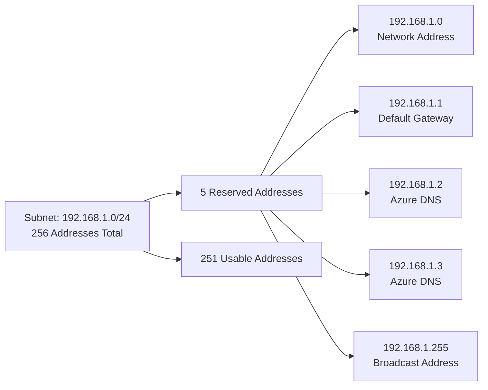

**Important Considerations:**
- **Usable Addresses**: Total addresses minus 5 reserved = usable addresses
- **Example**: `/24` subnet (256 addresses) = 251 usable addresses
- **Planning**: Account for reserved addresses when planning subnet sizes

### Things to Consider When Using Subnets

When you plan for adding subnet segments within your virtual network, there are several factors to consider.

**Subnet Planning Considerations:**
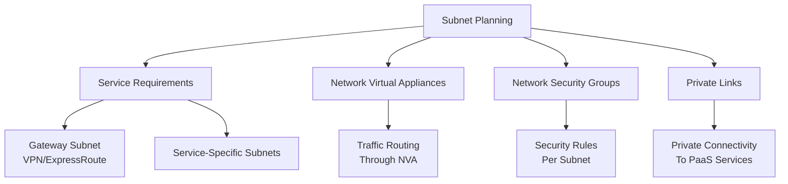

#### Consider Service Requirements

Each service directly deployed into a virtual network has specific requirements for routing and the types of traffic that must be allowed into and out of associated subnets. A service might require or create their own subnet. There must be enough unallocated space to meet the service requirements.

**Service-Specific Subnets:**
- **Gateway Subnet**: Required for VPN Gateway or ExpressRoute Gateway
- **Application Gateway Subnet**: Dedicated subnet for Application Gateway
- **Azure Bastion Subnet**: Dedicated subnet for Azure Bastion
- **Azure Firewall Subnet**: Dedicated subnet for Azure Firewall

**Example**: Suppose you connect a virtual network to an on-premises network by using Azure VPN Gateway. The virtual network must have a dedicated subnet for the gateway.

#### Consider Network Virtual Appliances

Azure routes network traffic between all subnets in a virtual network, by default. You can override Azure's default routing to prevent Azure routing between subnets. You can also override the default to route traffic between subnets through a network virtual appliance. If you require traffic between resources in the same virtual network to flow through a network virtual appliance, deploy the resources to different subnets.

**NVA Routing Architecture:**
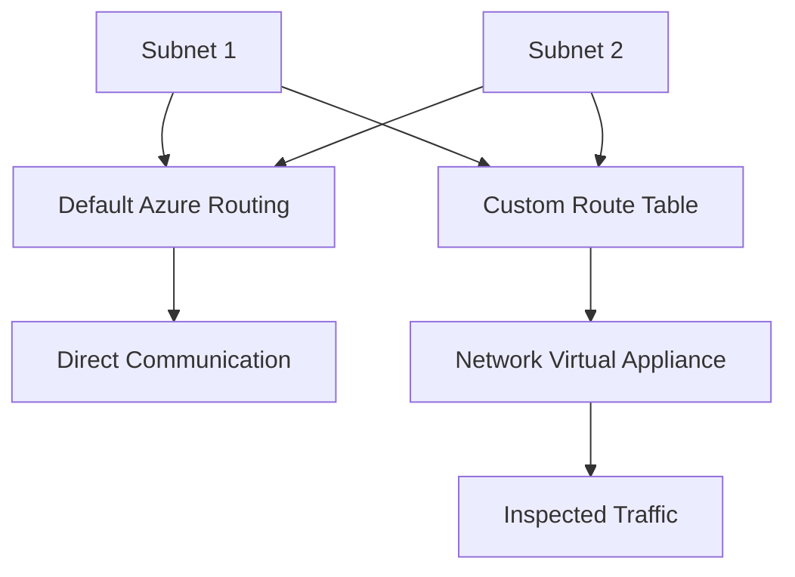

#### Consider Network Security Groups

You can associate zero or one network security group to each subnet in a virtual network. You can associate the same or a different network security group to each subnet. Each network security group contains rules that allow or deny traffic to and from sources and destinations.

**NSG Association:**
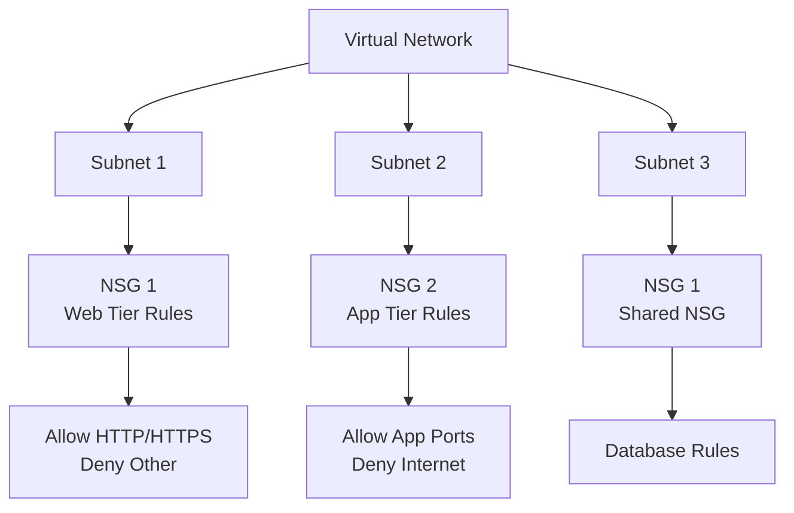

#### Consider Private Links

Azure Private Link provides private connectivity from a virtual network to Azure platform as a service (PaaS), customer-owned, or Microsoft partner services. Private Link simplifies the network architecture and secures the connection between endpoints in Azure. The service eliminates data exposure to the public internet.

**Private Link Architecture:**
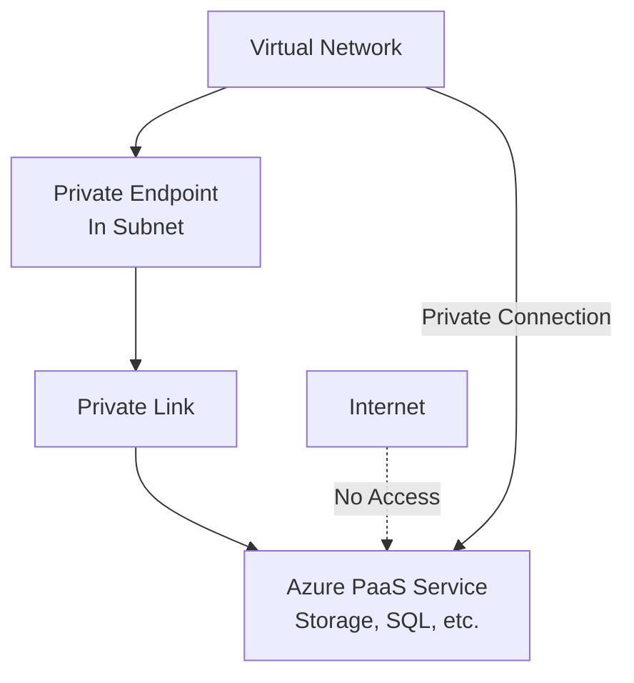

## Create Virtual Networks

You can create new virtual networks at any time. You can also add virtual networks when you create a virtual machine.

### Things to Know About Creating Virtual Networks

Review these requirements for creating a virtual network.

**Virtual Network Creation Requirements:**
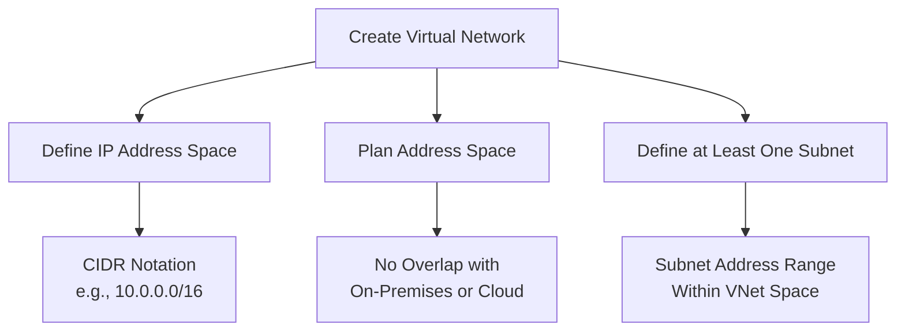

**Key Requirements:**

1. **IP Address Space**: When you create a virtual network, you need to define the IP address space for the network.

2. **Address Space Planning**: 
   - Plan to use an IP address space that's not already in use in your organization.
   - The address space for the network can be either on-premises or in the cloud, but not both.
   - Once you create the IP address space, it can't be changed. If you plan your address space for cloud-only virtual networks, you might later decide to connect an on-premises site.

3. **Subnet Requirements**:
   - To create a virtual network, you need to define at least one subnet.
   - Each subnet contains a range of IP addresses that fall within the virtual network address space.
   - The address range for each subnet must be unique within the address space for the virtual network.
   - The range for one subnet can't overlap with other subnet IP address ranges in the same virtual network.

**Virtual Network Creation Process:**
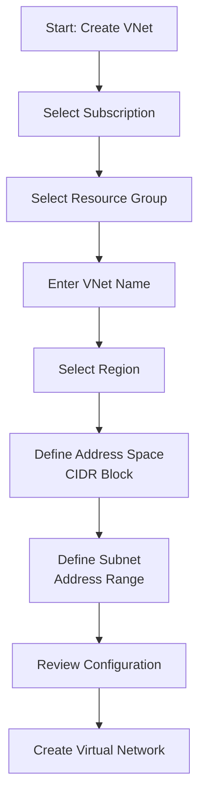

## IP Addresses

You can assign IP addresses to Azure resources to communicate with other Azure resources, your on-premises network, and the internet. There are two types of Azure IP addresses: private and public.

**IP Address Types:**
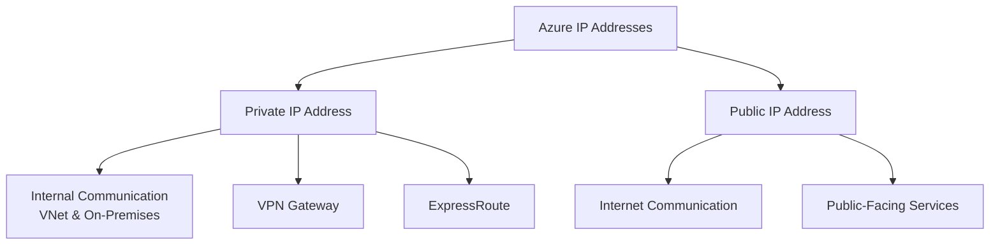

**Resource with Both IP Addresses:**
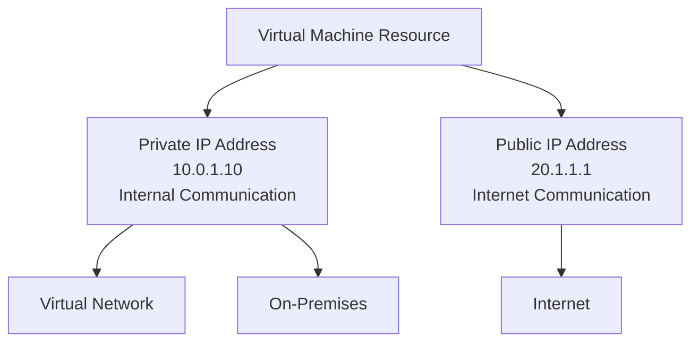

### Private IP Addresses

Private IP addresses enable communication within an Azure virtual network and your on-premises network. You create a private IP address for your resource when you use a VPN gateway or Azure ExpressRoute circuit to extend your network to Azure.

**Private IP Address Characteristics:**
- **Internal Communication**: Enables communication within Azure VNet
- **On-Premises Connectivity**: Works with VPN Gateway and ExpressRoute
- **Not Internet Accessible**: Not directly accessible from internet
- **Address Range**: From VNet/subnet address space

**Private IP Address Assignment:**

A private IP address is allocated from the address range of the virtual network subnet that a resource is deployed in. There are two options: dynamic and static.

**Dynamic Assignment:**
- Azure assigns the next available unassigned or unreserved IP address in the subnet's address range
- Dynamic assignment is the default allocation method
- Example: If addresses 10.0.0.4 through 10.0.0.9 are already assigned, Azure assigns 10.0.0.10 to a new resource

**Static Assignment:**
- You select and assign any unassigned or unreserved IP address in the subnet's address range
- Example: If subnet range is 10.0.0.0/16 and addresses 10.0.0.4 through 10.0.0.9 are assigned, you can assign any address between 10.0.0.10 and 10.0.255.254

**Private IP Address Assignment Flow:**
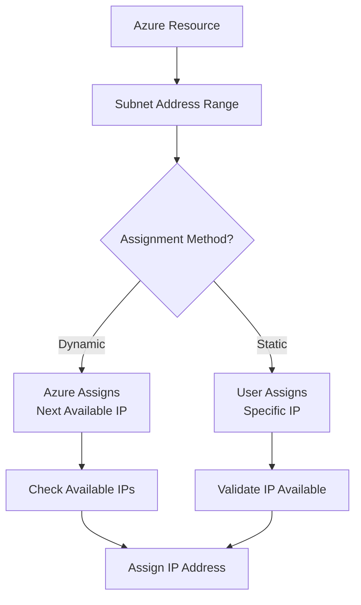

**Things to Consider When Associating Private IP Addresses:**

| Resource | Private IP Address Association | Dynamic IP Address | Static IP Address |
|----------|-------------------------------|-------------------|------------------|
| **Virtual machine** | NIC | Yes | Yes |
| **Internal load balancer** | Front-end configuration | Yes | Yes |
| **Application gateway** | Front-end configuration | Yes | Yes |

**When to Use Static Private IP Addresses:**

Static IP addresses don't change and are best for certain situations, such as:
- **DNS name resolution**: Where a change in the IP address requires updating host records
- **IP address-based security models**: That require apps or services to have a static IP address
- **TLS/SSL certificates**: Linked to an IP address
- **Firewall rules**: That allow or deny traffic by using IP address ranges
- **Role-based virtual machines**: Such as Domain Controllers and DNS servers

### Public IP Addresses

Public IP addresses allow your resource to communicate with the internet. You can create a public IP address to connect with Azure public-facing services.

**Public IP Address Characteristics:**
- **Internet Communication**: Enables communication with internet
- **Public-Facing Services**: Required for public-facing Azure services
- **SKU Options**: Basic or Standard SKU
- **IP Version**: IPv4 or IPv6 support

**Things to Consider When Creating a Public IP Address:**

To create a public IP address, configure these settings:

**IP Version:**
- Select to create an IPv4 or IPv6 address, or Both addresses

**SKU:**
- Select the SKU for the public IP address, including Basic or Standard
- The value must match the SKU of the Azure load balancer with which the address is used

**Name:**
- Enter a name to identify the IP address
- The name must be unique within the resource group you select

**IP Address Assignment:**

**Dynamic Addresses:**
- Assigned after a public IP address is associated to an Azure resource and is started for the first time
- Dynamic addresses can change if a resource such as a virtual machine is stopped (deallocated) and then restarted through Azure
- The address remains the same if a virtual machine is rebooted or stopped from within the guest OS
- When a public IP address resource is removed from a resource, the dynamic address is released

**Static Addresses:**
- Assigned when a public IP address is created
- Static addresses aren't released until a public IP address resource is deleted
- If the address isn't associated to a resource, you can change the assignment method after the address is created
- If the address is associated to a resource, you might not be able to change the assignment method

**Important Note:**
- If you select IPv6 for the IP version, the assignment method must be Dynamic for the Basic SKU
- Standard SKU addresses are Static for both IPv4 and IPv6 addresses

**Public IP Address Assignment Comparison:**
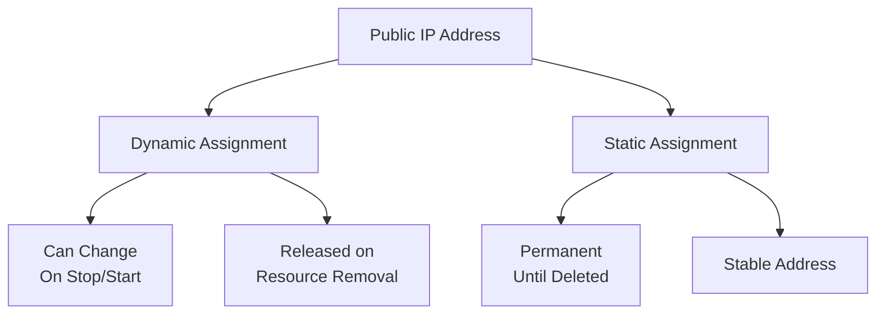

**Things to Consider When Associating Public IP Addresses:**

| Top-level Resource | IP Address Configuration |
|-------------------|------------------------|
| **Virtual machine** | Network interface configuration |
| **Virtual Network Gateway (VPN)** | Gateway IP configuration |
| **Virtual Network Gateway (ER)** | Gateway IP configuration |
| **NAT Gateway** | Gateway IP configuration |
| **Public Load Balancer** | Front-end configuration |
| **Application Gateway** | Front-end configuration |
| **Azure Firewall** | Front-end configuration |
| **Route Server** | Front-end configuration |
| **API Management** | Front-end configuration |
| **Bastion host** | Public IP configuration |

### Public IP Address SKU Features

**Standard SKU Features:**

| Feature | Standard SKU |
|---------|-------------|
| **Allocation method** | Static |
| **Security** | Secure by default model |
| **Available zones** | Supported. Standard IPs can be nonzonal, zonal, or zone-redundant |

**Public IP Address SKU Comparison:**
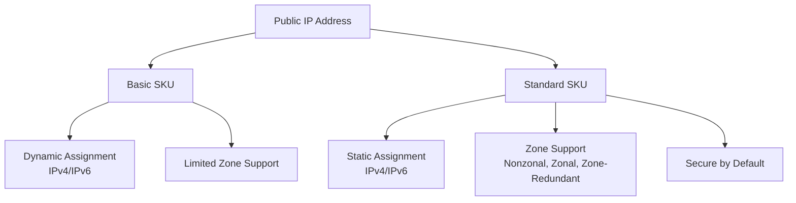

## IP Address Assignment Summary

**IP Address Assignment Methods:**
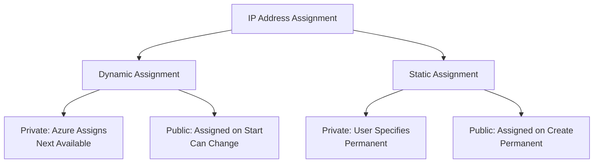

**Key Differences:**

| Aspect | Dynamic | Static |
|--------|---------|--------|
| **Private IP** | Azure assigns next available | User specifies |
| **Public IP (Basic)** | Assigned on start, can change | Assigned on create, permanent |
| **Public IP (Standard)** | Not available | Always static |
| **Use Case** | General resources | DNS, certificates, firewall rules |

## Best Practices

### Virtual Network Planning

1. **Address Space Planning**: 
   - Plan address space carefully before creation
   - Consider future growth and connectivity requirements
   - Ensure no overlap with on-premises networks

2. **Subnet Design**:
   - Create subnets based on security and management needs
   - Reserve space for service-specific subnets (gateway, etc.)
   - Account for reserved addresses in subnet sizing

3. **DNS Configuration**:
   - Configure custom DNS servers if needed
   - Plan DNS resolution for hybrid scenarios

### Subnet Planning

1. **Service Requirements**: Plan for service-specific subnets
2. **Security**: Use NSGs for subnet-level security
3. **Routing**: Consider NVA routing requirements
4. **Private Link**: Plan for Private Endpoint subnets

### IP Address Management

1. **Static IPs**: Use for DNS, certificates, firewall rules
2. **Dynamic IPs**: Use for general resources
3. **SKU Selection**: Use Standard SKU for production
4. **Zone Redundancy**: Use zone-redundant IPs for high availability

## Summary

Azure Virtual Networks provide:
- **Logical Isolation**: Isolated network environment for Azure resources
- **Subnet Segmentation**: Logical divisions for security and management
- **Hybrid Connectivity**: Connect to on-premises networks via VPN/ExpressRoute
- **IP Address Management**: Private and public IP address assignment
- **Flexible Configuration**: Support for various networking scenarios

**Key Takeaways:**
- Virtual networks provide logical isolation of Azure resources
- Subnets enable network segmentation and security
- Five IP addresses are reserved per subnet
- IP addresses can be dynamically or statically assigned
- Public IPs enable internet communication, private IPs enable internal communication

**Additional Resources:**
- [Virtual Network Quickstart](https://learn.microsoft.com/en-us/azure/virtual-network/quick-create-portal)
- [Virtual Network Best Practices](https://learn.microsoft.com/en-us/azure/virtual-network/virtual-network-vnet-plan-design-guide)
- [Subnet Planning Guide](https://learn.microsoft.com/en-us/azure/virtual-network/virtual-network-vnet-plan-design-guide#plan-for-subnets)
- [IP Address Management](https://learn.microsoft.com/en-us/azure/virtual-network/ip-services/public-ip-addresses)


