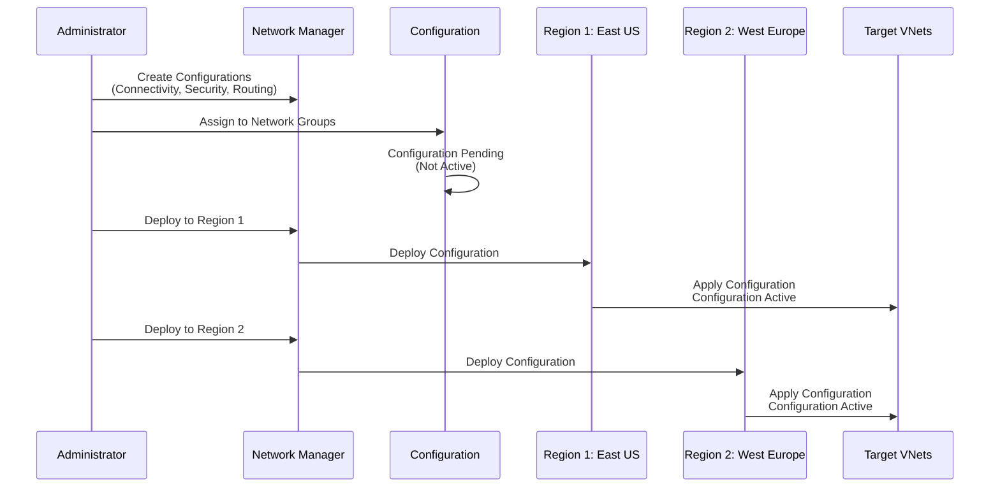
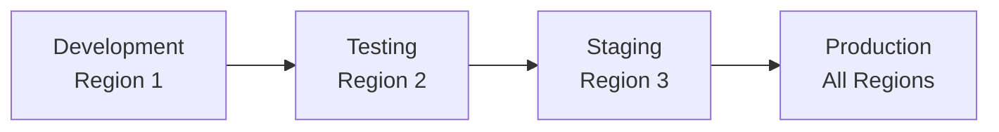

# Implementing Configuration Deployment with Terraform

## Overview

Configurations do not take effect until they are deployed to regions containing your target network resources. Deployment is a critical step that activates your Network Manager configurations.

## Architecture



## Terraform Implementation

### Deploy Connectivity Configuration

```hcl
# Network Manager and Configuration (assumed to exist)
resource "azurerm_network_manager" "main" {
  # ... (see 01-network-manager-instance.md)
}

resource "azurerm_network_manager_connectivity_configuration" "hub_spoke" {
  # ... (see 03-connectivity-configuration.md)
}

# Deploy connectivity configuration to East US
resource "azurerm_network_manager_deployment" "connectivity_eastus" {
  location           = "eastus"
  network_manager_id = azurerm_network_manager.main.id
  scope_access       = "Connectivity"

  configuration_ids = [
    azurerm_network_manager_connectivity_configuration.hub_spoke.id
  ]

  depends_on = [
    azurerm_network_manager_connectivity_configuration.hub_spoke
  ]
}

# Deploy connectivity configuration to West Europe
resource "azurerm_network_manager_deployment" "connectivity_westeurope" {
  location           = "westeurope"
  network_manager_id = azurerm_network_manager.main.id
  scope_access       = "Connectivity"

  configuration_ids = [
    azurerm_network_manager_connectivity_configuration.hub_spoke.id
  ]

  depends_on = [
    azurerm_network_manager_connectivity_configuration.hub_spoke
  ]
}
```

### Deploy Security Admin Configuration

```hcl
resource "azurerm_network_manager_security_admin_configuration" "production" {
  # ... (see 04-security-admin-rules.md)
}

# Deploy security admin configuration
resource "azurerm_network_manager_deployment" "security_eastus" {
  location           = "eastus"
  network_manager_id = azurerm_network_manager.main.id
  scope_access       = "SecurityAdmin"

  configuration_ids = [
    azurerm_network_manager_security_admin_configuration.production.id
  ]

  depends_on = [
    azurerm_network_manager_security_admin_configuration.production
  ]
}
```

### Deploy Routing Configuration

```hcl
resource "azurerm_network_manager_routing_configuration" "production" {
  # ... (see 05-routing-configuration.md)
}

# Deploy routing configuration
resource "azurerm_network_manager_deployment" "routing_eastus" {
  location           = "eastus"
  network_manager_id = azurerm_network_manager.main.id
  scope_access       = "Routing"

  configuration_ids = [
    azurerm_network_manager_routing_configuration.production.id
  ]

  depends_on = [
    azurerm_network_manager_routing_configuration.production
  ]
}
```

### Deploy Multiple Configurations

```hcl
# Deploy all configurations to a region
resource "azurerm_network_manager_deployment" "all_configs_eastus" {
  location           = "eastus"
  network_manager_id = azurerm_network_manager.main.id
  scope_access       = "Connectivity"

  configuration_ids = [
    azurerm_network_manager_connectivity_configuration.hub_spoke.id,
    azurerm_network_manager_connectivity_configuration.mesh.id
  ]

  depends_on = [
    azurerm_network_manager_connectivity_configuration.hub_spoke,
    azurerm_network_manager_connectivity_configuration.mesh
  ]
}
```

## Using the Module

```hcl
module "network_manager" {
  source = "../../modules/virtual-network-manager"

  # ... (other configuration)

  deployments = {
    "deploy-connectivity-eastus" = {
      location         = "eastus"
      scope_access     = "Connectivity"
      configuration_ids = [
        module.network_manager.connectivity_configuration_ids["hub-spoke-prod"]
      ]
    }
    "deploy-security-eastus" = {
      location         = "eastus"
      scope_access     = "SecurityAdmin"
      configuration_ids = [
        module.network_manager.security_admin_configuration_ids["security-prod"]
      ]
    }
    "deploy-routing-eastus" = {
      location         = "eastus"
      scope_access     = "Routing"
      configuration_ids = [
        module.network_manager.routing_configuration_ids["routing-prod"]
      ]
    }
  }
}
```

## Key Parameters

| Parameter | Description | Required | Example |
|-----------|-------------|----------|---------|
| `location` | Azure region to deploy to | Yes | `"eastus"` |
| `network_manager_id` | ID of the Network Manager | Yes | `azurerm_network_manager.main.id` |
| `scope_access` | Type of configuration | Yes | `"Connectivity"`, `"SecurityAdmin"`, or `"Routing"` |
| `configuration_ids` | List of configuration IDs to deploy | Yes | `[azurerm_network_manager_connectivity_configuration.hub_spoke.id]` |

## Scope Access Types

- **Connectivity**: Deploy connectivity configurations (hub-and-spoke, mesh)
- **SecurityAdmin**: Deploy security admin configurations
- **Routing**: Deploy routing configurations

## Deployment Strategy

### Phased Rollout



```hcl
# Phase 1: Deploy to Development
resource "azurerm_network_manager_deployment" "dev" {
  location           = "eastus"
  network_manager_id = azurerm_network_manager.main.id
  scope_access       = "Connectivity"
  configuration_ids  = [azurerm_network_manager_connectivity_configuration.hub_spoke.id]
}

# Phase 2: Deploy to Testing (after validation)
resource "azurerm_network_manager_deployment" "test" {
  location           = "westeurope"
  network_manager_id = azurerm_network_manager.main.id
  scope_access       = "Connectivity"
  configuration_ids  = [azurerm_network_manager_connectivity_configuration.hub_spoke.id]
  
  depends_on = [
    azurerm_network_manager_deployment.dev
  ]
}

# Phase 3: Deploy to Production
resource "azurerm_network_manager_deployment" "prod" {
  for_each = toset(["eastus", "westeurope", "southeastasia"])

  location           = each.value
  network_manager_id = azurerm_network_manager.main.id
  scope_access       = "Connectivity"
  configuration_ids  = [azurerm_network_manager_connectivity_configuration.hub_spoke.id]
  
  depends_on = [
    azurerm_network_manager_deployment.test
  ]
}
```

## Best Practices

1. **Deploy to Non-Production First**: Always deploy to development/testing environments first
2. **Regional Deployment**: Deploy to regions containing your target network resources
3. **Validation**: Use Network Watcher to validate configurations after deployment
4. **Monitoring**: Set up alerts for configuration changes
5. **Rollback Plan**: Have a plan to revert if issues occur
6. **Dependencies**: Ensure configurations are created before deployment
7. **Regional Sequence**: Deploy in a specific region sequence for controlled rollout

## Validation After Deployment

```hcl
# Use Network Watcher to validate connectivity
# This would be done via Azure CLI or Portal after deployment
# Example validation commands:
# az network watcher test-connectivity ...
# az network watcher show-next-hop ...
```

## Outputs

```hcl
output "deployment_id" {
  description = "The ID of the deployment"
  value       = azurerm_network_manager_deployment.connectivity_eastus.id
}

output "deployment_status" {
  description = "Deployment status for each region"
  value = {
    for k, v in azurerm_network_manager_deployment.main : k => {
      location     = v.location
      scope_access = v.scope_access
      id           = v.id
    }
  }
}
```

## Troubleshooting

### Common Issues

1. **Configuration Not Active**: Ensure deployment has been completed
2. **Wrong Region**: Deploy to regions containing target VNets
3. **Missing Dependencies**: Ensure configurations are created before deployment
4. **Scope Access Mismatch**: Ensure scope_access matches configuration type

## References

- [Terraform: azurerm_network_manager_deployment](https://registry.terraform.io/providers/hashicorp/azurerm/latest/docs/resources/network_manager_deployment)
- [Deploy Network Manager Configurations](https://learn.microsoft.com/en-us/azure/virtual-network-manager/deploy-network-manager-configuration)
- [Network Manager Deployment](https://learn.microsoft.com/en-us/azure/virtual-network-manager/concept-deployments)

