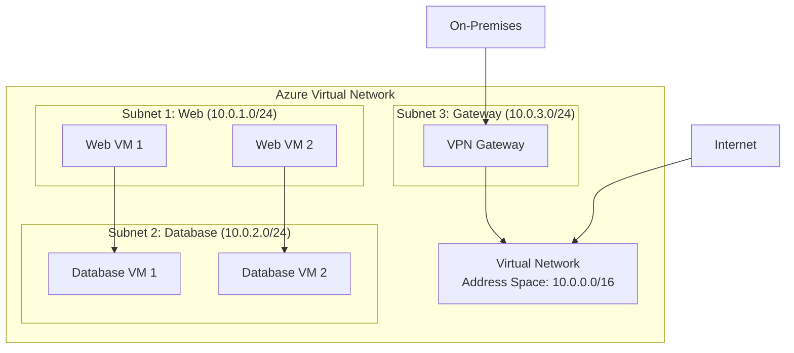
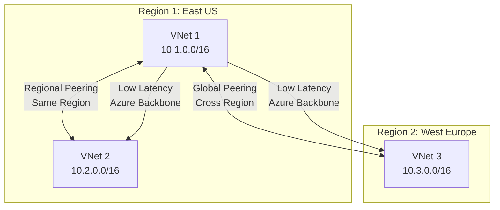
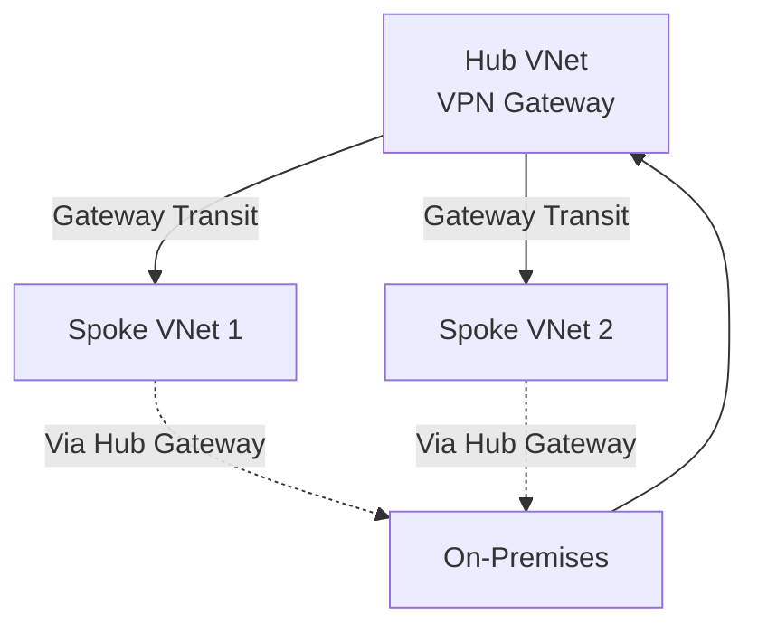

# Azure Virtual Networking

## What is Azure Virtual Networking?

Azure virtual networks enable Azure resources, such as virtual machines, web apps, and databases, to communicate with: each other, users on the internet, and on-premises client computers. You can think of an Azure network as a set of resources that links other Azure resources.

## Overview

Azure Virtual Networks (VNets) form the foundation of networking in Azure, providing isolation, segmentation, and connectivity for your cloud resources. Understanding VNet architecture is crucial for designing secure and scalable cloud infrastructures.

**Virtual Network Architecture:**

**Learn more:**
- [Azure Virtual Network Overview](https://learn.microsoft.com/en-us/azure/virtual-network/virtual-networks-overview)
- [Virtual Network Best Practices](https://learn.microsoft.com/en-us/azure/virtual-network/virtual-network-vnet-plan-design-guide)

Azure Virtual Networks (VNets) enable Azure resources (VMs, web apps, databases) to communicate with:
- Each other
- Users on the internet
- On-premises client computers

VNets act as a logical isolation boundary for Azure resources.
**Key Capabilities**
- **Isolate and segment** resources.
- **Internet communications**: Outbound by default; inbound via public IP or load balancer.
- **Communicate between Azure resources**: VNets and service endpoints.
- **Communicate with on-premises resources**: Point-to-site VPN, Site-to-site VPN, ExpressRoute.
- **Route network traffic**: Custom route tables and BGP.
- **Filter network traffic**: NSGs and network virtual appliances.
- **Connect virtual networks**: VNet peering.

**Communicate with on-premises resources**
- ***Virtual networks:*** Virtual networks can connect not only VMs, but other Azure resources such as the App Service Environment, Azure Kubernetes Service, and Azure virtual machine scale sets.
- ***Service endpoints***: You can use service endpoints to connect to other Azure resource types, such as Azure SQL databases and storage accounts. This approach allows you to link multiple Azure resources to virtual networks, thereby improving security and providing optimal routing between resources.

**Communicate with on-premises resources**
- **Point-to-site VPN**: Client initiates encrypted VPN to Azure.
- **Site-to-site VPN**: Connects on-premises VPN device to Azure VPN gateway.
- **ExpressRoute**: Private, high-bandwidth connection to Azure.

**Routing**
- Default routing between subnets, VNets, and internet.
- Custom route tables for advanced control.
- BGP for dynamic route propagation,  works with Azure VPN gateways or ExpressRoute to propagate on-premises BGP routes to Azure virtual networks.

**Traffic Filtering**
- **Network Security Groups (NSGs)**: Define inbound/outbound rules.
- **Network Virtual Appliances**: Specialized VMs for firewall/WAN optimization.

**Configuration Steps**
1. Create VNet: Define network name, address space (CIDR), subscription, resource group, location.
2. Configure subnets: Partition address space.
3. IMPORTANT: Enable advanced settings: DDoS protection, service endpoints.
4. Associate NSGs and route tables.

Additional: Address spaces, connected devices, subnets, peerings.

### How to connect virtual networks?

Using *virtual network peering*. Peering enables resources in each virtual network to communicate with each other. These virtual networks can be in separate regions, allowing you to create a global interconnected network through Azure.

**Peering Types:**
- **Regional Peering**: Connect VNets within the same Azure region
- **Global Peering**: Connect VNets across different Azure regions
- **Gateway Transit**: Use a VPN/ExpressRoute gateway in a peered VNet for connectivity

**Key Benefits:**
- Low latency communication using Azure backbone
- No gateway required for regional peering
- Transitive routing support with gateway transit
- Private connectivity without internet exposure

**VNet Peering Architecture:**

**Gateway Transit:**

**Learn more:**
- [Virtual Network Peering](https://learn.microsoft.com/en-us/azure/virtual-network/virtual-network-peering-overview)
- [Global VNet Peering](https://learn.microsoft.com/en-us/azure/virtual-network/virtual-network-peering-overview#global-vnet-peering)
- [Gateway Transit](https://learn.microsoft.com/en-us/azure/virtual-network/virtual-network-peering-overview#gateway-transit)

