# Architect network infrastructure in Azure 

## [[ Connect your on-premises network to Azure with VPN Gateway ](https://learn.microsoft.com/en-us/training/modules/connect-on-premises-network-with-vpn-gateway/2-connect-on-premises-networks-to-azure-using-site-to-site-vpn-gateways)]

Suppose you're the network architect at a regional healthcare provider. The organization has migrated much of its infrastructure to Azure. You'd like to connect your datacenter and larger regional facilities to Azure. You need secure connectivity so that patient health information is protected while it's crossing the network. You don't currently have the bandwidth requirements for a dedicated circuit, and you're looking for a way to integrate these networks in a cost-effective way.

The virtual private network (VPN) gateway options in Azure can help your company meet these connectivity requirements. Let's see how these VPN gateway options can meet your requirements, by creating and testing VPNs to securely connect sites to Azure.

A virtual private network (VPN) is a type of private interconnected network. VPNs use an encrypted tunnel within another network. They're typically deployed to connect two or more trusted private networks to one another over an untrusted network (typically the public Internet). Traffic is encrypted while traveling over the untrusted network to prevent eavesdropping or other attacks.

**Learn more:**
- [What is a VPN Gateway?](https://learn.microsoft.com/en-us/azure/vpn-gateway/vpn-gateway-about-vpngateways)
- [VPN Gateway Overview](https://learn.microsoft.com/en-us/azure/vpn-gateway/vpn-gateway-about-vpngateways)

IMPORTANT EXAMPLE: 
For the healthcare provider in our scenario, VPNs can help health professionals share sensitive information between locations. For example, say a patient requires surgery at a specialist facility. The surgical team needs to be able to see the details of the patient's medical history. This medical data is stored on a system in Azure. A VPN that connects the facility to Azure allows the surgical team to securely access this information.

### Azure VPN gateways

A VPN gateway is a type of Virtual Network Gateway. VPN gateways are deployed in Azure virtual networks and enable the following connectivity:

- Connect on-premises datacenters to Azure virtual networks through a ***site-to-site*** connection.
- Connect individual devices to Azure virtual networks through a *point-to-site* connection.
- Connect Azure virtual networks to other Azure virtual networks through a *network-to-network* (VNet-to-VNet) connection.

**Connection Types Diagram:**
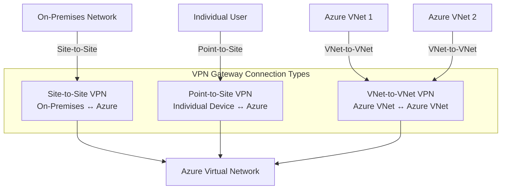

**Learn more:**
- [About VPN Gateway](https://learn.microsoft.com/en-us/azure/vpn-gateway/vpn-gateway-about-vpngateways)
- [VPN Gateway FAQ](https://learn.microsoft.com/en-us/azure/vpn-gateway/vpn-gateway-vpn-faq)

## **Key Features**
- Endpoint for encrypted connections using IPsec/IKE.
- Supports point-to-site, site-to-site, and VNet-to-VNet connections.
- Deployed in a special **GatewaySubnet** within the virtual network.

All transferred data is encrypted in a private tunnel as it crosses the internet. You can deploy only one VPN gateway in each virtual network, but you can use one gateway to connect to multiple locations, including other Azure virtual networks or on-premises datacenters.

When you deploy a VPN gateway, you specify the VPN type: either policy-based or route-based. The main difference between these two types of VPN is how the encrypted traffic is specified.

**Workflow for VPN Gateway Setup**
1. Design connectivity topology and address spaces.
2. Create an Azure virtual network.
3. Add a **GatewaySubnet**.
4. Create the VPN gateway (check which type)
5. Configure connections (S2S, P2S, VNet-to-VNet).
6. Generate certificates for P2S.
7. Validate routing and connectivity.
  
## VPN Gateway Architecture


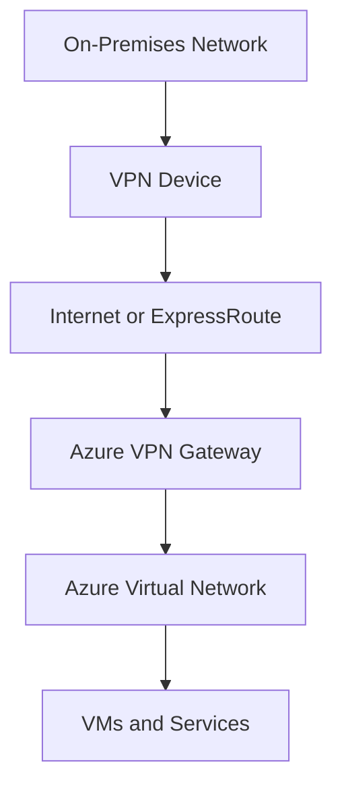

## VPN Gateway Setup Workflow
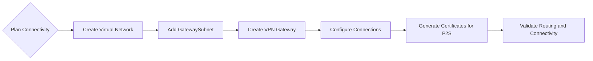

#### Policy-based VPNs

- **Use Case**: Defines VPN tunnels based on specific security policies (ACLs). Each policy determines which traffic is encrypted and sent through the tunnel.
- **Characteristics**:
  - Tunnel is tied directly to a security policy.
  - Best for simple scenarios with few tunnels.
  - Limited flexibility for dynamic routing.
- **Typical Example**: Connecting two sites where only specific traffic (e.g., between two subnets) should pass through the VPN.

**Policy-Based VPN Flow:**
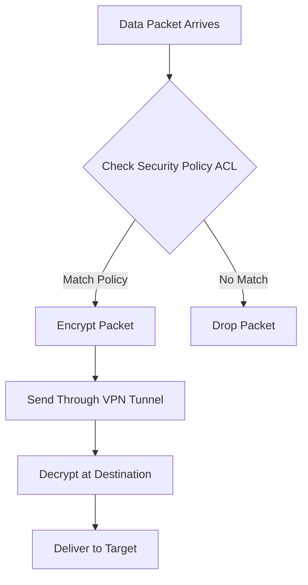

**Learn more:**
- [Policy-Based vs Route-Based VPNs](https://learn.microsoft.com/en-us/azure/vpn-gateway/vpn-gateway-connect-multiple-policybased-rm-ps)

Policy-based VPN gateways statically specify the IP address of packets that should be encrypted through each tunnel. This type of device evaluates every data packet against those sets of IP addresses to choose the tunnel through which that packet is going to be sent. Policy-based VPN gateways are limited in the features and connections they can support. Key features of policy-based VPN gateways in Azure include:

- Support for IKEv1 only. ADDITIONAL INFO: [CISCO IPsec IKEv1](https://www.cisco.com/c/es_mx/support/docs/security-vpn/ipsec-negotiation-ike-protocols/217432-understand-ipsec-ikev1-protocol.html)
- Use of [*static routing*](https://learningnetwork.cisco.com/s/article/static-routing-tipos-de-rutas-estaticas), where combinations of address prefixes from both networks control how traffic is encrypted and decrypted through the VPN tunnel. The source and destination of the tunneled networks are declared in the policy and don't need to be declared in routing tables.
- Policy-based VPNs must be used in specific scenarios that require them, such as for compatibility with legacy on-premises VPN devices.

#### Route-based VPNs

- **Use Case**: Creates a virtual interface (tunnel) and uses routing to decide which traffic goes through it.
- **Characteristics**:
  - Highly flexible, supports dynamic routing protocols (OSPF, BGP).
  - Scalable for multiple tunnels and networks.
  - Configured like a regular network interface.
- **Typical Example**: Large networks with multiple subnets and dynamic routing needs.

**Route-Based VPN Flow:**
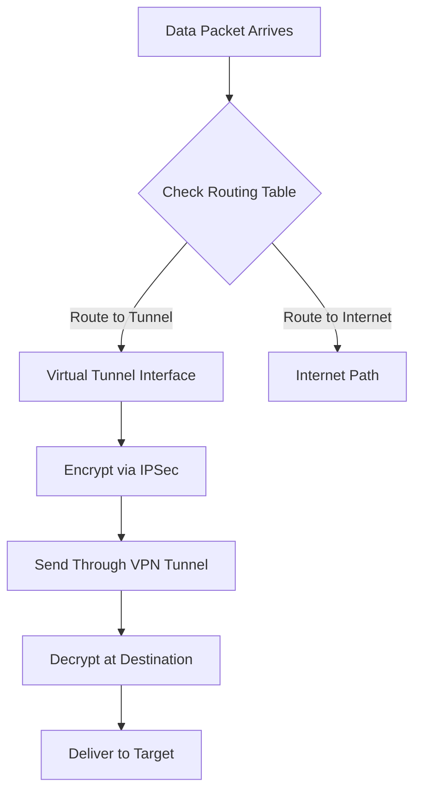

**Learn more:**
- [Route-Based VPN Configuration](https://learn.microsoft.com/en-us/azure/vpn-gateway/vpn-gateway-about-vpn-gateway-settings)
- [BGP with VPN Gateway](https://learn.microsoft.com/en-us/azure/vpn-gateway/vpn-gateway-bgp-overview)


If defining which IP addresses are behind each tunnel is too cumbersome for your situation, or you need features and connections that policy-based gateways don't support, you should use route-based gateways. With route-based gateways, IPSec tunnels are modeled as a network interface or VTI (virtual tunnel interface). IP routing (static routes or dynamic routing protocols) determines which of the tunnel interfaces to send each packet across. Route-based VPNs are the preferred connection method for on-premises devices because they're more resilient to topology changes such as th

- Connections between virtual networks
- Point-to-site connections
- Multisite connections
- Coexistence with an Azure ExpressRoute gateway

Key features of route-based VPN gateways in Azure include:

- Supports IKEv2.
  - [IKEv2 Cisco Documentation](https://www.cisco.com/en/US/docs/ios-xml/ios/sec_conn_ikevpn/configuration/15-1mt/Configuring_Internet_Key_Exchange_Version_2.html)
  - [Configure Site-to-Site IKEv2 Tunnel between ASA and Router](https://www.cisco.com/c/en/us/support/docs/security-vpn/ipsec-negotiation-ike-protocols/117337-config-asa-router-00.html) 
- Uses any-to-any [(wildcard)](https://www.ciscopress.com/articles/article.asp?p=3089353&seqNum=5) traffic selectors.
- Can use dynamic routing protocols, where routing/forwarding tables direct traffic to different IPSec tunnels. In this case, the source and destination networks aren't statically defined as they are in policy-based VPNs or even in route-based VPNs with static routing. Instead, data packets are encrypted, based on network routing tables that are created dynamically using routing protocols such as BGP (Border Gateway Protocol).

#### ADITIONAL INFO DYNAMIC ROUTING PROTOCOLS:
    - [G2G](https://www.geeksforgeeks.org/computer-networks/what-is-dynamic-routing-in-computer-network)
    - https://www.catchpoint.com/dynamic-routing-protocols 

Both types of VPN gateways (route-based and policy-based) in Azure use preshared key as the only method of authentication. Both types also rely on Internet Key Exchange (IKE) in either version 1 or version 2 and Internet Protocol Security (IPSec). IKE is used to set up a security association (an agreement of the encryption) between two endpoints. This association is then passed to the IPSec suite, which encrypts and decrypts data packets encapsulated in the VPN tunnel.

**IPSec/IKE Tunnel Establishment:**
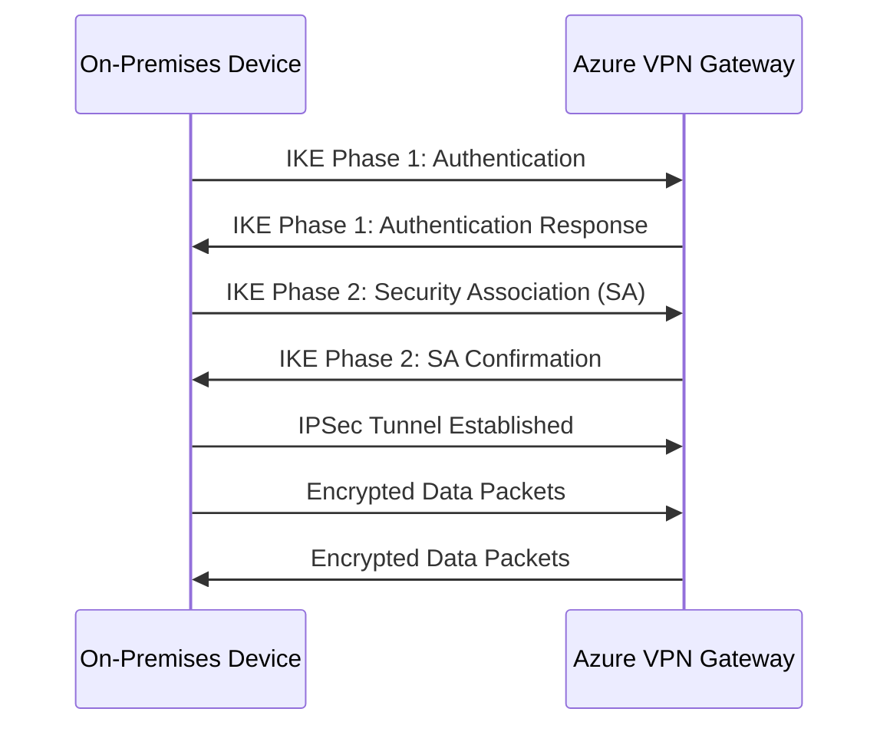

**Learn more:**
- [About IPSec/IKE Parameters](https://learn.microsoft.com/en-us/azure/vpn-gateway/vpn-gateway-about-ipsec-ike-parameters)
- [IPSec Protocol Overview](https://learn.microsoft.com/en-us/azure/vpn-gateway/vpn-gateway-about-ipsec-ike-parameters)

#### [DIFERENCES BETWEEN POLICY-ROUTING VPN](https://ipwithease.com/difference-between-a-policy-based-vpn-and-a-route-based-vpn/) 

### **Key Differences**

| Aspect            | Policy-Based                  | Route-Based                     |
|-------------------|------------------------------|---------------------------------|
| **Control**       | Based on security policies (ACLs) | Based on routing tables        |
| **Scalability**   | Low                          | High                            |
| **Routing**       | Static                       | Dynamic (OSPF/BGP)             |
| **Configuration** | Simpler                      | More flexible, slightly complex |


#### **Comparison**
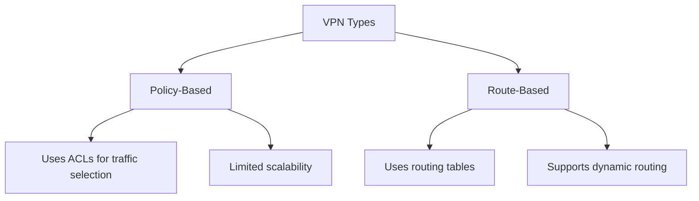

#### **Decision Flow**
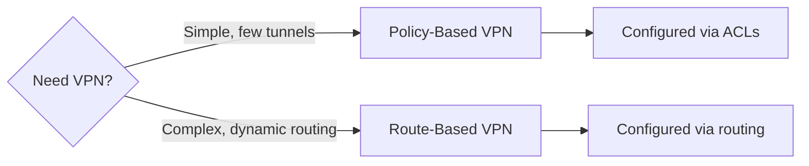

#### VPN gateway sizes

The SKU or size that you deploy, determines the capabilities of your VPN gateway. This table shows an example of some of the gateway SKUs. The numbers in this table are subject to change at any time. For the latest information, see Gateway SKUs in the Azure VPN Gateway documentation. The Basic gateway SKU should only be used for Dev/Test workloads. In addition, it's unsupported to migrate from Basic to any VpnGw#/Az sku at a later time without having to remove the gateway and redeploy.

[MORE INFO TABLE](https://learn.microsoft.com/en-us/azure/vpn-gateway/about-gateway-skus) 

#### Required Azure resources


You need these Azure resources before you can deploy an operational VPN gateway:

- ***Virtual network:*** Deploy an Azure virtual network with enough address space for the extra subnet that you need for the VPN gateway. The address space for this virtual network must not overlap with the on-premises network to which you're connecting. Remember that you can deploy only one VPN gateway within a virtual network.

- ***GatewaySubnet:*** Deploy a subnet called GatewaySubnet for the VPN gateway. Use at least a /27 address mask to make sure you have enough IP addresses in the subnet for future growth. You can't use this subnet for any other services.

- ***Public IP address:*** Create a Basic-SKU dynamic public IP address if using a non-zone-aware gateway. This address provides a public-routable IP address as the target for your on-premises VPN device. This IP address is dynamic, but it doesn't change unless you delete and re-create the VPN gateway.

- ***Local network gateway***: Create a local network gateway to define the on-premises network's configuration. Specifically, where the VPN gateway connects and what it connects to. This configuration includes the on-premises VPN device's public IPv4 address and the on-premises routable networks. This information is used by the VPN gateway to route packets that are destined for on-premises networks through the IPSec tunnel.

- ***Virtual network gateway***: Create the virtual network gateway to route traffic between the virtual network and the on-premises datacenter or other virtual networks. The virtual network gateway can be either configured as a VPN gateway or an ExpressRoute gateway, but this module deals only with VPN virtual network gateways.

- ***Connection***: Create a Connection resource to create a logical connection between the VPN gateway and the local network gateway. You can create multiple connections to the same gateway.
  - The connection is made to the on-premises VPN device's IPv4 address as defined by the local network gateway.
  - The connection is made from the virtual network gateway and its associated public IP address.

#### Required on-premises resources
To connect your datacenter to a VPN gateway, you need these on-premises resources:
- A VPN device that supports policy-based or route-based VPN gateways
- A public-facing (internet-routable) IPv4 address

### Active/standby


By default, VPN gateways are deployed as two instances in an active/standby configuration, even if you only see one VPN gateway resource in Azure. When planned maintenance or unplanned disruption affects the active instance, the standby instance automatically assumes responsibility for connections without any user intervention. Connections are interrupted during this failover, but they're typically restored within a few seconds for planned maintenance and within 90 seconds for unplanned disruptions.

**Active/Standby Architecture:**
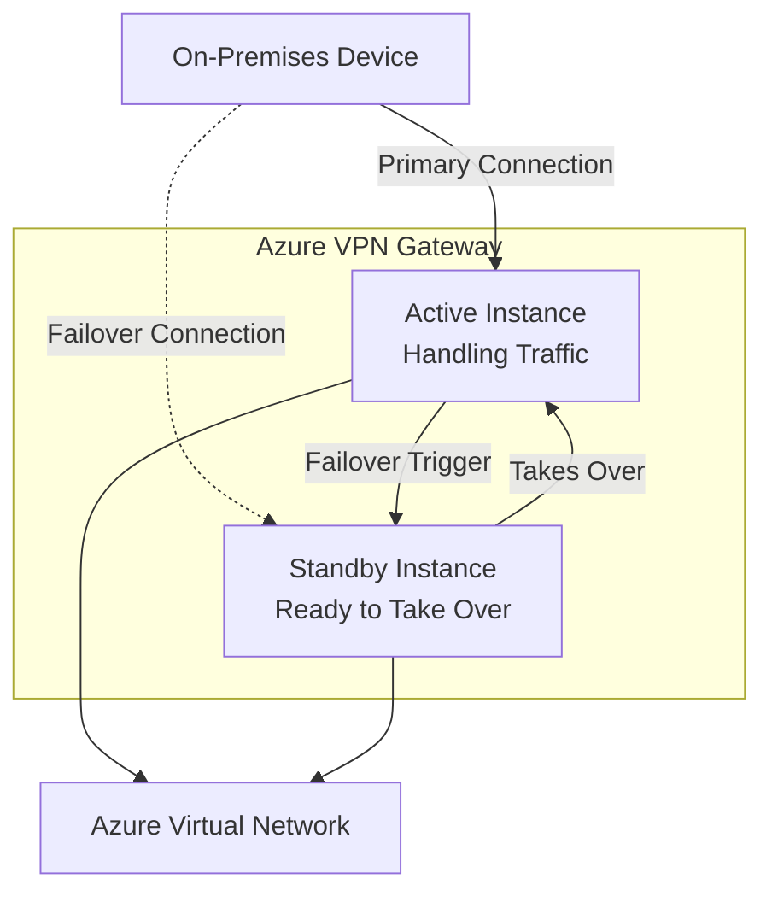

**Key Characteristics:**
- **Automatic Failover**: Seamless transition between active and standby instances
- **High Availability**: Built-in redundancy without additional configuration
- **Zero Downtime**: For planned maintenance (few seconds)
- **Minimal Downtime**: For unplanned disruptions (up to 90 seconds)

**Learn more:**
- [High Availability VPN Gateway](https://learn.microsoft.com/en-us/azure/vpn-gateway/vpn-gateway-high-availability-redundant)
- [VPN Gateway Redundancy](https://learn.microsoft.com/en-us/azure/vpn-gateway/vpn-gateway-about-vpngateways#redundancy)

### Active/active


With the introduction of support for the BGP routing protocol, you can also deploy VPN gateways in an active/active configuration. In this configuration, you assign a unique public IP address to each instance. You then create separate tunnels from the on-premises device to each IP address. You can extend the high availability by deploying another VPN device on-premises.

**Active/Active Architecture:**
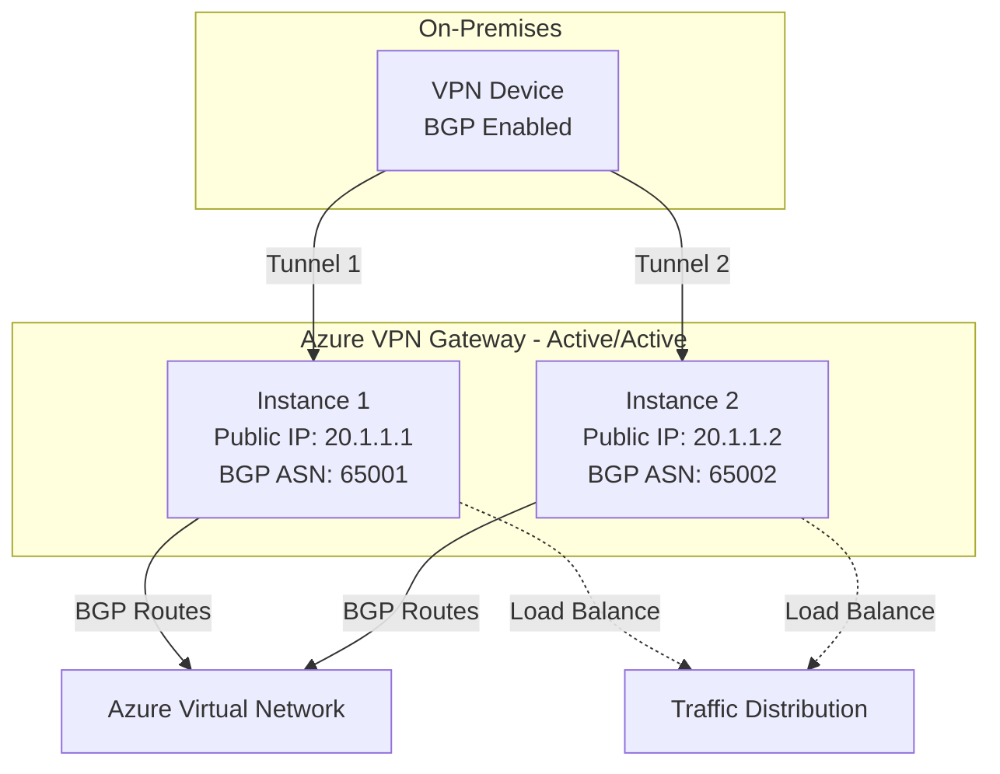

**Key Characteristics:**
- **BGP Required**: Dynamic routing protocol enables active/active configuration
- **Unique IPs**: Each gateway instance has its own public IP address
- **Separate Tunnels**: Independent IPSec tunnels for each instance
- **Enhanced Redundancy**: Can combine with on-premises VPN device redundancy
- **Load Distribution**: Traffic can be distributed across both active instances

**Learn more:**
- [Active-Active VPN Gateway Configuration](https://learn.microsoft.com/en-us/azure/vpn-gateway/vpn-gateway-activeactive-rm-powershell)
- [BGP with Active-Active VPN](https://learn.microsoft.com/en-us/azure/vpn-gateway/vpn-gateway-bgp-resource-manager-ps)


### ExpressRoute failover

Another high-availability option is to configure a VPN gateway as a secure failover path for ExpressRoute connections. ExpressRoute circuits have resiliency built in but aren't immune to physical problems that affect the cables delivering connectivity or outages affecting the complete ExpressRoute location. In high availability scenarios, where there's risk associated with an outage of an ExpressRoute circuit, you can also configure a VPN gateway that uses the internet as an alternative method of connectivity, thus ensuring there's always a connection to the Azure virtual networks.

**ExpressRoute with VPN Failover:**
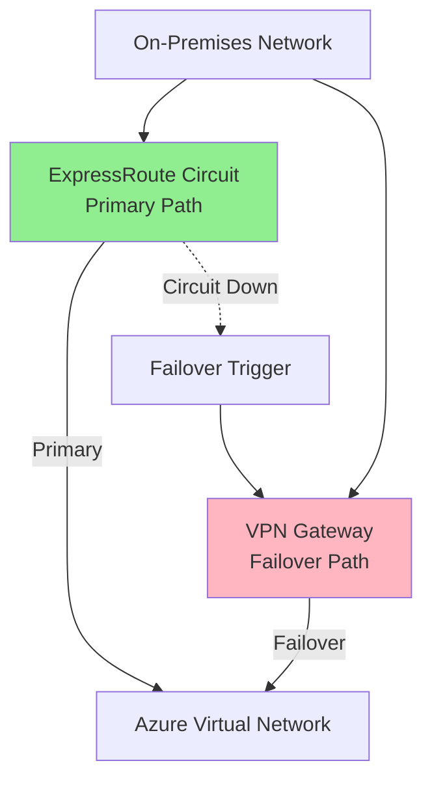

**Learn more:**
- [ExpressRoute and VPN Coexistence](https://learn.microsoft.com/en-us/azure/expressroute/expressroute-howto-coexist-resource-manager)
- [Configure ExpressRoute and VPN Failover](https://learn.microsoft.com/en-us/azure/expressroute/expressroute-howto-coexist-resource-manager)

### Zone-redundant gateways

In regions that support availability zones, you can deploy VPN and ExpressRoute gateways in a zone-redundant configuration. This configuration brings resiliency, scalability, and higher availability to virtual network gateways. Deploying gateways in Azure Availability Zones physically and logically separates gateways within a region while protecting your on-premises network connectivity to Azure from zone-level failures. These require different gateway SKUs and use Standard public IP addresses instead of Basic public IP addresses.

**Zone-Redundant Gateway Architecture:**
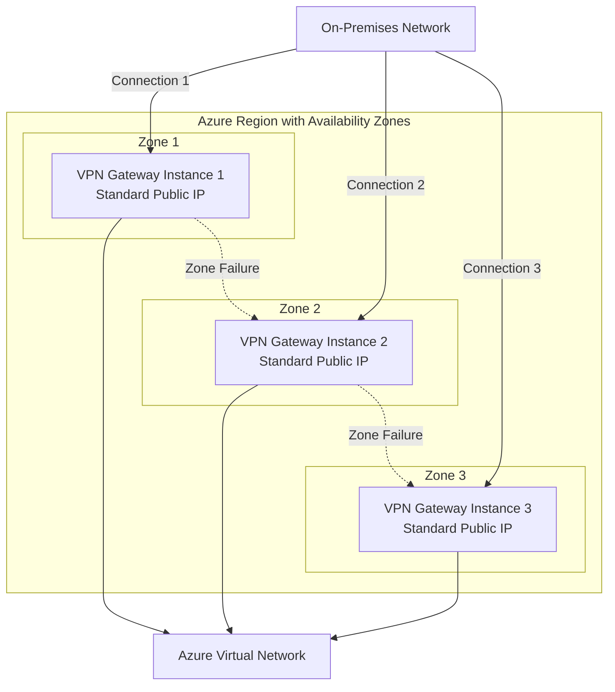

**Learn more:**
- [Zone-Redundant VPN Gateway](https://learn.microsoft.com/en-us/azure/vpn-gateway/about-zone-redundant-vnet-gateways)
- [Availability Zones for VPN Gateway](https://learn.microsoft.com/en-us/azure/vpn-gateway/about-zone-redundant-vnet-gateways)


#### Azure commands to verify the topology 

```bash
az network vnet list --output tsv

# Example: to verify that the local network gateways have been successfully created:
az network local-gateway list --resource-group "myResourceGroupName" --output table

# Check VPN gateway status
az network vnet-gateway show --name <gateway-name> --resource-group <resource-group>

# View VPN connections
az network vnet-gateway list-connections --name <gateway-name> --resource-group <resource-group>
```

**Learn more:**
- [Azure CLI VPN Gateway Commands](https://learn.microsoft.com/en-us/cli/azure/network/vnet-gateway)
- [Troubleshoot VPN Gateway](https://learn.microsoft.com/en-us/azure/vpn-gateway/vpn-gateway-troubleshoot)
- [VPN Gateway Monitoring](https://learn.microsoft.com/en-us/azure/vpn-gateway/monitor-vpn-gateway)

