# Azure Networking Complete Guide with Terraform

## Table of Contents

1. [Introduction](#introduction)
2. [Core Networking Services](#core-networking-services)
3. [Load Balancing and Traffic Management](#load-balancing-and-traffic-management)
4. [Security Services](#security-services)
5. [Connectivity Services](#connectivity-services)
6. [Application Delivery Services](#application-delivery-services)
7. [Monitoring and Management](#monitoring-and-management)
8. [Best Practices](#best-practices)
9. [Architecture Patterns](#architecture-patterns)

---

## Introduction

Azure Networking provides a comprehensive set of services to connect, protect, and optimize your cloud infrastructure. This guide covers all major Azure networking services and how to implement them with Terraform.

### Azure Networking Services Overview

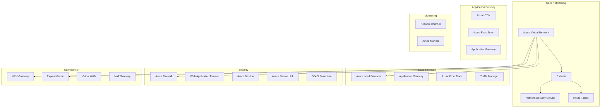

---

## Core Networking Services

### Azure Virtual Network (VNet)

Azure Virtual Network is the fundamental building block for your private network in Azure.

#### What is a VNet?

A VNet is a representation of your own network in the cloud. It logically isolates your Azure resources from each other and from the internet.

#### Key Features

- **Network Isolation**: Complete isolation from other VNets
- **IP Address Management**: Define your own private IP address space
- **Subnet Segmentation**: Divide your network into subnets
- **DNS Resolution**: Built-in DNS or custom DNS servers
- **Service Integration**: Connect to Azure services via service endpoints

#### Architecture

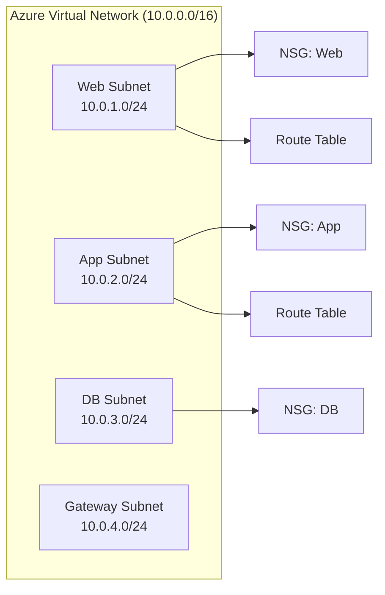

#### Terraform Example

```hcl
module "vnet" {
  source = "./modules/networking"
  
  resource_group_name = "rg-example"
  location            = "eastus"
  vnet_name           = "prod-vnet"
  address_space       = ["10.0.0.0/16"]
  
  subnets = {
    "web-subnet" = {
      address_prefixes = ["10.0.1.0/24"]
      service_endpoints = ["Microsoft.Storage", "Microsoft.Sql"]
    }
    "app-subnet" = {
      address_prefixes = ["10.0.2.0/24"]
    }
    "db-subnet" = {
      address_prefixes = ["10.0.3.0/24"]
    }
  }
  
  network_security_groups = {
    "web-nsg" = {
      rules = [
        {
          name                       = "AllowHTTP"
          priority                   = 1000
          direction                  = "Inbound"
          access                     = "Allow"
          protocol                   = "Tcp"
          source_port_range          = "*"
          destination_port_range     = "80"
          source_address_prefix      = "*"
          destination_address_prefix = "*"
        }
      ]
      associate_to_subnets = ["web-subnet"]
    }
  }
}
```

#### Best Practices

1. **Address Space Planning**: Use non-overlapping CIDR blocks
2. **Subnet Sizing**: Plan for future growth (don't use /30 subnets)
3. **Service Endpoints**: Enable for Azure services to improve security
4. **NSG Rules**: Follow least privilege principle
5. **Route Tables**: Use for hub-spoke architectures

---

### Network Security Groups (NSGs)

NSGs act as a distributed firewall at the network level.

#### NSG Rule Evaluation

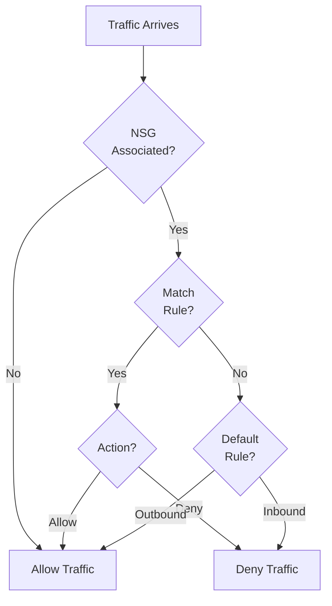

#### NSG Rule Priority

- Lower number = Higher priority
- First matching rule wins
- Default rules (65000+) are evaluated last

---

## Load Balancing and Traffic Management

### Azure Load Balancer

Azure Load Balancer provides high availability and network performance for your applications.

#### Load Balancer Types

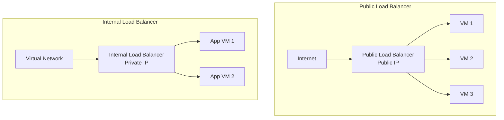

#### Load Balancer Features

- **Layer 4 Load Balancing**: TCP/UDP
- **Health Probes**: Automatic health checking
- **High Availability**: Built-in redundancy
- **Outbound Rules**: SNAT for backend VMs
- **Inbound NAT Rules**: Port forwarding

#### Load Distribution Methods

1. **Round Robin**: Even distribution (default)
2. **Source IP Affinity**: Sticky sessions (5-tuple hash)

#### Load Balancer Terraform Example

```hcl
module "load_balancer" {
  source = "./modules/load-balancer"
  
  resource_group_name = "rg-example"
  location            = "eastus"
  load_balancer_name  = "web-lb"
  sku                 = "Standard"
  
  frontend_ip_configurations = [
    {
      name                 = "public-frontend"
      public_ip_address_id = azurerm_public_ip.lb.id
      zones                = ["1", "2", "3"]
    }
  ]
  
  backend_address_pools = [
    {
      name = "web-backend-pool"
    }
  ]
  
  probe_configurations = [
    {
      name                = "http-probe"
      protocol            = "Http"
      port                = 80
      request_path        = "/health"
      interval_in_seconds = 5
      number_of_probes    = 2
    }
  ]
  
  load_balancing_rules = [
    {
      name                           = "http-rule"
      frontend_ip_configuration_name = "public-frontend"
      backend_address_pool_ids       = [azurerm_lb_backend_address_pool.web.id]
      probe_id                       = azurerm_lb_probe.http.id
      protocol                       = "Tcp"
      frontend_port                  = 80
      backend_port                   = 80
    }
  ]
}
```

---

### Azure Application Gateway

Application Gateway is a web traffic load balancer that enables you to manage traffic to your web applications.

#### Application Gateway Features

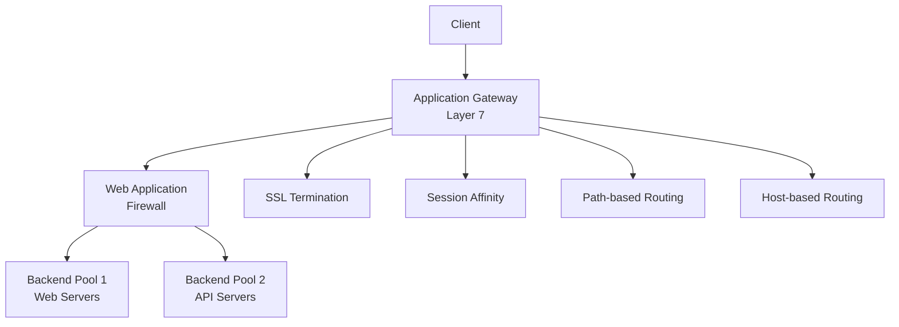

#### Application Gateway Capabilities

- **Layer 7 Load Balancing**: HTTP/HTTPS
- **SSL/TLS Termination**: Offload SSL processing
- **Web Application Firewall**: Built-in WAF
- **URL-based Routing**: Route based on URL path
- **Multi-site Hosting**: Host multiple sites
- **Redirection**: HTTP to HTTPS redirection
- **Session Affinity**: Cookie-based affinity

#### Application Gateway SKU Comparison

| Feature | Standard | WAF | Standard_v2 | WAF_v2 |
|---------|----------|-----|-------------|--------|
| Autoscaling | No | No | Yes | Yes |
| Zone Redundancy | No | No | Yes | Yes |
| Performance | Fixed | Fixed | Variable | Variable |
| WAF | No | Yes | No | Yes |
| Cost | Lower | Medium | Medium | Higher |

---

### Azure Front Door

Azure Front Door is a global, scalable entry point that uses the Microsoft global network.

#### Front Door Architecture

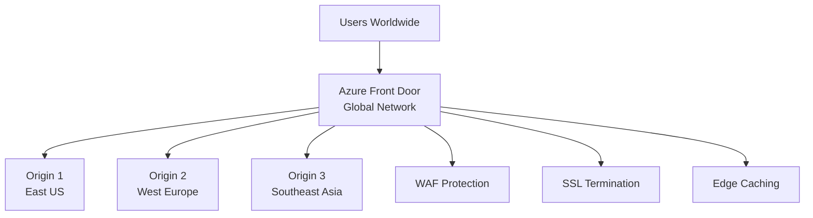

#### Front Door Features

- **Global Load Balancing**: Route to closest healthy backend
- **WAF Integration**: DDoS and WAF protection
- **SSL/TLS Termination**: At the edge
- **Caching**: Static content caching at edge locations
- **URL Rewrite**: Modify request/response URLs
- **Health Probes**: Automatic health checking

#### Use Cases

1. **Global Applications**: Serve users worldwide
2. **Multi-region Deployments**: Active-active setups
3. **Disaster Recovery**: Automatic failover
4. **Performance Optimization**: Route to closest region

---

### Azure Traffic Manager

Traffic Manager is a DNS-based traffic load balancer.

#### Traffic Routing Methods

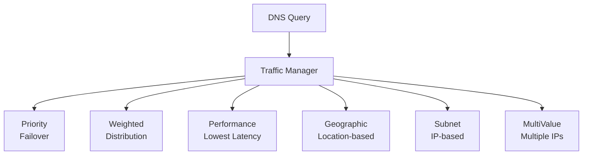

#### Routing Methods

1. **Priority**: Failover (primary → secondary)
2. **Weighted**: Distribute by weight percentage
3. **Performance**: Route to lowest latency endpoint
4. **Geographic**: Route based on user location
5. **Subnet**: Route based on source IP subnet
6. **MultiValue**: Return multiple healthy endpoints

---

## Security Services

### Azure Firewall

Azure Firewall is a managed, cloud-based network security service.

#### Firewall Architecture

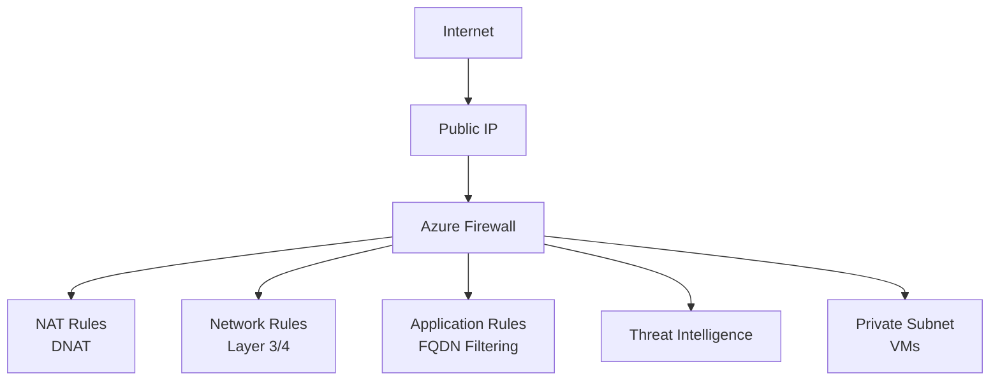

#### Firewall Rule Types

1. **Network Rules**: Filter by IP, port, protocol
2. **Application Rules**: Filter by FQDN
3. **NAT Rules**: Destination NAT (DNAT)

#### Understanding SNAT and DNAT in Azure Firewall

**NAT (Network Address Translation)** is a fundamental networking concept that allows devices to modify IP addresses in network packets. Azure Firewall uses NAT for different purposes depending on the direction of traffic.

#### SNAT (Source NAT) - Outbound Traffic

SNAT, or Source NAT, is used when resources in a private network need to access the Internet. The firewall modifies the **source IP address** of outbound packets, replacing the private IP with a public IP.

**How SNAT Works:**

1. A VM with private IP `10.0.1.10` wants to access `api.github.com`
2. The VM sends a packet with:
   - Source IP: `10.0.1.10` (private)
   - Destination IP: `140.82.121.3` (public)
3. Azure Firewall receives the packet and performs SNAT:
   - Changes source IP from `10.0.1.10` to `20.1.2.5` (Firewall's public IP)
   - Maintains a connection table to track the translation
4. The external server receives the packet and sees it coming from `20.1.2.5`
5. When the server responds, the firewall reverses the translation:
   - Changes destination IP from `20.1.2.5` back to `10.0.1.10`
   - Forwards the response to the VM

**SNAT in Azure:**

- **Azure Firewall**: Provides SNAT for outbound traffic from VMs in the VNet
- **NAT Gateway**: Specialized service for outbound SNAT (recommended for high-scale scenarios)
- **Load Balancer Outbound Rules**: Provides SNAT for backend pools

**Use Cases for SNAT:**

- VMs without public IPs need to download updates from the Internet
- Applications need to call external APIs
- VMs need to access Azure services (though Private Link is preferred)
- Outbound connectivity for container workloads

#### DNAT (Destination NAT) - Inbound Traffic

DNAT, or Destination NAT, is used when you want to expose internal services to the Internet. The firewall modifies the **destination IP address** of inbound packets, translating from a public IP to a private IP.

**How DNAT Works:**

1. An external client wants to access a web server at `20.1.2.5:80` (Firewall's public IP)
2. The client sends a packet with:
   - Source IP: Client's public IP
   - Destination IP: `20.1.2.5:80` (Firewall's public IP)
3. Azure Firewall receives the packet and performs DNAT:
   - Changes destination IP from `20.1.2.5` to `10.0.1.10` (internal web server)
   - Optionally changes destination port (e.g., `80` → `8080`)
   - Maintains a connection table
4. The internal web server receives the packet and sees it coming from the client
5. When the server responds, the firewall reverses the translation:
   - Changes source IP from `10.0.1.10` back to `20.1.2.5`
   - Forwards the response to the external client

**DNAT in Azure Firewall:**

- Configured via **NAT Rule Collections** in Azure Firewall
- Allows exposing internal services securely
- Can perform port translation (e.g., external port 80 → internal port 8080)

**Use Cases for DNAT:**

- Expose internal web servers to the Internet
- Port forwarding for specific services
- Expose APIs hosted on private VMs
- Provide secure access to internal applications

#### SNAT vs DNAT Comparison

| Aspect | SNAT (Source NAT) | DNAT (Destination NAT) |
|--------|-------------------|------------------------|
| **Direction** | Outbound (from private to public) | Inbound (from public to private) |
| **What Changes** | Source IP address | Destination IP address |
| **Purpose** | Allow private resources to access Internet | Expose private services to Internet |
| **Azure Service** | NAT Gateway, Load Balancer Outbound, Firewall | Azure Firewall NAT Rules |
| **Use Case** | VMs downloading updates, calling APIs | Web servers, APIs exposed to Internet |

**SNAT and DNAT Architecture:**

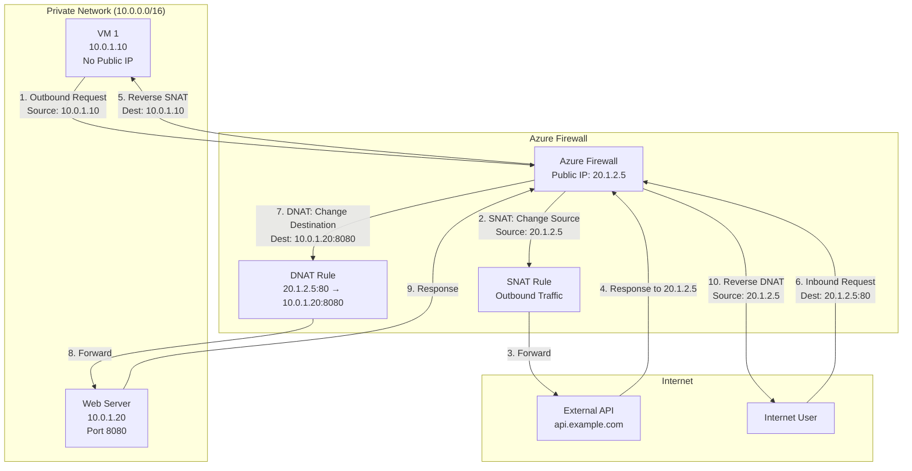

**SNAT Flow Sequence:**

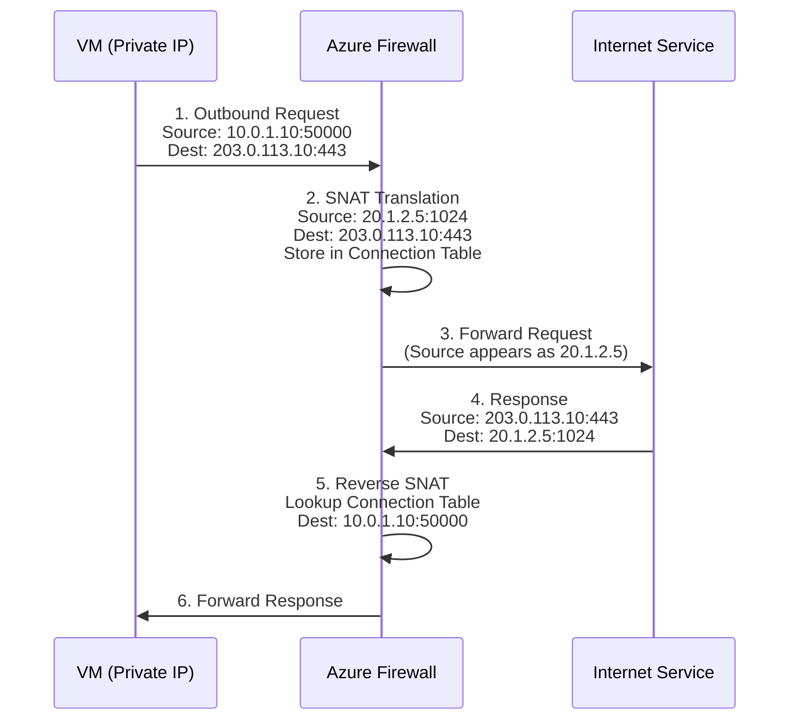

**DNAT Flow Sequence:**

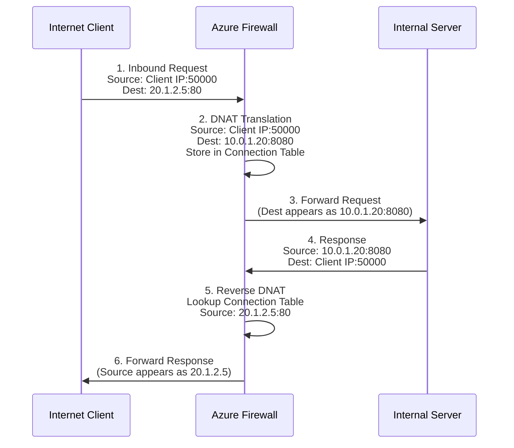

**Best Practices:**

1. **Use NAT Gateway for SNAT**: For high-scale outbound scenarios, use NAT Gateway instead of Firewall SNAT
2. **Minimize DNAT Rules**: Only expose necessary services to reduce attack surface
3. **Port Translation**: Use DNAT port translation to avoid conflicts (e.g., external 80 → internal 8080)
4. **Connection Tracking**: Both SNAT and DNAT maintain connection tables - ensure firewall has sufficient capacity
5. **Security Rules**: Apply Network and Application rules in addition to NAT rules for defense in depth

**Reference:** For more information on SNAT and DNAT concepts, see [SNAT y DNAT: Cuándo usar cada uno en un firewall](https://juncotic.com/snat-y-dnat-cuando-usar-cada-uno-en-un-firewall/)

---

#### SKU Comparison

| Feature | Standard | Premium |
|---------|----------|---------|
| Throughput | 2.5 Gbps | 30 Gbps |
| Network Rules | Yes | Yes |
| Application Rules | Yes | Yes |
| NAT Rules | Yes | Yes |
| Threat Intelligence | Yes | Yes |
| TLS Inspection | No | Yes |
| IDPS | No | Yes |
| URL Filtering | Basic | Advanced |

---

### Azure Bastion

Azure Bastion provides secure RDP/SSH access to VMs without public IPs.

#### Bastion Architecture

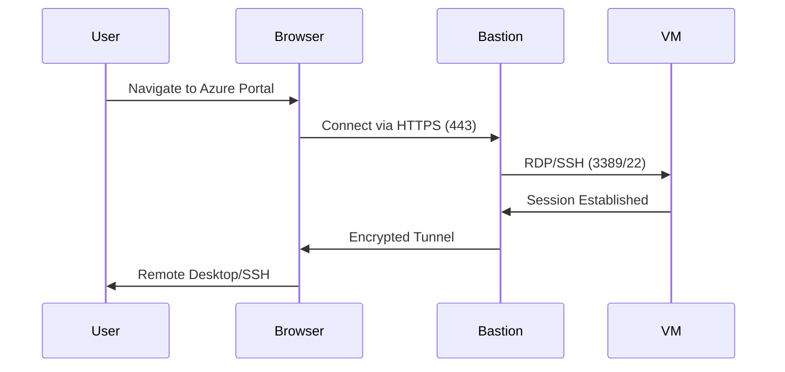

#### Bastion Benefits

- **No Public IPs**: VMs don't need public IPs
- **No VPN Required**: Access from anywhere
- **Browser-based**: No client software needed
- **Secure**: All traffic encrypted
- **NSG Integration**: Uses NSG rules

---

### Azure Private Link

Private Link provides private connectivity to Azure services.

#### Private Link Architecture

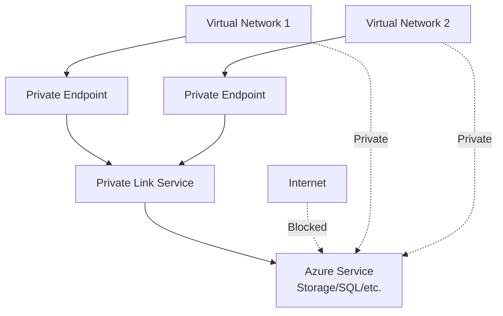

#### Private Link Benefits

- **Private Connectivity**: Traffic stays on Azure backbone
- **No Public Exposure**: Services not exposed to internet
- **Simplified Networking**: No NSG rules for service IPs
- **Global Reach**: Connect across regions

---

### Azure DDoS Protection

DDoS Protection protects against distributed denial-of-service attacks.

#### DDoS Protection Tiers

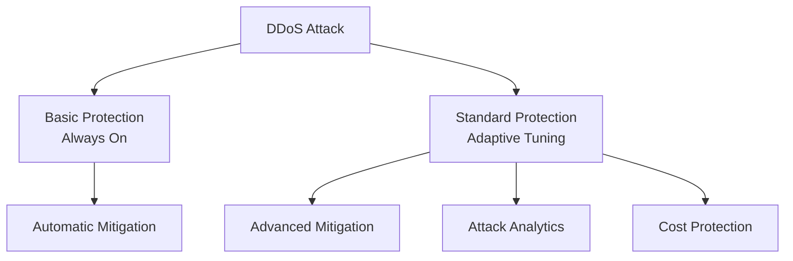

#### Protection Tiers

1. **Basic**: Always-on, automatic mitigation (free)
2. **Standard**: Advanced features, attack analytics, cost protection (paid)

---

## Connectivity Services

### Azure VPN Gateway

VPN Gateway connects your on-premises network to Azure via site-to-site or point-to-site VPN.

#### VPN Gateway Types

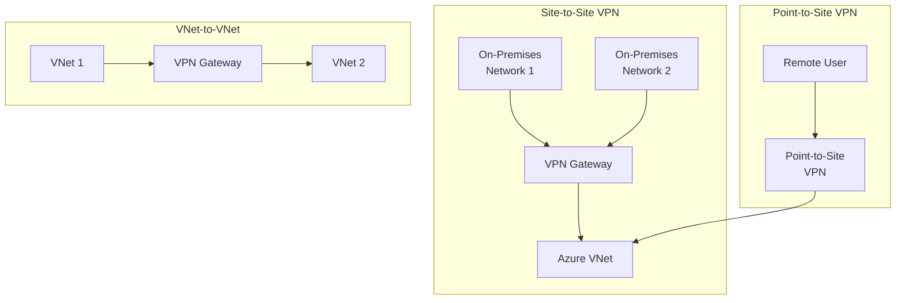

#### VPN Gateway SKUs

| SKU | Throughput | Tunnels | BGP |
|-----|------------|---------|-----|
| Basic | 100 Mbps | 10 | No |
| VpnGw1 | 650 Mbps | 30 | Yes |
| VpnGw2 | 1 Gbps | 30 | Yes |
| VpnGw3 | 1.25 Gbps | 30 | Yes |
| VpnGw4 | 5 Gbps | 100 | Yes |
| VpnGw5 | 10 Gbps | 100 | Yes |

---

### Azure ExpressRoute

ExpressRoute provides private connectivity to Azure via a dedicated connection.

#### ExpressRoute Architecture

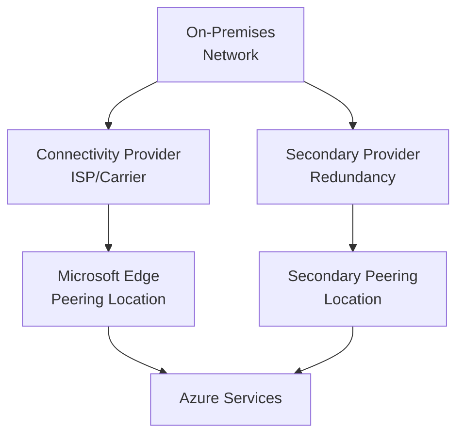

#### ExpressRoute Benefits

- **Private Connection**: Dedicated, not over internet
- **Higher Bandwidth**: Up to 100 Gbps
- **Lower Latency**: Predictable performance
- **Global Reach**: Connect to Azure regions worldwide
- **SLA**: 99.95% uptime SLA

#### Peering Types

1. **Azure Private Peering**: Connect to Azure VNets
2. **Microsoft Peering**: Connect to Microsoft 365, Azure services
3. **Azure Public Peering**: (Deprecated)

---

### Azure Virtual WAN

Virtual WAN is a networking service that brings many networking, security, and routing functionalities together.

#### Virtual WAN Architecture

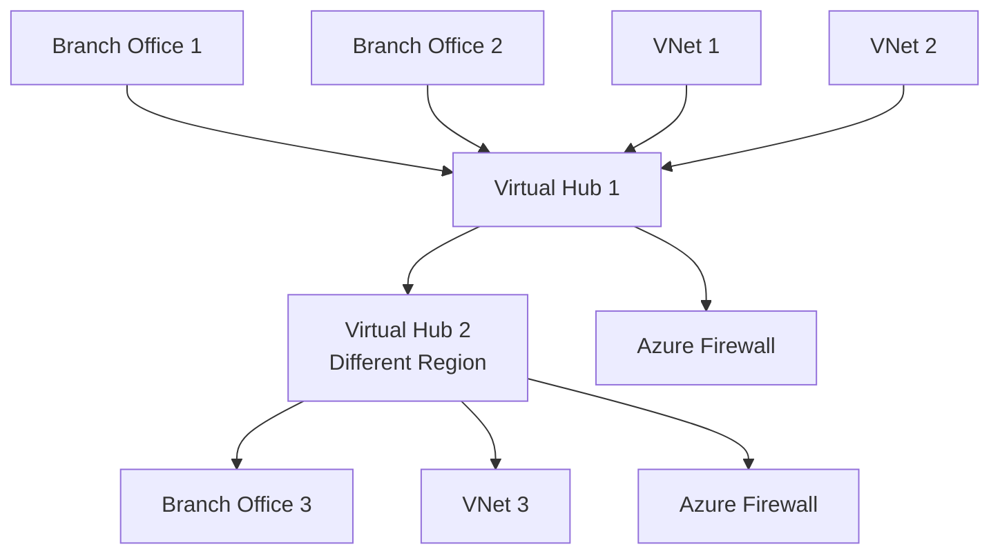

#### Virtual WAN Features

- **Hub and Spoke**: Centralized connectivity
- **Branch Connectivity**: VPN, ExpressRoute
- **VNet Connectivity**: Connect VNets to hubs
- **Firewall Integration**: Centralized security
- **SD-WAN Integration**: Third-party SD-WAN devices

---

### Azure NAT Gateway

NAT Gateway provides outbound internet connectivity for subnets.

#### NAT Gateway Architecture

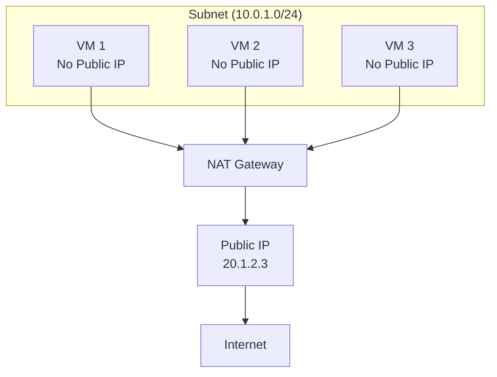

#### NAT Gateway Benefits

- **Simplified Outbound**: No backend pools needed
- **High Performance**: Up to 50 Gbps
- **No SNAT Exhaustion**: 64,000 flows per public IP
- **Cost Effective**: Pay per hour and data processed
- **Zone Redundant**: Automatic high availability

---

## Application Delivery Services

### Azure CDN

Azure CDN delivers content to users with high bandwidth.

#### CDN Architecture

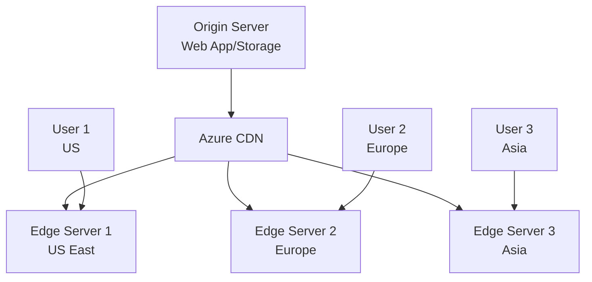

#### CDN Features

- **Global Distribution**: Content cached at edge locations
- **Dynamic Acceleration**: Route optimization
- **Custom Domains**: Use your own domain
- **HTTPS**: SSL/TLS support
- **Compression**: Automatic compression
- **Rules Engine**: Customize content delivery

---

## Monitoring and Management

### Azure Network Watcher

Network Watcher provides tools to monitor, diagnose, and view metrics for your network.

#### Network Watcher Tools

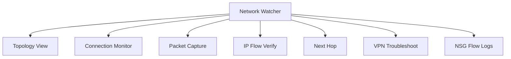

#### Network Watcher Features

1. **Topology**: Visualize network resources
2. **Connection Monitor**: Monitor connectivity
3. **Packet Capture**: Capture network packets
4. **IP Flow Verify**: Test if traffic is allowed
5. **Next Hop Analysis**: Determine routing path
6. **VPN Troubleshoot**: Diagnose VPN issues
7. **NSG Flow Logs**: Log network traffic

---

## Azure Networking Best Practices

### Network Design

1. **Hub-Spoke Architecture**: Centralize shared services
2. **Naming Conventions**: Consistent naming
3. **Address Space Planning**: Avoid overlaps
4. **Subnet Sizing**: Plan for growth
5. **NSG Rules**: Least privilege

### Security

1. **Defense in Depth**: Multiple security layers
2. **Zero Trust**: Verify all connections
3. **Network Segmentation**: Isolate workloads
4. **Monitoring**: Enable logging and monitoring
5. **Regular Audits**: Review security rules

### Performance

1. **Proximity**: Deploy close to users
2. **Caching**: Use CDN for static content
3. **Compression**: Enable compression
4. **Connection Pooling**: Reuse connections
5. **Load Balancing**: Distribute traffic

---

## Architecture Patterns

### Hub-Spoke Pattern

```mermaid
graph TB
    Hub[Hub VNet<br/>Shared Services] --> Spoke1[Spoke VNet 1<br/>Workload 1]
    Hub --> Spoke2[Spoke VNet 2<br/>Workload 2]
    Hub --> Spoke3[Spoke VNet 3<br/>Workload 3]
    
    Hub --> Firewall5[Azure Firewall]
    Hub --> VPN6[VPN Gateway]
    Hub --> Bastion2[Azure Bastion]
```

### Multi-Tier Application

```mermaid
graph TB
    Internet --> AppGW2[Application Gateway]
    AppGW2 --> WebTier[Web Tier<br/>Subnet]
    WebTier --> AppTier[App Tier<br/>Subnet]
    AppTier --> DBTier[DB Tier<br/>Subnet]
    
    WebTier --> NSG4[NSG: Web]
    AppTier --> NSG5[NSG: App]
    DBTier --> NSG6[NSG: DB]
```

---

## Conclusion

This guide provides a comprehensive overview of Azure networking services. Each service has specific use cases and should be selected based on your requirements.

For detailed implementation examples, see the module documentation and example configurations in this repository.
