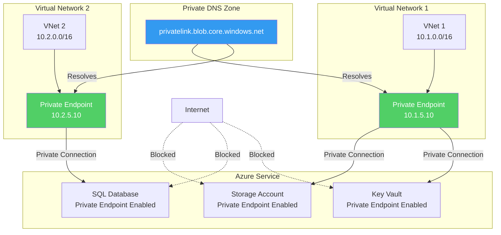
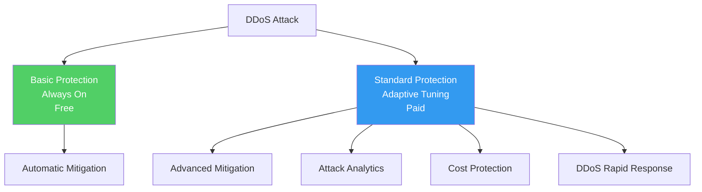
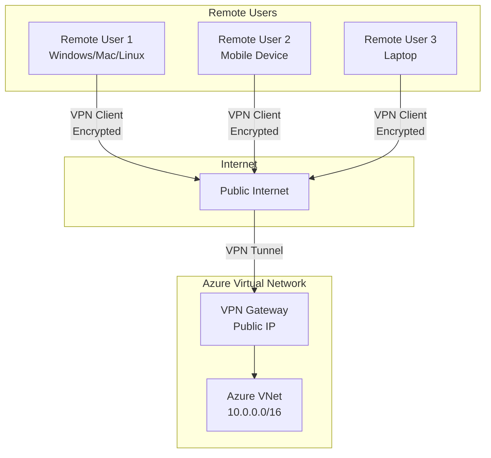
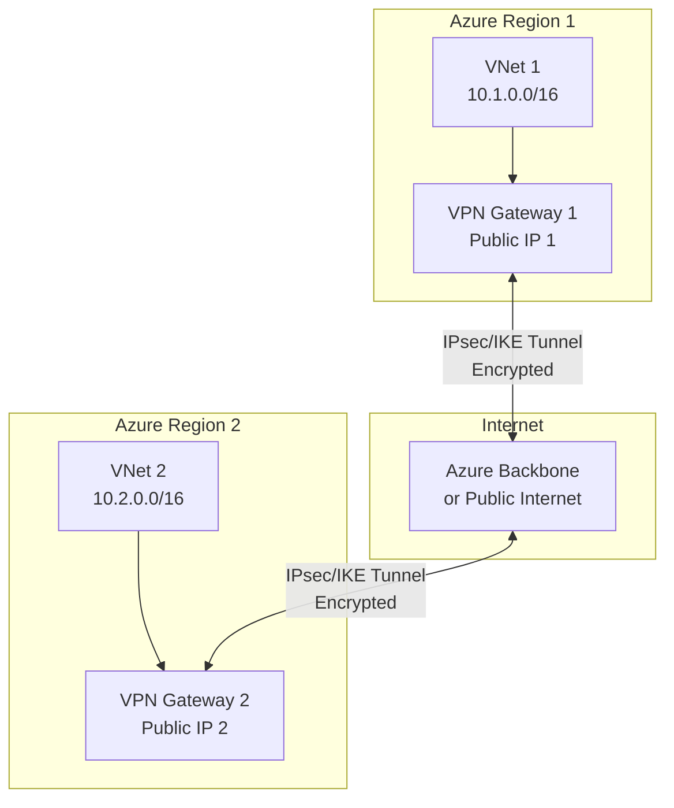
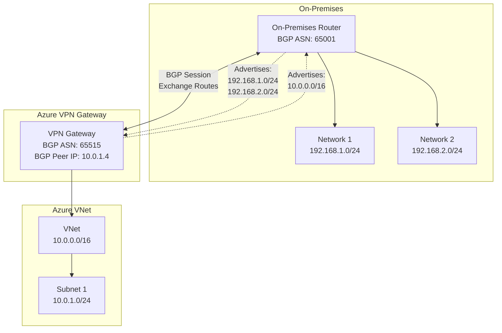
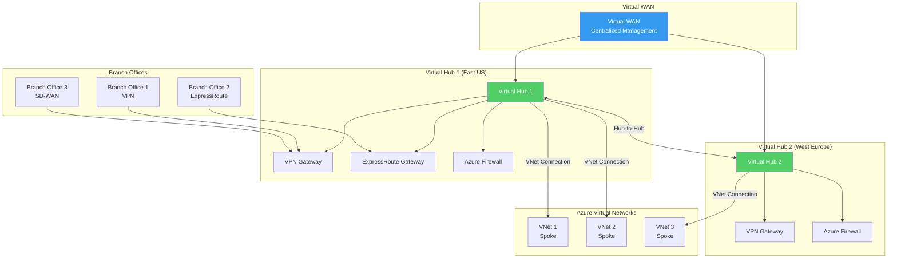

# Azure Networking Complete Guide with Terraform

## Table of Contents

1. [Introduction](#introduction)
2. [Core Networking Services](#core-networking-services)
3. [Load Balancing and Traffic Management](#load-balancing-and-traffic-management)
4. [Security Services](#security-services)
5. [Connectivity Services](#connectivity-services)
6. [Application Delivery Services](#application-delivery-services)
7. [Monitoring and Management](#monitoring-and-management)
8. [Best Practices](#best-practices)
9. [Architecture Patterns](#architecture-patterns)

---

## Introduction

Azure Networking provides a comprehensive set of services to connect, protect, and optimize your cloud infrastructure. This guide covers all major Azure networking services and how to implement them with Terraform.

### Azure Networking Services Overview


---

## Core Networking Services

### Azure Virtual Network (VNet)

Azure Virtual Network is the fundamental building block for your private network in Azure.

#### What is a VNet?

A VNet is a representation of your own network in the cloud. It logically isolates your Azure resources from each other and from the internet.

#### Key Features

- **Network Isolation**: Complete isolation from other VNets
- **IP Address Management**: Define your own private IP address space
- **Subnet Segmentation**: Divide your network into subnets
- **DNS Resolution**: Built-in DNS or custom DNS servers
- **Service Integration**: Connect to Azure services via service endpoints

#### Architecture


#### Terraform Example

```hcl
module "vnet" {
  source = "./modules/networking"
  
  resource_group_name = "rg-example"
  location            = "eastus"
  vnet_name           = "prod-vnet"
  address_space       = ["10.0.0.0/16"]
  
  subnets = {
    "web-subnet" = {
      address_prefixes = ["10.0.1.0/24"]
      service_endpoints = ["Microsoft.Storage", "Microsoft.Sql"]
    }
    "app-subnet" = {
      address_prefixes = ["10.0.2.0/24"]
    }
    "db-subnet" = {
      address_prefixes = ["10.0.3.0/24"]
    }
  }
  
  network_security_groups = {
    "web-nsg" = {
      rules = [
        {
          name                       = "AllowHTTP"
          priority                   = 1000
          direction                  = "Inbound"
          access                     = "Allow"
          protocol                   = "Tcp"
          source_port_range          = "*"
          destination_port_range     = "80"
          source_address_prefix      = "*"
          destination_address_prefix = "*"
        }
      ]
      associate_to_subnets = ["web-subnet"]
    }
  }
}
```

#### Best Practices

1. **Address Space Planning**: Use non-overlapping CIDR blocks
2. **Subnet Sizing**: Plan for future growth (don't use /30 subnets)
3. **Service Endpoints**: Enable for Azure services to improve security
4. **NSG Rules**: Follow least privilege principle
5. **Route Tables**: Use for hub-spoke architectures

---

### Network Security Groups (NSGs)

NSGs act as a distributed firewall at the network level.

#### NSG Rule Evaluation


#### NSG Rule Priority

- Lower number = Higher priority
- First matching rule wins
- Default rules (65000+) are evaluated last

---

## Load Balancing and Traffic Management

### Azure Load Balancer

Azure Load Balancer provides high availability and network performance for your applications.

#### Load Balancer Types


#### Load Balancer Features

- **Layer 4 Load Balancing**: TCP/UDP
- **Health Probes**: Automatic health checking
- **High Availability**: Built-in redundancy
- **Outbound Rules**: SNAT for backend VMs
- **Inbound NAT Rules**: Port forwarding

#### Load Distribution Methods

1. **Round Robin**: Even distribution (default)
2. **Source IP Affinity**: Sticky sessions (5-tuple hash)

#### Load Balancer Terraform Example

```hcl
module "load_balancer" {
  source = "./modules/load-balancer"
  
  resource_group_name = "rg-example"
  location            = "eastus"
  load_balancer_name  = "web-lb"
  sku                 = "Standard"
  
  frontend_ip_configurations = [
    {
      name                 = "public-frontend"
      public_ip_address_id = azurerm_public_ip.lb.id
      zones                = ["1", "2", "3"]
    }
  ]
  
  backend_address_pools = [
    {
      name = "web-backend-pool"
    }
  ]
  
  probe_configurations = [
    {
      name                = "http-probe"
      protocol            = "Http"
      port                = 80
      request_path        = "/health"
      interval_in_seconds = 5
      number_of_probes    = 2
    }
  ]
  
  load_balancing_rules = [
    {
      name                           = "http-rule"
      frontend_ip_configuration_name = "public-frontend"
      backend_address_pool_ids       = [azurerm_lb_backend_address_pool.web.id]
      probe_id                       = azurerm_lb_probe.http.id
      protocol                       = "Tcp"
      frontend_port                  = 80
      backend_port                   = 80
    }
  ]
}
```

---

### Azure Application Gateway

Application Gateway is a web traffic load balancer that enables you to manage traffic to your web applications.

#### Application Gateway Features


#### Application Gateway Capabilities

- **Layer 7 Load Balancing**: HTTP/HTTPS
- **SSL/TLS Termination**: Offload SSL processing
- **Web Application Firewall**: Built-in WAF
- **URL-based Routing**: Route based on URL path
- **Multi-site Hosting**: Host multiple sites
- **Redirection**: HTTP to HTTPS redirection
- **Session Affinity**: Cookie-based affinity

#### Application Gateway SKU Comparison

| Feature | Standard | WAF | Standard_v2 | WAF_v2 |
|---------|----------|-----|-------------|--------|
| Autoscaling | No | No | Yes | Yes |
| Zone Redundancy | No | No | Yes | Yes |
| Performance | Fixed | Fixed | Variable | Variable |
| WAF | No | Yes | No | Yes |
| Cost | Lower | Medium | Medium | Higher |

---

### Azure Front Door

Azure Front Door is a global, scalable entry point that uses the Microsoft global network.

#### Front Door Architecture


#### Front Door Features

- **Global Load Balancing**: Route to closest healthy backend
- **WAF Integration**: DDoS and WAF protection
- **SSL/TLS Termination**: At the edge
- **Caching**: Static content caching at edge locations
- **URL Rewrite**: Modify request/response URLs
- **Health Probes**: Automatic health checking

#### Use Cases

1. **Global Applications**: Serve users worldwide
2. **Multi-region Deployments**: Active-active setups
3. **Disaster Recovery**: Automatic failover
4. **Performance Optimization**: Route to closest region

---

### Azure Traffic Manager

Traffic Manager is a DNS-based traffic load balancer.

#### Traffic Routing Methods


#### Routing Methods

1. **Priority**: Failover (primary → secondary)
2. **Weighted**: Distribute by weight percentage
3. **Performance**: Route to lowest latency endpoint
4. **Geographic**: Route based on user location
5. **Subnet**: Route based on source IP subnet
6. **MultiValue**: Return multiple healthy endpoints

---

## Security Services

### Azure Firewall

Azure Firewall is a managed, cloud-based network security service.

#### Firewall Architecture


#### Firewall Rule Types

1. **Network Rules**: Filter by IP, port, protocol
2. **Application Rules**: Filter by FQDN
3. **NAT Rules**: Destination NAT (DNAT)

#### Understanding SNAT and DNAT in Azure Firewall

**NAT (Network Address Translation)** is a fundamental networking concept that allows devices to modify IP addresses in network packets. Azure Firewall uses NAT for different purposes depending on the direction of traffic.

#### SNAT (Source NAT) - Outbound Traffic

SNAT, or Source NAT, is used when resources in a private network need to access the Internet. The firewall modifies the **source IP address** of outbound packets, replacing the private IP with a public IP.

**How SNAT Works:**

1. A VM with private IP `10.0.1.10` wants to access `api.github.com`
2. The VM sends a packet with:
   - Source IP: `10.0.1.10` (private)
   - Destination IP: `140.82.121.3` (public)
3. Azure Firewall receives the packet and performs SNAT:
   - Changes source IP from `10.0.1.10` to `20.1.2.5` (Firewall's public IP)
   - Maintains a connection table to track the translation
4. The external server receives the packet and sees it coming from `20.1.2.5`
5. When the server responds, the firewall reverses the translation:
   - Changes destination IP from `20.1.2.5` back to `10.0.1.10`
   - Forwards the response to the VM

**SNAT in Azure:**

- **Azure Firewall**: Provides SNAT for outbound traffic from VMs in the VNet
- **NAT Gateway**: Specialized service for outbound SNAT (recommended for high-scale scenarios)
- **Load Balancer Outbound Rules**: Provides SNAT for backend pools

**Use Cases for SNAT:**

- VMs without public IPs need to download updates from the Internet
- Applications need to call external APIs
- VMs need to access Azure services (though Private Link is preferred)
- Outbound connectivity for container workloads

#### DNAT (Destination NAT) - Inbound Traffic

DNAT, or Destination NAT, is used when you want to expose internal services to the Internet. The firewall modifies the **destination IP address** of inbound packets, translating from a public IP to a private IP.

**How DNAT Works:**

1. An external client wants to access a web server at `20.1.2.5:80` (Firewall's public IP)
2. The client sends a packet with:
   - Source IP: Client's public IP
   - Destination IP: `20.1.2.5:80` (Firewall's public IP)
3. Azure Firewall receives the packet and performs DNAT:
   - Changes destination IP from `20.1.2.5` to `10.0.1.10` (internal web server)
   - Optionally changes destination port (e.g., `80` → `8080`)
   - Maintains a connection table
4. The internal web server receives the packet and sees it coming from the client
5. When the server responds, the firewall reverses the translation:
   - Changes source IP from `10.0.1.10` back to `20.1.2.5`
   - Forwards the response to the external client

**DNAT in Azure Firewall:**

- Configured via **NAT Rule Collections** in Azure Firewall
- Allows exposing internal services securely
- Can perform port translation (e.g., external port 80 → internal port 8080)

**Use Cases for DNAT:**

- Expose internal web servers to the Internet
- Port forwarding for specific services
- Expose APIs hosted on private VMs
- Provide secure access to internal applications

#### SNAT vs DNAT Comparison

| Aspect | SNAT (Source NAT) | DNAT (Destination NAT) |
|--------|-------------------|------------------------|
| **Direction** | Outbound (from private to public) | Inbound (from public to private) |
| **What Changes** | Source IP address | Destination IP address |
| **Purpose** | Allow private resources to access Internet | Expose private services to Internet |
| **Azure Service** | NAT Gateway, Load Balancer Outbound, Firewall | Azure Firewall NAT Rules |
| **Use Case** | VMs downloading updates, calling APIs | Web servers, APIs exposed to Internet |

**SNAT and DNAT Architecture:**


**SNAT Flow Sequence:**


**DNAT Flow Sequence:**


**Best Practices:**

1. **Use NAT Gateway for SNAT**: For high-scale outbound scenarios, use NAT Gateway instead of Firewall SNAT
2. **Minimize DNAT Rules**: Only expose necessary services to reduce attack surface
3. **Port Translation**: Use DNAT port translation to avoid conflicts (e.g., external 80 → internal 8080)
4. **Connection Tracking**: Both SNAT and DNAT maintain connection tables - ensure firewall has sufficient capacity
5. **Security Rules**: Apply Network and Application rules in addition to NAT rules for defense in depth

**Reference:** For more information on SNAT and DNAT concepts, see [SNAT y DNAT: Cuándo usar cada uno en un firewall](https://juncotic.com/snat-y-dnat-cuando-usar-cada-uno-en-un-firewall/)

---

#### SKU Comparison

| Feature | Standard | Premium |
|---------|----------|---------|
| Throughput | 2.5 Gbps | 30 Gbps |
| Network Rules | Yes | Yes |
| Application Rules | Yes | Yes |
| NAT Rules | Yes | Yes |
| Threat Intelligence | Yes | Yes |
| TLS Inspection | No | Yes |
| IDPS | No | Yes |
| URL Filtering | Basic | Advanced |

---

### Azure Bastion

Azure Bastion provides secure RDP/SSH access to VMs without public IPs.

#### Bastion Architecture


#### Bastion Benefits

- **No Public IPs**: VMs don't need public IPs
- **No VPN Required**: Access from anywhere
- **Browser-based**: No client software needed
- **Secure**: All traffic encrypted
- **NSG Integration**: Uses NSG rules

---

### Azure Private Link

Private Link provides private connectivity to Azure services and customer-owned services without exposing them to the Internet.

#### What is Private Link?

Private Link enables you to access Azure PaaS services and your own services over a private endpoint in your Virtual Network. Traffic stays on the Azure backbone network and never traverses the Internet.

#### Private Link Architecture



#### Private Link Components

**1. Private Endpoints:**
- Provide private IP addresses for Azure services
- Created in your Virtual Network
- Automatically integrates with Private DNS zones
- Traffic stays on Azure backbone

**2. Private Link Services:**
- Expose your own services via Private Link
- Works with Load Balancer (Standard SKU)
- Control who can connect (approval required)
- Private connectivity for consumers

#### Terraform Example

```hcl
module "private_link" {
  source = "./modules/private-link"
  
  resource_group_name = "rg-example"
  location           = "eastus"
  
  # Private Endpoint for Storage Account
  private_endpoints = {
    "storage-endpoint" = {
      name      = "pe-storage"
      subnet_id = azurerm_subnet.private_endpoints.id
      private_service_connection = {
        name                           = "storage-connection"
        private_connection_resource_id = azurerm_storage_account.main.id
        subresource_names              = ["blob"]
        is_manual_connection           = false
      }
      private_dns_zone_group = {
        name                 = "storage-dns-zone-group"
        private_dns_zone_ids = [azurerm_private_dns_zone.storage.id]
      }
    }
  }
}
```

#### Private Link Benefits

- **Private Connectivity**: Traffic stays on Azure backbone
- **No Public Exposure**: Services not exposed to internet
- **Simplified Networking**: No NSG rules for service IPs
- **Global Reach**: Connect across regions
- **Automatic DNS**: Automatic DNS integration with Private DNS zones
- **Compliance**: Meets compliance requirements for private connectivity

---

### Azure DDoS Protection

DDoS Protection protects Azure resources from distributed denial-of-service attacks.

#### What is DDoS Protection?

DDoS Protection provides protection against DDoS attacks by automatically detecting and mitigating attacks. It has two tiers: Basic (free, always-on) and Standard (paid, advanced features).

#### DDoS Protection Tiers



#### Terraform Example

```hcl
module "ddos_protection" {
  source = "./modules/ddos-protection"
  
  resource_group_name = "rg-example"
  location           = "eastus"
  
  ddos_protection_plan_name = "ddos-plan-prod"
  sku                      = "Standard"  # or "Basic" for free tier
}
```

#### Protection Tiers

**Basic (Free):**
- Always-on protection
- Automatic mitigation
- No additional cost
- Included with all Azure subscriptions

**Standard (Paid):**
- All Basic features
- Attack analytics and reporting
- Cost protection (waiver for resources scaled due to attack)
- DDoS rapid response support
- Adaptive tuning
- Telemetry and monitoring
- Custom alert thresholds

#### DDoS Protection Features

1. **Automatic Mitigation**: Automatically detects and mitigates attacks
2. **Attack Analytics**: Detailed reports on attacks
3. **Cost Protection**: Waiver for resources scaled during attacks
4. **Rapid Response**: Direct access to DDoS experts during active attacks
5. **Adaptive Tuning**: Automatically adjusts to your traffic patterns

---

## Connectivity Services

### Azure VPN Gateway

Azure VPN Gateway is a specific type of virtual network gateway that enables secure, encrypted connections between your on-premises networks and Azure Virtual Networks over the public Internet, or between Azure Virtual Networks.

#### What is a VPN Gateway?

A VPN Gateway is a virtual network gateway that uses encrypted tunnels to send encrypted traffic between an Azure Virtual Network and an on-premises location over the public Internet. It can also be used to send encrypted traffic between Azure Virtual Networks.

#### VPN Gateway Types

Azure VPN Gateway supports three main connection types, each designed for different scenarios:

##### 1. Site-to-Site (S2S) VPN

**What it is:**

Site-to-Site VPN creates a secure, encrypted connection between your on-premises network and an Azure Virtual Network. It uses IPsec/IKE (IKEv1 or IKEv2) VPN tunnels to establish the connection.

**How it works:**

```mermaid
graph TB
    subgraph "On-Premises Network"
        OnPremRouter[On-Premises<br/>VPN Device]
        OnPremNetwork[On-Premises<br/>Network<br/>192.168.1.0/24]
        OnPremRouter --> OnPremNetwork
    end
    
    subgraph "Internet"
        Internet[Public Internet]
    end
    
    subgraph "Azure Virtual Network"
        VPNGateway[VPN Gateway<br/>Public IP]
        AzureVNet[Azure VNet<br/>10.0.0.0/16]
        VPNGateway --> AzureVNet
    end
    
    OnPremRouter <-->|IPsec/IKE Tunnel<br/>Encrypted| Internet
    Internet <-->|IPsec/IKE Tunnel<br/>Encrypted| VPNGateway
```

**Use Cases:**

1. **Branch Office Connectivity**: Connect branch offices to Azure resources
   - Example: A retail company connects multiple store locations to Azure-hosted inventory systems
   - Benefits: Centralized management, secure access to cloud resources

2. **Hybrid Cloud Deployments**: Extend on-premises infrastructure to Azure
   - Example: A company migrates applications to Azure but keeps databases on-premises
   - Benefits: Gradual migration, maintain existing infrastructure

3. **Disaster Recovery**: Replicate data and failover to Azure
   - Example: Backup critical systems to Azure for disaster recovery
   - Benefits: Cost-effective DR solution, automated failover

4. **Development and Testing**: Connect development environments to Azure
   - Example: Developers need secure access to Azure resources from corporate network
   - Benefits: Secure access, no need for public endpoints

5. **Multi-Site Connectivity**: Connect multiple on-premises locations
   - Example: A company with offices in different cities connects all to Azure
   - Benefits: Centralized connectivity, mesh networking capabilities

**Key Characteristics:**

- Requires a VPN device on-premises (physical or virtual)
- Supports static routing or dynamic routing (BGP)
- Can support multiple tunnels from different on-premises locations
- Provides encrypted, authenticated connections

##### 2. Point-to-Site (P2S) VPN

**What it is:**

Point-to-Site VPN creates a secure, encrypted connection from an individual client computer to an Azure Virtual Network. It's ideal for remote workers or users who need to connect to Azure resources from anywhere.

**How it works:**



**Use Cases:**

1. **Remote Workforce**: Enable employees to work from home or remote locations
   - Example: A company allows employees to securely access internal Azure resources from home
   - Benefits: No need for VPN concentrators, easy to deploy

2. **Contractors and Partners**: Provide temporary secure access
   - Example: Grant contractors access to specific Azure resources for a project
   - Benefits: Easy to provision and revoke access, certificate-based authentication

3. **Mobile Workers**: Connect mobile devices to Azure resources
   - Example: Field workers need to access Azure-hosted applications from tablets
   - Benefits: Works on multiple platforms, no special hardware needed

4. **Testing and Development**: Developers testing from home
   - Example: Developers need to test applications in Azure from their home networks
   - Benefits: Quick setup, no infrastructure changes needed

5. **Small Office/Home Office (SOHO)**: Small businesses connecting to Azure
   - Example: A small business connects their office network to Azure without dedicated VPN hardware
   - Benefits: Cost-effective, no hardware investment

**Key Characteristics:**

- No VPN device required on-premises
- Uses VPN client software (built into Windows, macOS, iOS, Android, Linux)
- Supports certificate-based or Azure AD authentication
- Each client gets its own IP address from the VNet address space
- Ideal for small-scale deployments (typically < 100 concurrent connections)

##### 3. VNet-to-VNet VPN

**What it is:**

VNet-to-VNet VPN creates a secure, encrypted connection between two Azure Virtual Networks. It allows you to connect VNets in the same region, different regions, or even different subscriptions.

**How it works:**



**Use Cases:**

1. **Multi-Region Deployments**: Connect VNets across different Azure regions
   - Example: A company has VNets in East US and West Europe and needs them to communicate
   - Benefits: Regional redundancy, disaster recovery, data replication

2. **Cross-Subscription Connectivity**: Connect VNets in different subscriptions
   - Example: Connect development and production VNets in separate subscriptions
   - Benefits: Isolation with connectivity, cost allocation

3. **Hub-Spoke Architecture**: Connect spoke VNets to a hub VNet
   - Example: Central hub VNet with multiple spoke VNets for different workloads
   - Benefits: Centralized services, reduced complexity

4. **Geographic Redundancy**: Replicate data across regions
   - Example: Database replication between regions for high availability
   - Benefits: Automatic failover, data consistency

5. **Isolated Environments**: Connect isolated environments securely
   - Example: Connect production and disaster recovery VNets
   - Benefits: Secure communication, network isolation

**Key Characteristics:**

- Both VNets require VPN Gateways
- Traffic can traverse Azure backbone (faster) or public Internet
- Supports BGP for dynamic routing
- Can be used with ExpressRoute for hybrid scenarios
- No additional charges for traffic within Azure backbone

#### Understanding VPN Gateway SKUs

**What are SKUs?**

SKU stands for **Stock Keeping Unit**, but in Azure context, it refers to different **service tiers or performance levels** of a resource. Each SKU offers different capabilities, performance characteristics, and pricing. When you create a VPN Gateway, you must select a SKU that determines:

- **Throughput**: Maximum bandwidth the gateway can handle
- **Number of Tunnels**: How many simultaneous VPN connections it supports
- **Features**: Whether it supports advanced features like BGP, Active-Active mode, etc.
- **Pricing**: Higher SKUs cost more but offer better performance

**VPN Gateway SKU Comparison:**

| SKU | Throughput | Tunnels | BGP Support | Active-Active | Use Case |
|-----|------------|---------|-------------|---------------|----------|
| **Basic** | 100 Mbps | 10 | No | No | Development, testing, low-traffic scenarios |
| **VpnGw1** | 650 Mbps | 30 | Yes | Yes | Small to medium production workloads |
| **VpnGw2** | 1 Gbps | 30 | Yes | Yes | Medium production workloads |
| **VpnGw3** | 1.25 Gbps | 30 | Yes | Yes | Large production workloads |
| **VpnGw4** | 5 Gbps | 100 | Yes | Yes | Enterprise workloads, high availability |
| **VpnGw5** | 10 Gbps | 100 | Yes | Yes | Mission-critical, high-throughput scenarios |

**SKU Selection Guidelines:**

1. **Basic SKU**: 
   - Only for development and testing
   - Does not support production workloads
   - Limited to 10 tunnels, no BGP support

2. **VpnGw1-3**: 
   - Suitable for most production scenarios
   - Good balance of performance and cost
   - Supports all advanced features

3. **VpnGw4-5**: 
   - For high-throughput requirements
   - Enterprise-scale deployments
   - Multiple site connectivity

#### Why Use BGP with VPN Gateway?

**What is BGP?**

BGP (Border Gateway Protocol) is a dynamic routing protocol that automatically learns and advertises routes between networks. In the context of Azure VPN Gateway, BGP enables dynamic routing between your on-premises network and Azure, eliminating the need to manually configure static routes.

**Benefits of Using BGP:**

1. **Automatic Route Propagation**: Routes are automatically learned and advertised
2. **Failover Support**: Automatic failover if a connection fails
3. **Multi-Path Support**: Use multiple paths for redundancy
4. **Route Filtering**: Control which routes are advertised
5. **Scalability**: Easier to manage in large networks

**BGP Support by SKU:**

| SKU | BGP Support | Why BGP is Recommended |
|-----|-------------|------------------------|
| **Basic** | ❌ No | Not available - use static routes or upgrade SKU |
| **VpnGw1** | ✅ Yes | **Recommended for:**
- Multi-site connectivity (connect multiple on-premises locations)
- Active-Active gateway configurations for high availability
- Dynamic route updates when network topology changes
- Complex routing scenarios with multiple paths
- Automatic failover between redundant connections |
| **VpnGw2** | ✅ Yes | **Recommended for:**
- All VpnGw1 scenarios with higher throughput requirements
- Medium-scale enterprises with multiple branch offices
- Scenarios requiring route filtering and policy-based routing
- Integration with on-premises BGP-enabled routers |
| **VpnGw3** | ✅ Yes | **Recommended for:**
- All VpnGw2 scenarios with even higher throughput
- Large-scale deployments with complex routing requirements
- Scenarios with frequent network topology changes
- Multi-homed networks (multiple ISPs) |
| **VpnGw4** | ✅ Yes | **Recommended for:**
- Enterprise-scale deployments with 100+ tunnels
- High-availability scenarios requiring automatic failover
- Complex routing policies and route filtering
- Integration with large-scale BGP networks
- Mission-critical applications requiring dynamic routing |
| **VpnGw5** | ✅ Yes | **Recommended for:**
- All VpnGw4 scenarios with maximum throughput (10 Gbps)
- Mission-critical enterprise deployments
- Maximum redundancy and failover capabilities
- Large-scale BGP route propagation
- High-performance scenarios with complex routing requirements |

**When to Use BGP:**

1. **Multiple On-Premises Locations**: When connecting multiple branch offices, BGP automatically learns routes from all locations
2. **Active-Active Gateways**: BGP is required for Active-Active gateway configurations
3. **Dynamic Network Changes**: When your on-premises network topology changes frequently
4. **Route Filtering**: When you need to control which routes are advertised
5. **Complex Routing**: When you have complex routing requirements that static routes can't handle

**When Static Routing is Sufficient:**

- Single on-premises location
- Simple network topology
- Routes don't change frequently
- Cost optimization (Basic SKU)
- Development and testing environments

**BGP Configuration Example:**



**BGP Flow:**

1. On-premises router establishes BGP session with Azure VPN Gateway
2. Router advertises on-premises routes (e.g., 192.168.1.0/24, 192.168.2.0/24)
3. VPN Gateway advertises Azure VNet routes (e.g., 10.0.0.0/16)
4. Both sides automatically learn routes and update routing tables
5. If a route changes, BGP automatically updates both sides
6. If a connection fails, BGP removes the route and uses backup paths if available

---

### Azure ExpressRoute

ExpressRoute provides private connectivity to Azure via a dedicated connection.

#### ExpressRoute Architecture


#### ExpressRoute Benefits

- **Private Connection**: Dedicated, not over internet
- **Higher Bandwidth**: Up to 100 Gbps
- **Lower Latency**: Predictable performance
- **Global Reach**: Connect to Azure regions worldwide
- **SLA**: 99.95% uptime SLA

#### Peering Types

1. **Azure Private Peering**: Connect to Azure VNets
2. **Microsoft Peering**: Connect to Microsoft 365, Azure services
3. **Azure Public Peering**: (Deprecated)

---

### Azure Virtual WAN

Virtual WAN is a networking service that brings many networking, security, and routing functionalities together into a single operational interface.

#### What is Virtual WAN?

Virtual WAN simplifies global branch-to-branch connectivity by providing a unified platform for:
- Branch connectivity (VPN, ExpressRoute)
- Site-to-site connectivity
- Remote user connectivity (point-to-site VPN)
- VNet connectivity
- Centralized security (Azure Firewall)
- SD-WAN integration

#### Virtual WAN Architecture



#### Terraform Example

```hcl
module "virtual_wan" {
  source = "./modules/virtual-wan"
  
  resource_group_name = "rg-example"
  location           = "eastus"
  
  virtual_wan_name = "vwan-main"
  type             = "Standard"
  
  allow_branch_to_branch_traffic = true
  
  virtual_hubs = {
    "hub-eastus" = {
      name                = "vhub-eastus"
      address_prefix      = "10.1.0.0/24"
      sku                 = "Standard"
      hub_routing_preference = "ExpressRoute"
    }
    "hub-westeurope" = {
      name                = "vhub-westeurope"
      address_prefix      = "10.2.0.0/24"
      sku                 = "Standard"
      hub_routing_preference = "VPN"
    }
  }
}
```

#### Virtual WAN Features

- **Hub and Spoke**: Centralized connectivity in virtual hubs
- **Branch Connectivity**: VPN, ExpressRoute, SD-WAN
- **VNet Connectivity**: Connect VNets to hubs
- **Firewall Integration**: Centralized security with Azure Firewall
- **SD-WAN Integration**: Third-party SD-WAN devices
- **Global Reach**: Connect hubs across regions
- **Automated Management**: Simplified operations

---

### Azure NAT Gateway

NAT Gateway provides outbound internet connectivity for subnets.

#### NAT Gateway Architecture

```mermaid
graph TB
    subgraph "Subnet (10.0.1.0/24)"
        VM1[VM 1<br/>No Public IP]
        VM2[VM 2<br/>No Public IP]
        VM3[VM 3<br/>No Public IP]
    end
    
    VM1 --> NAT[NAT Gateway]
    VM2 --> NAT
    VM3 --> NAT
    
    NAT --> PublicIP[Public IP<br/>20.1.2.3]
    PublicIP --> Internet[Internet]
```

#### NAT Gateway Benefits

- **Simplified Outbound**: No backend pools needed
- **High Performance**: Up to 50 Gbps
- **No SNAT Exhaustion**: 64,000 flows per public IP
- **Cost Effective**: Pay per hour and data processed
- **Zone Redundant**: Automatic high availability

---

## Application Delivery Services

### Azure CDN

Azure CDN delivers content to users with high bandwidth.

#### CDN Architecture

```mermaid
graph TB
    Origin[Origin Server<br/>Web App/Storage] --> CDN[Azure CDN]
    CDN --> Edge1[Edge Server 1<br/>US East]
    CDN --> Edge2[Edge Server 2<br/>Europe]
    CDN --> Edge3[Edge Server 3<br/>Asia]
    
    User1[User 1<br/>US] --> Edge1
    User2[User 2<br/>Europe] --> Edge2
    User3[User 3<br/>Asia] --> Edge3
```

#### CDN Features

- **Global Distribution**: Content cached at edge locations
- **Dynamic Acceleration**: Route optimization
- **Custom Domains**: Use your own domain
- **HTTPS**: SSL/TLS support
- **Compression**: Automatic compression
- **Rules Engine**: Customize content delivery

---

## Monitoring and Management

### Azure Network Watcher

Network Watcher provides tools to monitor, diagnose, and view metrics for your Azure network infrastructure.

#### What is Network Watcher?

Network Watcher is a regional service that provides network monitoring and diagnostic capabilities. It helps you monitor, diagnose, view metrics, and enable or disable logs for resources in an Azure Virtual Network.

#### Network Watcher Tools

```mermaid
graph TB
    NW[Network Watcher] --> Topology[Topology View<br/>Visualize Network Resources]
    NW --> ConnectionMonitor[Connection Monitor<br/>Monitor Connectivity]
    NW --> PacketCapture[Packet Capture<br/>Capture Network Packets]
    NW --> IPFlow[IP Flow Verify<br/>Test NSG Rules]
    NW --> NextHop[Next Hop<br/>Determine Routing Path]
    NW --> VPNTroubleshoot[VPN Troubleshoot<br/>Diagnose VPN Issues]
    NW --> NSGFlow[NSG Flow Logs<br/>Log All Traffic]
    NW --> TrafficAnalytics[Traffic Analytics<br/>Analyze Flow Logs]
    
    style NW fill:#339af0,color:#fff
```

#### Terraform Example

```hcl
module "network_watcher" {
  source = "./modules/network-watcher"
  
  resource_group_name = "rg-example"
  location           = "eastus"
  
  network_watcher_name = "NetworkWatcher_eastus"
  enable_flow_logs     = true
  
  flow_logs = {
    "nsg-web-flow-log" = {
      network_security_group_id = azurerm_network_security_group.web.id
      storage_account_id        = azurerm_storage_account.logs.id
      enabled                   = true
      retention_days            = 30
      version                   = 2
      traffic_analytics = {
        enabled               = true
        workspace_id          = azurerm_log_analytics_workspace.main.workspace_id
        workspace_region      = "eastus"
        workspace_resource_id = azurerm_log_analytics_workspace.main.id
        interval_in_minutes   = 60
      }
    }
  }
}
```

#### Network Watcher Features

1. **Topology**: Visualize network resources and their relationships
   - See all resources in a VNet
   - Understand connectivity
   - Identify misconfigurations

2. **Connection Monitor**: Monitor connectivity between endpoints
   - Test connectivity between VMs
   - Measure latency
   - Detect connectivity issues

3. **Packet Capture**: Capture network packets for analysis
   - Capture packets from VMs
   - Analyze network traffic
   - Troubleshoot network issues

4. **IP Flow Verify**: Test if traffic is allowed by NSG rules
   - Verify if traffic is allowed/denied
   - Identify blocking NSG rules
   - Troubleshoot connectivity issues

5. **Next Hop Analysis**: Determine routing path
   - See where traffic is routed
   - Identify routing issues
   - Understand network topology

6. **VPN Troubleshoot**: Diagnose VPN issues
   - Troubleshoot VPN Gateway connections
   - Identify VPN configuration issues
   - Get diagnostic information

7. **NSG Flow Logs**: Log network traffic
   - Log all network traffic
   - Analyze traffic patterns
   - Security analysis
   - Compliance reporting

8. **Traffic Analytics**: Analyze flow logs
   - Visualize network traffic
   - Identify security threats
   - Optimize network performance

---

## Azure Networking Best Practices

### Network Design

1. **Hub-Spoke Architecture**: Centralize shared services
2. **Naming Conventions**: Consistent naming
3. **Address Space Planning**: Avoid overlaps
4. **Subnet Sizing**: Plan for growth
5. **NSG Rules**: Least privilege

### Security

1. **Defense in Depth**: Multiple security layers
2. **Zero Trust**: Verify all connections
3. **Network Segmentation**: Isolate workloads
4. **Monitoring**: Enable logging and monitoring
5. **Regular Audits**: Review security rules

### Performance

1. **Proximity**: Deploy close to users
2. **Caching**: Use CDN for static content
3. **Compression**: Enable compression
4. **Connection Pooling**: Reuse connections
5. **Load Balancing**: Distribute traffic

---

## Architecture Patterns

### Hub-Spoke Pattern

```mermaid
graph TB
    Hub[Hub VNet<br/>Shared Services] --> Spoke1[Spoke VNet 1<br/>Workload 1]
    Hub --> Spoke2[Spoke VNet 2<br/>Workload 2]
    Hub --> Spoke3[Spoke VNet 3<br/>Workload 3]
    
    Hub --> Firewall5[Azure Firewall]
    Hub --> VPN6[VPN Gateway]
    Hub --> Bastion2[Azure Bastion]
```

### Multi-Tier Application

```mermaid
graph TB
    Internet --> AppGW2[Application Gateway]
    AppGW2 --> WebTier[Web Tier<br/>Subnet]
    WebTier --> AppTier[App Tier<br/>Subnet]
    AppTier --> DBTier[DB Tier<br/>Subnet]
    
    WebTier --> NSG4[NSG: Web]
    AppTier --> NSG5[NSG: App]
    DBTier --> NSG6[NSG: DB]
```

---

### Azure DNS

Azure DNS provides DNS hosting for your domains with high availability and global distribution.

#### What is Azure DNS?

Azure DNS is a hosting service for DNS domains that provides name resolution using Microsoft's Azure infrastructure. It supports both public and private DNS zones.

#### DNS Zone Types

**Public DNS Zones:**
- Resolve DNS queries from anywhere on the Internet
- Used for internet-facing domains
- High availability (99.99% SLA)
- Fast DNS resolution globally

**Private DNS Zones:**
- Resolve DNS queries within Azure Virtual Networks
- Not accessible from the Internet
- Automatic VM registration (optional)
- Custom domain names for internal services

#### DNS Architecture

```mermaid
graph TB
    subgraph "Public DNS Zone"
        PublicZone[example.com<br/>Public Zone]
        PublicZone --> ARecord[A Record<br/>www → 1.2.3.4]
        PublicZone --> CNAME[CNAME<br/>api → www.example.com]
        PublicZone --> MX[MX Record<br/>mail → mail.example.com]
    end
    
    subgraph "Private DNS Zone"
        PrivateZone[internal.company<br/>Private Zone]
        PrivateZone --> PrivateA[A Record<br/>db → 10.0.3.10]
        PrivateZone --> PrivateCNAME[CNAME<br/>app → app-vm.internal.company]
    end
    
    subgraph "Virtual Network"
        VNet[VNet<br/>10.0.0.0/16]
        VM1[VM 1<br/>Auto-registered]
        VM2[VM 2<br/>Auto-registered]
    end
    
    Internet[Internet Users] -->|DNS Query| PublicZone
    VNet -->|DNS Query| PrivateZone
    PrivateZone -->|Auto-register| VM1
    PrivateZone -->|Auto-register| VM2
    
    style PublicZone fill:#339af0,color:#fff
    style PrivateZone fill:#51cf66,color:#fff
```

#### DNS Record Types

| Record Type | Purpose | Example |
|-------------|---------|---------|
| **A** | IPv4 address | `www.example.com → 1.2.3.4` |
| **AAAA** | IPv6 address | `www.example.com → 2001:db8::1` |
| **CNAME** | Canonical name (alias) | `api.example.com → www.example.com` |
| **MX** | Mail exchange | `example.com → mail.example.com (priority 10)` |
| **NS** | Name server | Delegation records |
| **PTR** | Pointer (reverse DNS) | `4.3.2.1.in-addr.arpa → www.example.com` |
| **SRV** | Service record | `_http._tcp.example.com → server:8080` |
| **TXT** | Text record | `example.com → "v=spf1 include:spf.example.com"` |
| **SOA** | Start of authority | Zone metadata |

#### Terraform Example

```hcl
module "dns" {
  source = "./modules/dns"
  
  resource_group_name = "rg-example"
  location           = "global"
  
  # Public DNS Zone
  dns_zones = {
    "example.com" = {
      zone_type = "Public"
    }
  }
  
  # DNS Records
  dns_records = {
    "example.com/www" = {
      zone_name = "example.com"
      name      = "www"
      type      = "A"
      ttl       = 300
      records   = ["1.2.3.4"]
    }
    "example.com/api" = {
      zone_name = "example.com"
      name      = "api"
      type      = "CNAME"
      ttl       = 300
      records   = ["www.example.com"]
    }
  }
  
  # Private DNS Zone
  dns_zones = {
    "internal.company" = {
      zone_type = "Private"
    }
  }
  
  # Private DNS Zone VNet Link
  private_dns_zone_virtual_network_links = {
    "internal.company/vnet-link" = {
      zone_name           = "internal.company"
      virtual_network_id  = azurerm_virtual_network.main.id
      registration_enabled = true  # Auto-register VMs
    }
  }
}
```

#### DNS Use Cases

1. **Public Domain Hosting**: Host DNS for your public domains
2. **Internal Name Resolution**: Use private DNS zones for internal services
3. **Service Discovery**: Automatic VM registration in private zones
4. **Custom Domains**: Create custom domain names for applications
5. **Hybrid DNS**: Integrate with on-premises DNS

---

### Azure Private Link

Private Link provides private connectivity to Azure services and customer-owned services without exposing them to the Internet.

#### Private Link Architecture

```mermaid
graph TB
    subgraph "Virtual Network"
        VNet[VNet<br/>10.0.0.0/16]
        PrivateEndpoint[Private Endpoint<br/>10.0.5.10]
        VNet --> PrivateEndpoint
    end
    
    subgraph "Azure Service"
        StorageAccount[Storage Account<br/>Private Endpoint]
        SQLDatabase[SQL Database<br/>Private Endpoint]
        KeyVault[Key Vault<br/>Private Endpoint]
    end
    
    subgraph "Private DNS Zone"
        PrivateDNS[privatelink.blob.core.windows.net]
        PrivateDNS -->|Resolves| PrivateEndpoint
    end
    
    PrivateEndpoint -->|Private Connection| StorageAccount
    PrivateEndpoint -->|Private Connection| SQLDatabase
    PrivateEndpoint -->|Private Connection| KeyVault
    
    Internet -.->|Blocked| StorageAccount
    Internet -.->|Blocked| SQLDatabase
    Internet -.->|Blocked| KeyVault
    
    style PrivateEndpoint fill:#51cf66,color:#fff
    style PrivateDNS fill:#339af0,color:#fff
```

#### Terraform Example

```hcl
module "private_link" {
  source = "./modules/private-link"
  
  resource_group_name = "rg-example"
  location           = "eastus"
  
  # Private Endpoint for Storage Account
  private_endpoints = {
    "storage-endpoint" = {
      name      = "pe-storage"
      subnet_id = azurerm_subnet.private_endpoints.id
      private_service_connection = {
        name                           = "storage-connection"
        private_connection_resource_id = azurerm_storage_account.main.id
        subresource_names              = ["blob"]
        is_manual_connection           = false
      }
      private_dns_zone_group = {
        name                 = "storage-dns-zone-group"
        private_dns_zone_ids = [azurerm_private_dns_zone.storage.id]
      }
    }
  }
}
```

#### Private Link Benefits

1. **No Public Exposure**: Services not accessible from Internet
2. **Private IP Addresses**: Services get private IPs in your VNet
3. **Automatic DNS Integration**: Automatic DNS resolution
4. **Global Reach**: Connect across regions
5. **Simplified Networking**: No need to manage service IP ranges

---

### Azure DDoS Protection

DDoS Protection protects Azure resources from distributed denial-of-service attacks.

#### DDoS Protection Tiers

```mermaid
graph TB
    Attack[DDoS Attack] --> Basic[Basic Protection<br/>Always On<br/>Free]
    Attack --> Standard[Standard Protection<br/>Adaptive Tuning<br/>Paid]
    
    Basic --> Mitigation1[Automatic Mitigation]
    Standard --> Mitigation2[Advanced Mitigation]
    Standard --> Alerting[Attack Analytics]
    Standard --> CostProtection[Cost Protection]
    Standard --> DDoSRR[DDoS Rapid Response]
```

#### Terraform Example

```hcl
module "ddos_protection" {
  source = "./modules/ddos-protection"
  
  resource_group_name = "rg-example"
  location           = "eastus"
  
  ddos_protection_plan_name = "ddos-plan-prod"
  sku                      = "Standard"  # or "Basic" for free tier
}
```

#### DDoS Protection Features

**Basic (Free):**
- Always-on protection
- Automatic mitigation
- No additional cost

**Standard (Paid):**
- All Basic features
- Attack analytics and reporting
- Cost protection (waiver for scaled resources)
- DDoS rapid response support
- Adaptive tuning
- Telemetry and monitoring

---

### Azure Firewall Manager

Firewall Manager provides centralized security policy management for Azure Firewall across multiple Virtual Networks and Virtual WAN hubs.

#### Firewall Manager Architecture

```mermaid
graph TB
    subgraph "Firewall Manager"
        FirewallPolicy[Firewall Policy<br/>Centralized Rules]
        RuleCollectionGroups[Rule Collection Groups]
        FirewallPolicy --> RuleCollectionGroups
    end
    
    subgraph "Virtual Network 1"
        VNet1[VNet 1]
        Firewall1[Azure Firewall<br/>Policy: FirewallPolicy]
        VNet1 --> Firewall1
    end
    
    subgraph "Virtual Network 2"
        VNet2[VNet 2]
        Firewall2[Azure Firewall<br/>Policy: FirewallPolicy]
        VNet2 --> Firewall2
    end
    
    subgraph "Virtual WAN Hub"
        VWANHub[Virtual WAN Hub]
        HubFirewall[Azure Firewall<br/>Policy: FirewallPolicy]
        VWANHub --> HubFirewall
    end
    
    FirewallPolicy --> Firewall1
    FirewallPolicy --> Firewall2
    FirewallPolicy --> HubFirewall
    
    style FirewallPolicy fill:#51cf66,color:#fff
```

#### Terraform Example

```hcl
module "firewall_manager" {
  source = "./modules/firewall-manager"
  
  resource_group_name = "rg-example"
  location           = "eastus"
  
  firewall_policy_name = "fw-policy-central"
  sku                 = "Premium"
  
  threat_intelligence_mode = "Deny"
  
  rule_collection_groups = {
    "network-rules" = {
      priority = 100
      network_rule_collections = [
        {
          name     = "AllowHTTPS"
          priority = 100
          action   = "Allow"
          rules = [
            {
              name                  = "AllowHTTPS"
              protocols             = ["TCP"]
              source_addresses      = ["*"]
              destination_addresses = ["*"]
              destination_ports     = ["443"]
            }
          ]
        }
      ]
    }
  }
}
```

#### Firewall Manager Benefits

1. **Centralized Management**: Manage all firewalls from one place
2. **Consistent Policies**: Apply same policies across all firewalls
3. **Rule Collection Groups**: Organize rules for easier management
4. **Threat Intelligence**: Centralized threat intelligence configuration
5. **TLS Inspection**: Premium SKU supports TLS inspection

---

### Azure CDN

Azure CDN delivers content to users with high bandwidth by caching content at edge locations close to users.

#### CDN Architecture

```mermaid
graph TB
    Origin[Origin Server<br/>Web App/Storage] --> CDN[Azure CDN Profile]
    CDN --> Edge1[Edge Server 1<br/>US East]
    CDN --> Edge2[Edge Server 2<br/>Europe]
    CDN --> Edge3[Edge Server 3<br/>Asia]
    
    User1[User 1<br/>US] -->|Fast Delivery| Edge1
    User2[User 2<br/>Europe] -->|Fast Delivery| Edge2
    User3[User 3<br/>Asia] -->|Fast Delivery| Edge3
    
    Edge1 -.->|Cache Miss| Origin
    Edge2 -.->|Cache Miss| Origin
    Edge3 -.->|Cache Miss| Origin
    
    style CDN fill:#339af0,color:#fff
    style Origin fill:#51cf66,color:#fff
```

#### Terraform Example

```hcl
module "cdn" {
  source = "./modules/cdn"
  
  resource_group_name = "rg-example"
  location           = "global"
  
  cdn_profile_name = "cdn-profile-main"
  sku              = "Standard_Microsoft"
  
  cdn_endpoints = {
    "web-endpoint" = {
      name                = "cdn-web"
      origin_host_header  = "www.example.com"
      origins = [
        {
          name       = "web-origin"
          host_name  = "www.example.com"
          http_port  = 80
          https_port = 443
        }
      ]
      is_http_allowed               = true
      is_https_allowed              = true
      querystring_caching_behaviour = "IgnoreQueryString"
      is_compression_enabled        = true
      content_types_to_compress     = ["text/html", "text/css", "application/javascript"]
    }
  }
}
```

#### CDN Features

- **Global Distribution**: Content cached at edge locations worldwide
- **Dynamic Acceleration**: Route optimization for dynamic content
- **Compression**: Automatic compression of content
- **HTTPS Support**: SSL/TLS encryption
- **Custom Domains**: Use your own domain names
- **Geo-filtering**: Block or allow content by geographic location

---

### Azure Network Watcher

Network Watcher provides tools to monitor, diagnose, and view metrics for your Azure network infrastructure.

#### Network Watcher Tools

```mermaid
graph TB
    NW[Network Watcher] --> Topology[Topology View<br/>Visualize Network]
    NW --> ConnectionMonitor[Connection Monitor<br/>Monitor Connectivity]
    NW --> PacketCapture[Packet Capture<br/>Capture Packets]
    NW --> IPFlow[IP Flow Verify<br/>Test Traffic Rules]
    NW --> NextHop[Next Hop<br/>Determine Routing]
    NW --> VPNTroubleshoot[VPN Troubleshoot<br/>Diagnose VPN]
    NW --> NSGFlow[NSG Flow Logs<br/>Log Traffic]
    
    style NW fill:#339af0,color:#fff
```

#### Terraform Example

```hcl
module "network_watcher" {
  source = "./modules/network-watcher"
  
  resource_group_name = "rg-example"
  location           = "eastus"
  
  network_watcher_name = "NetworkWatcher_eastus"
  enable_flow_logs     = true
  
  flow_logs = {
    "nsg-web-flow-log" = {
      network_security_group_id = azurerm_network_security_group.web.id
      storage_account_id        = azurerm_storage_account.logs.id
      enabled                   = true
      retention_days            = 30
      version                   = 2
      traffic_analytics = {
        enabled               = true
        workspace_id          = azurerm_log_analytics_workspace.main.workspace_id
        workspace_region      = "eastus"
        workspace_resource_id = azurerm_log_analytics_workspace.main.id
        interval_in_minutes   = 60
      }
    }
  }
}
```

#### Network Watcher Features

1. **Topology**: Visualize network resources and their relationships
2. **Connection Monitor**: Monitor connectivity between endpoints
3. **Packet Capture**: Capture network packets for analysis
4. **IP Flow Verify**: Test if traffic is allowed by NSG rules
5. **Next Hop**: Determine the routing path for traffic
6. **VPN Troubleshoot**: Diagnose VPN connectivity issues
7. **NSG Flow Logs**: Log all network traffic for analysis

---

## Conclusion

This guide provides a comprehensive overview of Azure networking services. Each service has specific use cases and should be selected based on your requirements.

For detailed implementation examples, see the module documentation and example configurations in this repository.
